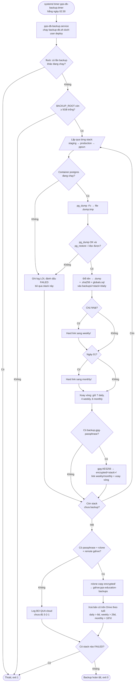
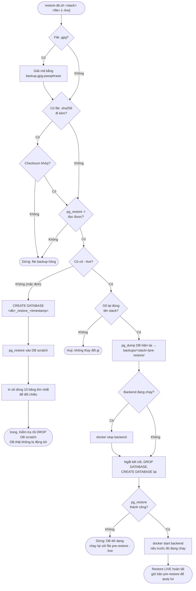

# Deploy lên server vật lý — runbook

Server vật lý riêng (không dùng Railway nữa), chạy **cả 2 stack staging +
production** cùng lúc, tách biệt hoàn toàn bằng Docker network/volume/
container riêng. Không có static IP → dùng Cloudflare Tunnel. File lưu trữ
media dùng MinIO tự host (thay Cloudflare R2 thật) nhưng giữ nguyên code
`MediaStorageService`/cấu trúc key hiện có. Có bổ sung 9Router (chấm AI) và
quy trình tắt máy an toàn từ xa (chưa có UPS).

Xem chi tiết plan gốc: hỏi lại trong phiên Claude Code đã tạo repo này nếu
cần đối chiếu — file README này là bản rút gọn để thao tác trực tiếp trên
server.

## 0. Hệ điều hành

**Ubuntu Server 26.04 LTS** (bản không GUI) — hỗ trợ chính thức tới ~2031,
tương thích tốt Docker Engine/`cloudflared`/Node.js (9Router). Vì là LTS còn
mới, nếu 1 repo apt bên thứ 3 (Docker/Cloudflare/NodeSource) chưa kịp build
riêng cho codename của 26.04, trỏ tạm repo đó sang codename LTS trước đó
(24.04 "noble") — không ảnh hưởng gì tới ứng dụng, chỉ là nguồn cài đặt.

## 1. Cài packages + user + firewall

```bash
apt update && apt upgrade -y
apt install -y ufw fail2ban curl gnupg git rsync unattended-upgrades nginx

# Docker Engine + Compose plugin
install -m 0755 -d /etc/apt/keyrings
curl -fsSL https://download.docker.com/linux/ubuntu/gpg -o /etc/apt/keyrings/docker.asc
chmod a+r /etc/apt/keyrings/docker.asc
echo "deb [arch=$(dpkg --print-architecture) signed-by=/etc/apt/keyrings/docker.asc] \
  https://download.docker.com/linux/ubuntu $(. /etc/os-release && echo $VERSION_CODENAME) stable" \
  > /etc/apt/sources.list.d/docker.list
apt update
apt install -y docker-ce docker-ce-cli containerd.io docker-compose-plugin

# User deploy (chạy self-hosted GitHub Actions runner - xem mục 8, KHÔNG còn
# dùng cho SSH nữa vì GitHub Actions cloud không SSH vào IP LAN được) - KHÁC
# key cá nhân quản trị từ máy nhà
adduser --disabled-password --gecos "" deploy
usermod -aG docker deploy

# Firewall: KHÔNG mở 80/443 (dùng Cloudflare Tunnel, xem mục 4) — SSH chỉ cho LAN
# (self-hosted runner ở mục 8 tự kết nối OUTBOUND ra GitHub, không cần mở
# thêm port nào cho việc đó)
ufw default deny incoming
ufw default allow outgoing
ufw allow from <LAN_SUBNET, VD 192.168.1.0/24> to any port 22 proto tcp
ufw enable
```

## 2. Thư mục + secret trên server

```
/opt/pps-education/staging/{docker-compose.yml,.env,frontend/{admin,user}}
/opt/pps-education/production/{docker-compose.yml,.env,frontend/{admin,user}}
```

Copy `deploy/docker-compose.staging.yml` → `/opt/pps-education/staging/docker-compose.yml`
(và tương tự cho production) **lần đầu** để bootstrap thư mục — từ 2026-09-15
(đã xác nhận với người dùng), `cd-staging.yml`/`cd-production.yml` tự đồng bộ
lại file này từ repo ở MỖI LẦN deploy (trước đây chỉ copy tay 1 lần lúc
bootstrap rồi không bao giờ cập nhật lại — thay đổi sau này trong
`deploy/docker-compose.*.yml`, VD `DB_POOL_SIZE`, im lặng không tới được
server dù CI xanh, gây lệch giữa staging/production thật với repo mà không
ai biết). Việc bootstrap tay ở đây chỉ còn cần thiết cho lần đầu (thư mục
chưa tồn tại) — sau đó không cần copy tay nữa.

`.env` mỗi stack (tạo tay 1 lần, `chmod 600`, **không** đi qua GitHub/CI):

```
DB_PASSWORD=...
JWT_SECRET=...
GOOGLE_OAUTH_CLIENT_IDS=...
S3_ACCESS_KEY=...        # dùng chung cho MinIO root user + R2_ACCESS_KEY_ID trong compose
S3_SECRET_KEY=...        # dùng chung cho MinIO root password + R2_SECRET_ACCESS_KEY trong compose
MAIL_HOST=...
MAIL_PORT=587
MAIL_USERNAME=...
MAIL_PASSWORD=...
MAIL_CONTACT_HOTLINE=...
MAIL_CONTACT_SUPPORT_EMAIL=...
MAIL_CONTACT_WEBSITE=...
FIREBASE_CREDENTIALS_BASE64=...
OPENAI_API_KEY=...
ANTHROPIC_API_KEY=...
GEMINI_API_KEY=...
NINE_ROUTER_API_KEY=...
NINE_ROUTER_MODEL=...
NINE_ROUTER_AUDIO_MODEL=...
```

```bash
docker compose up -d   # chạy ở cả 2 thư mục — Flyway tự chạy migration khi backend khởi động
```

### Bootstrap tài khoản sysadmin đầu tiên (1 lần duy nhất/stack)

`SEED_DEV_USERS` (11 tài khoản demo, mật khẩu cứng `Dev@123456`) **KHÔNG**
dùng cho staging/production — chỉ dành local dev. Để tạo tài khoản quản trị
đầu tiên trên staging/production, dùng `InitialAdminSeeder` riêng (chỉ tạo
đúng 1 user `sysadmin`, mật khẩu do bạn tự đặt):

```bash
# Thêm 2 dòng này vào .env của đúng stack (thay <MAT_KHAU_MANH> bằng mật khẩu thật):
SEED_INITIAL_ADMIN=true
SEED_SYSADMIN_PASSWORD=<MAT_KHAU_MANH>
```

```bash
docker compose up -d --force-recreate backend   # restart để nạp .env mới, seeder tự chạy 1 lần lúc khởi động
```

Sau khi thấy log `[InitialAdminSeeder] Đã tạo tài khoản 'sysadmin'` — **tắt
lại ngay** (đặt `SEED_INITIAL_ADMIN=false` trong `.env`, `docker compose up
-d --force-recreate backend` lần nữa) để tránh giữ mật khẩu bootstrap nằm
sẵn trong `.env` lâu dài không cần thiết. Từ tài khoản `sysadmin` này, tạo
tiếp các tài khoản thật khác qua UI quản lý người dùng của app.

## 3. MinIO (thay Cloudflare R2)

Bucket `pps-media` + quyền `anonymous download` (giữ đúng hành vi bucket
public của R2) được **service `minio-init` trong `docker-compose.*.yml` tự
tạo** mỗi lần `docker compose up -d` — idempotent, và `backend` chờ nó chạy
xong mới khởi động (`depends_on: service_completed_successfully`). Không cần
thao tác tay.

Kiểm tra sau khi stack lên:

```bash
docker compose -f docker-compose.yml logs minio-init   # thay "up" xanh: "bucket pps-media da san sang"
```

Fallback thủ công (chỉ khi cần chạy lại ngoài luồng compose, VD sau khi xoá
nhầm policy) — thay `pps-staging_internal` bằng `pps-production_internal` cho
prod:

```bash
docker run --rm --network pps-staging_internal --entrypoint /bin/sh \
  -e MC_HOST_s="http://<S3_ACCESS_KEY>:<S3_SECRET_KEY>@minio:9000" minio/mc \
  -c 'mc mb --ignore-existing s/pps-media && mc anonymous set download s/pps-media'
```

Nếu có dữ liệu cũ thật trên R2 cần giữ lại: dùng `rclone`/`mc mirror` chuyển
1 lần trước khi cắt hẳn sang MinIO (không tự động, làm tay khi cần).

## 4. Nginx + Cloudflare Tunnel

Domain thật: **`ppsvietnam.edu.vn`** (đã quản lý trên Cloudflare, DNS Setup:
Full). ⚠️ Domain gốc `ppsvietnam.edu.vn`/`www.`/`pma.` đang phục vụ 1 site
khác (IP `103.179.190.129`, Proxied) — KHÔNG được đụng vào các record đó,
chỉ thao tác trên 6 subdomain dưới đây.

1. Copy `deploy/nginx/admin.conf.template`, `student.conf.template`,
   `files.conf.template` vào `/etc/nginx/sites-available/`, thay placeholder
   theo bảng:

   | File | `__HOSTNAME__` | `__ROOT_PATH__` | `__API_PORT__` / `__MINIO_PORT__` |
   |---|---|---|---|
   | admin-staging | `admin-staging.ppsvietnam.edu.vn` | `/opt/pps-education/staging/frontend/admin` | 8081 |
   | admin (prod) | `admin.ppsvietnam.edu.vn` | `/opt/pps-education/production/frontend/admin` | 8080 |
   | student-staging | `student-staging.ppsvietnam.edu.vn` | `/opt/pps-education/staging/frontend/user` | 8081 |
   | student (prod) | `student.ppsvietnam.edu.vn` | `/opt/pps-education/production/frontend/user` | 8080 |
   | files-staging | `files-staging.ppsvietnam.edu.vn` | — | 9002 |
   | files (prod) | `files.ppsvietnam.edu.vn` | — | 9000 |

   Domain đổi từ `user` sang `student` (2026-09-15, đã xác nhận với người
   dùng - phù hợp môi trường học đường hơn) - `__ROOT_PATH__` VẪN trỏ vào
   thư mục `frontend/user` vì thư mục source `pps-education-frontend/user`
   và `cd-frontend.yml` (matrix `app: [admin, user]`) CHƯA đổi tên theo
   (quyết định phạm vi tối thiểu - chỉ đổi domain/nginx, không đổi code/CI).

2. `ln -s` từng file vào `sites-enabled/`, `nginx -t && systemctl reload nginx`.
   - `admin*`/`student*` template có `client_max_body_size 210m` trong
     `location /api/` (upload media tới 200MB). Server đã cài trước bản này
     phải thêm dòng đó thủ công rồi reload, nếu không upload >1MB bị 413.
   - `files*` template có `rewrite ^/(.*)$ /pps-media/$1 break;` để chèn tên
     bucket MinIO vào path (URL public do backend sinh không kèm tên bucket).
   - `admin*`/`student*` template (từ 2026-09-22) có 2 block `Cache-Control`:
     `/assets/` (file có hash) cache 1 năm `immutable`; `index.html` (và với
     student thêm `sw.js`/`registerSW.js`/`manifest.webmanifest`) bắt buộc
     `no-cache`. Lý do: sự cố 2026-09-21 — shortcut iOS "Thêm vào Màn hình
     chính" của app admin giữ bundle JS cũ nhiều ngày sau deploy (web mở bằng
     Safari bình thường vẫn đúng), vì nginx mặc định không ép revalidate
     `index.html`. Server đã cài trước bản này phải thêm 2 block đó thủ công
     vào 4 file `admin*`/`student*` rồi `nginx -t && systemctl reload nginx`
     (đã áp dụng trên server 2026-09-22); Cloudflare đã cache `sw.js` cũ ở
     edge với TTL mặc định 4h -> purge URL đó 1 lần sau khi reload nginx;
     người dùng đang bị kẹt cần xoá và thêm lại shortcut 1 lần cuối.
3. Cài `cloudflared` (gói `.deb` chính thức Cloudflare), `cloudflared tunnel login`,
   `cloudflared tunnel create pps-education`.
4. Tạo `~/.cloudflared/config.yml`:
   ```yaml
   tunnel: pps-education
   credentials-file: /root/.cloudflared/<TUNNEL_ID>.json
   ingress:
     - hostname: admin.ppsvietnam.edu.vn
       service: http://localhost:80
     - hostname: student.ppsvietnam.edu.vn
       service: http://localhost:80
     - hostname: admin-staging.ppsvietnam.edu.vn
       service: http://localhost:80
     - hostname: student-staging.ppsvietnam.edu.vn
       service: http://localhost:80
     - hostname: files.ppsvietnam.edu.vn
       service: http://localhost:80
     - hostname: files-staging.ppsvietnam.edu.vn
       service: http://localhost:80
     - service: http_status:404
   ```
5. `cloudflared tunnel route dns pps-education <hostname>` cho từng hostname ở
   trên (6 lần) — tự động tạo/GHI ĐÈ record DNS đúng hostname đó thành CNAME
   trỏ vào tunnel (record `admin`/`user` cũ trỏ IP giả `192.0.2.1` sẽ được
   thay thế, 4 record còn lại là tạo mới). Domain `user`/`user-staging` đổi
   thành `student`/`student-staging` từ 2026-09-15 (xem ghi chú mục 1) —
   nếu tunnel/DNS trên server vẫn đang trỏ hostname `user` cũ, cần chạy lại
   `cloudflared tunnel route dns` cho hostname `student` mới rồi mới sửa
   `config.yml`, không tự động theo repo.
6. `cloudflared service install && systemctl enable --now cloudflared`.
7. Trên Cloudflare Dashboard: bật "Always Use HTTPS" + SSL/TLS mode "Full".

## 5. 9Router (chấm AI)

```bash
# Node.js LTS qua NodeSource (không dùng bản Ubuntu mặc định)
curl -fsSL https://deb.nodesource.com/setup_lts.x | bash -
apt install -y nodejs
npm install -g 9router
```

Tạo systemd unit `/etc/systemd/system/9router.service`:

```ini
[Unit]
Description=9Router
After=network.target

[Service]
ExecStart=/usr/bin/9router
Restart=on-failure
User=deploy

[Install]
WantedBy=multi-user.target
```

`systemctl enable --now 9router` — mặc định 9Router chỉ nghe `127.0.0.1`
(loopback CỦA HOST), nhưng backend chạy trong container Docker gọi tới qua
`host.docker.internal`, đi qua interface bridge của Docker chứ KHÔNG qua
loopback — nên PHẢI đổi 9Router sang nghe `0.0.0.0` thì backend mới kết nối
được (xem sự cố 2026-09-04: bind `127.0.0.1` làm mọi request từ backend
timeout dù routing/DNS đã đúng).

Sửa `--host` trong drop-in `/etc/systemd/system/9router.service.d/override.conf`:

```ini
[Service]
ExecStart=
ExecStart=/usr/bin/9router --tray --no-browser --log --host 0.0.0.0
```

Vì `0.0.0.0` mở ra mọi interface (không còn chỉ loopback), **bắt buộc** chặn
bằng `ufw` — chỉ cho phép đúng subnet Docker của từng stack gọi vào, KHÔNG
public port 20128 ra Internet hay LAN:

```bash
sudo ufw allow from 172.28.0.0/24 to any port 20128   # staging (docker-compose.staging.yml)
sudo ufw allow from 172.29.0.0/24 to any port 20128   # production (docker-compose.production.yml)
sudo ufw deny 20128                                    # deny rule PHẢI nằm SAU 2 dòng allow ở trên
                                                        # (ufw xét rule theo thứ tự, deny đứng trước sẽ
                                                        # chặn luôn cả traffic từ subnet được allow)
```

2 subnet trên đã được **ghim cố định** trong `networks.internal.ipam` của
từng file `docker-compose.*.yml` (không để Docker tự chọn) — vì
`extra_hosts.backend` trỏ thẳng vào gateway của subnet đó
(`172.28.0.1`/`172.29.0.1`), subnet đổi là gateway sai theo, request lại
timeout. **Không dùng giá trị đặc biệt `host-gateway`** của Docker cho
`extra_hosts` — nó resolve ra gateway của bridge MẶC ĐỊNH (`docker0`,
thường `172.17.0.1`), không phải gateway của network `internal` tuỳ chỉnh
mà backend thực sự nằm trong, khiến container không có route tới đó.

Do 9Router giờ nhận kết nối "remote" (không còn từ đúng `127.0.0.1` của
host), nó **bắt buộc** kèm API key — set `NINE_ROUTER_API_KEY` trong `.env`
mỗi stack (lấy/tạo key trong Dashboard, xem bên dưới), nếu không backend sẽ
nhận `401 {"error":"API key required for remote API access"}`.

Cấu hình Dashboard 9Router (Combo & Vision Adapter, Media Providers → STT,
tạo API key) qua SSH tunnel từ máy cá nhân, KHÔNG public hostname nào cho
việc này:

```bash
ssh -L 20128:localhost:20128 deploy@<LAN_IP>
# rồi mở http://localhost:20128 trên trình duyệt máy nhà
```

Set `NINE_ROUTER_API_KEY`/`NINE_ROUTER_MODEL`/`NINE_ROUTER_STT_MODEL`/
`NINE_ROUTER_AUDIO_MODEL` trong `.env` mỗi stack theo combo đã tạo (xem
`.env.example` gốc repo, mục 9Router, để biết ý nghĩa từng biến).

## 6. Quản trị từ xa trong LAN

1. Đặt IP LAN tĩnh cho server qua DHCP reservation trên router (theo MAC).
2. `sshd_config`: `PasswordAuthentication no` (chỉ key-auth); ufw đã giới
   hạn SSH chỉ nhận từ LAN subnet (mục 1).
3. (Tùy chọn) `apt install cockpit` — web UI xem CPU/RAM/disk, restart/
   shutdown service, chỉ bind LAN (cổng 9090).
4. **Kết nối pgAdmin/DBeaver vào Postgres từ máy cá nhân** — Postgres publish
   `127.0.0.1:5433` (staging) / `127.0.0.1:5432` (production), CHỈ nghe
   localhost của server (không lộ ra ngoài, giống cách 9Router/backend đã
   làm). Tạo SSH tunnel từ máy cá nhân:
   ```bash
   ssh -L 5433:localhost:5433 -L 5432:localhost:5432 ppsadmin@<LAN_IP>
   ```
   Giữ cửa sổ này mở, rồi trong pgAdmin/DBeaver tạo connection mới: Host
   `localhost`, Port `5433` (staging) hoặc `5432` (production), Database
   `pps_education`, User `pps_app`, Password = giá trị `DB_PASSWORD` trong
   `.env` của đúng stack.

## 7. Tắt server an toàn từ xa (chưa có UPS)

`/usr/local/bin/safe-shutdown.sh` (root sở hữu, `chmod 700`):

```bash
#!/usr/bin/env bash
set -euo pipefail
cd /opt/pps-education/staging && docker compose down
cd /opt/pps-education/production && docker compose down
systemctl stop cloudflared 9router
sync
shutdown -h now
```

`visudo`, thêm dòng (chỉ cho phép đúng script này, không phải toàn quyền root):

```
deploy ALL=(root) NOPASSWD: /usr/local/bin/safe-shutdown.sh
```

Tắt từ máy cá nhân trong LAN: `ssh deploy@<LAN_IP> sudo /usr/local/bin/safe-shutdown.sh`

**Bật lại (Wake-on-LAN)**: bật WOL trong BIOS/UEFI +
`sudo ethtool -s <iface> wol g` (thêm vào netplan để giữ qua reboot), rồi từ
máy khác trong LAN: `wakeonlan <MAC_ADDRESS>`.

Khi có UPS sau này: cài **NUT (Network UPS Tools)** để tự gọi
`safe-shutdown.sh` khi phát hiện mất điện — script đã sẵn sàng để tái dùng.

## 8. Self-hosted GitHub Actions runner (thay SSH deploy)

Server không có static IP public → GitHub Actions cloud (`ubuntu-latest`)
không SSH vào IP LAN được. Giải pháp: cài **self-hosted runner** ngay trên
server — runner tự kết nối OUTBOUND ra GitHub (không cần mở port/SSH qua
internet), job deploy chạy TRỰC TIẾP trên server (xem `cd-staging.yml`/
`cd-production.yml`/`cd-frontend.yml`, đều dùng `runs-on: [self-hosted,
pps-education]`).

**An toàn với repo public**: chỉ 3 workflow deploy trên (trigger `push` vào
nhánh đã bật branch protection) dùng self-hosted runner — `backend-ci.yml`/
`frontend-ci.yml` (trigger `pull_request`, có thể đến từ fork lạ) vẫn chạy
trên `ubuntu-latest` như cũ, KHÔNG BAO GIỜ đổi sang self-hosted (tránh rủi ro
code lạ từ PR fork chạy được trên server thật).

1. Vào GitHub repo → Settings → Actions → Runners → **New self-hosted
   runner** → chọn Linux x64 → copy đúng lệnh `token=...` mà GitHub sinh ra
   (hết hạn sau ~1h, chỉ dùng 1 lần để đăng ký).
2. Trên server, chạy dưới user `deploy` (đã tạo ở mục 1):
   ```bash
   sudo -u deploy -i
   mkdir actions-runner && cd actions-runner
   curl -o actions-runner-linux-x64.tar.gz -L https://github.com/actions/runner/releases/latest/download/actions-runner-linux-x64.tar.gz
   tar xzf actions-runner-linux-x64.tar.gz
   ./config.sh --url https://github.com/langtuananh2424/pps-education --token <TOKEN_TU_BUOC_1> --labels pps-education --name pps-education-server
   ```
3. Cài làm systemd service để tự chạy nền + tự khởi động lại khi reboot
   (chạy lại với quyền `sudo`, không phải user `deploy`):
   ```bash
   sudo ./svc.sh install deploy
   sudo ./svc.sh start
   ```
4. Kiểm tra: GitHub repo → Settings → Actions → Runners phải thấy
   `pps-education-server` trạng thái **Idle** (màu xanh).

## 9. GitHub Secrets/Environments cần tạo

- **Không còn cần** `DEPLOY_HOST`/`DEPLOY_USER`/`DEPLOY_SSH_KEY`/`DEPLOY_SSH_PORT`
  (đã bỏ SSH deploy, xem mục 8).
- Environment `staging` và `production` (production có required reviewer):
  `VITE_GOOGLE_CLIENT_ID`, `VITE_FIREBASE_API_KEY`, `VITE_FIREBASE_AUTH_DOMAIN`,
  `VITE_FIREBASE_PROJECT_ID`, `VITE_FIREBASE_MESSAGING_SENDER_ID`,
  `VITE_FIREBASE_APP_ID`, `VITE_FIREBASE_VAPID_KEY` (giá trị đúng stack).

## 10. Rollback

- Image có cả tag bất biến (`backend:staging-<sha>`/`prod-<sha>`) và tag di
  động (`staging-latest`/`prod-latest`).
- Rollback: SSH vào server, sửa dòng `image:` trong `docker-compose.yml` của
  đúng stack sang tag `<sha>` cũ, `docker compose up -d --no-deps backend`.
- Frontend rollback: re-run job cũ trong tab GitHub Actions (rsync `--delete`
  ghi đè lại đúng bản build đó).

## 11. Backup Postgres (3-2-1)

> Thao tác tay (backup thủ công trước thay đổi lớn về DB, khôi phục, rollback
> migration hỏng): xem [`RUNBOOK-db-backup-restore.md`](RUNBOOK-db-backup-restore.md).

Backup tự động hàng ngày cho cả 3 DB trên server (`staging`, `production` và
`ppsvn` — website công khai ở `/opt/pps-center`), theo quy
tắc **3-2-1**: 3 bản dữ liệu (1 bản gốc đang chạy + 2 bản local + 1 bản
cloud), lưu trên ít nhất 2 loại lưu trữ khác nhau, 1 bản off-site.

- **2 bản local** (chưa mã hoá, dùng để restore nhanh): thư mục
  `/opt/pps-education/backups/<stack>/{daily,weekly,monthly}` trên chính SSD
  server — hiện chưa có ổ cứng ngoài riêng, nên "2 bản" ở đây là daily +
  weekly/monthly xoay vòng trên cùng ổ (chống xoá/ghi đè nhầm 1 bản, **không**
  chống hỏng ổ vật lý). Khi có ổ USB/external HDD sau này, nên đổi
  `BACKUP_ROOT` trong `backup-db.sh` sang mount point của ổ đó để đúng tinh
  thần 3-2-1 (2 *media* vật lý khác nhau).
- **1 bản cloud**: bản mã hoá GPG (đối xứng, 1 passphrase) trong
  `/opt/pps-education/backups/encrypted/`, đồng bộ lên Google Drive cá nhân
  qua `rclone` (remote tên `gdrive`). Mã hoá riêng bản này vì DB chứa dữ liệu
  cá nhân học sinh/phụ huynh — không đẩy plaintext lên Drive cá nhân.
  Sau khi backup lên Drive, định kỳ tải thủ công về máy cá nhân để có thêm 1
  bản offline (việc này làm tay, ngoài phạm vi script).
- Lịch: **hàng ngày 02:30** (giờ server, ít tải nhất), giữ **7 bản daily + 4
  bản weekly (Chủ Nhật) + 6 bản monthly (ngày 01)** cho mỗi stack, cả bản
  local lẫn bản mã hoá.

### Sơ đồ quy trình

**Backup** (`backup-db.sh`, chạy tự động qua systemd timer):



**Khôi phục** (`restore-db.sh`, chạy tay khi test định kỳ hoặc khi sự cố):



### Cài đặt lần đầu

```bash
# 1. Tải script + systemd units từ GitHub (server KHÔNG có sẵn bản checkout
#    repo) - REF = nhánh đã chứa các file này (develop sau khi merge PR, hoặc
#    main khi đã lên staging). Chạy lại đúng khối này mỗi khi script đổi.
REF=develop
RAW=https://raw.githubusercontent.com/langtuananh2424/pps-education/$REF/deploy
for f in backup-db.sh backup-db-manual.sh restore-db.sh; do
  sudo curl -fsSL "$RAW/$f" -o /opt/pps-education/$f
  sudo chown deploy:deploy /opt/pps-education/$f
  sudo chmod 750 /opt/pps-education/$f
done
for f in pps-db-backup.service pps-db-backup.timer; do
  sudo curl -fsSL "$RAW/systemd/$f" -o /etc/systemd/system/$f
done
head -1 /opt/pps-education/backup-db.sh   # phải là "#!/usr/bin/env bash" (không phải trang lỗi 404)

# Thư mục backup thuộc user deploy (script chạy dưới user này, /opt/pps-education
# có thể đang thuộc root)
sudo install -d -o deploy -g deploy -m 700 /opt/pps-education/backups

# 2. Cai gpg (thuong co san tren Ubuntu Server) + rclone
sudo apt install -y gnupg
curl https://rclone.org/install.sh | sudo bash
```

**Tạo passphrase mã hoá** (chỉ 1 lần — **lưu passphrase này vào password
manager cá nhân**, mất passphrase = mất luôn khả năng đọc bản backup trên
Drive dù file vẫn còn):

```bash
openssl rand -base64 32 | sudo tee /opt/pps-education/backup.gpg-passphrase > /dev/null
sudo chown deploy:deploy /opt/pps-education/backup.gpg-passphrase
sudo chmod 600 /opt/pps-education/backup.gpg-passphrase
cat /opt/pps-education/backup.gpg-passphrase   # copy vào password manager, KHÔNG chỉ lưu trên server
```

**Cấu hình rclone remote `gdrive`** (làm tay, cần đăng nhập Google — Claude
không thể thực hiện bước này, bạn tự chạy trên server qua SSH):

```bash
sudo -u deploy rclone config
```

**Trước tiên tạo OAuth Client ID riêng** — client_id dùng chung của rclone
đang bị ngừng trong năm 2026 (rclone ≥ 1.75 cảnh báo khi để trống), nên không
dùng nữa. Trên [Google Cloud Console](https://console.cloud.google.com/),
đăng nhập tài khoản Google sẽ chứa backup:

1. Tạo project mới (VD `pps-db-backup`) — tách riêng khỏi project OAuth/Firebase
   của app.
2. *APIs & Services → Library* → bật **Google Drive API**.
3. *Google Auth Platform → Branding*: tên app (VD `pps-db-backup-rclone`) +
   email hỗ trợ. *Audience*: tài khoản Workspace chọn **Internal**; tài khoản
   Gmail thường chọn **External** rồi bấm **Publish app** (chuyển sang *In
   production*) — nếu để *Testing*, refresh token hết hạn sau 7 ngày và backup
   lên Drive sẽ tự ngừng. Scope `drive.file` là non-sensitive nên publish không
   cần Google xét duyệt.
4. *Data Access → Add or remove scopes*: thêm `.../auth/drive.file`.
5. *Clients → Create client* → Application type **Desktop app** → lưu Client
   ID + Client secret vào password manager (không commit, không chụp màn hình).

Rồi chạy `rclone config` ở trên: `n` (New remote) → name `gdrive` → storage
`drive` → dán `client_id`/`client_secret` vừa tạo → scope **`drive.file`**
(rclone chỉ thấy/xoá được file do chính nó tạo — lộ server cũng không đọc được
phần còn lại của Drive) → để trống `service_account_file` → "Edit advanced
config?" `n` → "Use web browser…?" **`n`** (server không có trình duyệt) →
rclone in ra 1 lệnh `rclone authorize "drive" "eyJ..."`. Chạy lệnh đó trên
**máy cá nhân đã cài rclone** (`winget install Rclone.Rclone`, mở PowerShell
mới), đăng nhập Google, rclone trả về 1 đoạn token → dán vào `config_token>`
trên server → Shared Drive `n` → `y` để lưu remote.

Kiểm tra:

```bash
sudo -u deploy rclone mkdir gdrive:pps-education-backups && sudo -u deploy rclone lsd gdrive:
```

**Kích hoạt timer:**

```bash
sudo systemctl daemon-reload
sudo systemctl enable --now pps-db-backup.timer
systemctl list-timers pps-db-backup.timer   # kiểm tra lần chạy kế tiếp
```

Chạy thử ngay (không đợi tới 02:30) để verify:

```bash
sudo systemctl start pps-db-backup.service
journalctl -u pps-db-backup.service -n 100 --no-pager
tail -n 50 /opt/pps-education/backups/backup.log
```

### Tải backup về laptop qua mạng nội bộ (LAN)

Bản sao ngoài server khi chưa đẩy lên cloud (hoặc thêm 1 bản offline). Laptop
chỉ kéo **bản đã mã hoá GPG** (`backups/encrypted/`) — mất laptop cũng không lộ
dữ liệu nếu không có passphrase — qua **user riêng `pps-backup-pull`**: chỉ
SFTP, chỉ đọc, không shell, không sudo, chỉ đăng nhập bằng SSH key, và chỉ từ
LAN (ufw mục 1). `backup-db.sh` tự cấp quyền đọc `encrypted/` cho group
`pps-backup` sau mỗi lần chạy; bản dump chưa mã hoá vẫn chỉ `deploy` đọc được.

**Trên server** (1 lần):

```bash
sudo groupadd pps-backup
sudo usermod -aG pps-backup deploy
sudo adduser --disabled-password --gecos "" --shell /usr/sbin/nologin pps-backup-pull
sudo usermod -aG pps-backup pps-backup-pull

# Chi SFTP chi doc cho user nay
sudo tee /etc/ssh/sshd_config.d/60-pps-backup-pull.conf > /dev/null <<'EOF'
Match User pps-backup-pull
    ForceCommand internal-sftp -R
    PasswordAuthentication no
    AllowTcpForwarding no
    X11Forwarding no
    PermitTTY no
EOF
sudo sshd -t && sudo systemctl reload ssh

# Kiem tra Match chi ap cho dung user: dong 1 phai ra "forcecommand internal-sftp -R",
# dong 2 (ppsadmin) phai ra "forcecommand none" - neu ra internal-sftp thi dung lai,
# KHONG dong phien SSH dang mo (ppsadmin se mat shell), xoa file .conf roi reload
sudo sshd -T -C user=pps-backup-pull,host=laptop,addr=192.168.100.10 | grep -i forcecommand
sudo sshd -T -C user=ppsadmin,host=laptop,addr=192.168.100.10 | grep -i forcecommand

# Cap quyen ngay (khong doi toi lan backup ke tiep)
sudo systemctl start pps-db-backup.service
```

**Trên laptop Windows** (PowerShell) — tạo key riêng cho việc này:

```powershell
ssh-keygen -t ed25519 -f $env:USERPROFILE\.ssh\pps_backup_pull -N '""' -C "pps-backup-pull@laptop"
Get-Content $env:USERPROFILE\.ssh\pps_backup_pull.pub
```

Dán dòng public key vừa in vào server (thay `<PUBLIC_KEY>`):

```bash
sudo install -d -m 700 -o pps-backup-pull -g pps-backup-pull /home/pps-backup-pull/.ssh
echo '<PUBLIC_KEY>' | sudo tee /home/pps-backup-pull/.ssh/authorized_keys > /dev/null
sudo chown pps-backup-pull:pps-backup-pull /home/pps-backup-pull/.ssh/authorized_keys
sudo chmod 600 /home/pps-backup-pull/.ssh/authorized_keys
```

Laptop — kết nối thử lần đầu (gõ `yes` để lưu host key vào `known_hosts`),
rồi tạo remote rclone `ppsserver` và kéo về:

```powershell
sftp -i $env:USERPROFILE\.ssh\pps_backup_pull pps-backup-pull@192.168.100.90
# trong sftp: ls /opt/pps-education/backups/encrypted  -> thay staging/production/ppsvn, roi: bye

rclone config create ppsserver sftp host 192.168.100.90 user pps-backup-pull `
  key_file $env:USERPROFILE\.ssh\pps_backup_pull known_hosts_file $env:USERPROFILE\.ssh\known_hosts

rclone copy ppsserver:/opt/pps-education/backups/encrypted D:\pps-db-backups --progress
```

`rclone copy` chỉ tải file mới, không xoá bản cũ trên laptop — chạy lại lệnh
cuối mỗi lần laptop ở trong mạng trung tâm. Giải mã khi cần (Git Bash, passphrase
lấy từ password manager):

```bash
gpg --pinentry-mode loopback -d -o restored.dump production_pps_education_<ts>.dump.gpg
```

### Kiểm tra định kỳ

- `systemctl status pps-db-backup.timer` — timer phải `active (waiting)`.
- `journalctl -u pps-db-backup.service --since -7d` — không có dòng `LOI`.
- **Test restore ít nhất mỗi quý** (backup không test = không đáng tin):

```bash
# Mac dinh restore vao 1 DB SCRATCH moi (<db>_restore_<ts>), KHONG dung DB
# dang phuc vu. Nhan ca ban .dump (local) lan .dump.gpg (tai tu Drive - tu giai
# ma bang backup.gpg-passphrase); in so dong cac bang lon nhat de doi chieu.
sudo -u deploy /opt/pps-education/restore-db.sh production \
  /opt/pps-education/backups/production/daily/production_pps_education_<timestamp>.dump
```

**Restore đè DB thật (chỉ khi sự cố thật)** — thêm `--live`; script bắt gõ
lại tên stack để xác nhận, tự dump 1 bản `backups/<stack>/pre-restore/` của
DB hiện tại, dừng container backend, drop + tạo lại DB, `pg_restore`, rồi bật
lại backend:

```bash
sudo -u deploy /opt/pps-education/restore-db.sh production <file.dump|file.dump.gpg> --live
```

### Ghi chú vận hành

- Mỗi bản dump được kiểm tra bằng `pg_restore -l` trước khi giữ lại (dump
  hỏng/cắt ngang bị loại, job báo lỗi), kèm file `.sha256` và
  `<stack>_globals_<ts>.sql` (role/quyền cấp cluster). Có `flock` chống 2 lần
  chạy chồng nhau, và huỷ job nếu `BACKUP_ROOT` còn < 5GB trống.
- Lên Drive dùng `rclone copy` + tự xoá bản cũ theo tuổi (daily > 8 ngày,
  weekly > 29 ngày, monthly > 187 ngày) — **không** dùng `rclone sync`, để lỡ
  thư mục local bị xoá nhầm thì bản trên Drive không bị xoá theo.
- `backup-db.sh` tự bỏ qua bước cloud (chỉ log cảnh báo, không fail cả job)
  nếu chưa có `backup.gpg-passphrase` hoặc remote `gdrive` — script vẫn chạy
  được ngay sau khi copy lên server, cấu hình cloud sau không chặn backup
  local.
- Dung lượng: mỗi dump DB nén sẵn (`pg_dump -Fc`); theo dõi dung lượng
  `/opt/pps-education/backups` qua `du -sh` định kỳ, còn free chưa cấp phát
  trong `ubuntu-vg` nếu cần mở rộng LVM (xem mục 12 — đã cấp 150GB+100GB cho
  data production, còn ~590GB free trong VG tính tới 2026-09-19).
- Không backup MinIO (media file) trong script này — nếu cần, cân nhắc
  `mc mirror`/`rclone` riêng cho `minio_data` (khối lượng lớn hơn nhiều, nên
  tách lịch/retention riêng, không trộn chung với DB).

## 12. Logical Volume riêng cho dữ liệu production (DB + media)

Bổ sung 2026-09-19 (đã xác nhận với người dùng) — trước đây `pg_data`/
`minio_data` là Docker named volume, thực chất ghi vào
`/var/lib/docker/volumes/...` nằm trên `ubuntu-lv` (root filesystem, `/`).
Tách riêng 2 Logical Volume mới trong `ubuntu-vg` (còn ~846GB free lúc tạo)
để dữ liệu production không cạnh tranh dung lượng với root filesystem —
tránh kịch bản media/DB phình to làm đầy `/` gây sập cả server (không chỉ
riêng app). Chỉ áp dụng cho **production** (staging vẫn dùng named volume
trên root — dung lượng nhỏ, mất cũng không nghiêm trọng).

`deploy/docker-compose.production.yml` đã đổi `postgres`/`minio` sang bind
mount `/mnt/pps-production/db` và `/mnt/pps-production/media` (thay vì named
volume `pg_data`/`minio_data`) — 2 đường dẫn này **phải được mount sẵn qua
fstab trước khi chạy `docker compose up -d`**, nếu không Docker tự tạo thư
mục rỗng ngay trên root và ghi nhầm vào đó (im lặng, không báo lỗi).

### Setup lần đầu (đã làm 2026-09-19)

```bash
# 1. Tạo LV (150GB cho DB, 100GB cho media - dư sức tăng trưởng nhiều năm,
#    còn ~590GB free trong ubuntu-vg để lvextend sau này nếu cần)
sudo lvcreate -L 150G -n lv-pps-prod-db ubuntu-vg
sudo lvcreate -L 100G -n lv-pps-prod-media ubuntu-vg
sudo mkfs.ext4 /dev/ubuntu-vg/lv-pps-prod-db
sudo mkfs.ext4 /dev/ubuntu-vg/lv-pps-prod-media

# 2. Mount point + fstab (persist qua reboot)
sudo mkdir -p /mnt/pps-production/db /mnt/pps-production/media
DB_UUID=$(sudo blkid -s UUID -o value /dev/ubuntu-vg/lv-pps-prod-db)
MEDIA_UUID=$(sudo blkid -s UUID -o value /dev/ubuntu-vg/lv-pps-prod-media)
echo "UUID=$DB_UUID  /mnt/pps-production/db     ext4  defaults  0 2" | sudo tee -a /etc/fstab
echo "UUID=$MEDIA_UUID  /mnt/pps-production/media  ext4  defaults  0 2" | sudo tee -a /etc/fstab
sudo mount -a
df -h /mnt/pps-production/db /mnt/pps-production/media   # xác nhận đã mount đúng

# 3. Downtime ngắn (~1-2 phút) — dừng container để copy dữ liệu an toàn,
#    dùng "stop" (không "down") để giữ nguyên named volume cũ làm backup
#    cho tới khi xác nhận dữ liệu mới hoạt động ổn
cd /opt/pps-education/production
docker compose stop postgres minio

PG_SRC=$(docker volume inspect pps-production_pg_data --format '{{ .Mountpoint }}')
MEDIA_SRC=$(docker volume inspect pps-production_minio_data --format '{{ .Mountpoint }}')
sudo rsync -aHAX --info=progress2 "$PG_SRC"/ /mnt/pps-production/db/
sudo rsync -aHAX --info=progress2 "$MEDIA_SRC"/ /mnt/pps-production/media/

# 4. Deploy code đã đổi compose sang bind mount (merge PR vào nhánh trigger
#    cd-production.yml) - CI tự đồng bộ docker-compose.production.yml mới
#    lên server rồi "docker compose up -d", compose tự nhận diện volume
#    config đổi và recreate 2 container postgres/minio trỏ vào LV mới.

# 5. Verify sau khi lên: app chạy bình thường, dữ liệu cũ còn nguyên
#    (đăng nhập, xem lại 1 bài học có media cũ). Sau khi ổn định vài ngày,
#    xoá named volume cũ để giải phóng chỗ trên root:
docker volume rm pps-production_pg_data pps-production_minio_data
```
