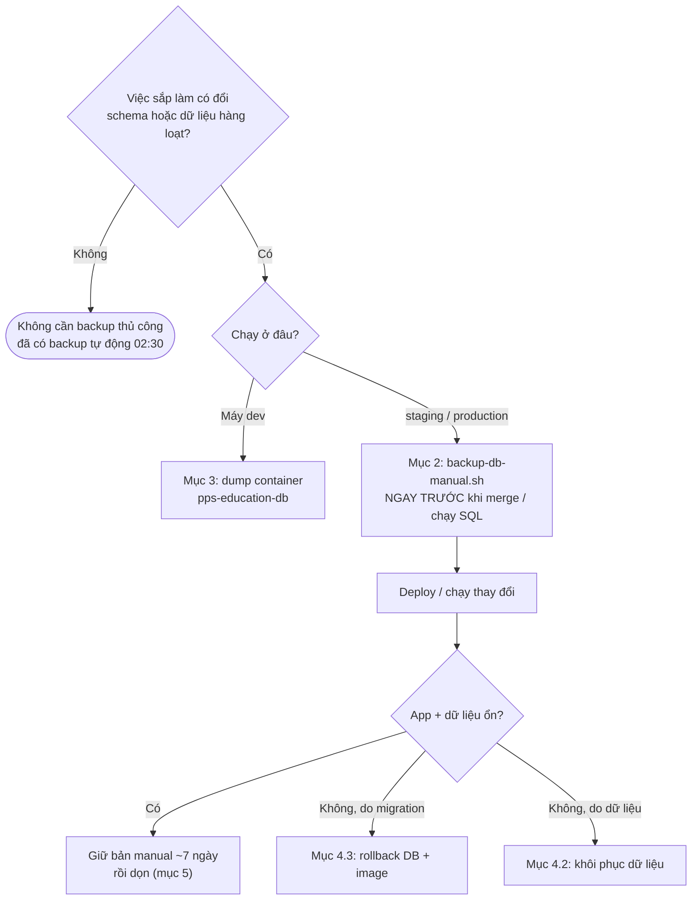

# Runbook — Backup & khôi phục database

Các bước thao tác tay khi cần **backup thủ công** trước thay đổi lớn về DB và
khi cần **khôi phục** DB. Phần cài đặt backup tự động hằng ngày (systemd
timer, GPG, rclone → Google Drive) và sơ đồ luồng của từng script nằm ở
[`deploy/README.md` mục 11](README.md#11-backup-postgres-3-2-1) — runbook này
giả định đã cài xong mục đó.

## 0. Tra nhanh

| Tình huống | Làm theo |
|---|---|
| Sắp merge PR có migration Flyway "nguy hiểm" lên staging/production | [Mục 2](#2-backup-thủ-công-trước-thay-đổi-lớn-server) |
| Sắp chạy SQL sửa dữ liệu tay / import hàng loạt trên server | [Mục 2](#2-backup-thủ-công-trước-thay-đổi-lớn-server) |
| Thử migration mới / `docker compose down -v` trên máy dev | [Mục 3](#3-backup--khôi-phục-trên-máy-dev-local) |
| Test restore định kỳ (mỗi quý) | [Mục 4.1](#41-test-restore-vào-db-scratch-không-ảnh-hưởng-gì) |
| Dữ liệu bị xoá/sửa nhầm, schema không đổi | [Mục 4.2](#42-dữ-liệu-bị-xoásửa-nhầm) |
| Migration vừa deploy làm hỏng DB/app | [Mục 4.3](#43-rollback-migration-hỏng-db--image-backend) |
| Mất bản local trên server, phải lấy từ Google Drive | [Mục 4.4](#44-lấy-bản-backup-từ-google-drive) |
| File media (ảnh/audio/video) production bị xoá/ghi đè/mất | [Mục 4.5](#45-khôi-phục-file-media-minio-production) |



## 1. Thông tin các DB trên server

Mọi lệnh bên dưới chạy trên server qua SSH (`ssh ppsadmin@192.168.100.90`) hoặc
Cockpit terminal, dưới user `ppsadmin` (có sudo). Script chạy dưới user
`deploy` (`sudo -u deploy ...`) để file backup thuộc đúng owner.

| Stack | Container Postgres | Container backend | DB / user | Schema quản lý bởi |
|---|---|---|---|---|
| `staging` | `pps-staging-postgres-1` | `pps-staging-backend-1` | `pps_education` / `pps_app` | Flyway |
| `production` | `pps-production-postgres-1` | `pps-production-backend-1` | `pps_education` / `pps_app` | Flyway |
| `ppsvn` (web công khai) | `ppsvn-postgres-1` | `ppsvn-backend-1` | `ppscenter` / `ppscenter` | Prisma |

| Thư mục (`/opt/pps-education/backups/...`) | Nội dung | Tự xoá? |
|---|---|---|
| `<stack>/daily`, `weekly`, `monthly` | Backup tự động 02:30 | Có — giữ 7 / 4 / 6 bản |
| `<stack>/manual` | Backup thủ công (mục 2) | **Không** — tự dọn |
| `<stack>/pre-restore` | Bản `restore-db.sh --live` tự chụp trước khi ghi đè | **Không** — tự dọn |
| `encrypted/<stack>/...` | Bản GPG của daily/weekly/monthly, đồng bộ lên Drive | Có |

## 2. Backup thủ công trước thay đổi lớn (server)

### Khi nào BẮT BUỘC

Chụp bản thủ công trước khi deploy lên **staging hoặc production** nếu thay
đổi có bất kỳ điều nào sau:

- Migration Flyway có `DROP` (bảng/cột/constraint), `RENAME`, `ALTER ... TYPE`,
  thêm `NOT NULL` vào cột đã có dữ liệu, hoặc `UPDATE`/`DELETE`/`INSERT` dữ
  liệu hàng loạt (data migration).
- Migration có placeholder chạy 1 lần kiểu `APPLY_LOCALTIME_8H_SHIFT` (xem
  `CONTRIBUTING.md` mục Data-fix LocalTime).
- Chạy SQL sửa tay trực tiếp bằng `psql`, import Excel hàng loạt, script dọn
  dữ liệu.
- PR promote `develop → main` hoặc `main → production` gom nhiều migration.

Migration chỉ `CREATE TABLE` / `ADD COLUMN` nullable / `CREATE INDEX` thường
không cần — backup tự động 02:30 là đủ.

Kiểm tra PR sắp promote có migration nào (chạy trên máy dev):

```bash
git fetch origin && git diff --name-only origin/production origin/main -- pps-education-backend/src/main/resources/db/migration/
```

### Các bước

**Bước 1 — Chụp bản thủ công NGAY TRƯỚC khi deploy.** Với production, job
deploy trong `cd-production.yml` chờ approve (environment `production`), nên có
thể merge PR xong rồi chụp trong lúc job đang chờ, chụp xong mới bấm approve.
Với staging, chụp **trước khi bấm merge** vì job deploy chạy ngay.

```bash
sudo -u deploy /opt/pps-education/backup-db-manual.sh production truoc-V193-doi-cot-hoc-phi
```

Nhãn nên có mã migration/việc sắp làm, viết không dấu. Script sẽ:
- dump + kiểm tra dump đọc được + checksum vào `backups/production/manual/`;
- gắn tag giữ lại image backend đang chạy (`pps-rollback/production-backend:<ts>-<nhãn>`)
  — CD chạy `docker image prune -f` sau mỗi lần deploy, không có tag này thì
  image cũ bị xoá, lúc rollback không còn image khớp với schema cũ;
- ghi file `.info.txt`: tên image rollback + 5 migration Flyway gần nhất.

Đọc output, xác nhận có dòng `OK: ...dump` và **chép lại đường dẫn file**.

**Bước 2 — Deploy / chạy thay đổi** (approve job, hoặc chạy SQL).

**Bước 3 — Kiểm tra sau deploy:**

```bash
docker logs --since 10m pps-production-backend-1 2>&1 | grep -iE 'flyway|migrat|error' | tail -20
docker exec pps-production-postgres-1 psql -U pps_app -d pps_education -c \
  "SELECT version, description, success FROM flyway_schema_history ORDER BY installed_rank DESC LIMIT 5;"
```

Đăng nhập app và thao tác đúng chức năng bị ảnh hưởng. Đừng dựa vào
`/actuator/health` — endpoint này có thể báo `DOWN` do SMTP chưa cấu hình,
không phản ánh tình trạng DB.

**Bước 4 — Nếu hỏng:** sang [mục 4.3](#43-rollback-migration-hỏng-db--image-backend)
(do migration) hoặc [mục 4.2](#42-dữ-liệu-bị-xoásửa-nhầm) (do dữ liệu).
Nếu ổn: giữ bản thủ công khoảng 7 ngày rồi dọn ([mục 5](#5-dọn-dẹp)).

## 3. Backup & khôi phục trên máy dev (local)

DB local chạy trong container `pps-education-db` (từ `docker-compose.yml` ở
root repo, volume `pps_pg_data`). Nên dump trước khi: thử migration mới có
đổi/xoá dữ liệu, chuyển qua lại giữa các nhánh có migration khác nhau,
hoặc `docker compose down -v` (xoá sạch volume).

Lệnh dưới đây dump **trong container** rồi `docker cp` ra ngoài — chạy được
cả trong PowerShell lẫn Git Bash. Không dùng `docker exec ... pg_dump > file`
trong Windows PowerShell 5.1: toán tử `>` ghi lại dưới dạng UTF-16 và làm hỏng
file dump nhị phân.

```bash
docker exec pps-education-db pg_dump -U pps_app -Fc -f /tmp/local.dump pps_education
```

```bash
docker cp pps-education-db:/tmp/local.dump ./backups-local/pps_education_truoc-V193.dump
```

(`backups-local/` tự tạo trước; đừng commit file dump — DB local có thể chứa
email thật của giáo viên.)

**Khôi phục local** — dừng backend trước (`mvn spring-boot:run` hoặc container
`pps-education-backend`), rồi:

```bash
docker cp ./backups-local/pps_education_truoc-V193.dump pps-education-db:/tmp/local.dump
```

```bash
docker exec pps-education-db psql -U pps_app -d postgres -c "DROP DATABASE pps_education WITH (FORCE);" -c "CREATE DATABASE pps_education OWNER pps_app;"
```

```bash
docker exec pps-education-db pg_restore -U pps_app -d pps_education --exit-on-error /tmp/local.dump
```

Sau khi restore về schema cũ, **checkout lại đúng nhánh khớp với schema đó**
trước khi chạy backend — chạy code nhánh mới sẽ khiến Flyway áp lại migration
mới ngay khi khởi động.

## 4. Khôi phục (server)

`restore-db.sh` nhận cả file `.dump` lẫn `.dump.gpg`, tự đối chiếu `.sha256`
nếu có và kiểm tra file dump đọc được trước khi làm gì. Mặc định **không** đụng
DB thật.

### 4.1 Test restore vào DB scratch (không ảnh hưởng gì)

Làm **mỗi quý** với 1 bản bất kỳ, và luôn làm trước khi `--live` để chắc file
dùng được.

```bash
ls -lt /opt/pps-education/backups/production/daily/ | head
sudo -u deploy /opt/pps-education/restore-db.sh production /opt/pps-education/backups/production/daily/<file>.dump
```

Script tạo DB `pps_education_restore_<ts>` và in số dòng 10 bảng lớn nhất. Đối
chiếu với DB thật:

```bash
docker exec pps-production-postgres-1 psql -U pps_app -d pps_education -c \
  "SELECT relname, n_live_tup FROM pg_stat_user_tables ORDER BY n_live_tup DESC LIMIT 10;"
```

Xong thì xoá DB scratch (lệnh chính xác được in ở cuối output của script):

```bash
docker exec pps-production-postgres-1 psql -U pps_app -d postgres -c 'DROP DATABASE "pps_education_restore_<ts>";'
```

### 4.2 Dữ liệu bị xoá/sửa nhầm

Chọn cách **ít mất dữ liệu nhất**:

**Cách A (ưu tiên) — chỉ lấy lại phần bị mất.** Restore bản gần nhất trước sự
cố vào DB scratch ([4.1](#41-test-restore-vào-db-scratch-không-ảnh-hưởng-gì)),
rồi copy đúng những dòng bị mất sang DB thật. Mọi dữ liệu phát sinh sau thời
điểm backup vẫn được giữ nguyên. VD lấy lại các buổi điểm danh của 1 lớp bị
xoá nhầm:

```bash
docker exec pps-production-postgres-1 psql -U pps_app -d pps_education_restore_<ts> \
  -c "\copy (SELECT * FROM <bang> WHERE <dieu_kien>) TO '/tmp/rows.csv' CSV HEADER"
docker exec pps-production-postgres-1 psql -U pps_app -d pps_education \
  -c "\copy <bang> FROM '/tmp/rows.csv' CSV HEADER"
```

(Cả 2 DB cùng 1 container nên `/tmp/rows.csv` dùng chung được. Cẩn thận khoá
ngoại/sequence — thử trên staging trước nếu bảng phức tạp.)

**Cách B — ghi đè toàn bộ DB.** Chỉ khi hỏng diện rộng. **Mất mọi dữ liệu phát
sinh sau thời điểm backup** — báo trước cho người dùng hệ thống.

```bash
sudo -u deploy /opt/pps-education/restore-db.sh production <file>.dump --live
```

Script bắt gõ lại tên stack, tự chụp `pre-restore/`, dừng backend, drop + tạo
lại DB, restore, rồi bật lại backend.

### 4.3 Rollback migration hỏng (DB + image backend)

Phải rollback **cả DB lẫn image backend**, và **đúng thứ tự dưới đây**. Nếu
chỉ restore DB mà giữ image mới, backend khởi động lại sẽ cho Flyway áp lại
đúng migration hỏng đó ngay.

Cần: bản manual chụp ở mục 2 + file `.info.txt` đi kèm (chứa tên image rollback).

```bash
cat /opt/pps-education/backups/production/manual/<file>.info.txt
```

**Bước 1 — Dừng backend** (để `restore-db.sh` KHÔNG tự bật lại image mới):

```bash
docker stop pps-production-backend-1
```

**Bước 2 — Restore DB về bản trước thay đổi:**

```bash
sudo -u deploy /opt/pps-education/restore-db.sh production /opt/pps-education/backups/production/manual/<file>.dump --live
```

(Backend đã dừng từ trước nên script giữ nguyên trạng thái dừng.)

**Bước 3 — Chạy image cũ.** Sửa dòng `image:` của service `backend` trong
`/opt/pps-education/production/docker-compose.yml` thành tên image rollback
trong `.info.txt`:

```bash
cd /opt/pps-education/production
sudo -u deploy sed -i 's#^\(    image: \)ghcr.io/langtuananh2424/pps-education/backend:.*#\1pps-rollback/production-backend:<ts>-<nhan>#' docker-compose.yml
grep -n 'image:' docker-compose.yml
sudo -u deploy docker compose up -d --no-deps backend
```

(Nếu không có bản manual/image rollback: dùng tag bất biến `prod-<sha 7 ký tự>`
của lần deploy trước trên GHCR — lấy SHA từ lần chạy `cd-production.yml`
thành công trước đó trong tab Actions — xem `deploy/README.md` mục 10.)

**Bước 4 — Kiểm tra:** migration mới nhất trong `flyway_schema_history` phải
khớp với `.info.txt`, log backend không có lỗi Flyway, app đăng nhập và thao
tác bình thường.

**Bước 5 — Sửa code trước lần deploy kế tiếp.** `cd-production.yml` ghi đè
lại `docker-compose.yml` từ repo và kéo `prod-latest` ở **mọi** lần deploy
sau, nên phải revert/sửa trong repo trước khi có lần deploy tiếp theo — nếu
không migration hỏng sẽ quay lại. Theo `CONTRIBUTING.md`: không sửa nội dung
migration đã merge, sửa bằng migration mới hoặc revert PR, rồi đi lại luồng
`develop → main → production` bình thường. Nếu staging cũng đã chạy migration
đó, làm lại các bước trên cho `staging`.

### 4.4 Lấy bản backup từ Google Drive

Khi thư mục local trên server bị mất/hỏng. Cần passphrase GPG (có trên server
tại `/opt/pps-education/backup.gpg-passphrase` — nếu server mới, tạo lại file
này từ password manager, cùng owner/quyền như README mục 11).

```bash
sudo -u deploy rclone ls gdrive:pps-education-backups/production/daily
sudo -u deploy rclone copy gdrive:pps-education-backups/production/daily/<file>.dump.gpg /opt/pps-education/backups/production/
sudo -u deploy /opt/pps-education/restore-db.sh production /opt/pps-education/backups/production/<file>.dump.gpg
```

Lệnh cuối restore vào DB scratch trước; ổn rồi mới chạy lại với `--live`.

### 4.5 Khôi phục file media (MinIO production)

Nguồn: `/mnt/pps-backup/media/` do `backup-media.sh` tạo (README mục 11b) —
`current/<key>` là bản mới nhất (kể cả file đã bị xoá trên MinIO),
`changed/<ts>/<key>` là bản cũ của file bị ghi đè. `<key>` chính là đường dẫn
object trong bucket `pps-media` (cột URL media trong DB, bỏ phần
`https://files.ppsvietnam.edu.vn/`).

Ghi vào MinIO cần tài khoản root (tài khoản backup chỉ đọc) — lấy từ container
đang chạy, dùng xong xoá:

```bash
sudo -u deploy bash -c 'umask 077; docker inspect -f "{{range .Config.Env}}{{println .}}{{end}}" pps-production-minio-1 | grep -E "^MINIO_ROOT_(USER|PASSWORD)=" > /tmp/pps-minio-root.env'
```

Tìm file trong backup:

```bash
sudo find /mnt/pps-backup/media -path '*<mot-phan-ten-file>*' -printf '%TY-%Tm-%Td %TH:%TM  %s  %p\n'
```

**Khôi phục 1 file / 1 thư mục** (thay `<key>`; thư mục thì thêm `--recursive`):

```bash
sudo -u deploy docker run --rm --network pps-production_internal \
  --env-file /tmp/pps-minio-root.env -v /mnt/pps-backup/media:/bk:ro \
  --entrypoint sh quay.io/minio/mc:RELEASE.2025-08-13T08-35-41Z@sha256:a7fe349ef4bd8521fb8497f55c6042871b2ae640607cf99d9bede5e9bdf11727 -c '
mc alias set m http://minio:9000 "$MINIO_ROOT_USER" "$MINIO_ROOT_PASSWORD" > /dev/null &&
mc cp "/bk/current/<key>" "m/pps-media/<key>"'
```

Lấy bản cũ trước khi bị ghi đè: thay `/bk/current/<key>` bằng
`/bk/changed/<ts>/<key>`.

**Khôi phục toàn bộ bucket** (mất cả volume media) — chỉ chép file còn thiếu,
không ghi đè file đang có. Chạy `--dry-run` trước để xem danh sách:

```bash
sudo -u deploy docker run --rm --network pps-production_internal \
  --env-file /tmp/pps-minio-root.env -v /mnt/pps-backup/media:/bk:ro \
  --entrypoint sh quay.io/minio/mc:RELEASE.2025-08-13T08-35-41Z@sha256:a7fe349ef4bd8521fb8497f55c6042871b2ae640607cf99d9bede5e9bdf11727 -c '
mc alias set m http://minio:9000 "$MINIO_ROOT_USER" "$MINIO_ROOT_PASSWORD" > /dev/null &&
mc mb --ignore-existing m/pps-media &&
mc mirror --dry-run /bk/current m/pps-media'
```

Ổn thì chạy lại bỏ `--dry-run`. `current/` còn cả file đã bị xoá có chủ đích
trên MinIO — không sao (DB không còn trỏ tới), chỉ tốn dung lượng.

Xong **luôn** xoá file tạm chứa mật khẩu root:

```bash
sudo rm -f /tmp/pps-minio-root.env
```

Kiểm tra: mở lại trên app đúng bài học/bài nộp có file vừa khôi phục, hoặc
`curl -sI https://files.ppsvietnam.edu.vn/<key>` phải trả `200`.

> Lệnh trên dùng image `mc` đã ghim trên quay.io (giống `minio-init`; Docker Hub
> đã gỡ `minio/mc`). Nếu quay.io cũng gỡ: nạp lại từ file lưu offline, xem
> README mục 3b bước 6.

## 5. Dọn dẹp

Bản `manual/`, `pre-restore/` và image `pps-rollback/*` **không tự xoá**.
Sau khi thay đổi chạy ổn định khoảng 7 ngày:

```bash
ls -lh /opt/pps-education/backups/*/manual /opt/pps-education/backups/*/pre-restore
sudo -u deploy rm /opt/pps-education/backups/production/manual/<ts>_<nhan>.*
docker images 'pps-rollback/*'
docker rmi pps-rollback/production-backend:<ts>-<nhan>
```

## 6. Sau mỗi lần khôi phục thật

- Ghi lại: thời điểm sự cố, bản backup đã dùng, khoảng dữ liệu bị mất (nếu có).
- Báo cho người dùng hệ thống nếu có dữ liệu phát sinh sau thời điểm backup bị
  mất (Cách B ở 4.2 hoặc rollback 4.3).
- Chạy tay 1 lần backup tự động để có bản mới nhất ngay sau khi khôi phục:
  `sudo systemctl start pps-db-backup.service`.
- Xoá DB scratch còn sót: `docker exec pps-production-postgres-1 psql -U pps_app -d postgres -c '\l'`.
