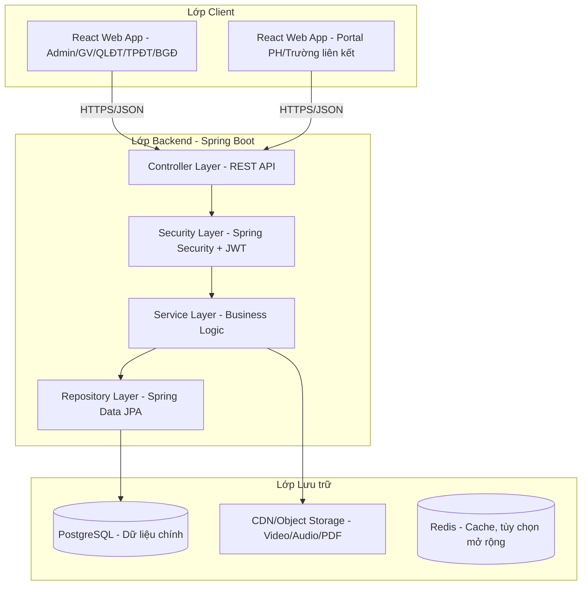

# Giới thiệu

## Mục đích tài liệu

Tài liệu này (System Design Document - SDD) mô tả chi tiết thiết kế kỹ
thuật của Hệ thống Giáo dục và Quản lý PPS English, bao gồm kiến trúc
tổng thể, thiết kế cơ sở dữ liệu, cơ chế bảo mật và các luồng nghiệp vụ
chính. Tài liệu là cơ sở để đội ngũ phát triển triển khai hệ thống đảm
bảo tính nhất quán giữa các thành viên và làm căn cứ đối chiếu khi
review code.

## Phạm vi hệ thống

Hệ thống phục vụ mô hình trung tâm Anh ngữ vừa liên kết với các trường
trên địa bàn Hà Nội, vừa tổ chức các khóa học mở tại cơ sở riêng, với
quy mô dự kiến 1300 học sinh. Hệ thống bao phủ 10 phân hệ nghiệp vụ:
Quản lý người dùng & phân quyền, Quản lý công việc, Quản lý nhân sự,
Quản lý học sinh, Quản lý học thuật & đào tạo, Cổng thông tin &
E-Learning, Quản lý tài chính & học phí, Quản lý khách hàng & tuyển sinh
và Quản lý điểm trường & cơ sở vật chất.

## Tài liệu tham chiếu

Tài liệu Đặc tả Yêu cầu Phần mềm (SRS) --- PPS-Education_SRS.docx.

## Từ điển thuật ngữ

  -----------------------------------------------------------------------
  Thuật ngữ        Giải thích
  ---------------- ------------------------------------------------------
  SRS              Software Requirements Specification --- Tài liệu đặc
                   tả yêu cầu phần mềm

  SDD              System Design Document --- Tài liệu thiết kế hệ thống

  PBAC             Permission-Based Access Control --- Kiểm soát truy cập
                   dựa trên quyền

  UUID             Universal Unique Identifier - Mã định danh duy nhất
                   toàn cầu

  Điểm trường      Khái niệm chung cho cơ sở tự vận hành hoặc trường liên
                   kết

  TPĐT             Trưởng phòng đào tạo

  QLĐT             Quản lý điểm trường

  QLVH             Quản lý vận hành

  BGĐ              Ban giám đốc

  PH               Phụ huynh

  HS               Học sinh

  GV               Giáo viên

  FK               Foreign Key -- Khóa ngoại

  PK               Primary Key -- Khóa chính
  -----------------------------------------------------------------------

# Kiến trúc tổng thể

## Sơ đồ kiến trúc

<!-- Nguồn: docs/diagrams/architecture/KienTrucTongThe.mmd (chỉnh sửa trực tiếp file này, không sửa trong srs.md/sdd-groups) -->

## Tech stack chi tiết

  ------------------------------------------------------------------------
  Thành phần     Công nghệ      Ghi chú
  -------------- -------------- ------------------------------------------
  Backend        Spring Boot    Kiến trúc phân lớp
                                Controller-Service-Repository

  Frontend       React          Component-based, tổ chức theo module
                                nghiệp vụ

  Database       PostgreSQL     Có bật extension postgis, pgcrypto

  Quản lý mã     Github         Quy trình branching + Pull Request
  nguồn                         

  Đóng gói/triển Docker +       Đồng nhất môi trường
  khai           Docker Compose 

  Môi trường     Railway hoặc   Deploy nhanh từ GitHub
  staging/demo   Render         
  ------------------------------------------------------------------------

## Nguyên tắc thiết kế xuyên suốt

Đây là các quy ước áp dụng cho toàn bộ cơ sở dữ liệu, đã thống nhất
trước khi thiết kế chi tiết từng bảng:

a)  **Khóa chính kết hợp:**

*id BIGSERIAL PRIMARY KEY,* \-- dùng nội bộ (JOIN, FK, index)

*uuid UUID NOT NULL UNIQUE DEFAULT gen_random_uuid(),* \-- dùng public
(API/URL)

FK giữa các bảng luôn dùng BIGINT tham chiếu id, không dùng UUID để giữ
index gọn nhẹ

b)  **Soft-delete có chọn lọc:** Chỉ áp dụng *deleted_at TIMESTAMPTZ
    NULL* cho các bảng nghiệp vụ quan trọng, có giá trị pháp lý hoặc tài
    chính (học sinh, hóa đơn, hợp đồng,...). Bảng danh mục/cấu hình dùng
    xóa cứng.

c)  **Nhật ký lịch sử riêng cho từng bảng:** Các bảng nghiệp vụ nhạy cảm
    có bảng *\<table\>\_history* đi kèm, cấu trúc chuẩn:

*history_id BIGSERIAL PRIMARY KEY,*

*\<table\>\_id BIGINT NOT NULL,*

*changed_by BIGINT NOT NULL REFERENCES users(id),*

*changed_at TIMESTAMPTZ NOT NULL DEFAULT NOW(),*

*action VARCHAR(20) NOT NULL, \-- INSERT / UPDATE / DELETE*

*old_data JSONB,*

*new_data JSONB*

d)  **Quy ước đặt tên:** Tên bảng số nhiều, snake_case, tiếng Anh
    (students, class_sessions). Tên cột snake_case tiếng Anh. Timestamp
    chuẩn created_at / updated_at (TIMESTAMPTZ). Khóa ngoại đặt tên
    *\<table_singular\>\_id*

e)  ***Mô hình phân quyền Hybrid PBAC:*** Người dùng được gán 1 hoặc
    nhiều Role (vai trò mặc định), mỗi Role có tập Permission (quyền chi
    tiết). Ngoài ra hỗ trợ Override --- cấp/tước quyền ngoại lệ đích
    danh cho 1 user, có thể có thời hạn --- phục vụ các tình huống ủy
    quyền linh hoạt trong thực tế vận hành.
