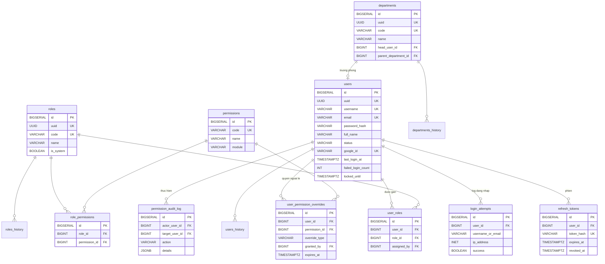

## Nền tảng

### Mô tả tổng quan

Nhóm nền tảng chứa các bảng gốc mà mọi phân hệ khác tham chiếu tới: Hệ
thống xác thực/phân quyền, phòng ban và các bảng hạ tầng dùng chung.

### Sơ đồ ERD

<!-- Nguồn: docs/diagrams/erd/ERD-Nhom1-NenTang.mmd (chỉnh sửa trực tiếp file này, không sửa trong srs.md/sdd-groups) -->

### Chi tiết từng bảng

a)  Bảng departments -- Phòng ban

Ngầm định bởi FR-HRM-03 (duyệt đơn 2 cấp) và FR-TSK-01 (giao việc theo
phòng ban)

  ------------------------------------------------------------------------------
  Cột                    Kiểu              Ràng buộc           Ghi chú
  ---------------------- ----------------- ------------------- -----------------
  id                     BIGSERIAL         PK                  

  uuid                   UUID              UNIQUE, NOT NULL,   
                                           DEFAULT             
                                           gen_random_uuid()   

  code                   VARCHAR(50)       UNIQUE, NOT NULL    Ví dụ: PDT, KT,
                                                               VH, TS

  name                   VARCHAR(200)      NOT NULL            \"Phòng Đào
                                                               tạo\", \"Phòng Kế
                                                               toán\"\...

  head_user_id           BIGINT            FK → users(id),     Trưởng phòng ---
                                           NULL                NULL khi phòng
                                                               chưa có trưởng
                                                               phòng

  parent_department_id   BIGINT            FK →                Dự phòng cho
                                           departments(id),    phòng ban con
                                           NULL                (hiện chưa dùng)

  created_at, updated_at TIMESTAMPTZ                           
  ------------------------------------------------------------------------------

Không soft-delete, không history -- danh mục cấu hình tĩnh

*Lưu ý khi triển khai: Có quan hệ vòng giữa departments.head_user_id và
employees.department_id (qua employees.user_id). Xử lý bằng cách seed
departments trước, tạo users + employees, sau đó UPDATE
departments.head_user_id.*

b)  Bảng user -- Tài khoản người dùng

Bảng trung tâm --- mọi tác nhân (Học sinh, Phụ huynh, Giáo viên, các cấp
Quản lý\...) đều là 1 record trong bảng này.

  -----------------------------------------------------------------------------
  Cột                  Kiểu             Ràng buộc          Ghi chú
  -------------------- ---------------- ------------------ --------------------
  id                   BIGSERIAL        PK                 

  username             VARCHAR(100)     UNIQUE, NOT NULL   

  email                VARCHAR(255)     UNIQUE, NOT NULL   Dùng cho đăng nhập
                                                           Google

  password_hash        VARCHAR(255)     NULL               NULL nếu chỉ đăng
                                                           nhập Google. Mã hóa
                                                           BCrypt

  full_name            VARCHAR(200)     NOT NULL           

  phone                VARCHAR(20)      NULL               

  status               VARCHAR(20)      NOT NULL, DEFAULT  ACTIVE / INACTIVE /
                                        \'ACTIVE\'         SUSPENDED

  google_id            VARCHAR(255)     UNIQUE, NULL       

  last_login_at        TIMESTAMPTZ      NULL               

  failed_login_count   INT              NOT NULL, DEFAULT  Đếm cho cơ chế chống
                                        0                  brute-force

  locked_until         TIMESTAMPTZ      NULL               Thời điểm hết khóa
                                                           tài khoản

  created_at,          TIMESTAMPTZ                         
  updated_at                                               
  -----------------------------------------------------------------------------

Không soft-delete --- dùng status=\'INACTIVE\' để vô hiệu hóa. Có bảng
users_history.

*Quyết định thiết kế:* Học sinh và Phụ huynh dùng chung bảng users thông
tin đặc thù từng loại tác nhân được lưu ở bảng mở rộng riêng (students,
parents, employees --- chi tiết ở các nhóm sau) liên kết 1-1 qua
user_id. Áp dụng đúng nguyên tắc này, `department_id`/`is_management` ---
chỉ có ý nghĩa với nhân sự --- nằm ở bảng `employees` (nhóm Nhân sự), không
nằm ở `users`.

*Cơ chế khởi tạo tài khoản (UC-43/FR-USR-01):* hệ thống không có tự đăng
ký --- tài khoản do người có quyền user.manage khởi tạo. Mật khẩu ban đầu
tùy chọn: nhập (tối thiểu 8 ký tự, băm BCrypt --- NFR-SEC-01) hoặc bỏ
trống để tạo tài khoản chỉ đăng nhập Google (password_hash = NULL, đăng
nhập Google khớp theo email --- UC-01 A4). Tài khoản mới KHÔNG kèm role
--- gán sau qua UC-03/UC-04. Không có cơ chế "bắt đổi mật khẩu lần đầu"
(bảng users không có cột tương ứng --- ngoài phạm vi thiết kế hiện tại).
Ngoại lệ duy nhất về thẩm quyền: luồng khởi tạo hồ sơ nhân sự (UC-08,
quyền hrm.manage) được tạo tài khoản kèm hồ sơ trong cùng 1 transaction
cho nhân sự chưa có tài khoản --- dùng chung cơ chế/ràng buộc ở trên.

c)  Bảng roles -- Vai trò

  ------------------------------------------------------------------------
  Cột             Kiểu             Ràng buộc          Ghi chú
  --------------- ---------------- ------------------ --------------------
  id              BIGSERIAL        PK                 

  uuid            UUID             UNIQUE, NOT NULL   

  code            VARCHAR(50)      UNIQUE, NOT NULL   STUDENT, PARENT,
                                                      TEACHER,
                                                      HEAD_ACADEMIC,
                                                      SITE_MANAGER,
                                                      OPS_MANAGER,
                                                      HR_MANAGER, STAFF,
                                                      SYS_ADMIN,
                                                      PARTNER_REP,
                                                      EXECUTIVE

  name            VARCHAR(200)     NOT NULL           Tên hiển thị

  description     TEXT             NULL               

  is_system       BOOLEAN          NOT NULL, DEFAULT  TRUE = 1 trong 11
                                   FALSE              role gốc của hệ
                                                      thống, không cho xóa
                                                      qua UI

  created_at,     TIMESTAMPTZ                         
  updated_at                                          
  ------------------------------------------------------------------------

Có bảng roles_history.

d)  Bảng permissions -- Danh mục quyền chi tiết

  ----------------------------------------------------------------------------
  Cột             Kiểu             Ràng buộc          Ghi chú
  --------------- ---------------- ------------------ ------------------------
  id              BIGSERIAL        PK                 

  code            VARCHAR(100)     UNIQUE, NOT NULL   Format
                                                      \<module\>.\<action\>,
                                                      VD class.create,
                                                      grade.approve

  name            VARCHAR(200)     NOT NULL           

  module          VARCHAR(50)      NOT NULL           AUTH, USER, TASK, HRM,
                                                      STUDENT, ACADEMIC, LMS,
                                                      FINANCE, CRM, FACILITY

  description     TEXT             NULL               

  created_at      TIMESTAMPTZ                         
  ----------------------------------------------------------------------------

Không cần history -- danh mục cố định do developer định nghĩa qua
migration.

e)  Bảng user_roles -- Gán role cho user (M-N)

  ------------------------------------------------------------------------
  Cột             Kiểu             Ràng buộc          Ghi chú
  --------------- ---------------- ------------------ --------------------
  id              BIGSERIAL        PK                 

  user_id         BIGINT           FK → users(id),    
                                   NOT NULL           

  role_id         BIGINT           FK → roles(id),    
                                   NOT NULL           

  assigned_at     TIMESTAMPTZ      NOT NULL, DEFAULT  
                                   NOW()              

  assigned_by     BIGINT           FK → users(id),    
                                   NOT NULL           

                                   UNIQUE(user_id,    
                                   role_id)           
  ------------------------------------------------------------------------

1 user có thể được gán nhiều role cùng lúc --- hỗ trợ nguyên tắc \"một
tài khoản có thể đảm nhận công việc thuộc phạm vi tác nhân khác\" đã nêu
trong SRS.

f)  Bảng role_permissions --- Role có những permission gì (M-N)

  ------------------------------------------------------------------------
  Cột             Kiểu             Ràng buộc          Ghi chú
  --------------- ---------------- ------------------ --------------------
  id              BIGSERIAL        PK                 

  role_id         BIGINT           FK → roles(id),    
                                   NOT NULL           

  permission_id   BIGINT           FK →               
                                   permissions(id),   
                                   NOT NULL           

                                   UNIQUE(role_id,    
                                   permission_id)     
  ------------------------------------------------------------------------

g)  Bảng user_permission_overrides --- Quyền ngoại lệ

  ------------------------------------------------------------------------------
  Cột             Kiểu             Ràng buộc                Ghi chú
  --------------- ---------------- ------------------------ --------------------
  id              BIGSERIAL        PK                       

  user_id         BIGINT           FK → users(id), NOT NULL 

  permission_id   BIGINT           FK → permissions(id),    
                                   NOT NULL                 

  override_type   VARCHAR(20)      NOT NULL, CHECK IN       
                                   (\'GRANT\',\'REVOKE\')   

  reason          TEXT             NULL                     VD: \"GV được ủy
                                                            quyền xếp lịch thay
                                                            TPĐT khi đi công
                                                            tác\"

  granted_by      BIGINT           FK → users(id), NOT NULL 

  granted_at      TIMESTAMPTZ      NOT NULL, DEFAULT NOW()  

  expires_at      TIMESTAMPTZ      NULL                     Cho phép ủy quyền có
                                                            thời hạn

                                   UNIQUE(user_id,          
                                   permission_id)           
  ------------------------------------------------------------------------------

Logic tính effective permission (business logic, không phải cấu trúc
bảng):

effective_permissions(user) = (hợp tất cả permissions từ user_roles →
role_permissions) - các REVOKE override còn hiệu lực + các GRANT
override còn hiệu lực

h)  Bảng permission_audit_log --- Nhật ký thay đổi phân quyền

  -----------------------------------------------------------------------------------
  Cột                    Kiểu           Ràng buộc          Ghi chú
  ---------------------- -------------- ------------------ --------------------------
  id                     BIGSERIAL      PK                 

  actor_user_id          BIGINT         FK → users(id),    Ai thực hiện
                                        NOT NULL           

  target_user_id         BIGINT         FK → users(id),    Ảnh hưởng đến ai
                                        NOT NULL           

  action                 VARCHAR(50)    NOT NULL           ROLE_GRANTED /
                                                           ROLE_REVOKED /
                                                           PERM_OVERRIDE_ADDED /
                                                           PERM_OVERRIDE_REMOVED

  target_role_id         BIGINT         FK → roles(id),    
                                        NULL               

  target_permission_id   BIGINT         FK →               
                                        permissions(id),   
                                        NULL               

  details                JSONB          NULL               

  ip_address             INET           NULL               

  created_at             TIMESTAMPTZ    NOT NULL, DEFAULT  
                                        NOW()              
  -----------------------------------------------------------------------------------

i)  Bảng refresh_tokens --- Refresh token cho JWT

  ------------------------------------------------------------------------
  Cột              Kiểu           Ràng buộc     Ghi chú
  ---------------- -------------- ------------- --------------------------
  id               BIGSERIAL      PK            

  user_id          BIGINT         FK →          
                                  users(id),    
                                  NOT NULL      

  token_hash       VARCHAR(255)   UNIQUE, NOT   Băm SHA-256, không lưu
                                  NULL          plain-text

  device_info      VARCHAR(500)   NULL          

  ip_address       INET           NULL          

  issued_at        TIMESTAMPTZ    NOT NULL,     
                                  DEFAULT NOW() 

  expires_at       TIMESTAMPTZ    NOT NULL      

  revoked_at       TIMESTAMPTZ    NULL          

  last_used_at     TIMESTAMPTZ    NULL          
  ------------------------------------------------------------------------

Chỉ số:

CREATE INDEX idx_refresh_tokens_user_active ON refresh_tokens(user_id)
WHERE revoked_at IS NULL;

CREATE INDEX idx_refresh_tokens_expires ON refresh_tokens(expires_at)
WHERE revoked_at IS NULL;

Access token không lưu DB --- stateless, verify bằng chữ ký. Đổi mật
khẩu → thu hồi toàn bộ refresh token cũ.

j)  Bảng login_attempts --- Nhật ký đăng nhập

  ---------------------------------------------------------------------------
  Cột                 Kiểu           Ràng buộc     Ghi chú
  ------------------- -------------- ------------- --------------------------
  id                  BIGSERIAL      PK            

  username_or_email   VARCHAR(255)   NOT NULL      Không FK vì user có thể
                                                   không tồn tại

  user_id             BIGINT         FK →          
                                     users(id),    
                                     NULL          

  ip_address          INET           NOT NULL      

  user_agent          VARCHAR(500)   NULL          

  success             BOOLEAN        NOT NULL      

  failure_reason      VARCHAR(50)    NULL          WRONG_PASSWORD /
                                                   USER_NOT_FOUND /
                                                   USER_LOCKED /
                                                   USER_INACTIVE

  created_at          TIMESTAMPTZ    NOT NULL,     
                                     DEFAULT NOW() 
  ---------------------------------------------------------------------------

Bảng ghi tần suất cao -- cần cron job archive/xóa dữ liệu \> 90 ngày.

k)  Bảng system_settings --- Cấu hình hệ thống

Cho phép Quản trị viên bật/tắt tính năng qua UI không cần deploy lại.

  ------------------------------------------------------------------------
  Cột              Kiểu           Ràng buộc     Ghi chú
  ---------------- -------------- ------------- --------------------------
  id               BIGSERIAL      PK            

  setting_key      VARCHAR(100)   UNIQUE, NOT   VD attendance.gps_enabled
                                  NULL          

  setting_value    JSONB          NOT NULL      

  description      TEXT           NULL          

  category         VARCHAR(50)    NOT NULL      ATTENDANCE / SECURITY /
                                                NOTIFICATION /
                                                FEATURE_FLAG

  updated_by       BIGINT         FK →          
                                  users(id)     

  updated_at       TIMESTAMPTZ                  
  ------------------------------------------------------------------------

Có bảng system_settings_history.

l)  Bảng import_jobs --- Hạ tầng import Excel chung

Dùng chung cho mọi loại import (ca làm việc, lịch làm việc, danh sách
học sinh\...), không tạo bảng riêng cho từng loại.

  --------------------------------------------------------------------------
  Cột                Kiểu           Ràng buộc     Ghi chú
  ------------------ -------------- ------------- --------------------------
  id                 BIGSERIAL      PK            

  uuid               UUID           UNIQUE, NOT   
                                    NULL          

  import_type        VARCHAR(50)    NOT NULL      SHIFTS / EMPLOYEE_SHIFTS /
                                                  WORK_CALENDAR / STUDENTS /
                                                  ATTENDANCE /
                                                  TEACHING_SCHEDULE

  source_file_name   VARCHAR(500)   NOT NULL      

  source_file_url    VARCHAR(500)   NOT NULL      

  total_rows         INT            NULL          

  success_rows       INT            DEFAULT 0     

  failed_rows        INT            DEFAULT 0     

  status             VARCHAR(20)    NOT NULL,     PENDING / PROCESSING /
                                    DEFAULT       COMPLETED / FAILED /
                                    \'PENDING\'   PARTIAL_SUCCESS

  error_summary      JSONB          NULL          

  result_details     JSONB          NULL          

  uploaded_by        BIGINT         FK →          
                                    users(id)     

  started_at,        TIMESTAMPTZ    NULL          
  finished_at                                     

  created_at         TIMESTAMPTZ                  
  --------------------------------------------------------------------------

m)  Bảng approval_flows --- Luồng duyệt chung

Hạ tầng dùng chung cho các luồng duyệt 1 bước trong hệ thống

  ------------------------------------------------------------------------
  Cột              Kiểu           Ràng buộc     Ghi chú
  ---------------- -------------- ------------- --------------------------
  id               BIGSERIAL      PK            

  entity_type      VARCHAR(50)    NOT NULL      CURRICULUM /
                                                STUDENT_COMMENT /
                                                GRADE_ENTRY /
                                                TEACHING_PLAN

  entity_id        BIGINT         NOT NULL      

  status           VARCHAR(20)    NOT NULL,     PENDING / APPROVED /
                                  DEFAULT       REJECTED / CANCELLED
                                  \'PENDING\'   

  submitted_by     BIGINT         FK →          
                                  users(id),    
                                  NOT NULL      

  submitted_at     TIMESTAMPTZ    NOT NULL,     
                                  DEFAULT NOW() 

  approver_id      BIGINT         FK →          
                                  users(id),    
                                  NULL          

  decision         VARCHAR(20)    NULL          

  comment          TEXT           NULL          

  decided_at       TIMESTAMPTZ    NULL          

  batch_id         UUID           NULL          Nhóm nhiều record để duyệt
                                                lô

  created_at,      TIMESTAMPTZ                  
  updated_at                                    
  ------------------------------------------------------------------------

Chỉ số:

CREATE INDEX idx_approval_entity ON approval_flows(entity_type,
entity_id);

CREATE INDEX idx_approval_pending ON approval_flows(status,
submitted_at) WHERE status = \'PENDING\';

CREATE INDEX idx_approval_batch ON approval_flows(batch_id) WHERE
batch_id IS NOT NULL;

*Phân biệt với leave_request_approvals (Nhóm 4):* approval_flows là
luồng duyệt 1 bước đơn giản (đề xuất → duyệt/từ chối), trong khi đơn
nghỉ phép cần workflow nhiều bước tuần tự nên có bảng riêng.
