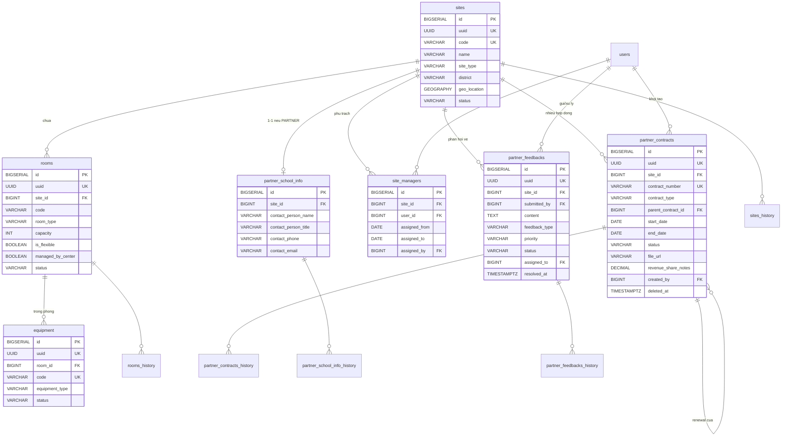

## Cơ sở vật chất & Điểm trường

### Mô tả tổng quan

Nhóm này quản lý danh mục điểm trường (thống nhất cơ sở tự vận hành và
trường liên kết thành 1 entity duy nhất phân loại theo site_type), phòng
học, thiết bị, hợp đồng hợp tác, và kênh phản hồi 2 chiều với trường
liên kết.

### Sơ đồ ERD

<!-- Nguồn: docs/diagrams/erd/ERD-Nhom2-CoSoVatChat.mmd (chỉnh sửa trực tiếp file này, không sửa trong srs.md/sdd-groups) -->

### Chi tiết từng bảng

a)  Bảng sites -- Điểm trường

  ---------------------------------------------------------------------------------------------
  Cột              Kiểu                    Ràng buộc                 Ghi chú
  ---------------- ----------------------- ------------------------- --------------------------
  id               BIGSERIAL               PK                        

  uuid             UUID                    UNIQUE, NOT NULL          

  code             VARCHAR(50)             UNIQUE, NOT NULL          VD: HQ-DL, LK-NGUYENDU

  name             VARCHAR(200)            NOT NULL                  \"Cơ sở Đống Đa\",
                                                                     \"Trường THCS Nguyễn Du\"

  site_type        VARCHAR(20)             NOT NULL, CHECK IN        OWNED = tự vận hành,
                                           (\'OWNED\',\'PARTNER\')   PARTNER = liên kết

  address          VARCHAR(500)            NULL                      

  district         VARCHAR(100)            NULL                      Quận/huyện

  phone            VARCHAR(20)             NULL                      

  geo_location     GEOGRAPHY(POINT,4326)   NULL                      Tọa độ trung tâm điểm
                                                                     trường --- dùng validate
                                                                     GPS chấm công

  status           VARCHAR(20)             NOT NULL, DEFAULT         ACTIVE / INACTIVE /
                                           \'ACTIVE\'                PENDING

  created_at,      TIMESTAMPTZ                                       
  updated_at                                                         
  ---------------------------------------------------------------------------------------------

Không soft-delete --- dùng status=\'INACTIVE\'. Có sites_history.

b)  Bảng partner_school_info --- Thông tin liên hệ trường liên kết

Quan hệ 1-1 với sites (chỉ áp dụng khi site_type=\'PARTNER\'), tách
riêng để tránh nhiều cột NULL ở bảng sites.

  ----------------------------------------------------------------------------
  Cột                    Kiểu            Ràng buộc           Ghi chú
  ---------------------- --------------- ------------------- -----------------
  id                     BIGSERIAL       PK                  

  site_id                BIGINT          FK → sites(id),     
                                         UNIQUE, NOT NULL    

  contact_person_name    VARCHAR(200)    NULL                

  contact_person_title   VARCHAR(100)    NULL                

  contact_phone          VARCHAR(20)     NULL                

  contact_email          VARCHAR(255)    NULL                

  additional_info        TEXT            NULL                

  created_at, updated_at TIMESTAMPTZ                         
  ----------------------------------------------------------------------------

Có partner_school_info_history.

c)  Bảng partner_contracts --- Hợp đồng liên kết

  ----------------------------------------------------------------------------------
  Cột                   Kiểu            Ràng buộc                Ghi chú
  --------------------- --------------- ------------------------ -------------------
  id                    BIGSERIAL       PK                       

  uuid                  UUID            UNIQUE, NOT NULL         

  site_id               BIGINT          FK → sites(id), NOT NULL 

  contract_number       VARCHAR(100)    UNIQUE, NOT NULL         

  contract_type         VARCHAR(30)     NOT NULL                 INITIAL / RENEWAL /
                                                                 AMENDMENT

  parent_contract_id    BIGINT          FK →                     Trỏ về hợp đồng cha
                                        partner_contracts(id),   nếu là
                                        NULL                     RENEWAL/AMENDMENT

  start_date, end_date  DATE            NOT NULL                 

  status                VARCHAR(20)     NOT NULL, DEFAULT        DRAFT / ACTIVE /
                                        \'DRAFT\'                EXPIRED /
                                                                 TERMINATED

  terms_summary         TEXT            NULL                     

  file_url              VARCHAR(500)    NULL                     

  signed_at             DATE            NULL                     

  signed_by_center,     VARCHAR(200)    NULL                     
  signed_by_partner                                              

  revenue_share_notes   TEXT            NULL                     Cột dự phòng cho
                                                                 chính sách chia sẻ
                                                                 doanh thu (backlog,
                                                                 chưa có quyết định
                                                                 chính thức)

  created_by            BIGINT          FK → users(id)           Quản lý vận hành
                                                                 khởi tạo

  created_at,           TIMESTAMPTZ                              Có soft-delete
  updated_at,                                                    
  deleted_at                                                     
  ----------------------------------------------------------------------------------

Có partner_contracts_history --- chứng cứ pháp lý, bắt buộc truy vết.

Ràng buộc:

CREATE UNIQUE INDEX idx_partner_contracts_active

ON partner_contracts(site_id)

WHERE status = \'ACTIVE\' AND deleted_at IS NULL;

ALTER TABLE partner_contracts ADD CONSTRAINT chk_contract_dates

CHECK (end_date \> start_date);

d)  Bảng site_managers --- Gán Quản lý điểm trường

Phản ánh quyết định: 1 điểm trường có 1 Quản lý điểm trường phụ trách
chính tại 1 thời điểm; 1 Quản lý điểm trường có thể phụ trách nhiều điểm
trường cùng lúc.

  ------------------------------------------------------------------------
  Cột                Kiểu            Ràng buộc           Ghi chú
  ------------------ --------------- ------------------- -----------------
  id                 BIGSERIAL       PK                  

  site_id            BIGINT          FK → sites(id), NOT 
                                     NULL                

  user_id            BIGINT          FK → users(id), NOT 
                                     NULL                

  assigned_from      DATE            NOT NULL            

  assigned_to        DATE            NULL                NULL = đang phụ
                                                         trách

  assigned_by        BIGINT          FK → users(id), NOT 
                                     NULL                

  notes              TEXT            NULL                

  created_at,        TIMESTAMPTZ                         
  updated_at                                             
  ------------------------------------------------------------------------

Ràng buộc:

CREATE UNIQUE INDEX idx_site_managers_active

ON site_managers(site_id)

WHERE assigned_to IS NULL;

Không soft-delete, không history riêng --- bản thân bảng đã là lịch sử
phân công theo thời gian.

e)  Bảng rooms --- Phòng học

  -------------------------------------------------------------------------
  Cột                 Kiểu            Ràng buộc           Ghi chú
  ------------------- --------------- ------------------- -----------------
  id                  BIGSERIAL       PK                  

  uuid                UUID            UNIQUE, NOT NULL    

  site_id             BIGINT          FK → sites(id), NOT 
                                      NULL                

  code                VARCHAR(50)     NOT NULL            Unique trong phạm
                                                          vi 1 site

  name                VARCHAR(200)    NULL                

  room_type           VARCHAR(30)     NOT NULL            THEORY / COMPUTER
                                                          / LAB / OTHER

  capacity            INT             NOT NULL, CHECK \>  
                                      0                   

  is_flexible         BOOLEAN         NOT NULL, DEFAULT   TRUE = phòng do
                                      FALSE               trường liên kết
                                                          cấp, có thể đổi
                                                          theo tuần ---
                                                          loại trừ khỏi
                                                          ràng buộc trùng
                                                          phòng

  managed_by_center   BOOLEAN         NOT NULL, DEFAULT   Dự phòng mở rộng
                                      TRUE                --- hiện tại mọi
                                                          phòng lưu trong
                                                          bảng đều do trung
                                                          tâm quản lý

  status              VARCHAR(20)     NOT NULL, DEFAULT   AVAILABLE /
                                      \'AVAILABLE\'       MAINTENANCE /
                                                          DISABLED

  notes               TEXT            NULL                

  created_at,         TIMESTAMPTZ                         
  updated_at                                              

                                      UNIQUE(site_id,     
                                      code)               
  -------------------------------------------------------------------------

Có rooms_history.

*Ghi chú nghiệp vụ: Với lớp học do trường THCS tự quản lý phòng (giáo
viên trung tâm chỉ đến dạy), hệ thống không lưu phòng cụ thể --- cột
room_id ở bảng lịch dạy (Nhóm 5) sẽ để NULL cho các buổi này*

f)  Bảng equipment --- Thiết bị dạy học

  ------------------------------------------------------------------------
  Cột                Kiểu            Ràng buộc           Ghi chú
  ------------------ --------------- ------------------- -----------------
  id                 BIGSERIAL       PK                  

  uuid               UUID            UNIQUE, NOT NULL    

  room_id            BIGINT          FK → rooms(id),     NULL = thiết bị
                                     NULL                chung chưa gán
                                                         phòng

  code               VARCHAR(50)     UNIQUE, NOT NULL    Mã tài sản

  name               VARCHAR(200)    NOT NULL            

  equipment_type     VARCHAR(30)     NOT NULL            PROJECTOR /
                                                         SPEAKER / MIC /
                                                         COMPUTER / OTHER

  status             VARCHAR(20)     NOT NULL, DEFAULT   AVAILABLE /
                                     \'AVAILABLE\'       IN_USE /
                                                         MAINTENANCE /
                                                         BROKEN

  notes              TEXT            NULL                

  created_at,        TIMESTAMPTZ                         
  updated_at                                             
  ------------------------------------------------------------------------

Không history.

g)  Bảng partner_feedbacks --- Kênh phản hồi từ trường liên kết

  ------------------------------------------------------------------------
  Cột                Kiểu            Ràng buộc           Ghi chú
  ------------------ --------------- ------------------- -----------------
  id                 BIGSERIAL       PK                  

  uuid               UUID            UNIQUE, NOT NULL    

  site_id            BIGINT          FK → sites(id), NOT 
                                     NULL                

  submitted_by       BIGINT          FK → users(id), NOT Đại diện trường
                                     NULL                liên kết gửi

  content            TEXT            NOT NULL            

  feedback_type      VARCHAR(30)     NOT NULL            TEACHER / CLASS /
                                                         OPERATIONS /
                                                         OTHER

  priority           VARCHAR(20)     NOT NULL, DEFAULT   LOW / NORMAL /
                                     \'NORMAL\'          HIGH / URGENT

  status             VARCHAR(20)     NOT NULL, DEFAULT   NEW / IN_PROGRESS
                                     \'NEW\'             / RESOLVED /
                                                         CLOSED

  assigned_to        BIGINT          FK → users(id),     Quản lý điểm
                                     NULL                trường xử lý

  resolution_notes   TEXT            NULL                

  resolved_at        TIMESTAMPTZ     NULL                
  ------------------------------------------------------------------------

Có partner_feedbacks_history.
