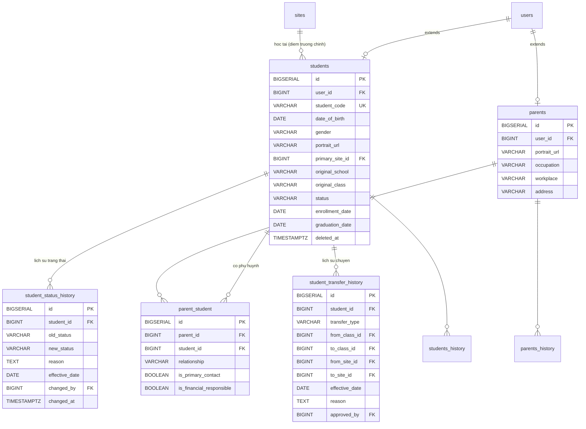

## Học sinh & Phụ huynh

### Mô tả tổng quan

Nhóm này quản lý hồ sơ học sinh, hồ sơ phụ huynh và quan hệ N-N giữa 2
đối tượng. Bao gồm cả lịch sử thay đổi trạng thái và lịch sử chuyển
lớp/chuyển trường.

### Sơ đồ ERD

<!-- Nguồn: docs/diagrams/erd/ERD-Nhom3-HocSinhPhuHuynh.mmd (chỉnh sửa trực tiếp file này, không sửa trong srs.md/sdd-groups) -->

### Chi tiết từng bảng

a)  Bảng students -- Hồ sơ điện tử học sinh

Extends users --- thông tin đặc thù học sinh tách riêng khỏi bảng auth
chung.

  ------------------------------------------------------------------------
  Cột                Kiểu            Ràng buộc           Ghi chú
  ------------------ --------------- ------------------- -----------------
  id                 BIGSERIAL       PK                  

  user_id            BIGINT          FK → users(id),     Quan hệ 1-1 với
                                     UNIQUE, NOT NULL    users

  student_code       VARCHAR(20)     UNIQUE, NOT NULL    Mã học sinh nội
                                                         bộ, VD
                                                         HS2026-0001

  date_of_birth      DATE            NOT NULL            

  gender             VARCHAR(10)     NULL                MALE / FEMALE /
                                                         OTHER

  portrait_url       VARCHAR(500)    NULL                Ảnh chân dung lưu
                                                         trên CDN

  primary_site_id    BIGINT          FK → sites(id),     Điểm trường chính
                                     NULL                học sinh theo
                                                         học; NULL với học
                                                         sinh mới chưa xếp
                                                         lớp

  original_school    VARCHAR(200)    NULL                Trường gốc học
                                                         sinh đang học (VD
                                                         \"THCS Nguyễn
                                                         Du\")

  original_class     VARCHAR(50)     NULL                Lớp gốc (VD
                                                         \"8A2\")

  status             VARCHAR(20)     NOT NULL, DEFAULT   ACTIVE /
                                     \'ACTIVE\'          SUSPENDED /
                                                         EXPELLED /
                                                         GRADUATED /
                                                         WITHDRAWN /
                                                         DEFERRAL

  enrollment_date    DATE            NOT NULL            Ngày nhập học
                                                         chính thức

  graduation_date    DATE            NULL                

  notes              TEXT            NULL                Ghi chú đặc biệt
                                                         (dị ứng, sức
                                                         khỏe, cá
                                                         tính\...)

  created_at,        TIMESTAMPTZ                         
  updated_at                                             

  deleted_at         TIMESTAMPTZ     NULL                Soft-delete
  ------------------------------------------------------------------------

Có students_history.

Ghi chú thiết kế:

-   primary_site_id là điểm trường chính --- dùng cho báo cáo tổng hợp.
    Còn quan hệ chi tiết với các lớp học (có thể học nhiều lớp ở nhiều
    điểm trường khác nhau) sẽ ở bảng class_enrollments khi thiết kế Nhóm
    5 (Học thuật).

-   original_school và original_class để dạng free-text (VARCHAR) chứ
    không FK về bảng nào --- vì đây là thông tin tham chiếu ra bên ngoài
    hệ thống, học sinh có thể đến từ trường không phải đối tác của trung
    tâm.

-   Không có cột full_name, email, phone --- các trường này đã ở users,
    tránh trùng lặp.

-   **DEFERRAL** (bổ sung ngoài 5 giá trị gốc, xác nhận với PM khi
    implement UC-14): UC-14/FR-STU-02 mô tả trạng thái "Bảo lưu" (tạm
    ngừng học, có thể quay lại) không trùng nghĩa với WITHDRAWN (rút
    hẳn). Map "Bảo lưu" → DEFERRAL, giữ nguyên WITHDRAWN cho trường hợp
    rút khỏi chương trình hẳn.

-   Bảng parents --- Hồ sơ phụ huynh

Extends users.

  ------------------------------------------------------------------------
  Cột                Kiểu            Ràng buộc           Ghi chú
  ------------------ --------------- ------------------- -----------------
  id                 BIGSERIAL       PK                  

  user_id            BIGINT          FK → users(id),     Quan hệ 1-1 với
                                     UNIQUE, NOT NULL    users

  portrait_url       VARCHAR(500)    NULL                Ảnh chân dung lưu
                                                         trên CDN. Bổ sung
                                                         ngoài SDD gốc, đã
                                                         xác nhận với người
                                                         dùng (2026-07-23,
                                                         V48) — mẫu tham
                                                         chiếu
                                                         students.portrait_url

  occupation         VARCHAR(200)    NULL                Nghề nghiệp

  workplace          VARCHAR(500)    NULL                

  address            VARCHAR(500)    NULL                

  notes              TEXT            NULL                

  created_at,        TIMESTAMPTZ                         
  updated_at                                             
  ------------------------------------------------------------------------

Không soft-delete --- nếu không dùng nữa, gỡ liên kết qua bảng
parent_student. Có parents_history.

b)  Bảng parent_student --- Liên kết Phụ huynh ↔ Học sinh

Bảng M-N có thêm thuộc tính phân vai trò --- không phải liên kết đơn
thuần.

  ----------------------------------------------------------------------------
  **Cột**                    **Kiểu**           **Ràng buộc**   **Ghi chú**
  -------------------------- ------------------ --------------- --------------
  id                         BIGSERIAL          PK               

  parent_id                  BIGINT             FK →            
                                                parents(id),    
                                                NOT NULL        

  student_id                 BIGINT             FK →             
                                                students(id),   
                                                NOT NULL        

  relationship               VARCHAR(20)        NOT NULL        FATHER /
                                                                MOTHER /
                                                                GUARDIAN /
                                                                OTHER

  is_primary_contact         BOOLEAN            NOT NULL,       Ưu tiên khi hệ
                                                DEFAULT FALSE   thống gửi
                                                                thông báo (VD
                                                                tin nhắn vắng
                                                                học ở
                                                                FR-STU-03)

  is_financial_responsible   BOOLEAN            NOT NULL,       Người chịu
                                                DEFAULT FALSE   trách nhiệm
                                                                thanh toán
                                                                (nhận hóa đơn
                                                                ở Nhóm Tài
                                                                chính)

  notes                      TEXT               NULL            Ghi chú (VD:
                                                                \"chỉ liên hệ
                                                                khi khẩn
                                                                cấp\")

  created_at, updated_at     TIMESTAMPTZ                        

  UNIQUE(parent_id,                                             Không cho tạo
  student_id)                                                   liên kết trùng
  ----------------------------------------------------------------------------

Ràng buộc :

CREATE UNIQUE INDEX idx_parent_student_primary

ON parent_student(student_id)

> WHERE is_primary_contact = TRUE;

CREATE UNIQUE INDEX idx_parent_student_financial

ON parent_student(student_id)

WHERE is_financial_responsible = TRUE;

(Mỗi học sinh tối đa 1 primary contact và tối đa 1 người chịu trách
nhiệm tài chính.)

Không cần history --- thay đổi (đổi giám hộ) tạo record mới, xóa cứng
record cũ.

Ghi chú thiết kế:

-   Không dùng lại users trực tiếp cho quan hệ này --- vì cần thông tin
    đặc thù (nghề nghiệp, quan hệ, người chịu trách nhiệm tài chính)
    không thuộc về user chung. Đây là lý do có bảng parents.

-   1 phụ huynh có thể có nhiều con → cần M-N, không phải 1-N.

*Nghiệp vụ:* Thông báo tự động (VD vắng học) được gửi cho tất cả phụ
huynh có bản ghi trong bảng này của học sinh đó, không giới hạn chỉ
is_primary_contact.

c)  Bảng student_status_history --- Lịch sử thay đổi trạng thái

Tách riêng khỏi students_history vì có ngữ nghĩa nghiệp vụ riêng, phục
vụ hiển thị timeline trên UI.

  ------------------------------------------------------------------------
  Cột                Kiểu            Ràng buộc           Ghi chú
  ------------------ --------------- ------------------- -----------------
  id                 BIGSERIAL       PK                  

  student_id         BIGINT          FK → students(id),  
                                     NOT NULL            

  old_status         VARCHAR(20)     NULL                NULL nếu là
                                                         record đầu tiên

  new_status         VARCHAR(20)     NOT NULL            

  reason             TEXT            NULL                VD: \"Bảo lưu do
                                                         sức khỏe\"

  effective_date     DATE            NOT NULL            

  changed_by         BIGINT          FK → users(id), NOT 
                                     NULL                

  changed_at         TIMESTAMPTZ     NOT NULL, DEFAULT   
                                     NOW()               
  ------------------------------------------------------------------------

d)  Bảng student_transfer_history --- Lịch sử chuyển lớp/chuyển điểm
    trường

  ------------------------------------------------------------------------
  Cột                Kiểu            Ràng buộc           Ghi chú
  ------------------ --------------- ------------------- -----------------
  id                 BIGSERIAL       PK                  

  student_id         BIGINT          FK → students(id),  
                                     NOT NULL            

  transfer_type      VARCHAR(20)     NOT NULL            CLASS_CHANGE /
                                                         SITE_CHANGE /
                                                         BOTH

  from_class_id,     BIGINT          FK → classes(id),   Tham chiếu bảng
  to_class_id                        NULL                classes ở Nhóm 5

  from_site_id,      BIGINT          FK → sites(id),     
  to_site_id                         NULL                

  effective_date     DATE            NOT NULL            

  reason             TEXT            NULL                

  approved_by        BIGINT          FK → users(id), NOT 
                                     NULL                

  created_at         TIMESTAMPTZ     NOT NULL, DEFAULT   
                                     NOW()               
  ------------------------------------------------------------------------

Chỉ số:

CREATE INDEX idx_transfer_history_student ON
student_transfer_history(student_id, effective_date DESC);
