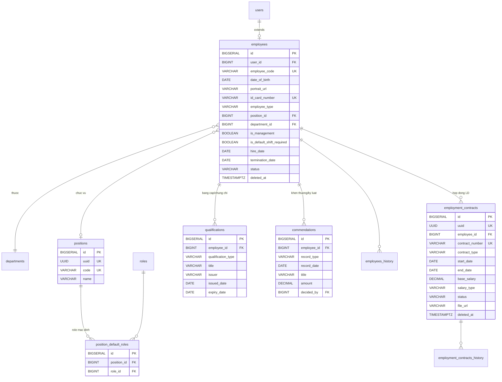
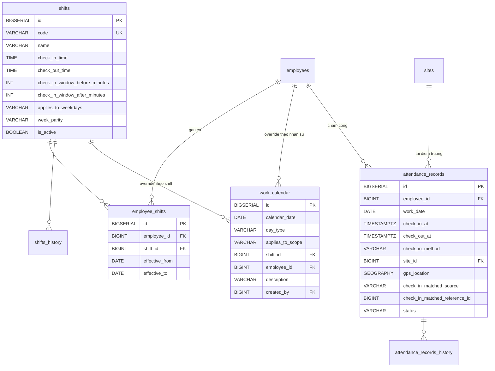
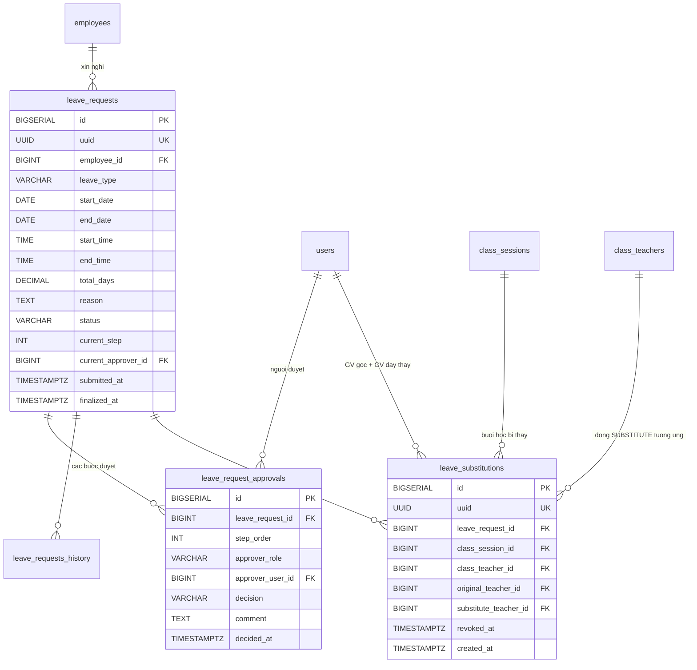
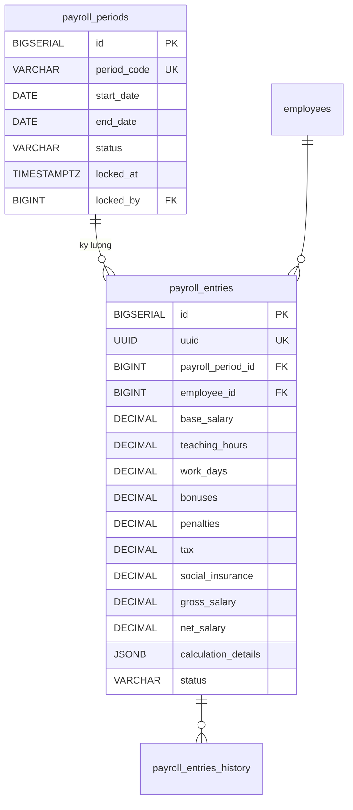

## Nhân sự

### Mô tả tổng quan

Nhóm phức tạp nhất trong 9 nhóm -- quản lý hồ sơ nhân sự, hợp đồng lao
động, hệ thống ca làm việc linh hoạt, chấm công đa phương thức, workflow
duyệt đơn từ 2 cấp theo phòng ban và bảng lương.

Nhóm này sẽ được chia làm 4 nhóm nhỏ: Hồ sơ nhân sự, Chấm công, Đơn từ,
Bảng lương.

### Hồ sơ nhân sự

<!-- Nguồn: docs/diagrams/erd/ERD-Nhom4A-HoSoNhanSu.mmd (chỉnh sửa trực tiếp file này, không sửa trong srs.md/sdd-groups) -->

a)  Bảng Employees -- Hồ sơ nhân sự

  ------------------------------------------------------------------------------
  Cột                         Kiểu            Ràng buộc    Ghi chú
  --------------------------- --------------- ------------ ---------------------
  id                          BIGSERIAL       PK           

  user_id                     BIGINT          FK →         
                                              users(id),   
                                              UNIQUE, NOT  
                                              NULL         

  employee_code               VARCHAR(20)     UNIQUE, NOT  VD NV2026-0001
                                              NULL         

  date_of_birth               DATE            NOT NULL     

  portrait_url                VARCHAR(500)    NULL         Ảnh chân dung lưu
                                                           trên CDN. Bổ sung
                                                           ngoài SDD gốc, đã
                                                           xác nhận với
                                                           người dùng
                                                           (2026-07-23, V48)
                                                           — mẫu tham chiếu
                                                           students.
                                                           portrait_url

  id_card_number              VARCHAR(20)     UNIQUE, NULL Số CCCD/CMND

  id_card_issued_date,        DATE,           NULL         
  id_card_issued_place        VARCHAR(200)                 

  permanent_address,          VARCHAR(500)    NULL         
  current_address                                          

  bank_account_number,        VARCHAR(50),    NULL         
  bank_name                   VARCHAR(200)                 

  tax_code                    VARCHAR(20)     NULL         

  social_insurance_number     VARCHAR(20)     NULL         

  employee_type               VARCHAR(20)     NOT NULL     TEACHER / STAFF /
                                                           MANAGER

  position_id                  BIGINT          FK →         NULL nếu chưa gán
                                              positions(id),   chức vụ (V36 —
                                              NULL              trước là
                                                                position_title
                                                                text tự do,
                                                                xem mục c)

  department_id                BIGINT          FK →         NULL nếu chưa gán
                                              departments(id),  phòng ban
                                              NULL

  is_management                BOOLEAN         NOT NULL,    Miễn trừ chấm công,
                                              DEFAULT FALSE  miễn trừ duyệt đơn
                                                             (dành cho Ban giám
                                                             đốc và các cấp
                                                             quản lý theo từng
                                                             ngữ cảnh)

  is_default_shift_required   BOOLEAN         NOT NULL,    TRUE = phải chấm công
                                              DEFAULT TRUE ca mặc định khi không
                                                           có lịch dạy; FALSE =
                                                           GV linh hoạt hoàn
                                                           toàn theo lịch dạy

  hire_date                   DATE            NOT NULL     

  termination_date            DATE            NULL         

  status                      VARCHAR(20)     NOT NULL,    ACTIVE / ON_LEAVE /
                                              DEFAULT      TERMINATED
                                              \'ACTIVE\'   

  created_at, updated_at,     TIMESTAMPTZ                  Soft-delete (chứa
  deleted_at                                               CCCD, tài khoản ngân
                                                           hàng)
  ------------------------------------------------------------------------------

Có employees_history.

b)  Bảng employment_contracts --- Hợp đồng lao động

  ------------------------------------------------------------------------
  **Cột**            **Kiểu**           **Ràng buộc**    **Ghi chú**
  ------------------ ------------------ ---------------- -----------------
  id                 BIGSERIAL          PK                

  uuid               UUID               UNIQUE, NOT NULL 

  employee_id        BIGINT             FK →              
                                        employees(id),   
                                        NOT NULL         

  contract_number    VARCHAR(100)       UNIQUE, NOT NULL 

  contract_type      VARCHAR(30)        NOT NULL         PROBATION /
                                                         FIXED_TERM /
                                                         INDEFINITE /
                                                         SEASONAL

  start_date,        DATE               end_date NULL    
  end_date                              nếu INDEFINITE   

  base_salary        DECIMAL(15,2)      NOT NULL          

  salary_type        VARCHAR(20)        NOT NULL         MONTHLY / HOURLY

  status             VARCHAR(20)        NOT NULL,        DRAFT / ACTIVE /
                                        DEFAULT          EXPIRED /
                                        \'DRAFT\'        TERMINATED

  file_url           VARCHAR(500)       NULL              

  created_by         BIGINT             FK → users(id)    

  created_at,        TIMESTAMPTZ                         Soft-delete
  updated_at,                                            
  deleted_at                                             
  ------------------------------------------------------------------------

Có employment_contracts_history. Ràng buộc: mỗi nhân sự chỉ 1 hợp đồng
ACTIVE tại 1 thời điểm.

c)  Bảng qualifications --- Bằng cấp/Chứng chỉ

  ----------------------------------------------------------------------------
  **Cột**              **Kiểu**          **Ràng buộc**    **Ghi chú**
  -------------------- ----------------- ---------------- --------------------
  id                   BIGSERIAL         PK                

  employee_id          BIGINT            FK →             
                                         employees(id),   
                                         NOT NULL         

  qualification_type   VARCHAR(30)       NOT NULL         DEGREE /
                                                          PEDAGOGY_CERT /
                                                          LANGUAGE_CERT /
                                                          OTHER

  title                VARCHAR(300)      NOT NULL         VD \"IELTS 8.0\"

  issuer               VARCHAR(300)      NULL              

  issued_date,         DATE              NULL             
  expiry_date                                             

  file_url             VARCHAR(500)      NULL              
  ----------------------------------------------------------------------------

Không history --- bảng phụ, ít thay đổi.

d)  Bảng commendations --- Khen thưởng/Kỷ luật

  ------------------------------------------------------------------------
  **Cột**        **Kiểu**           **Ràng buộc**    **Ghi chú**
  -------------- ------------------ ---------------- ---------------------
  id             BIGSERIAL          PK                

  employee_id    BIGINT             FK →             
                                    employees(id),   
                                    NOT NULL         

  record_type    VARCHAR(20)        NOT NULL         COMMENDATION /
                                                     DISCIPLINE

  record_date    DATE               NOT NULL         

  title          VARCHAR(300)       NOT NULL          

  amount         DECIMAL(15,2)      NULL             Dùng ở tính lương

  decided_by     BIGINT             FK → users(id)    
  ------------------------------------------------------------------------

Không history, mỗi record là 1 sự kiện độc lập, không sửa.

e)  Bảng positions --- Chức vụ (V36, bổ sung ngoài SDD gốc — FR-HRM-06/UC-52)

Thay thế employees.position_title (text tự do) — chuẩn hóa thành danh mục
để có thể ánh xạ vai trò (role) mặc định qua position_default_roles.

  ------------------------------------------------------------------------------
  Cột                    Kiểu              Ràng buộc           Ghi chú
  ---------------------- ----------------- ------------------- -----------------
  id                     BIGSERIAL         PK                  

  uuid                   UUID              UNIQUE, NOT NULL,   
                                           DEFAULT             
                                           gen_random_uuid()   

  code                   VARCHAR(50)       UNIQUE, NOT NULL    Ví dụ: GV, TP_DT,
                                                               NV

  name                   VARCHAR(200)      NOT NULL            \"Giáo viên\",
                                                               \"Trưởng phòng
                                                               đào tạo\"...

  created_at, updated_at TIMESTAMPTZ                           
  ------------------------------------------------------------------------------

Không soft-delete, không history — danh mục cấu hình tĩnh (giống
departments). Không xóa được nếu đang có nhân sự mang chức vụ đó (UC-52 A1).

f)  Bảng position_default_roles --- Vai trò mặc định theo chức vụ (V36,
    bổ sung ngoài SDD gốc — FR-HRM-06/UC-52)

  ------------------------------------------------------------------------
  **Cột**        **Kiểu**           **Ràng buộc**    **Ghi chú**
  -------------- ------------------ ---------------- ---------------------
  id             BIGSERIAL          PK                

  position_id    BIGINT             FK →             1 chức vụ có nhiều
                                    positions(id),   role mặc định
                                    NOT NULL         

  role_id        BIGINT             FK → roles(id),  UNIQUE cùng
                                    NOT NULL         position_id
  ------------------------------------------------------------------------

Khi employees.position_id được gán/đổi (UC-08 A5, UC-51 bước 4), hệ thống
đối chiếu bảng này để tự động gán/thu hồi role tương ứng ở user_roles —
xem cột user_roles.granted_via_position_id (docs/sdd-groups/02-nen-tang.md
mục e) để biết role nào do cơ chế này tự gán (phân biệt với role gán tay
qua UC-46).

### Chấm công

<!-- Nguồn: docs/diagrams/erd/ERD-Nhom4B-ChamCong.mmd (chỉnh sửa trực tiếp file này, không sửa trong srs.md/sdd-groups) -->

Đây là phần có logic phức tạp, hỗ trợ đặc thù giáo viên, pattern thứ 7
xen kẽ và chấm công thủ công khi thiết bị lỗi.

a)  Bảng shifts --- Ca làm việc chuẩn

  -------------------------------------------------------------------------------------
  **Cột**                           **Kiểu**       **Ràng buộc**      **Ghi chú**
  --------------------------------- -------------- ------------------ -----------------
  id                                BIGSERIAL      PK                  

  code                              VARCHAR(50)    UNIQUE, NOT NULL   VD
                                                                      OFFICE_STANDARD

  name                              VARCHAR(200)   NOT NULL            

  check_in_time, check_out_time     TIME           NOT NULL           

  check_in_window_before_minutes    INT            NOT NULL, DEFAULT   
                                                   30                 

  check_in_window_after_minutes     INT            NOT NULL, DEFAULT  
                                                   30                 

  check_out_window_before_minutes   INT            NOT NULL, DEFAULT   
                                                   30                 

  check_out_window_after_minutes    INT            NOT NULL, DEFAULT  
                                                   60                 

  applies_to_weekdays               VARCHAR(20)    NOT NULL, DEFAULT  1=T2\...7=CN
                                                   \'1,2,3,4,5,6\'    

  week_parity                       VARCHAR(10)    NOT NULL, DEFAULT  ALL / ODD / EVEN
                                                   \'ALL\'            --- xử lý pattern
                                                                      thứ 7 xen kẽ

  is_active                         BOOLEAN        NOT NULL, DEFAULT   
                                                   TRUE               

  import_job_id                     BIGINT         FK →               Nếu tạo qua
                                                   import_jobs(id),   import Excel
                                                   NULL               
  -------------------------------------------------------------------------------------

Có shifts_history --- thay đổi ca ảnh hưởng kết quả tính lương.

b)  Bảng employee_shifts --- Gán ca cho nhân sự

  -----------------------------------------------------------------------
  **Cột**               **Kiểu**           **Ràng buộc**          **Ghi
                                                                  chú**
  --------------------- ------------------ ---------------------- -------
  id                    BIGSERIAL          PK                      

  employee_id           BIGINT             FK → employees(id),    
                                           NOT NULL               

  shift_id              BIGINT             FK → shifts(id), NOT    
                                           NULL                   

  effective_from,       DATE               effective_to NULL =    
  effective_to                             đang áp dụng           

  import_job_id         BIGINT             FK → import_jobs(id),   
                                           NULL                   
  -----------------------------------------------------------------------

Ràng buộc: mỗi nhân sự 1 thời điểm chỉ 1 ca đang active.

c)  Bảng work_calendar -- Lịch làm việc override theo ngày cụ thể

Chỉ chứa các ngày ngoại lệ so với pattern mặc định của shift (Nghỉ T7
xen kẽ, lễ tết, làm bù).

  ---------------------------------------------------------------------------
  **Cột**            **Kiểu**          **Ràng buộc**      **Ghi chú**
  ------------------ ----------------- ------------------ -------------------
  id                 BIGSERIAL         PK                  

  calendar_date      DATE              NOT NULL           

  day_type           VARCHAR(20)       NOT NULL           WORKING / OFF /
                                                          HOLIDAY /
                                                          COMPENSATORY

  applies_to_scope   VARCHAR(20)       NOT NULL, DEFAULT  ALL / SHIFT /
                                       \'ALL\'            EMPLOYEE

  shift_id           BIGINT            FK → shifts(id),   Chỉ set khi
                                       NULL               scope=SHIFT

  employee_id        BIGINT            FK →               Chỉ set khi
                                       employees(id),     scope=EMPLOYEE
                                       NULL               

  description        VARCHAR(500)      NULL               \"Nghỉ T7 tuần lẻ\"

  import_job_id      BIGINT            FK →               
                                       import_jobs(id),   
                                       NULL               

  created_by         BIGINT            FK → users(id)      
  ---------------------------------------------------------------------------

d)  Bảng attendance_records --- Bản ghi chấm công

  --------------------------------------------------------------------------------------------------
  **Cột**                         **Kiểu**                **Ràng buộc**         **Ghi chú**
  ------------------------------- ----------------------- --------------------- --------------------
  id                              BIGSERIAL               PK                     

  employee_id                     BIGINT                  FK → employees(id),   
                                                          NOT NULL              

  work_date                       DATE                    NOT NULL               

  check_in_at, check_out_at       TIMESTAMPTZ             NULL                  

  check_in_method,                VARCHAR(20)             NULL                  FINGERPRINT / FACE /
  check_out_method                                                              GPS / MANUAL

  site_id                         BIGINT                  FK → sites(id), NULL  

  gps_location                    GEOGRAPHY(POINT,4326)   NULL                  Dùng PostGIS,
                                                                                validate bằng
                                                                                ST_DWithin() với
                                                                                sites.geo_location

  check_in_matched_source         VARCHAR(30)             NULL                  SHIFT /
                                                                                TEACHING_SCHEDULE /
                                                                                MANUAL_OVERRIDE

  check_in_matched_reference_id   BIGINT                  NULL                  Trỏ về shifts.id
                                                                                hoặc
                                                                                class_sessions.id
                                                                                tùy source

  status                          VARCHAR(20)             NOT NULL, DEFAULT     NORMAL / LATE /
                                                          \'NORMAL\'            EARLY_LEAVE /
                                                                                MISSING

  created_at, updated_at          TIMESTAMPTZ                                    

                                                          UNIQUE(employee_id,   
                                                          work_date)            
  --------------------------------------------------------------------------------------------------

Có attendance_records_history (chỉnh trực tiếp + snapshot JSONB, không
tách bảng điều chỉnh riêng).

*Logic nghiệp vụ quan trọng:* Với cấp quản lý
(users.is_management=TRUE), không tạo record ở bảng này --- miễn trừ
chấm công. Với GV, hệ thống chấp nhận chấm công nếu thời điểm khớp với
**cửa sổ ca cố định** HOẶC **cửa sổ theo lịch dạy** (tiết dạy sớm/muộn
nhất trong ngày, lấy từ class_sessions ở Nhóm 5), tùy điều kiện nào khớp
trước.

Bảng system_settings liên quan (đã có ở Nhóm 1) --- seed data cho chấm
công:

  -------------------------------------------------------------------------------
  **setting_key**                       **Giá trị  **Ý nghĩa**
                                        mặc định** 
  ------------------------------------- ---------- ------------------------------
  attendance.gps_enabled                TRUE       Cho phép chấm công GPS

  attendance.fingerprint_enabled        TRUE       Cho phép chấm công vân tay

  attendance.face_enabled               TRUE       Cho phép chấm công khuôn mặt

  attendance.manual_when_all_disabled   TRUE       Cho phép chấm công thủ công
                                                   (chỉ kiểm tra thời gian) khi
                                                   cả 3 phương thức trên bị tắt

  attendance.gps_radius_meters          200        Bán kính chấp nhận GPS
  -------------------------------------------------------------------------------

### Đơn từ

<!-- Nguồn: docs/diagrams/erd/ERD-Nhom4C-DonTu.mmd (chỉnh sửa trực tiếp file này, không sửa trong srs.md/sdd-groups) -->

a)  Bảng leave_requests --- Đơn từ

  ----------------------------------------------------------------------------
  **Cột**               **Kiểu**          **Ràng buộc**    **Ghi chú**
  --------------------- ----------------- ---------------- -------------------
  id                    BIGSERIAL         PK                

  uuid                  UUID              UNIQUE, NOT NULL 

  employee_id           BIGINT            FK →              
                                          employees(id),   
                                          NOT NULL         

  leave_type            VARCHAR(20)       NOT NULL         ANNUAL / SICK /
                                                           UNPAID / LATE /
                                                           EARLY_LEAVE /
                                                           PERSONAL

  start_date, end_date  DATE              NOT NULL          

  start_time, end_time  TIME              NULL             Áp dụng
                                                           LATE/EARLY_LEAVE

  total_days            DECIMAL(4,2)      NOT NULL         Tính bởi service

  reason                TEXT              NOT NULL         

  attachment_url        VARCHAR(500)      NULL              

  status                VARCHAR(20)       NOT NULL,        PENDING / APPROVED
                                          DEFAULT          / REJECTED /
                                          \'PENDING\'      CANCELLED

  current_step          INT               NOT NULL,         
                                          DEFAULT 1        

  current_approver_id   BIGINT            FK → users(id),  
                                          NULL             

  submitted_at,         TIMESTAMPTZ                         
  finalized_at                                             
  ----------------------------------------------------------------------------

Có leave_requests_history.

b)  Bảng leave_request_approvals --- Các bước duyệt

  ---------------------------------------------------------------------------------
  **Cột**            **Kiểu**       **Ràng buộc**              **Ghi chú**
  ------------------ -------------- -------------------------- --------------------
  id                 BIGSERIAL      PK                          

  leave_request_id   BIGINT         FK → leave_requests(id),   
                                    NOT NULL                   

  step_order         INT            NOT NULL                    

  approver_role      VARCHAR(30)    NOT NULL                   DEPARTMENT_HEAD /
                                                               OPERATIONS_MANAGER /
                                                               EXECUTIVE

  approver_user_id   BIGINT         FK → users(id), NULL       Điền khi có người
                                                               vào duyệt

  decision           VARCHAR(20)    NULL                       APPROVED / REJECTED

  comment            TEXT           NULL                        

  decided_at         TIMESTAMPTZ    NULL                       

                                    UNIQUE(leave_request_id,    
                                    step_order)                
  ---------------------------------------------------------------------------------

c)  Bảng leave_substitutions --- Giáo viên dạy thay theo đơn nghỉ (bổ
sung ngoài SDD gốc, đã xác nhận với người dùng 2026-08-05; xem UC-10 A/
UC-11 A2)

1 record = 1 buổi học (class_sessions) của 1 đơn nghỉ đã được gán giáo
viên dạy thay.

  ---------------------------------------------------------------------------------
  **Cột**                 **Kiểu**       **Ràng buộc**              **Ghi chú**
  ----------------------- -------------- -------------------------- ----------------
  id                      BIGSERIAL      PK

  uuid                    UUID           UNIQUE, NOT NULL

  leave_request_id        BIGINT         FK → leave_requests(id),
                                          NOT NULL

  class_session_id        BIGINT         FK → class_sessions(id),
                                          NOT NULL

  class_teacher_id        BIGINT         FK → class_teachers(id),   Dòng
                                          NOT NULL                  teacher_role=
                                                                     SUBSTITUTE
                                                                     tương ứng ở
                                                                     lớp

  original_teacher_id     BIGINT         FK → users(id), NOT NULL   GV chính của
                                                                     buổi học tại
                                                                     thời điểm gán,
                                                                     để trả lại
                                                                     khi thu hồi

  substitute_teacher_id   BIGINT         FK → users(id), NOT NULL

  revoked_at               TIMESTAMPTZ    NULL                      NULL = đang
                                                                     dạy thay; có
                                                                     giá trị = đã
                                                                     bị scheduled
                                                                     job thu hồi
                                                                     (chính là log
                                                                     thu hồi)

  created_at               TIMESTAMPTZ
  ---------------------------------------------------------------------------------

Ràng buộc: partial unique index trên (class_session_id) WHERE
revoked_at IS NULL --- 1 buổi học chỉ có đúng 1 lượt dạy thay ĐANG MỞ tại
1 thời điểm (khác plain UNIQUE vì 1 buổi có thể có nhiều lượt dạy thay
theo thời gian, miễn không trùng lúc đang mở).

Logic nghiệp vụ: xem UC-10 bước 5 (ghi bản ghi + cập nhật
class_sessions.primary_teacher_id/class_teachers NGAY khi nộp đơn, không
đợi duyệt), UC-11 A2 (thu hồi ngay khi đơn bị Từ chối), và "Mở rộng" cuối
UC-11 (scheduled job tự thu hồi sau end_date + 2 ngày nếu đơn Đã duyệt).
UNIQUE(class_session_id) đảm bảo 1 buổi học chỉ có 1 lượt dạy thay đang mở
tại 1 thời điểm.

Logic workflow (business logic)

Nhân sự thuộc phòng ban có Trưởng phòng:

Bước 1: DEPARTMENT_HEAD (Trưởng phòng ban)

Bước 2: OPERATIONS_MANAGER (Quản lý vận hành, bao quát toàn công ty)

Nhân sự thuộc phòng ban KHÔNG có Trưởng phòng:

Bước 1: OPERATIONS_MANAGER (bỏ qua bước Trưởng phòng)

Cấp quản lý (QLĐT/TPĐT/QLVH/QLNS):

Bước 1: EXECUTIVE (Ban giám đốc)

Ban giám đốc: miễn trừ --- không tạo đơn.

### Bảng lương

<!-- Nguồn: docs/diagrams/erd/ERD-Nhom4D-BangLuong.mmd (chỉnh sửa trực tiếp file này, không sửa trong srs.md/sdd-groups) -->

a)  Bảng payroll_periods --- Kỳ lương

  ------------------------------------------------------------------------
  **Cột**           **Kiểu**                 **Ràng buộc**    **Ghi chú**
  ----------------- ------------------------ ---------------- ------------
  id                BIGSERIAL                PK                

  period_code       VARCHAR(20)              UNIQUE, NOT NULL VD 2026-07

  start_date,       DATE                     NOT NULL          
  end_date                                                    

  status            VARCHAR(20)              NOT NULL,        DRAFT /
                                             DEFAULT          LOCKED /
                                             \'DRAFT\'        PAID

  locked_at,        TIMESTAMPTZ, BIGINT FK   NULL              
  locked_by                                                   
  ------------------------------------------------------------------------

b)  Bảng payroll_entries --- Chi tiết lương từng nhân sự

  -----------------------------------------------------------------------------------------
  **Cột**                  **Kiểu**        **Ràng buộc**               **Ghi chú**
  ------------------------ --------------- --------------------------- --------------------
  id                       BIGSERIAL       PK                           

  uuid                     UUID            UNIQUE, NOT NULL            

  payroll_period_id        BIGINT          FK → payroll_periods(id),    
                                           NOT NULL                    

  employee_id              BIGINT          FK → employees(id), NOT     
                                           NULL                        

  base_salary              DECIMAL(15,2)   NOT NULL                    Snapshot từ hợp đồng
                                                                       ACTIVE tại thời điểm
                                                                       chốt

  teaching_hours,          DECIMAL         NULL                        Cho GV
  hourly_rate                                                          

  work_days                DECIMAL(5,2)    DEFAULT 0                   Từ
                                                                       attendance_records

  bonuses, penalties       DECIMAL(15,2)   DEFAULT 0                   Từ commendations

  tax, social_insurance,   DECIMAL(15,2)   DEFAULT 0                    
  health_insurance,                                                    
  unemployment_insurance                                               

  gross_salary,            DECIMAL(15,2)   NOT NULL                    
  total_deductions,                                                    
  net_salary                                                           

  calculation_details      JSONB           NULL                        Breakdown công thức
                                                                       tính

  status                   VARCHAR(20)     NOT NULL, DEFAULT           CALCULATED /
                                           \'CALCULATED\'              APPROVED / PAID

                                           UNIQUE(payroll_period_id,    
                                           employee_id)                
  -----------------------------------------------------------------------------------------

Có payroll_entries_history.
