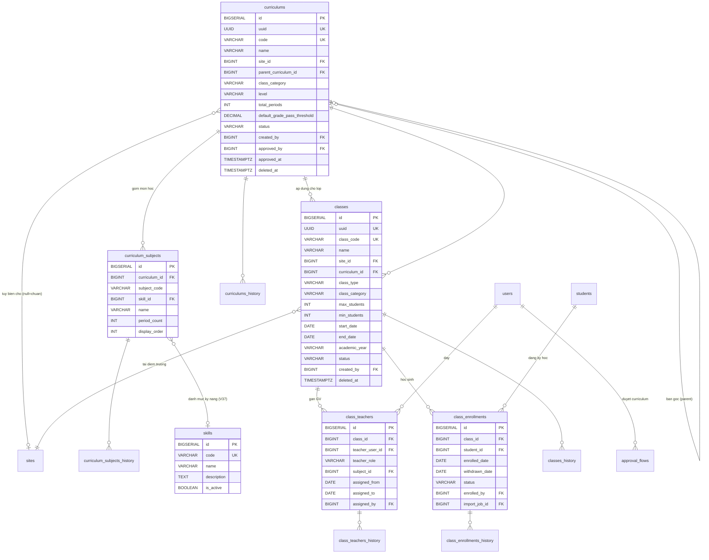
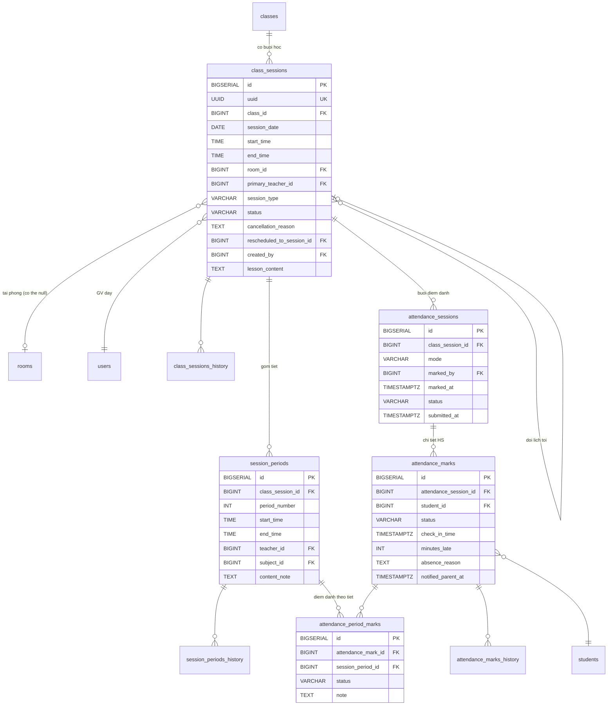
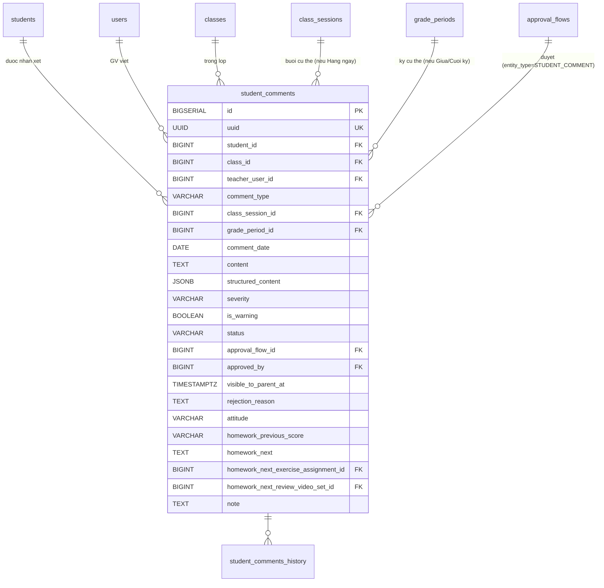

## Học thuật

### Mô tả tổng quan

Nhóm lớn nhất và trung tâm của hệ thống, bao phủ 5 phân hệ và toàn bộ
phân hệ 6. Phần này sẽ chia thành 4 phần con: Khung chương trình học &
Lớp học, Lịch dạy & Điểm danh, Sổ điểm, Nhận xét định kỳ.

### Khung chương trình & Lớp học

<!-- Nguồn: docs/diagrams/erd/ERD-Nhom5A-KhungChuongTrinh.mmd (chỉnh sửa trực tiếp file này, không sửa trong srs.md/sdd-groups) -->

a)  Bảng curriculums --- Khung chương trình

1 bảng duy nhất cho cả khung chuẩn và bản tùy biến theo trường, phân
biệt qua site_id (NULL = chuẩn).

  -------------------------------------------------------------------------------------
  **Cột**                        **Kiểu**       **Ràng buộc**      **Ghi chú**
  ------------------------------ -------------- ------------------ --------------------
  id                             BIGSERIAL      PK

  uuid                           UUID           UNIQUE, NOT NULL

  code                           VARCHAR(50)    UNIQUE, NOT NULL   VD EN-G8-STD-2026

  name                           VARCHAR(300)   NOT NULL

  site_id                        BIGINT         FK → sites(id),    NULL = khung chuẩn;
                                                 NULL               NOT NULL = tùy biến
                                                                    cho site

  parent_curriculum_id           BIGINT         FK →               Nếu tùy biến, trỏ về
                                                 curriculums(id),   bản chuẩn gốc
                                                 NULL

  class_category                 VARCHAR(30)    NOT NULL           MAIN / SUPPLEMENTARY
                                                                    / EXAM_PREP / OTHER

  level                          VARCHAR(50)    NULL               "Lớp 6",
                                                                    "PET"...

  total_periods                  INT            NULL

  default_grade_pass_threshold   DECIMAL(4,2)   NULL, DEFAULT 5.0

  status                         VARCHAR(20)    NOT NULL, DEFAULT  DRAFT /
                                                 'DRAFT'            PENDING_APPROVAL /
                                                                    ACTIVE / ARCHIVED

  created_by                     BIGINT         FK → users(id)

  approved_by                    BIGINT         FK → users(id),    Trưởng phòng đào tạo
                                                 NULL               --- người duyệt cuối
                                                                    cùng

  approved_at                    TIMESTAMPTZ    NULL

  created_at, updated_at,        TIMESTAMPTZ                       Soft-delete
  deleted_at
  -------------------------------------------------------------------------------------

Có curriculums_history.

Ràng buộc

ALTER TABLE curriculums ADD CONSTRAINT chk_custom_has_parent

CHECK ( (site_id IS NULL AND parent_curriculum_id IS NULL) OR

(site_id IS NOT NULL AND parent_curriculum_id IS NOT NULL) );

b)  Bảng curriculum_subjects --- Môn học trong khung

  ------------------------------------------------------------------------
  **Cột**         **Kiểu**          **Ràng buộc**            **Ghi chú**
  --------------- ----------------- ------------------------ -------------
  id              BIGSERIAL         PK

  curriculum_id   BIGINT            FK → curriculums(id),
                                     NOT NULL

  subject_code    VARCHAR(50)       NOT NULL                 SPEAKING /
                                                               LISTENING /
                                                               READING /
                                                               WRITING /
                                                               GRAMMAR /
                                                               OTHER

  skill_id        BIGINT            FK → skills(id), NULL    V37 --- tham chiếu
                                                               danh mục kỹ năng (bổ
                                                               sung ngoài SDD gốc,
                                                               đã xác nhận với người
                                                               dùng). Chỉ set khi
                                                               subject_code=OTHER và
                                                               cần 1 kỹ năng ngoài 6
                                                               giá trị gốc; name vẫn
                                                               là cột hiển thị chính

  name            VARCHAR(200)      NOT NULL

  period_count    INT               NULL

  display_order   INT               NOT NULL, DEFAULT 0

                                     UNIQUE(curriculum_id,
                                     subject_code)
  ------------------------------------------------------------------------

Có curriculum_subjects_history.

f)  Bảng skills --- Danh mục kỹ năng (mới, V37, bổ sung ngoài SDD gốc,
    đã xác nhận với người dùng)

Danh mục kỹ năng dùng chung toàn hệ thống, quản lý qua UC-54. Không thay
thế enum `SubjectCode`/`ComponentCode` hiện có trên
`curriculum_subjects.subject_code`/`grade_components.code` (vẫn giữ
nguyên, 2 cột đó là VARCHAR tự do không CHECK constraint) — bảng này chỉ
là danh mục tham chiếu bổ sung qua cột `skill_id` (FK, nullable) trên 2
bảng đó, cho phép Trưởng phòng đào tạo thêm kỹ năng mới (ngoài 6 giá trị
enum gốc) mà không cần sửa code.

  ---------------------------------------------------------------------
  **Cột**       **Kiểu**       **Ràng buộc**            **Ghi chú**
  ------------- -------------- ------------------------ ---------------
  id            BIGSERIAL      PK

  code          VARCHAR(50)    UNIQUE, NOT NULL         VD VOCABULARY

  name          VARCHAR(200)   NOT NULL                 Tên hiển thị,
                                                          VD "Từ vựng"

  description   TEXT           NULL

  is_active     BOOLEAN        NOT NULL, DEFAULT TRUE   FALSE = vô
                                                          hiệu hoá,
                                                          không xoá
                                                          cứng

  created_at,   TIMESTAMPTZ
  updated_at
  ---------------------------------------------------------------------

Seed sẵn 7 giá trị khớp đúng 2 enum hiện có khi tạo bảng (migration
V37): SPEAKING, LISTENING, READING, WRITING, GRAMMAR, PROJECT, OTHER.

c)  Bảng classes --- Lớp học thực tế

  ---------------------------------------------------------------------------
  **Cột**          **Kiểu**          **Ràng buộc**      **Ghi chú**
  ---------------- ----------------- ------------------ ---------------------
  id               BIGSERIAL         PK

  uuid             UUID              UNIQUE, NOT NULL

  class_code       VARCHAR(50)       UNIQUE, NOT NULL   VD 8A2-NGDU-26-27

  name             VARCHAR(300)      NOT NULL

  site_id          BIGINT            FK → sites(id),
                                      NOT NULL

  curriculum_id    BIGINT            FK →
                                      curriculums(id),
                                      NOT NULL

  class_type       VARCHAR(20)       NOT NULL           LINKED / OPEN

  class_category   VARCHAR(30)       NULL               Copy từ curriculum
                                                         tại thời điểm tạo

  max_students     INT               NOT NULL, CHECK >
                                      0

  min_students     INT               NULL

  start_date,      DATE              start_date NOT
  end_date                           NULL

  academic_year    VARCHAR(20)       NULL

  semester         VARCHAR(20)       NULL               S1 / S2 / SUMMER

  status           VARCHAR(20)       NOT NULL, DEFAULT  PLANNED /
                                      'PLANNED'          OPEN_ENROLLMENT /
                                                         IN_PROGRESS /
                                                         COMPLETED / CANCELLED

  created_by       BIGINT            FK → users(id)     TPĐT quyết định, Nhân
                                                         viên giáo vụ nhập

  created_at,      TIMESTAMPTZ                          Soft-delete
  updated_at,
  deleted_at
  ---------------------------------------------------------------------------

Có classes_history.

*Logic nghiệp vụ:* Trưởng phòng đào tạo quyết định sắp xếp lớp/điều phối
giáo viên; Nhân viên giáo vụ thực hiện nhập liệu hành chính trên bảng
này theo quyết định đó.

d)  Bảng class_teachers --- Gán GV cho lớp

  ---------------------------------------------------------------------------
  **Cột**           **Kiểu**         **Ràng buộc**              **Ghi chú**
  ----------------- ---------------- -------------------------- -------------
  id                BIGSERIAL        PK

  class_id          BIGINT           FK → classes(id), NOT NULL

  teacher_user_id   BIGINT           FK → users(id), NOT NULL

  teacher_role      VARCHAR(20)      NOT NULL, DEFAULT          PRIMARY /
                                      'PRIMARY'                  ASSISTANT /
                                                                 SUBSTITUTE

  subject_id        BIGINT           FK →
                                      curriculum_subjects(id),
                                      NULL

  assigned_from,    DATE             assigned_to NULL = đang
  assigned_to                        phụ trách

  assigned_by       BIGINT           FK → users(id)
  ---------------------------------------------------------------------------

Có class_teachers_history.

Ràng buộc:

CREATE UNIQUE INDEX idx_class_teacher_primary_active

ON class_teachers(class_id, COALESCE(subject_id, 0))

WHERE teacher_role = 'PRIMARY' AND assigned_to IS NULL;

e)  Bảng class_enrollments --- Học sinh trong lớp

  --------------------------------------------------------------------------
  **Cột**            **Kiểu**          **Ràng buộc**      **Ghi chú**
  ------------------ ----------------- ------------------ ------------------
  id                 BIGSERIAL         PK

  class_id           BIGINT            FK → classes(id),
                                        NOT NULL

  student_id         BIGINT            FK → students(id),
                                        NOT NULL

  enrolled_date,     DATE              NULL cho
  withdrawn_date                       withdrawn_date

  status             VARCHAR(20)       NOT NULL, DEFAULT  ACTIVE / WITHDRAWN
                                        'ACTIVE'           / TRANSFERRED /
                                                           COMPLETED

  withdraw_reason    TEXT              NULL

  enrolled_by        BIGINT            FK → users(id)

  import_job_id      BIGINT            FK →               Nếu từ import
                                        import_jobs(id),   Excel lớp liên kết
                                        NULL
  --------------------------------------------------------------------------

Có class_enrollments_history.

Ràng buộc:

CREATE UNIQUE INDEX idx_enrollment_active

ON class_enrollments(class_id, student_id)

WHERE status = 'ACTIVE';

g)  Bảng approval_flows

(Đã thiết kế ở Nhóm 1 --- dùng chung cho luồng duyệt curriculum tùy biến
với entity_type='CURRICULUM', không tạo bảng riêng. V37 bổ sung thêm giá
trị entity_type='GRADE_PERIOD_RESULT' dùng cho mục Sổ điểm bên dưới —
chỉ thêm giá trị Java enum, không đổi schema bảng này.)

### Lịch dạy & Điểm danh

<!-- Nguồn: docs/diagrams/erd/ERD-Nhom5B-LichDayDiemDanh.mmd (chỉnh sửa trực tiếp file này, không sửa trong srs.md/sdd-groups) -->

a)  Bảng class_sessions --- Buổi học

1 record = 1 buổi học vật lý tại 1 thời điểm cụ thể.

  --------------------------------------------------------------------------------
  **Cột**                     **Kiểu**         **Ràng buộc**         **Ghi chú**
  --------------------------- ---------------- --------------------- -------------
  id                          BIGSERIAL        PK

  uuid                        UUID             UNIQUE, NOT NULL

  class_id                    BIGINT           FK → classes(id), NOT
                                                NULL

  session_date                DATE             NOT NULL

  start_time, end_time        TIME             NOT NULL

  room_id                     BIGINT           FK → rooms(id), NULL  NULL khi lớp
                                                                     do trường tự
                                                                     quản lý phòng

  primary_teacher_id          BIGINT           FK → users(id), NOT   Có thể khác
                                                NULL                 GV chính của
                                                                     lớp (VD dạy
                                                                     thay)

  session_type                VARCHAR(20)      NOT NULL, DEFAULT     REGULAR /
                                                'REGULAR'             MAKEUP / EXAM
                                                                     / SPECIAL

  status                      VARCHAR(20)      NOT NULL, DEFAULT     SCHEDULED /
                                                'SCHEDULED'           IN_PROGRESS /
                                                                     COMPLETED /
                                                                     CANCELLED /
                                                                     RESCHEDULED

  cancellation_reason         TEXT             NULL

  rescheduled_to_session_id   BIGINT           FK →                  Tự tham chiếu
                                                class_sessions(id),   khi dời lịch
                                                NULL

  created_by                  BIGINT           FK → users(id)        Nhân viên
                                                                     giáo vụ tạo

  lesson_content               TEXT             NULL                  "Bài học hôm
                                                                     nay" — 1 giá
                                                                     trị dùng
                                                                     chung cả lớp,
                                                                     GV điền cùng
                                                                     lúc điểm danh
                                                                     (V50, bổ sung
                                                                     ngoài SDD
                                                                     gốc, đã xác
                                                                     nhận với
                                                                     người dùng
                                                                     2026-07-24).
                                                                     KHÁC
                                                                     session_periods.
                                                                     content_note
                                                                     (per-tiết,
                                                                     chưa có code
                                                                     nào dùng) —
                                                                     đây là giá
                                                                     trị per-buổi.

  created_at, updated_at      TIMESTAMPTZ
  --------------------------------------------------------------------------------

Có class_sessions_history.

Ràng buộc:

ALTER TABLE class_sessions ADD CONSTRAINT chk_session_time CHECK
(end_time > start_time);

CREATE INDEX idx_class_sessions_date ON class_sessions(session_date);

CREATE INDEX idx_class_sessions_teacher_date ON
class_sessions(primary_teacher_id, session_date DESC);

Logic kiểm tra trùng phòng (FR-FAC-03) --- xử lý ở service layer, không
phải SQL constraint đơn thuần:

SELECT * FROM class_sessions cs

JOIN rooms r ON r.id = cs.room_id

WHERE cs.room_id = :room_id

AND cs.session_date = :date

AND cs.status NOT IN ('CANCELLED', 'RESCHEDULED')

AND r.is_flexible = FALSE

AND (:start_time < cs.end_time AND :end_time > cs.start_time)

AND cs.id != :editing_session_id;

Chỉ kiểm tra với phòng có is_flexible=FALSE; phòng linh hoạt (trường
liên kết cấp) được loại trừ khỏi ràng buộc cứng.

**UC-56/UC-57/UC-58 (FR-ACA-05, bổ sung ngoài SDD gốc, đã xác nhận với
người dùng):** không thêm bảng/cột mới nào. UC-56 (sinh lịch hàng loạt
theo mẫu lặp) và UC-57 (nhập lịch qua Excel) đều gọi lại đúng logic tạo
1 class_session + kiểm tra trùng phòng ở trên (lặp qua nhiều
ngày/dòng), không viết lại. UC-58 ("Lịch của tôi" — Giáo viên xem lịch
dạy qua mọi lớp) chỉ thêm 1 query lọc theo `primary_teacher_id` +
khoảng `session_date` tùy chọn, tận dụng đúng index
`idx_class_sessions_teacher_date` đã có sẵn ở trên — không cần index
mới. Riêng UC-57 dùng lại giá trị có sẵn từ V1
`import_jobs.import_type = TEACHING_SCHEDULE` (bảng import_jobs định
nghĩa ở `docs/sdd-groups/02-nen-tang.md` mục l — giá trị enum này có
sẵn từ đầu nhưng trước giờ chưa có code nào dùng, nay chính là lần đầu
dùng thật, không cần migration vì import_type là VARCHAR(50) tự do).

b)  Bảng session_periods --- Tiết học trong buổi

Tự động sinh (mặc định 2 tiết/buổi theo system_settings) khi tạo
class_sessions, GV có thể sửa chi tiết sau.

  -----------------------------------------------------------------------------
  **Cột**            **Kiểu**      **Ràng buộc**              **Ghi chú**
  ------------------ ------------- -------------------------- -----------------
  id                 BIGSERIAL     PK

  class_session_id   BIGINT        FK → class_sessions(id),
                                    NOT NULL

  period_number      INT           NOT NULL

  start_time,        TIME          NOT NULL
  end_time

  teacher_id         BIGINT        FK → users(id), NULL       NULL = dùng
                                                               primary_teacher
                                                               của session

  subject_id         BIGINT        FK →
                                    curriculum_subjects(id),
                                    NULL

  content_note       TEXT          NULL

                                    UNIQUE(class_session_id,
                                    period_number)
  -----------------------------------------------------------------------------

Có session_periods_history.

c)  Bảng attendance_sessions --- Buổi điểm danh

Header cho việc điểm danh 1 buổi cụ thể.

  ----------------------------------------------------------------------------
  **Cột**            **Kiểu**         **Ràng buộc**         **Ghi chú**
  ------------------ ---------------- --------------------- ------------------
  id                 BIGSERIAL        PK

  class_session_id   BIGINT           FK →
                                       class_sessions(id),
                                       NOT NULL, UNIQUE

  mode               VARCHAR(20)      NOT NULL, DEFAULT     SESSION_LEVEL /
                                       'SESSION_LEVEL'       PERIOD_LEVEL

  marked_by          BIGINT           FK → users(id), NOT
                                       NULL

  marked_at          TIMESTAMPTZ      NOT NULL, DEFAULT
                                       NOW()

  status              VARCHAR(20)      NOT NULL, DEFAULT     DRAFT / SUBMITTED
                                       'DRAFT'               / LOCKED

  submitted_at       TIMESTAMPTZ      NULL
  ----------------------------------------------------------------------------

Không cần history riêng --- chi tiết thay đổi đã có ở
attendance_marks_history.

d)  Bảng attendance_marks --- Điểm danh cấp buổi (mỗi HS)

Nguồn dữ liệu chính để tính chuyên cần.

  -------------------------------------------------------------------------------------
  **Cột**                 **Kiểu**       **Ràng buộc**                   **Ghi chú**
  ----------------------- -------------- ------------------------------- --------------
  id                      BIGSERIAL      PK

  attendance_session_id   BIGINT         FK → attendance_sessions(id),
                                         NOT NULL

  student_id              BIGINT         FK → students(id), NOT NULL

  status                  VARCHAR(20)    NOT NULL                        PRESENT /
                                                                         ABSENT /
                                                                         EXCUSED / LATE
                                                                         / EARLY_LEAVE

  check_in_time           TIMESTAMPTZ    NULL

  minutes_late,           INT            NULL
  minutes_early_leave

  absence_reason          TEXT           NULL

  notified_parent_at      TIMESTAMPTZ    NULL                            Thời điểm đã
                                                                         gửi thông báo
                                                                         cho PH

                                         UNIQUE(attendance_session_id,
                                         student_id)
  -------------------------------------------------------------------------------------

Có attendance_marks_history.

Chỉ số:

CREATE INDEX idx_attendance_marks_student ON
attendance_marks(student_id);

*Logic gửi thông báo:* Khi attendance_sessions.status chuyển SUBMITTED
và có mark ABSENT/LATE → gửi thông báo cho **tất cả phụ huynh** liên kết
với HS đó.

e)  Bảng attendance_period_marks --- Điểm danh chi tiết theo tiết

Chỉ tạo khi GV cần sửa chi tiết theo tiết (VD: có mặt tiết 1, vắng tiết
2). Khi điểm danh 1 lần đầu buổi (SESSION_LEVEL), hệ thống tự tạo record
ở đây cho từng tiết với cùng status.

  ---------------------------------------------------------------------------
  **Cột**              **Kiểu**        **Ràng buộc**                **Ghi
                                                                     chú**
  -------------------- --------------- ---------------------------- ---------
  id                   BIGSERIAL       PK

  attendance_mark_id   BIGINT          FK → attendance_marks(id),
                                        NOT NULL

  session_period_id    BIGINT          FK → session_periods(id),
                                        NOT NULL

  status               VARCHAR(20)     NOT NULL                     PRESENT /
                                                                     ABSENT /
                                                                     EXCUSED /
                                                                     LATE

  note                 TEXT            NULL

                                        UNIQUE(attendance_mark_id,
                                        session_period_id)
  ---------------------------------------------------------------------------

Không history riêng --- thay đổi ghi vào attendance_marks_history.

### Sổ điểm & Điểm tổng kết

Đây là phần thiết kế linh hoạt nhất hệ thống --- mỗi curriculum tự định
nghĩa cấu trúc điểm riêng (kỳ đánh giá + bộ điểm), cho phép lớp bổ trợ
có 2 kỹ năng, lớp chính có 5 kỹ năng, mà không cần đổi schema.

a)  Bảng grade_periods --- Kỳ đánh giá

Mỗi curriculum định nghĩa các kỳ đánh giá riêng (Giữa kỳ 1, Cuối kỳ
1...).

  --------------------------------------------------------------------------
  **Cột**           **Kiểu**          **Ràng buộc**            **Ghi chú**
  ----------------- ----------------- ------------------------ -------------
  id                BIGSERIAL         PK

  curriculum_id     BIGINT            FK → curriculums(id),
                                       NOT NULL

  code              VARCHAR(50)       NOT NULL                 MID_1 / END_1
                                                                / MID_2 /
                                                                END_2 / OTHER

  name              VARCHAR(200)      NOT NULL                 "Giữa kỳ
                                                                1", "Cuối
                                                                kỳ 1"

  display_order     INT               NOT NULL, DEFAULT 0

  weight_in_final   DECIMAL(5,2)      NOT NULL                 Trọng số kỳ
                                                                trong điểm
                                                                tổng kết (VD
                                                                20.00 = 20%)

  start_date,       DATE              NULL
  end_date

  status            VARCHAR(20)       NOT NULL, DEFAULT        ACTIVE /
                                       'ACTIVE'                 ARCHIVED

                                       UNIQUE(curriculum_id,
                                       code)
  --------------------------------------------------------------------------

Có grade_periods_history.

*Ràng buộc nghiệp vụ (validate ở service, không phải SQL):* Tổng
weight_in_final của các kỳ thuộc cùng 1 curriculum phải = 100.

b)  Bảng grade_components --- Thành phần điểm trong kỳ

Với lớp bổ trợ 2 kỹ năng, lớp chính 5 kỹ năng → chỉ khác số lượng record
ở đây, cùng schema.

  --------------------------------------------------------------------------
  **Cột**            **Kiểu**         **Ràng buộc**              **Ghi chú**
  ------------------ ---------------- -------------------------- -----------
  id                 BIGSERIAL        PK

  grade_period_id    BIGINT           FK → grade_periods(id),
                                       NOT NULL

  subject_id         BIGINT           FK →
                                       curriculum_subjects(id),
                                       NULL

  skill_id           BIGINT           FK → skills(id), NULL     V37 --- tham
                                                                 chiếu danh
                                                                 mục kỹ năng
                                                                 (bổ sung
                                                                 ngoài SDD
                                                                 gốc, đã xác
                                                                 nhận với
                                                                 người
                                                                 dùng). Cho
                                                                 phép thêm 1
                                                                 thành phần
                                                                 điểm mới
                                                                 vào 1 kỳ
                                                                 đánh giá đã
                                                                 tồn tại
                                                                 (UC-16/A2)
                                                                 mà không
                                                                 cần trước
                                                                 đó có
                                                                 subject_id
                                                                 tương ứng
                                                                 trong
                                                                 curriculum_subjects

  code               VARCHAR(50)      NOT NULL                   SPEAKING /
                                                                 WRITING /
                                                                 LISTENING /
                                                                 READING /
                                                                 GRAMMAR /
                                                                 PROJECT /
                                                                 OTHER

  name               VARCHAR(200)     NOT NULL

  max_score          DECIMAL(5,2)     NOT NULL, DEFAULT 10.00

  pass_threshold     DECIMAL(5,2)     NULL

  scale_type         VARCHAR(20)      NOT NULL, DEFAULT         V37 --- chỉ
                                       'NUMERIC'                 phục vụ
                                                                 hiển thị
                                                                 đúng định
                                                                 dạng ở FE
                                                                 (NUMERIC /
                                                                 PERCENTAGE
                                                                 / BAND).
                                                                 max_score/
                                                                 pass_threshold
                                                                 hiện có vẫn
                                                                 là cận trên
                                                                 thực tế
                                                                 dùng để
                                                                 validate —
                                                                 không tự
                                                                 tính lại
                                                                 công thức
                                                                 theo
                                                                 scale_type

  display_order      INT              NOT NULL, DEFAULT 0

                                       UNIQUE(grade_period_id,
                                       code)
  --------------------------------------------------------------------------

Có grade_components_history.

*Logic bảo vệ khi sửa cấu trúc:* Nếu đã tồn tại grade_entries cho
component này → cấm sửa max_score, chỉ cho sửa
name/description/display_order/pass_threshold.

*Logic thêm thành phần điểm mới (UC-16/A2):* Trưởng phòng đào tạo (hoặc
người có quyền academic.grade.manage) có thể thêm 1 component mới vào 1
grade_period đã tồn tại — kể cả khung đang Có hiệu lực và đã có lớp
dùng — mà không cần đi qua lại UC-16b/UC-17.

**V40 (bổ sung ngoài SDD gốc, đã xác nhận với người dùng): đã bỏ hẳn
cột `weight_in_period`.** Trọng số cấp thành phần điểm/kỹ năng trước đây
chỉ dùng để (a) validate tổng ≤ 100 lúc thêm component và (b) tính điểm
trung bình tạm thời cho Giáo viên tham khảo (API không được frontend
gọi ở bất kỳ đâu) — không hề ảnh hưởng tới Overall/Level thực tế công
bố cho Phụ huynh (grade_period_results), giá trị này luôn do Giáo viên
tự nhập tay hoặc import Excel (UC-53). Người dùng quyết định bỏ hẳn cột
này; không còn validate tổng trọng số, không còn công thức tự tính
điểm trung bình nào nữa. **Không nhầm với `grade_periods.weight_in_final`
(trọng số cấp KỲ đánh giá, phục vụ `grade_final_summaries` — chưa triển
khai) — cột đó vẫn giữ nguyên, không bị ảnh hưởng.**

c)  Bảng grade_entries --- Điểm cụ thể của học sinh

Mỗi ô nhập điểm = 1 record. **V43 (bổ sung ngoài SDD gốc, đã xác nhận
với người dùng --- sửa đổi lần 2 sau V39)** --- luồng 4 trạng thái DRAFT
(Nháp) → PROVISIONAL_PUBLISHED (Công bố dự kiến) → APPEAL (Phúc khảo) →
OFFICIAL (Chính thức). Khoá sửa/xoá hoàn toàn theo TRẠNG THÁI (khác V39
--- không còn khoá theo hạn X ngày): Nháp sửa/xoá tự do không giới hạn
thời gian; Công bố dự kiến/Chính thức khoá hẳn với GV thường; Phúc khảo
chỉ GV đã tiếp nhận (`grade_appeal_requests.status=ACCEPTED`, xem mục
c3) đúng yêu cầu đó mới sửa được. Actor có quyền
`academic.grade.edit.override` bỏ qua mọi ràng buộc trạng thái.

  ---------------------------------------------------------------------------
  **Cột**              **Kiểu**         **Ràng buộc**           **Ghi chú**
  -------------------- ---------------- ----------------------- -------------
  id                   BIGSERIAL        PK

  uuid                 UUID             UNIQUE, NOT NULL

  class_id             BIGINT           FK → classes(id), NOT
                                         NULL

  student_id           BIGINT           FK → students(id), NOT
                                         NULL

  grade_component_id   BIGINT           FK →
                                         grade_components(id),
                                         NOT NULL

  score                DECIMAL(5,2)     NOT NULL                0 ≤ score ≤
                                                                 max_score
                                                                 (validate
                                                                 service)

  absence_flag         BOOLEAN          NOT NULL, DEFAULT FALSE HS vắng buổi
                                                                 kiểm tra

  teacher_note         TEXT             NULL

  entered_by           BIGINT           FK → users(id), NOT
                                         NULL

  entered_at           TIMESTAMPTZ      NOT NULL, DEFAULT NOW()

  status               VARCHAR(20)      NOT NULL, DEFAULT       DRAFT /
                                         'DRAFT'                 PROVISIONAL_
                                                                 PUBLISHED /
                                                                 APPEAL /
                                                                 OFFICIAL
                                                                 (V43 --- thay
                                                                 DRAFT/
                                                                 PUBLISHED
                                                                 của V39)

  submitted_at,        TIMESTAMPTZ      NULL                    V39: cột vẫn
  approval_flow_id     BIGINT           FK →                    còn trong DB
                                         approval_flows(id),     (không DROP,
                                         NULL                    bảo toàn lịch
                                                                 sử luồng
                                                                 duyệt cũ)
                                                                 nhưng KHÔNG
                                                                 còn dùng ở
                                                                 code/entity
                                                                 mới.

  published_at         TIMESTAMPTZ      NULL                    Thời điểm
                                                                 công bố DỰ
                                                                 KIẾN (V39 đổi
                                                                 tên từ
                                                                 approved_at)
                                                                 --- là mốc
                                                                 tính hạn Y
                                                                 ngày phúc
                                                                 khảo (V43)

  published_by         BIGINT           FK → users(id), NULL    V39: đổi tên
                                                                 từ approved_by.
                                                                 Quản lý điểm
                                                                 trường/Trưởng
                                                                 phòng đào tạo

  finalized_at         TIMESTAMPTZ      NULL                    V43, mới ---
                                                                 thời điểm
                                                                 chuyển
                                                                 OFFICIAL,
                                                                 luôn do hệ
                                                                 thống tự động
                                                                 gán (không có
                                                                 finalized_by
                                                                 --- không có
                                                                 thao tác thủ
                                                                 công nào
                                                                 chuyển
                                                                 Chính thức)

                                         UNIQUE(class_id,
                                         student_id,
                                         grade_component_id)
  ---------------------------------------------------------------------------

Có grade_entries_history --- bắt buộc. V43 (xoá điểm Nháp, bổ sung
ngoài SDD gốc): xoá cứng grade_entries phải xoá hết
grade_entries_history của bản ghi đó trước (FK NOT NULL không CASCADE)
--- không lưu lại "bản ghi lịch sử xoá" nào (điểm Nháp chưa công bố,
chưa có giá trị pháp lý cần giữ, xem quy ước soft-delete trong
`docs/sdd-groups/00-intro-va-kien-truc.md`).

CREATE INDEX idx_grade_entries_class_student ON grade_entries(class_id,
student_id);

idx_grade_entries_pending (WHERE status = 'PENDING') --- không còn ý
nghĩa từ V39 (status không còn giá trị PENDING), giữ nguyên index cũ
trong DB (không DROP), không tạo index mới thay thế.

Workflow (V43):

GV nhập điểm → ghi nhận ngay DRAFT, không qua bước submit riêng, sửa/xoá
tự do không giới hạn thời gian.

Lần đầu tiên có điểm nhập cho 1 (class_id, grade_period_id) → hệ thống
ghi 1 dòng `grade_period_edit_windows` đánh dấu mốc first_entered_at ---
làm gốc tính hạn X ngày TỰ ĐỘNG CÔNG BỐ DỰ KIẾN (không còn là hạn chỉnh
sửa như V39).

Quản lý điểm trường/Trưởng phòng đào tạo công bố dự kiến (quyền
academic.grade.publish, UC-20) → PROVISIONAL_PUBLISHED, hiển thị cho
Phụ huynh ngay lập tức, bắt đầu tính hạn Y ngày phúc khảo (UC-62). GV
KHÔNG tự sửa/xoá được nữa từ đây (khác V39).

Học sinh/Phụ huynh gửi phúc khảo (UC-62) trong hạn Y ngày → APPEAL. GV
phụ trách lớp tiếp nhận rồi sửa lại điểm → tự động quay lại
PROVISIONAL_PUBLISHED (publishedAt giữ nguyên, không reset hạn Y ngày).

Hết hạn Y ngày (dù đang PROVISIONAL_PUBLISHED hay APPEAL) → OFFICIAL,
`finalized_at=now()`, khoá vĩnh viễn. Actor có quyền
`academic.grade.edit.override` bỏ qua mọi ràng buộc trạng thái ở trên
(thêm/sửa/xoá bất kể DRAFT/PROVISIONAL_PUBLISHED/APPEAL/OFFICIAL).

c2) Bảng grade_period_edit_windows --- Mốc lần đầu nhập điểm theo (lớp,
    kỳ đánh giá) (V39, bổ sung ngoài SDD gốc, đã xác nhận với người
    dùng)

Ghi 1 lần duy nhất (UNIQUE class_id + grade_period_id) mốc thời điểm
lần đầu tiên có điểm được nhập cho 1 (lớp, kỳ đánh giá) --- làm gốc
tính hạn X ngày tự động công bố dự kiến (V43 --- KHÔNG còn là hạn
Giáo viên toàn quyền sửa điểm như V39; grade_entries VÀ
grade_period_results dùng chung 1 mốc theo cùng cặp class_id +
grade_period_id). Không cập nhật lại sau khi tạo, không có bảng history
riêng.

  -------------------------------------------------------------------
  **Cột**            **Kiểu**       **Ràng buộc**          **Ghi chú**
  ------------------ -------------- ---------------------- -----------
  id                 BIGSERIAL      PK

  class_id           BIGINT         FK → classes(id), NOT
                                     NULL

  grade_period_id    BIGINT         FK → grade_periods(id),
                                     NOT NULL

  first_entered_at   TIMESTAMPTZ    NOT NULL, DEFAULT
                                     NOW()

                                     UNIQUE(class_id,
                                     grade_period_id)
  -------------------------------------------------------------------

Cấu hình số ngày X: system_settings key
`academic.grade_edit_window_days` (JSONB số nguyên, mặc định 7) ---
đọc qua GET /api/academic/settings/grade-edit-window-days (public),
ghi qua PUT cùng đường dẫn (quyền academic.grade.manage) ---
AcademicSettingsController, API hẹp riêng cho đúng setting này (không
xây SystemSettingsController tổng quát).

c3) Bảng grade_appeal_requests --- Yêu cầu phúc khảo (V43, mới, bổ sung
    ngoài SDD gốc, đã xác nhận với người dùng --- UC-62)

Học sinh/Phụ huynh gửi yêu cầu phúc khảo trên 1 bản ghi điểm đang
PROVISIONAL_PUBLISHED; Giáo viên phụ trách lớp phải tiếp nhận (ACCEPTED)
mới được sửa điểm. `entity_type`/`entity_id` polymorphic --- không FK
cứng tới `grade_entries`/`grade_period_results` (giống pattern
`notifications.entity_type`/`entity_id` đã dùng), vì 1 yêu cầu phúc
khảo có thể trỏ tới 1 trong 2 bảng khác nhau.

  ------------------------------------------------------------------------------
  **Cột**                **Kiểu**       **Ràng buộc**              **Ghi chú**
  ----------------------- -------------- -------------------------- -----------
  id                      BIGSERIAL      PK

  uuid                    UUID           UNIQUE, NOT NULL

  entity_type             VARCHAR(30)    NOT NULL                   GRADE_ENTRY
                                                                     /
                                                                     GRADE_PERIOD
                                                                     _RESULT

  entity_id               BIGINT         NOT NULL                   Polymorphic,
                                                                     không FK
                                                                     cứng

  class_id                BIGINT         FK → classes(id), NOT NULL Denormalized
                                                                     --- truy vấn
                                                                     theo lớp GV
                                                                     phụ trách

  student_id              BIGINT         FK → students(id), NOT
                                          NULL

  requested_by_user_id    BIGINT         FK → users(id), NOT NULL   Học sinh
                                                                     hoặc Phụ
                                                                     huynh

  reason                  TEXT           NULL                       Tuỳ chọn

  status                  VARCHAR(20)    NOT NULL, DEFAULT 'PENDING' PENDING /
                                                                     ACCEPTED /
                                                                     RESOLVED

  accepted_by_user_id     BIGINT         FK → users(id), NULL       GV đã tiếp
                                                                     nhận

  accepted_at             TIMESTAMPTZ    NULL

  resolved_at             TIMESTAMPTZ    NULL                       GV sửa điểm
                                                                     xong (tự
                                                                     động, xem
                                                                     GradeService)

  created_at              TIMESTAMPTZ    NOT NULL, DEFAULT NOW()
  ------------------------------------------------------------------------------

Index: `(entity_type, entity_id, status)` --- check đang có phúc khảo mở
chưa; `(class_id, status)` --- GV liệt kê hàng chờ tiếp nhận;
`(requested_by_user_id)` --- Học sinh/Phụ huynh tự xem lịch sử. Không có
bảng history riêng --- vòng đời PENDING → ACCEPTED → RESOLVED nằm ngay
trên chính bản ghi (đủ làm audit trail, không cần versioning).

**GradeSchedulerService --- 2 job tách biệt (bổ sung ngoài SDD gốc, đã
xác nhận với người dùng):**

- `autoPublishProvisionalExpiredGrades` (UC-20 A3) --- cron
  `@Scheduled(cron = "0 0 3 * * *")` (03:00 hàng đêm) --- quét toàn bộ
  `grade_period_edit_windows` có `first_entered_at < now() - X ngày`
  (`academic.grade_edit_window_days`), với mỗi (class_id,
  grade_period_id) khớp: chuyển mọi `grade_entries`/
  `grade_period_results` còn `status=DRAFT` của đúng cặp đó sang
  `PROVISIONAL_PUBLISHED`, `published_at=now()`, **`published_by=NULL`**
  (phân biệt với công bố thủ công luôn có `published_by`). Song song
  với công bố thủ công (`GradeService#publishGrades`), TỰ ĐỘNG kích
  hoạt khi không ai công bố tay — không thay thế. Không ghi
  `grade_entries_history` cho hành động này (cột `changed_by` NOT NULL,
  không có actor người dùng tương ứng) — `published_at`/
  `published_by=NULL` trên chính bản ghi đã đủ làm tín hiệu audit.

- `autoFinalizeExpiredAppealWindow` (UC-62 A3, V43, mới) --- cron
  `@Scheduled(cron = "0 30 3 * * *")` (03:30 hàng đêm, lệch giờ với job
  trên) --- quét mọi `grade_entries`/`grade_period_results` có
  `status IN (PROVISIONAL_PUBLISHED, APPEAL)` và
  `published_at < now() - Y ngày` (`academic.grade_appeal_window_days`,
  mặc định 7) → chuyển `status=OFFICIAL`, `finalized_at=now()`. Chạy
  BẤT KỂ bản ghi có đang APPEAL dở dang hay không (đã xác nhận với
  người dùng) --- không gửi thông báo gì thêm.

Cấu hình số ngày Y: system_settings key
`academic.grade_appeal_window_days` (JSONB số nguyên, mặc định 7) ---
đọc qua GET /api/academic/settings/grade-appeal-window-days (public),
ghi qua PUT cùng đường dẫn (quyền academic.grade.manage) --- cùng
`AcademicSettingsController` với setting X ngày ở trên.

**Thông báo (bổ sung ngoài SDD gốc, đã xác nhận với người dùng):**

- Công bố điểm dự kiến (UC-20): cả `GradeService#publishGrades` (thủ
  công) lẫn `GradeSchedulerService#autoPublishProvisionalExpiredGrades`
  (tự động, A3) sau khi chuyển `grade_entries`/`grade_period_results`
  sang `PROVISIONAL_PUBLISHED` đều gọi `NotificationService.notify(...)`
  với `notification_type=GRADE_PUBLISHED` cho mọi Phụ huynh liên kết
  qua `parent_student` với học sinh có điểm vừa công bố — `entity_type`
  = `GRADE_ENTRY`/`GRADE_PERIOD_RESULT`, `triggered_by` = actor công bố
  (thủ công) hoặc `NULL` (tự động).

- Gửi yêu cầu phúc khảo (UC-62, V43, mới): `GradeAppealService#submitAppeal`
  gọi `NotificationService.notify(...)` với
  `notification_type=GRADE_APPEAL_REQUESTED` (enum mới, V43) cho TẤT CẢ
  giáo viên phụ trách lớp (`class_teachers`, không chỉ primary) —
  `entity_type=GRADE_APPEAL_REQUEST`, `triggered_by` = học sinh/phụ
  huynh đã gửi yêu cầu.

d)  Bảng grade_final_summaries --- Điểm tổng kết học phần

Snapshot chốt cuối cùng --- bảo toàn dữ liệu lịch sử ngay cả khi cấu
trúc điểm thay đổi sau này. **Chưa triển khai (không nằm trong phạm vi
V37)** — khác với `grade_period_results` (mục h dưới đây): bảng này là
1 record TỔNG KẾT TOÀN HỌC PHẦN/khoá học cho 1 học sinh (UNIQUE theo
class_id+student_id, không theo từng kỳ), với `calculation_snapshot` do
HỆ THỐNG tính theo công thức cấu hình sẵn — khác hẳn cách tiếp cận của
`grade_period_results` (lưu nguyên giá trị Overall/Level GV đã tính sẵn
trong Excel cho từng KỲ đánh giá, hệ thống không tự tính). Giữ nguyên
thiết kế bên dưới cho tương lai khi có UC "chốt điểm tổng kết" rõ ràng.

  ---------------------------------------------------------------------------
  **Cột**                **Kiểu**          **Ràng buộc**      **Ghi chú**
  ---------------------- ----------------- ------------------ ---------------
  id                     BIGSERIAL         PK

  uuid                   UUID              UNIQUE, NOT NULL

  class_id               BIGINT            FK → classes(id),
                                            NOT NULL

  student_id             BIGINT            FK → students(id),
                                            NOT NULL

  final_score            DECIMAL(5,2)      NOT NULL

  result                 VARCHAR(30)       NOT NULL           EXCELLENT /
                                                               GOOD / PASS /
                                                               FAIL /
                                                               INCOMPLETE

  calculation_snapshot   JSONB             NOT NULL           Snapshot toàn
                                                               bộ công thức +
                                                               điểm thành phần
                                                               tại thời điểm
                                                               chốt

  finalized_by           BIGINT            FK → users(id),
                                            NOT NULL

  finalized_at           TIMESTAMPTZ       NOT NULL

  status                 VARCHAR(20)       NOT NULL, DEFAULT  FINALIZED /
                                            'FINALIZED'        REVISED

  revision_reason        TEXT              NULL

                                            UNIQUE(class_id,
                                            student_id)
  ---------------------------------------------------------------------------

Có grade_final_summaries_history.

Format calculation_snapshot (JSONB) --- ví dụ:

{

"curriculum_name": "TA Lớp 8 - THCS Nguyễn Du",

"final_formula": "SUM(period_avg * period_weight) / 100",

"periods": [

{

"period_name": "Giữa kỳ 1", "period_weight": 20, "period_avg":
7.5,

"components": [

{"code": "SPEAKING", "score": 8.0, "weight": 50, "weighted":
4.0},

{"code": "WRITING", "score": 7.0, "weight": 50, "weighted":
3.5}

]

}

],

"final_score": 7.65

}

*Lưu ý (V40, bổ sung ngoài SDD gốc, đã xác nhận với người dùng):* ví dụ
trên giả định mỗi component có 1 `weight` riêng để tính `weighted` —
nhưng cột `grade_components.weight_in_period` đã bị bỏ (xem mục b). Nếu
sau này triển khai `grade_final_summaries` thật, trọng số theo component
(nếu vẫn cần) phải lấy từ 1 nguồn khác (VD nhập tay lúc tổng kết, hoặc
thiết kế lại theo yêu cầu tại thời điểm đó) — không còn tồn tại sẵn trên
`grade_components`.

h)  Bảng grade_period_results --- Overall/Level theo kỳ đánh giá (mới,
    V37, bổ sung ngoài SDD gốc, đã xác nhận với người dùng)

Lưu điểm Overall + Level đã quy đổi sẵn của 1 học sinh cho 1 kỳ đánh giá
cụ thể (không phải tổng kết cả học phần — xem phân biệt với
`grade_final_summaries` ở mục d). Phục vụ UC-53 (nhập điểm qua Excel):
GV/hệ thống ghi nguyên giá trị Overall/Level do GV đã tự tính (band
IELTS, %, hay quy đổi riêng của trường) — hệ thống KHÔNG tự tính lại
theo công thức. **V43 (bổ sung ngoài SDD gốc, đã xác nhận với người
dùng — sửa đổi lần 2 sau V39):** vòng đời trạng thái giống hệt
grade_entries sau khi cập nhật — luồng 4 trạng thái DRAFT →
PROVISIONAL_PUBLISHED → APPEAL → OFFICIAL (xem mục c), khoá sửa/xoá
theo TRẠNG THÁI (không còn theo hạn X ngày), phúc khảo dùng chung bảng
`grade_appeal_requests` (mục c3, qua entity_type=GRADE_PERIOD_RESULT)
với grade_entries.

  ---------------------------------------------------------------------------
  **Cột**            **Kiểu**         **Ràng buộc**             **Ghi chú**
  ------------------ ---------------- ------------------------- -------------
  id                 BIGSERIAL        PK

  uuid               UUID             UNIQUE, NOT NULL

  class_id           BIGINT           FK → classes(id), NOT
                                       NULL

  student_id         BIGINT           FK → students(id), NOT
                                       NULL

  grade_period_id    BIGINT           FK → grade_periods(id),
                                       NOT NULL

  overall_score      DECIMAL(5,2)     NULL                      Giá trị GV
                                                                 đã tính sẵn
                                                                 (band/%/số),
                                                                 hệ thống chỉ
                                                                 lưu lại

  scale_type         VARCHAR(20)      NOT NULL, DEFAULT         NUMERIC /
                                       'NUMERIC'                 PERCENTAGE /
                                                                 BAND, chỉ
                                                                 phục vụ hiển
                                                                 thị

  level               VARCHAR(100)     NULL                     VD "B2",
                                                                 "Band 6.5" ---
                                                                 tự do, GV
                                                                 nhập/import

  source              VARCHAR(20)      NOT NULL, DEFAULT        MANUAL /
                                       'MANUAL'                  EXCEL_IMPORT

  import_job_id       BIGINT           FK → import_jobs(id),    Chỉ set khi
                                       NULL                      source=EXCEL_IMPORT

  status              VARCHAR(20)      NOT NULL, DEFAULT        DRAFT /
                                       'DRAFT'                   PROVISIONAL_
                                                                 PUBLISHED /
                                                                 APPEAL /
                                                                 OFFICIAL
                                                                 (V43)

  entered_by          BIGINT           FK → users(id), NOT
                                       NULL

  entered_at          TIMESTAMPTZ      NOT NULL, DEFAULT NOW()

  submitted_at,       TIMESTAMPTZ      NULL                     V39: cột vẫn
  approval_flow_id    BIGINT           FK →                     còn trong DB
                                       approval_flows(id),      (không DROP)
                                       NULL                      nhưng KHÔNG
                                                                 còn dùng ở
                                                                 code/entity
                                                                 mới.

  published_at        TIMESTAMPTZ      NULL                     Thời điểm
                                                                 công bố dự
                                                                 kiến (V39
                                                                 đổi tên từ
                                                                 approved_at)
                                                                 --- mốc tính
                                                                 hạn Y ngày
                                                                 phúc khảo

  published_by        BIGINT           FK → users(id), NULL     V39: đổi tên
                                                                 từ approved_by.
                                                                 Quản lý điểm
                                                                 trường/Trưởng
                                                                 phòng đào tạo

  finalized_at        TIMESTAMPTZ      NULL                     V43, mới ---
                                                                 giống
                                                                 grade_entries

                                       UNIQUE(class_id,
                                       student_id,
                                       grade_period_id)
  ---------------------------------------------------------------------------

Sửa/xoá được khi status=DRAFT (không giới hạn thời gian) hoặc status=
APPEAL và actor là GV đã tiếp nhận đúng yêu cầu phúc khảo (mục c3), hoặc
actor có quyền academic.grade.edit.override (bỏ qua mọi ràng buộc trạng
thái) — giống hệt grade_entries (V43). Không có bảng history riêng ở
lần này (đủ audit qua entered_by/published_by/timestamps — bổ sung
*_history sau nếu phát sinh nhu cầu).

CREATE INDEX idx_grade_period_results_class_student ON
grade_period_results(class_id, student_id);

Workflow (V43): giống hệt grade_entries — GV nhập → DRAFT ngay (không
qua submit), sửa/xoá tự do; Quản lý điểm trường/Trưởng phòng đào tạo
công bố dự kiến (quyền academic.grade.publish) → PROVISIONAL_PUBLISHED,
hiển thị Phụ huynh ngay, GV không tự sửa được nữa; Học sinh/Phụ huynh
gửi phúc khảo (UC-62) → APPEAL, GV tiếp nhận rồi sửa → quay lại
PROVISIONAL_PUBLISHED; hết hạn Y ngày → OFFICIAL, khoá vĩnh viễn.

### Nhận xét định kỳ

<!-- Nguồn: docs/diagrams/erd/ERD-Nhom5D-NhanXet.mmd (chỉnh sửa trực tiếp file này, không sửa trong srs.md/sdd-groups) -->

Xử lý FR-ACA-04 (Sổ nhận xét 3 biểu mẫu: Hàng ngày/Giữa kỳ/Cuối kỳ) và
FR-LMS-09 (cơ chế duyệt trước khi hiển thị PH). Chỉ 1 bảng duy nhất cho
cả 3 biểu mẫu, phân biệt qua comment_type.

a)  Bảng student_comments --- Nhận xét học sinh

  -------------------------------------------------------------------------------------------
  **Cột**                **Kiểu**      **Ràng buộc**         **Ghi chú**
  ---------------------- ------------- --------------------- --------------------------------
  id                     BIGSERIAL     PK

  uuid                   UUID          UNIQUE, NOT NULL

  student_id             BIGINT        FK → students(id),
                                        NOT NULL

  class_id               BIGINT        FK → classes(id), NOT
                                        NULL

  teacher_user_id        BIGINT        FK → users(id), NOT
                                        NULL

  comment_type           VARCHAR(20)   NOT NULL              DAILY / MID_TERM / END_TERM

  class_session_id       BIGINT        FK →                  Chỉ set khi comment_type=DAILY
                                        class_sessions(id),
                                        NULL

  grade_period_id        BIGINT        FK →                  Chỉ set khi
                                        grade_periods(id),    comment_type=MID_TERM/END_TERM
                                        NULL

  comment_date            DATE          NOT NULL

  content                 TEXT          NOT NULL              Nội dung tự do

  structured_content      JSONB         NULL                  Cấu trúc cho biểu mẫu Giữa/Cuối
                                                               kỳ (attitude, participation,
                                                               skills...)

  severity                VARCHAR(20)   NOT NULL, DEFAULT     POSITIVE / NORMAL / CONCERN /
                                        'NORMAL'               WARNING

  is_warning               BOOLEAN       NOT NULL, DEFAULT     Cờ "PH cần chú ý ngay" --- GV
                                        FALSE                  chủ động đánh dấu

  status                   VARCHAR(20)   NOT NULL, DEFAULT     DRAFT / PENDING / APPROVED /
                                        'DRAFT'                REJECTED

  approval_flow_id         BIGINT        FK →
                                        approval_flows(id),
                                        NULL

  submitted_at,            TIMESTAMPTZ   NULL
  approved_at

  approved_by              BIGINT        FK → users(id), NULL  Quản lý điểm trường

  visible_to_parent_at     TIMESTAMPTZ   NULL

  rejection_reason         TEXT          NULL

  attitude                 VARCHAR(20)   NULL                  Chỉ dùng khi comment_type=
                                                                DAILY (V50, bổ sung ngoài SDD
                                                                gốc, đã xác nhận với người
                                                                dùng 2026-07-24) — Kém/Yếu/
                                                                Trung bình/Trung bình khá/
                                                                Khá/Tốt (mở rộng từ 3 lên 6
                                                                mức 2026-07-27), cột phẳng
                                                                RIÊNG với structured_content.
                                                                attitude (JSONB, chỉ dùng cho
                                                                Giữa/Cuối kỳ) — 2 cơ chế khác
                                                                nhau cho 2 nhóm biểu mẫu khác
                                                                nhau

  homework_previous_score  VARCHAR(10)   NULL                  Chỉ DAILY (V50) — VD "80%",
                                                                chấm BTVN buổi TRƯỚC buổi này

  homework_next            TEXT          NULL                  Chỉ DAILY (V50) — BTVN ngữ
                                                                pháp OFFLINE giao cho buổi
                                                                SAU (kênh ONLINE dùng
                                                                homework_next_exercise_
                                                                assignment_id, V55), hạn nộp
                                                                ngầm hiểu là ngày buổi học kế
                                                                tiếp

  homework_next_           BIGINT        FK →                  Chỉ DAILY (V55, bổ sung ngoài
  exercise_assignment_id                 exercise_             SDD gốc, đã xác nhận với
                                          assignments(id),      người dùng 2026-07-28) — BTVN
                                          NULL                  ngữ pháp ONLINE giao cho buổi
                                                                SAU; NULL = kênh này đang
                                                                OFFLINE (dùng homework_next)
                                                                hoặc không giao cho học sinh
                                                                này

  homework_next_review_    BIGINT        FK →                  Chỉ DAILY (V55, bổ sung ngoài
  video_set_id                           review_video_         SDD gốc, đã xác nhận với
                                          sets(id), NULL        người dùng 2026-07-28) — Video
                                                                Ôn tập (Kết nối/Phản xạ) giao
                                                                cho buổi SAU, luôn ONLINE;
                                                                NULL = không giao video cho
                                                                học sinh này

  note                     TEXT          NULL                  Chỉ DAILY (V50) — ghi chú thêm
  -------------------------------------------------------------------------------------------

**Bổ sung ngoài SDD gốc, đã xác nhận với người dùng (V55, 2026-07-28):**
2 cột `homework_next_exercise_assignment_id`/`homework_next_review_video_set_id`
theo TỪNG học sinh (không theo cả lớp) để có thể không giao bài cho 1 số
học sinh cụ thể. Dòng của buổi N lưu "sẽ giao gì cho buổi N+1"; % buổi
trước của buổi N+1 tính NGƯỢC lại từ FK trên dòng buổi N của CHÍNH học
sinh đó — join `exercise_attempts` (ngữ pháp, % = total_score/
exercise.total_points) hoặc `review_video_progress`/`review_video_
submissions` (video, tuỳ video_type CONNECTION/REFLEX) — không lưu %
trùng lặp, tính lại mỗi lần hiển thị/xuất Excel. Xem
`StudentCommentService`.

Có student_comments_history.

Ràng buộc:

ALTER TABLE student_comments ADD CONSTRAINT chk_comment_context CHECK (

(comment_type = 'DAILY' AND class_session_id IS NOT NULL AND
grade_period_id IS NULL) OR

(comment_type IN ('MID_TERM', 'END_TERM') AND grade_period_id IS NOT
NULL AND class_session_id IS NULL)

);

Chỉ số:

CREATE INDEX idx_comments_student_type ON student_comments(student_id,
comment_type, comment_date DESC);

CREATE INDEX idx_comments_warnings ON student_comments(student_id,
comment_date DESC)

WHERE is_warning = TRUE AND status = 'APPROVED';

Format structured_content (JSONB) --- biểu mẫu Giữa/Cuối kỳ:

{

"attitude": {"rating": "GOOD", "note": "Chủ động tham gia hoạt
động lớp"},

"participation": {"rating": "AVERAGE", "note": "Đôi lúc mất tập
trung"},

"skills": {"speaking": "Phát âm tốt, cần cải thiện fluency"},

"recommendations": "Cần luyện thêm nghe hàng ngày"

}

Workflow duyệt:

Duyệt từng nhận xét:

GV tạo → DRAFT → submit → PENDING (approval_flows, batch_id=NULL)

→ Quản lý điểm trường duyệt riêng lẻ → APPROVED/REJECTED

Duyệt theo lô:

GV nhập hàng loạt (VD điểm danh + comment cả lớp 30 HS)

→ submit lô → sinh 1 batch_id, tạo 30 record approval_flows cùng
batch_id

→ Quản lý điểm trường duyệt cả lô cùng lúc (transactional)

Logic cảnh báo hiển thị Portal PH:

SELECT * FROM student_comments

WHERE student_id = :student_id

AND is_warning = TRUE

AND status = 'APPROVED'

ORDER BY comment_date DESC;
