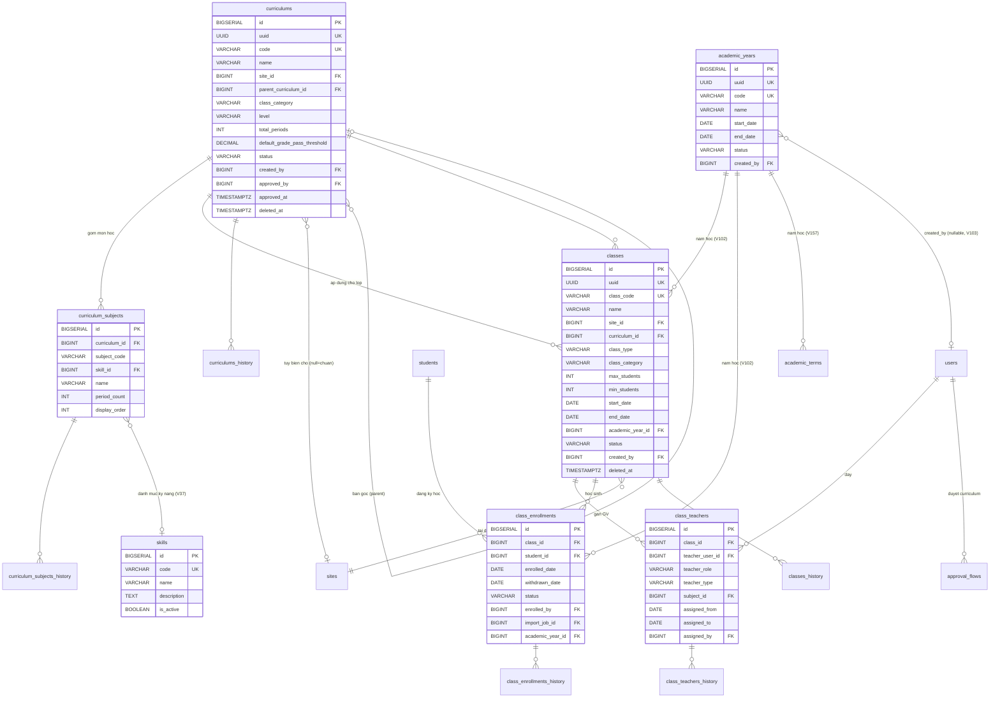
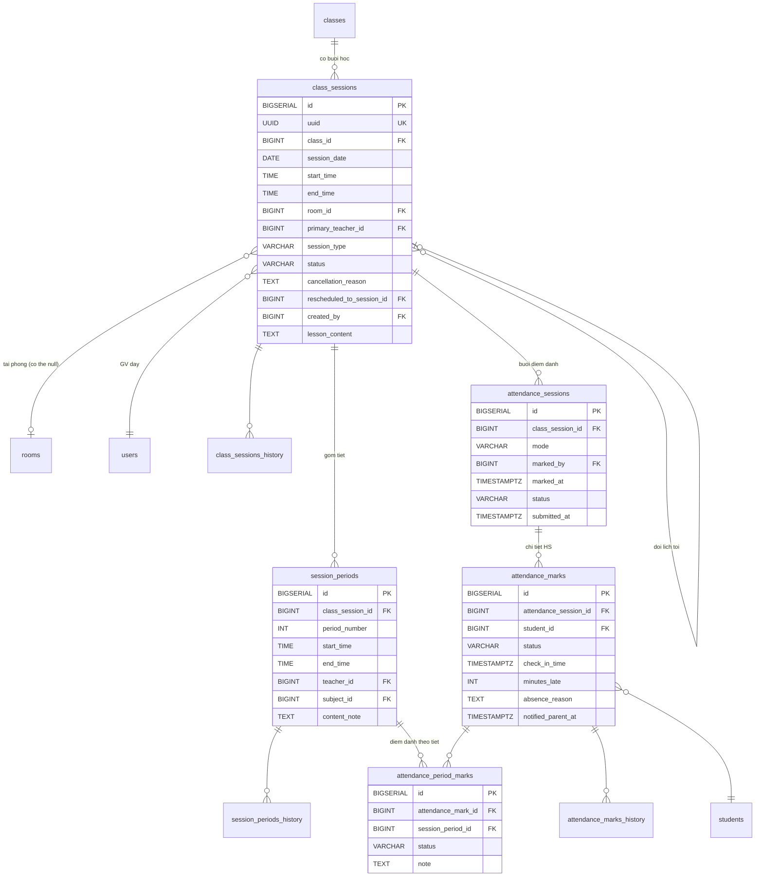
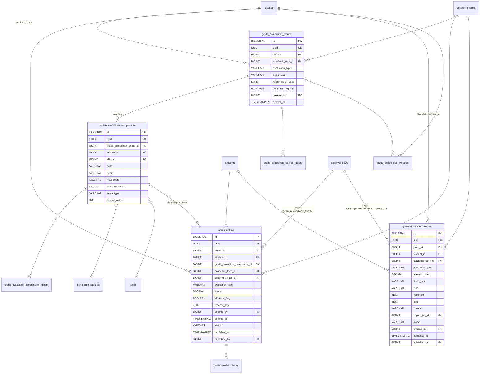
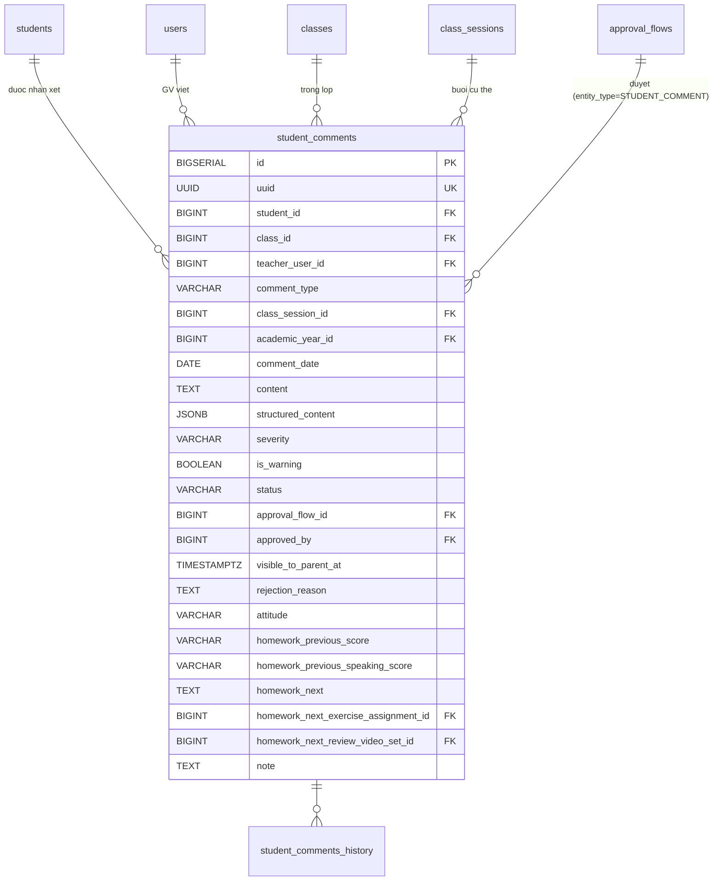

## Học thuật

### Mô tả tổng quan

Nhóm lớn nhất và trung tâm của hệ thống, bao phủ 5 phân hệ và toàn bộ
phân hệ 6. Phần này sẽ chia thành 4 phần con: Khung chương trình học &
Lớp học, Lịch dạy & Điểm danh, Sổ điểm, Nhận xét định kỳ.

### Khung chương trình & Lớp học

<!-- Nguồn: docs/diagrams/erd/ERD-Nhom5A-KhungChuongTrinh.mmd (chỉnh sửa trực tiếp file này, không sửa trong srs.md/sdd-groups) -->

a)  Bảng curriculums --- Khung chương trình

1 bảng duy nhất cho cả khung chuẩn và bản tùy biến theo trường, phân
biệt qua site_id (NULL = chuẩn).

  -------------------------------------------------------------------------------------
  **Cột**                        **Kiểu**       **Ràng buộc**      **Ghi chú**
  ------------------------------ -------------- ------------------ --------------------
  id                             BIGSERIAL      PK

  uuid                           UUID           UNIQUE, NOT NULL

  code                           VARCHAR(50)    UNIQUE, NOT NULL   VD EN-G8-STD-2026

  name                           VARCHAR(300)   NOT NULL

  site_id                        BIGINT         FK → sites(id),    NULL = khung chuẩn;
                                                 NULL               NOT NULL = tùy biến
                                                                    cho site

  parent_curriculum_id           BIGINT         FK →               Nếu tùy biến, trỏ về
                                                 curriculums(id),   bản chuẩn gốc
                                                 NULL

  class_category                 VARCHAR(30)    NOT NULL           MAIN / SUPPLEMENTARY
                                                                    / EXAM_PREP / OTHER

  level                          VARCHAR(50)    NULL               "Lớp 6",
                                                                    "PET"...

  total_periods                  INT            NULL

  default_grade_pass_threshold   DECIMAL(4,2)   NULL, DEFAULT 5.0

  status                         VARCHAR(20)    NOT NULL, DEFAULT  DRAFT /
                                                 'DRAFT'            PENDING_APPROVAL /
                                                                    ACTIVE / ARCHIVED

  created_by                     BIGINT         FK → users(id)

  approved_by                    BIGINT         FK → users(id),    Trưởng phòng đào tạo
                                                 NULL               --- người duyệt cuối
                                                                    cùng

  approved_at                    TIMESTAMPTZ    NULL

  created_at, updated_at,        TIMESTAMPTZ                       Soft-delete
  deleted_at
  -------------------------------------------------------------------------------------

Có curriculums_history.

Ràng buộc

ALTER TABLE curriculums ADD CONSTRAINT chk_custom_has_parent

CHECK ( (site_id IS NULL AND parent_curriculum_id IS NULL) OR

(site_id IS NOT NULL AND parent_curriculum_id IS NOT NULL) );

b)  Bảng curriculum_subjects --- Môn học trong khung

  ------------------------------------------------------------------------
  **Cột**         **Kiểu**          **Ràng buộc**            **Ghi chú**
  --------------- ----------------- ------------------------ -------------
  id              BIGSERIAL         PK

  curriculum_id   BIGINT            FK → curriculums(id),
                                     NOT NULL

  subject_code    VARCHAR(50)       NOT NULL                 SPEAKING /
                                                               LISTENING /
                                                               READING /
                                                               WRITING /
                                                               GRAMMAR /
                                                               OTHER

  skill_id        BIGINT            FK → skills(id), NULL    V37 --- tham chiếu
                                                               danh mục kỹ năng (bổ
                                                               sung ngoài SDD gốc,
                                                               đã xác nhận với người
                                                               dùng). Chỉ set khi
                                                               subject_code=OTHER và
                                                               cần 1 kỹ năng ngoài 6
                                                               giá trị gốc; name vẫn
                                                               là cột hiển thị chính

  name            VARCHAR(200)      NOT NULL

  period_count    INT               NULL

  display_order   INT               NOT NULL, DEFAULT 0

                                     UNIQUE(curriculum_id,
                                     subject_code)
  ------------------------------------------------------------------------

Có curriculum_subjects_history.

f)  Bảng skills --- Danh mục kỹ năng (mới, V37, bổ sung ngoài SDD gốc,
    đã xác nhận với người dùng)

Danh mục kỹ năng dùng chung toàn hệ thống, quản lý qua UC-54. Không thay
thế enum `SubjectCode`/`ComponentCode` hiện có trên
`curriculum_subjects.subject_code`/`grade_components.code` (vẫn giữ
nguyên, 2 cột đó là VARCHAR tự do không CHECK constraint) — bảng này chỉ
là danh mục tham chiếu bổ sung qua cột `skill_id` (FK, nullable) trên 2
bảng đó, cho phép Trưởng phòng đào tạo thêm kỹ năng mới (ngoài 6 giá trị
enum gốc) mà không cần sửa code.

  ---------------------------------------------------------------------
  **Cột**       **Kiểu**       **Ràng buộc**            **Ghi chú**
  ------------- -------------- ------------------------ ---------------
  id            BIGSERIAL      PK

  code          VARCHAR(50)    UNIQUE, NOT NULL         VD VOCABULARY

  name          VARCHAR(200)   NOT NULL                 Tên hiển thị,
                                                          VD "Từ vựng"

  description   TEXT           NULL

  is_active     BOOLEAN        NOT NULL, DEFAULT TRUE   FALSE = vô
                                                          hiệu hoá,
                                                          không xoá
                                                          cứng

  created_at,   TIMESTAMPTZ
  updated_at
  ---------------------------------------------------------------------

Seed sẵn 7 giá trị khớp đúng 2 enum hiện có khi tạo bảng (migration
V37): SPEAKING, LISTENING, READING, WRITING, GRAMMAR, PROJECT, OTHER.

c)  Bảng classes --- Lớp học thực tế

  ---------------------------------------------------------------------------
  **Cột**          **Kiểu**          **Ràng buộc**      **Ghi chú**
  ---------------- ----------------- ------------------ ---------------------
  id               BIGSERIAL         PK

  uuid             UUID              UNIQUE, NOT NULL

  class_code       VARCHAR(50)       UNIQUE, NOT NULL   VD 8A2-NGDU-26-27

  name             VARCHAR(300)      NOT NULL

  site_id          BIGINT            FK → sites(id),
                                      NOT NULL

  curriculum_id    BIGINT            FK →
                                      curriculums(id),
                                      NOT NULL

  class_type       VARCHAR(20)       NOT NULL           LINKED / OPEN

  class_category   VARCHAR(30)       NULL               Copy từ curriculum
                                                         tại thời điểm tạo

  max_students     INT               NOT NULL, CHECK >
                                      0

  min_students     INT               NULL

  start_date,      DATE              start_date NOT
  end_date                           NULL

  academic_year    VARCHAR(20)       NULL

  status           VARCHAR(20)       NOT NULL, DEFAULT  PLANNED /
                                      'PLANNED'          OPEN_ENROLLMENT /
                                                         IN_PROGRESS /
                                                         COMPLETED / CANCELLED

  created_by       BIGINT            FK → users(id)     TPĐT quyết định, Nhân
                                                         viên giáo vụ nhập

  created_at,      TIMESTAMPTZ                          Soft-delete
  updated_at,
  deleted_at
  ---------------------------------------------------------------------------

Có classes_history.

*Logic nghiệp vụ:* Trưởng phòng đào tạo quyết định sắp xếp lớp/điều phối
giáo viên; Nhân viên giáo vụ thực hiện nhập liệu hành chính trên bảng
này theo quyết định đó.

> **Bổ sung ngoài SDD gốc (đã xác nhận với người dùng 2026-07-31):** cột
> `semester` (VARCHAR tự do, không có business logic đọc/ghi có ý nghĩa)
> đã bị XÓA (migration V71) — thay bằng bảng `academic_terms` riêng, xem
> mục c-bis) dưới đây. `classes` KHÔNG có FK tới `academic_terms` — 1 lớp
> không thuộc cố định 1 kỳ.

c-bis)  Bảng academic_terms --- Giai đoạn/Học kỳ (bổ sung ngoài SDD gốc,
đã xác nhận với người dùng 2026-07-31, migration V71)

  ---------------------------------------------------------------------------
  **Cột**          **Kiểu**          **Ràng buộc**      **Ghi chú**
  ---------------- ----------------- ------------------ ---------------------
  id               BIGSERIAL         PK

  uuid             UUID              UNIQUE, NOT NULL

  site_id          BIGINT            FK → sites(id),    Giới hạn theo điểm
                                      NOT NULL           trường, độc lập lớp

  academic_year_id BIGINT            FK →               V157 (bổ sung ngoài
                                      academic_years(id), SDD gốc, xác nhận
                                      NULL               2026-08-28) — kỳ
                                                          học thuộc năm học
                                                          nào. NULL ở DB cho
                                                          dữ liệu kỳ cũ; kỳ
                                                          tạo mới bắt buộc
                                                          có (validate ở
                                                          service/DTO).
                                                          Index
                                                          idx_academic_terms_academic_year

  code             VARCHAR(50)       NOT NULL           UNIQUE theo
                                                          (site_id, code)

  name             VARCHAR(200)      NOT NULL           VD "Giữa kỳ 1
                                                          (2026-2027)"

  start_date,      DATE              NOT NULL
  end_date

  created_by       BIGINT            FK → users(id)

  created_at,      TIMESTAMPTZ
  updated_at
  ---------------------------------------------------------------------------

*Logic nghiệp vụ:* độc lập với `classes` — 1 lớp tồn tại xuyên suốt nhiều
kỳ (sĩ số/giáo viên có thể đổi giữa các kỳ do sắp xếp lại học sinh theo
trình độ). **V157 (xác nhận với người dùng 2026-08-28):** mỗi kỳ học bắt
buộc gắn 1 `academic_years` (quan hệ 1-N ổn định — khác quan hệ lớp↔kỳ cố
tình KHÔNG đặt FK); khi năm học đã khai báo đủ `start_date`/`end_date`,
khoảng `[start_date, end_date]` của kỳ phải nằm gọn trong năm học (validate
mềm ở `AcademicTermService`). "Hồ sơ lớp/học sinh theo kỳ" là dữ liệu TÍNH
RA (derived) từ
các bảng đã có ngày tháng sẵn (`class_enrollments`,
`class_teachers.assigned_from/assigned_to`, `class_sessions.session_date`,
`student_comments.comment_date`...) lọc theo `[start_date, end_date]` của
kỳ — không có bảng snapshot/join riêng. Xem
docs/uc/phan-he-06-hoc-thuat.md (UC-18) để biết đầy đủ bối cảnh quyết
định.

d)  Bảng class_teachers --- Gán GV cho lớp

  ---------------------------------------------------------------------------
  **Cột**           **Kiểu**         **Ràng buộc**              **Ghi chú**
  ----------------- ---------------- -------------------------- -------------
  id                BIGSERIAL        PK

  class_id          BIGINT           FK → classes(id), NOT NULL

  teacher_user_id   BIGINT           FK → users(id), NOT NULL

  teacher_role      VARCHAR(20)      NOT NULL, DEFAULT          PRIMARY /
                                      'PRIMARY'                  ASSISTANT /
                                                                 SUBSTITUTE /
                                                                 CM (bổ sung
                                                                 ngoài SDD
                                                                 gốc, xác
                                                                 nhận
                                                                 2026-08-13)

  teacher_type      VARCHAR(20)      NULL (bổ sung ngoài SDD    VIETNAMESE /
                                      gốc, xác nhận 2026-08-13,  FOREIGN,
                                      V121)                      chỉ có ý
                                                                 nghĩa khi
                                                                 teacher_role
                                                                 =PRIMARY

  subject_id        BIGINT           FK →
                                      curriculum_subjects(id),
                                      NULL

  assigned_from,    DATE             assigned_to NULL = đang
  assigned_to                        phụ trách

  assigned_by       BIGINT           FK → users(id)
  ---------------------------------------------------------------------------

Có class_teachers_history.

Ràng buộc:

CREATE UNIQUE INDEX idx_class_teacher_primary_active

ON class_teachers(class_id, COALESCE(subject_id, 0), COALESCE(teacher_type,
'NONE'))

WHERE teacher_role = 'PRIMARY' AND assigned_to IS NULL;

(Bổ sung ngoài SDD gốc, xác nhận 2026-08-13, V121 — trước đây index chỉ có
`(class_id, COALESCE(subject_id, 0))`, giờ thêm `teacher_type` để cho phép
đồng thời 1 PRIMARY active loại VIETNAMESE + 1 PRIMARY active loại FOREIGN
cho cùng lớp/học phần — xem docs/uc/phan-he-06-hoc-thuat.md UC-18 để biết
đầy đủ bối cảnh, cùng use case "đổi giáo viên chính" mới có cascade sang
class_sessions.)

e)  Bảng class_enrollments --- Học sinh trong lớp

  --------------------------------------------------------------------------
  **Cột**            **Kiểu**          **Ràng buộc**      **Ghi chú**
  ------------------ ----------------- ------------------ ------------------
  id                 BIGSERIAL         PK

  class_id           BIGINT            FK → classes(id),
                                        NOT NULL

  student_id         BIGINT            FK → students(id),
                                        NOT NULL

  enrolled_date,     DATE              NULL cho
  withdrawn_date                       withdrawn_date

  status             VARCHAR(20)       NOT NULL, DEFAULT  ACTIVE / WITHDRAWN
                                        'ACTIVE'           / TRANSFERRED /
                                                           COMPLETED

  withdraw_reason    TEXT              NULL

  enrolled_by        BIGINT            FK → users(id)

  import_job_id      BIGINT            FK →               Nếu từ import
                                        import_jobs(id),   Excel lớp liên kết
                                        NULL

  academic_year_id   BIGINT            FK →               Copy từ
                                        academic_years(id), classes.
                                        NULL                academic_year_id
                                                            tại thời điểm tạo
                                                            (V102, đổi từ
                                                            VARCHAR sang FK ở
                                                            V103; bổ sung
                                                            ngoài SDD gốc, đã
                                                            xác nhận với
                                                            người dùng
                                                            2026-08-07) — để
                                                            Portal HS/PH lọc
                                                            lịch sử ghi danh
                                                            theo năm học
                                                            không cần join
                                                            qua classes
  --------------------------------------------------------------------------

Có class_enrollments_history.

Ràng buộc:

CREATE UNIQUE INDEX idx_enrollment_active

ON class_enrollments(class_id, student_id)

WHERE status = 'ACTIVE';

g)  Bảng approval_flows

(Đã thiết kế ở Nhóm 1 --- dùng chung cho luồng duyệt curriculum tùy biến
với entity_type='CURRICULUM', không tạo bảng riêng. V37 bổ sung thêm giá
trị entity_type='GRADE_PERIOD_RESULT' dùng cho mục Sổ điểm bên dưới —
chỉ thêm giá trị Java enum, không đổi schema bảng này.)

h)  Bảng academic_years --- Danh mục Năm học (V103, bổ sung ngoài SDD gốc,
    đã xác nhận với người dùng 2026-08-07)

Danh mục "Năm học" DÙNG CHUNG TOÀN HỆ THỐNG (khác `academic_terms` —
Kỳ học, giới hạn theo điểm trường). Là nguồn FK cho `academic_year_id`
trên `classes`, `grade_entries`, `student_comments`, `class_enrollments`
(V102, thay cho chuỗi tự do trước đây), `teaching_plans` (V103, thay
cho chuỗi tự do từ V21) và `academic_terms` (V157 — mỗi kỳ học thuộc 1
năm học).

  -------------------------------------------------------------------------
  **Cột**       **Kiểu**       **Ràng buộc**            **Ghi chú**
  ------------- -------------- ------------------------ -------------------
  id            BIGSERIAL      PK

  uuid          UUID           UNIQUE, NOT NULL, DEFAULT
                                gen_random_uuid()

  code          VARCHAR(20)    UNIQUE, NOT NULL         VD "2026-2027"

  name          VARCHAR(100)   NOT NULL

  start_date    DATE           NULL

  end_date      DATE           NULL

  status        VARCHAR(20)    NOT NULL, DEFAULT        PLANNED / ACTIVE /
                                'PLANNED'                CLOSED

  created_by    BIGINT         FK → users(id), NULL     Nullable — dữ liệu
                                                          backfill từ chuỗi
                                                          cũ (V103) không có
                                                          actor thật

  created_at,   TIMESTAMPTZ    NOT NULL
  updated_at
  -------------------------------------------------------------------------

Không có DELETE — đóng năm học dùng `status=CLOSED` qua PUT, không xoá
cứng.

### Lịch dạy & Điểm danh

<!-- Nguồn: docs/diagrams/erd/ERD-Nhom5B-LichDayDiemDanh.mmd (chỉnh sửa trực tiếp file này, không sửa trong srs.md/sdd-groups) -->

a)  Bảng class_sessions --- Buổi học

1 record = 1 buổi học vật lý tại 1 thời điểm cụ thể.

  --------------------------------------------------------------------------------
  **Cột**                     **Kiểu**         **Ràng buộc**         **Ghi chú**
  --------------------------- ---------------- --------------------- -------------
  id                          BIGSERIAL        PK

  uuid                        UUID             UNIQUE, NOT NULL

  class_id                    BIGINT           FK → classes(id), NOT
                                                NULL

  session_date                DATE             NOT NULL

  start_time, end_time        TIME             NOT NULL

  room_id                     BIGINT           FK → rooms(id), NULL  NULL khi lớp
                                                                     do trường tự
                                                                     quản lý phòng

  primary_teacher_id          BIGINT           FK → users(id), NOT   Có thể khác
                                                NULL                 GV chính của
                                                                     lớp (VD dạy
                                                                     thay)

  session_type                VARCHAR(20)      NOT NULL, DEFAULT     REGULAR /
                                                'REGULAR'             MAKEUP / EXAM
                                                                     / SPECIAL

  status                      VARCHAR(20)      NOT NULL, DEFAULT     SCHEDULED /
                                                'SCHEDULED'           IN_PROGRESS /
                                                                     COMPLETED /
                                                                     CANCELLED /
                                                                     RESCHEDULED

  teacher_type                VARCHAR(20)      NULL                  VIETNAMESE /
                                                                     FOREIGN — HS/
                                                                     PH xem GV
                                                                     buổi này là
                                                                     người Việt
                                                                     hay nước
                                                                     ngoài, tùy
                                                                     chọn (bổ sung
                                                                     ngoài SDD
                                                                     gốc, đã xác
                                                                     nhận với
                                                                     người dùng
                                                                     2026-07-29).
                                                                     KHÔNG liên
                                                                     quan hồ sơ
                                                                     nhân sự. Từ
                                                                     2026-08-12
                                                                     field này
                                                                     CÓ chi phối
                                                                     logic "BTVN
                                                                     buổi trước"
                                                                     (UC-21) —
                                                                     xem
                                                                     StudentCommentService
                                                                     #previousComment,
                                                                     không còn
                                                                     thuần hiển
                                                                     thị.

  cancellation_reason         TEXT             NULL

  rescheduled_to_session_id   BIGINT           FK →                  Tự tham chiếu
                                                class_sessions(id),   khi dời lịch
                                                NULL

  created_by                  BIGINT           FK → users(id)        Nhân viên
                                                                     giáo vụ tạo

  lesson_content               TEXT             NULL                  "Bài học hôm
                                                                     nay" — 1 giá
                                                                     trị dùng
                                                                     chung cả lớp,
                                                                     GV điền cùng
                                                                     lúc điểm danh
                                                                     (V50, bổ sung
                                                                     ngoài SDD
                                                                     gốc, đã xác
                                                                     nhận với
                                                                     người dùng
                                                                     2026-07-24).
                                                                     KHÁC
                                                                     session_periods.
                                                                     content_note
                                                                     (per-tiết,
                                                                     chưa có code
                                                                     nào dùng) —
                                                                     đây là giá
                                                                     trị per-buổi.

  created_at, updated_at      TIMESTAMPTZ
  --------------------------------------------------------------------------------

Có class_sessions_history.

Ràng buộc:

ALTER TABLE class_sessions ADD CONSTRAINT chk_session_time CHECK
(end_time > start_time);

CREATE INDEX idx_class_sessions_date ON class_sessions(session_date);

CREATE INDEX idx_class_sessions_teacher_date ON
class_sessions(primary_teacher_id, session_date DESC);

Logic kiểm tra trùng phòng (FR-FAC-03) --- xử lý ở service layer, không
phải SQL constraint đơn thuần:

SELECT * FROM class_sessions cs

JOIN rooms r ON r.id = cs.room_id

WHERE cs.room_id = :room_id

AND cs.session_date = :date

AND cs.status NOT IN ('CANCELLED', 'RESCHEDULED')

AND r.is_flexible = FALSE

AND (:start_time < cs.end_time AND :end_time > cs.start_time)

AND cs.id != :editing_session_id;

Chỉ kiểm tra với phòng có is_flexible=FALSE; phòng linh hoạt (trường
liên kết cấp) được loại trừ khỏi ràng buộc cứng.

**UC-56/UC-57/UC-58 (FR-ACA-05, bổ sung ngoài SDD gốc, đã xác nhận với
người dùng):** không thêm bảng/cột mới nào. UC-56 (sinh lịch hàng loạt
theo mẫu lặp) và UC-57 (nhập lịch qua Excel) đều gọi lại đúng logic tạo
1 class_session + kiểm tra trùng phòng ở trên (lặp qua nhiều
ngày/dòng), không viết lại. UC-58 ("Lịch của tôi" — Giáo viên xem lịch
dạy qua mọi lớp) chỉ thêm 1 query lọc theo `primary_teacher_id` +
khoảng `session_date` tùy chọn, tận dụng đúng index
`idx_class_sessions_teacher_date` đã có sẵn ở trên — không cần index
mới. Riêng UC-57 dùng lại giá trị có sẵn từ V1
`import_jobs.import_type = TEACHING_SCHEDULE` (bảng import_jobs định
nghĩa ở `docs/sdd-groups/02-nen-tang.md` mục l — giá trị enum này có
sẵn từ đầu nhưng trước giờ chưa có code nào dùng, nay chính là lần đầu
dùng thật, không cần migration vì import_type là VARCHAR(50) tự do).

a-bis)  Bảng class_session_check_ins --- Nhận lớp (UC-71, bổ sung HOÀN
TOÀN ngoài SDD/SRS gốc, đã xác nhận với người dùng 2026-08-18, migration
V126)

1 record = 1 giáo viên đã có mặt để dạy 1 buổi học cụ thể. Không có
check-out — khác hẳn `attendance_records` (UC-09, ca hành chính).

  ---------------------------------------------------------------------------
  **Cột**            **Kiểu**             **Ràng buộc**       **Ghi chú**
  ------------------ -------------------- ------------------- --------------
  id                 BIGSERIAL            PK

  uuid               UUID                 UNIQUE, NOT NULL

  class_session_id   BIGINT               FK →                UNIQUE — 1
                                           class_sessions(id), buổi học chỉ
                                           NOT NULL            1 lượt nhận
                                                                lớp

  teacher_id         BIGINT               FK → users(id),     Phải khớp
                                           NOT NULL            class_sessions.
                                                                primary_teacher_id
                                                                tại thời
                                                                điểm nhận —
                                                                validate ở
                                                                Service

  check_in_time      TIMESTAMPTZ          NOT NULL

  status             VARCHAR(20)          NOT NULL            ON_TIME |
                                                                LATE

  latitude,          DOUBLE PRECISION     NOT NULL

  longitude

  site_id            BIGINT               FK → sites(id),     Resolve qua
                                           NOT NULL            class_sessions.
                                                                class_id →
                                                                classes.
                                                                site_id, lưu
                                                                lại để
                                                                audit/query

  created_at,        TIMESTAMPTZ
  updated_at
  ---------------------------------------------------------------------------

Không có cột/trạng thái "ABSENT" và không có scheduled job quét — buổi học
đã qua giờ kết thúc (`session_date + end_time < now`) mà KHÔNG có row ở
bảng này được coi là "vắng/không nhận lớp", tính TÍNH RA khi đọc (cùng tinh
thần dữ liệu derived đã áp dụng cho `academic_terms`, mục c-bis bên dưới).
Bán kính GPS dùng chung `system_settings.attendance.gps_radius_meters` với
UC-09 (không thêm setting riêng) — kiểm tra qua `SiteRepository.isWithinRadius`
(native `ST_DWithin`) đã có sẵn từ UC-09, không tạo cơ chế mới. Xem
docs/uc/phan-he-06-hoc-thuat.md (UC-71).

b)  Bảng session_periods --- Tiết học trong buổi

Tự động sinh (mặc định 2 tiết/buổi theo system_settings) khi tạo
class_sessions, GV có thể sửa chi tiết sau.

  -----------------------------------------------------------------------------
  **Cột**            **Kiểu**      **Ràng buộc**              **Ghi chú**
  ------------------ ------------- -------------------------- -----------------
  id                 BIGSERIAL     PK

  class_session_id   BIGINT        FK → class_sessions(id),
                                    NOT NULL

  period_number      INT           NOT NULL

  start_time,        TIME          NOT NULL
  end_time

  teacher_id         BIGINT        FK → users(id), NULL       NULL = dùng
                                                               primary_teacher
                                                               của session

  subject_id         BIGINT        FK →
                                    curriculum_subjects(id),
                                    NULL

  content_note       TEXT          NULL

                                    UNIQUE(class_session_id,
                                    period_number)
  -----------------------------------------------------------------------------

Có session_periods_history.

c)  Bảng attendance_sessions --- Buổi điểm danh

Header cho việc điểm danh 1 buổi cụ thể.

  ----------------------------------------------------------------------------
  **Cột**            **Kiểu**         **Ràng buộc**         **Ghi chú**
  ------------------ ---------------- --------------------- ------------------
  id                 BIGSERIAL        PK

  class_session_id   BIGINT           FK →
                                       class_sessions(id),
                                       NOT NULL, UNIQUE

  mode               VARCHAR(20)      NOT NULL, DEFAULT     SESSION_LEVEL /
                                       'SESSION_LEVEL'       PERIOD_LEVEL

  marked_by          BIGINT           FK → users(id), NOT
                                       NULL

  marked_at          TIMESTAMPTZ      NOT NULL, DEFAULT
                                       NOW()

  status              VARCHAR(20)      NOT NULL, DEFAULT     DRAFT / SUBMITTED
                                       'DRAFT'               / LOCKED

  submitted_at       TIMESTAMPTZ      NULL
  ----------------------------------------------------------------------------

Không cần history riêng --- chi tiết thay đổi đã có ở
attendance_marks_history.

d)  Bảng attendance_marks --- Điểm danh cấp buổi (mỗi HS)

Nguồn dữ liệu chính để tính chuyên cần.

  -------------------------------------------------------------------------------------
  **Cột**                 **Kiểu**       **Ràng buộc**                   **Ghi chú**
  ----------------------- -------------- ------------------------------- --------------
  id                      BIGSERIAL      PK

  attendance_session_id   BIGINT         FK → attendance_sessions(id),
                                         NOT NULL

  student_id              BIGINT         FK → students(id), NOT NULL

  status                  VARCHAR(20)    NOT NULL                        PRESENT /
                                                                         ABSENT /
                                                                         EXCUSED / LATE
                                                                         / EARLY_LEAVE

  check_in_time           TIMESTAMPTZ    NULL

  minutes_late,           INT            NULL
  minutes_early_leave

  absence_reason          TEXT           NULL

  notified_parent_at      TIMESTAMPTZ    NULL                            Thời điểm đã
                                                                         gửi thông báo
                                                                         cho PH

                                         UNIQUE(attendance_session_id,
                                         student_id)
  -------------------------------------------------------------------------------------

Có attendance_marks_history.

Chỉ số:

CREATE INDEX idx_attendance_marks_student ON
attendance_marks(student_id);

*Logic gửi thông báo:* Khi attendance_sessions.status chuyển SUBMITTED
và có mark ABSENT/LATE → gửi thông báo cho **tất cả phụ huynh** liên kết
với HS đó.

e)  Bảng attendance_period_marks --- Điểm danh chi tiết theo tiết

Chỉ tạo khi GV cần sửa chi tiết theo tiết (VD: có mặt tiết 1, vắng tiết
2). Khi điểm danh 1 lần đầu buổi (SESSION_LEVEL), hệ thống tự tạo record
ở đây cho từng tiết với cùng status.

  ---------------------------------------------------------------------------
  **Cột**              **Kiểu**        **Ràng buộc**                **Ghi
                                                                     chú**
  -------------------- --------------- ---------------------------- ---------
  id                   BIGSERIAL       PK

  attendance_mark_id   BIGINT          FK → attendance_marks(id),
                                        NOT NULL

  session_period_id    BIGINT          FK → session_periods(id),
                                        NOT NULL

  status               VARCHAR(20)     NOT NULL                     PRESENT /
                                                                     ABSENT /
                                                                     EXCUSED /
                                                                     LATE

  note                 TEXT            NULL

                                        UNIQUE(attendance_mark_id,
                                        session_period_id)
  ---------------------------------------------------------------------------

Không history riêng --- thay đổi ghi vào attendance_marks_history.

### Sổ điểm & Điểm tổng kết

V95 (bổ sung ngoài SDD gốc, đã xác nhận với người dùng 2026-08-06 —
consolidate vào `academic_terms`): thay hẳn thiết kế cũ "kỳ đánh giá theo
curriculum, dùng chung nhiều lớp" (`grade_periods`/`grade_components`,
V13/V37/V40, đã DROP ở V95) bằng cấu trúc gắn TRỰC TIẾP (lớp, kỳ học,
Giữa/Cuối kỳ) — mỗi lớp tự quyết định đánh giá Giữa kỳ/Cuối kỳ/cả hai qua
từng `grade_component_setups` riêng (VD lớp bổ trợ chỉ tạo 1 setup
`END_TERM`, không tạo setup `MID_TERM`), không còn phụ thuộc cấu hình
chung của khung chương trình. Đồng thời tích hợp "Nhận xét"/"Ghi chú"
trực tiếp vào `grade_evaluation_results` (đổi tên từ `grade_period_results`)
— Giáo viên nhập điểm + nhận xét cùng lúc, Quản lý điểm trường sửa được
nhận xét (không sửa điểm) ngay tại bước duyệt.

**State machine duyệt điểm — ĐÃ CÓ TỪ V77, KHÔNG đổi ở V95:** 4 trạng
thái `DRAFT → SUBMITTED → OFFICIAL / REJECTED` (thay hẳn luồng "công bố
dự kiến + phúc khảo" V43/UC-62 cũ — đã bỏ hẳn phúc khảo, xác nhận với
người dùng). Áp dụng đồng thời cho `grade_entries` và
`grade_evaluation_results`:

- **DRAFT**: GV toàn quyền sửa/xoá, không giới hạn thời gian.
- **SUBMITTED**: GV bấm "Gửi duyệt" (hành động tường minh, không tự động
  khi nhập dòng điểm đầu tiên) — chờ Quản lý điểm trường duyệt, không sửa
  được nữa (trừ actor có `academic.grade.edit.override`).
- **OFFICIAL**: Quản lý điểm trường duyệt xong, hiển thị ngay cho Phụ
  huynh/Học sinh qua Portal, khoá vĩnh viễn.
- **REJECTED**: Quản lý từ chối (chỉ từ SUBMITTED), GV hoặc Quản lý sửa
  lại rồi gửi duyệt lại (→ SUBMITTED) hoặc Quản lý duyệt thẳng (→
  OFFICIAL, không bắt GV gửi lại).

Lịch sử gửi/duyệt/từ chối lưu trong `approval_flows` (`entity_type=
GRADE_ENTRY`/`GRADE_PERIOD_RESULT`) — dùng lại đúng bảng đã thiết kế sẵn
từ V1 cho UC-17, không thêm cột trạng thái riêng trên `grade_entries`/
`grade_evaluation_results`. Actor có quyền `academic.grade.edit.override`
(mặc định HEAD_ACADEMIC + SITE_MANAGER) bỏ qua mọi ràng buộc theo trạng
thái.

<!-- Nguồn: docs/diagrams/erd/ERD-Nhom5C-SoDiem.mmd (chỉnh sửa trực tiếp file này, không sửa trong srs.md/sdd-groups) -->

a)  Bảng `grade_component_setups` --- Cấu hình sổ điểm (thay
    `grade_periods`)

  ---------------------------------------------------------------------------
  **Cột**            **Kiểu**         **Ràng buộc**       **Ghi chú**
  ------------------ ---------------- ------------------- --------------------
  id                 BIGSERIAL        PK

  uuid               UUID             UNIQUE, NOT NULL

  class_id           BIGINT           FK → classes(id),
                                       NOT NULL

  academic_term_id   BIGINT           FK →
                                       academic_terms(id),
                                       NOT NULL

  evaluation_type    VARCHAR(20)      NOT NULL            MID_TERM / END_TERM

  scale_type         VARCHAR(20)      NOT NULL            Thang điểm áp dụng
                                                            cho mọi thành phần
                                                            điểm trong setup —
                                                            POINT_10 (0-10) /
                                                            PERCENT (0-100) /
                                                            IELTS (band
                                                            1.0-9.0, cho phép
                                                            nhập lẻ). V97, thay
                                                            weight_in_final —
                                                            hệ thống KHÔNG tính
                                                            OVERALL cả kỳ từ
                                                            Giữa+Cuối kỳ, hiển
                                                            thị riêng Overall
                                                            mỗi setup.

  roster_as_of_date  DATE             NOT NULL            Ngày chốt danh
                                                            sách HS —
                                                            class_enrollments
                                                            active tại đúng
                                                            ngày này (GV/
                                                            Quản trị tự chọn
                                                            lúc setup)

  comment_required   BOOLEAN          NOT NULL, DEFAULT
                                       FALSE

  created_by         BIGINT           FK → users(id)

  created_at,        TIMESTAMPTZ                          Soft-delete
  updated_at,
  deleted_at
  ---------------------------------------------------------------------------

Có `grade_component_setups_history`. `UNIQUE(class_id, academic_term_id,
evaluation_type)` — 1 lớp chỉ có tối đa 1 setup MID_TERM + 1 setup
END_TERM cho mỗi kỳ học.

*Ràng buộc nghiệp vụ (validate ở service, không SQL, V97):* `max_score`
của mọi `grade_evaluation_components` thuộc 1 setup phải khớp cận trên
`scale_type` của setup đó — POINT_10 → 10, PERCENT → 100, IELTS → 9
(`GradeService#requireMaxScoreMatchesScale`, ném
`GradeComponentSetupScaleMismatchException` nếu sai). `scale_type` không
sửa được sau khi tạo setup (component đã tạo theo maxScore của thang cũ,
đổi thang sẽ phá tính nhất quán).

*Danh sách học sinh (roster):* KHÔNG phải bảng snapshot riêng — tính
theo `class_enrollments` lọc `enrolled_date <= roster_as_of_date AND
(withdrawn_date IS NULL OR withdrawn_date >= roster_as_of_date)` mỗi lần
gọi `GET /api/grade-component-setups/{id}/roster` (xem
`GradeService#getRoster`).

b)  Bảng `grade_evaluation_components` --- Thành phần điểm (thay
    `grade_components`)

  --------------------------------------------------------------------------
  **Cột**              **Kiểu**         **Ràng buộc**            **Ghi chú**
  --------------------- ---------------- ------------------------ -----------
  id                    BIGSERIAL        PK

  uuid                  UUID             UNIQUE, NOT NULL

  grade_component_      BIGINT           FK →
  setup_id                               grade_component_
                                          setups(id), NOT NULL

  subject_id            BIGINT           FK →
                                          curriculum_subjects(id),
                                          NULL

  skill_id              BIGINT           FK → skills(id), NULL

  code                  VARCHAR(50)      NOT NULL                 SPEAKING /
                                                                   WRITING /
                                                                   LISTENING /
                                                                   READING /
                                                                   GRAMMAR /
                                                                   PROJECT /
                                                                   OTHER

  name                  VARCHAR(200)     NOT NULL

  max_score              DECIMAL(5,2)     NOT NULL, DEFAULT
                                          10.00

  pass_threshold         DECIMAL(5,2)     NULL

  scale_type             VARCHAR(20)      NOT NULL, DEFAULT        NUMERIC /
                                          'NUMERIC'                 PERCENTAGE
                                                                    / BAND

  display_order          INT              NOT NULL, DEFAULT 0

                                          UNIQUE(grade_component_
                                          setup_id, code)
  --------------------------------------------------------------------------

Có `grade_evaluation_components_history`.

*Logic bảo vệ khi sửa cấu trúc:* Nếu đã tồn tại `grade_entries` cho
component này → cấm sửa `max_score`, chỉ cho sửa
`name`/`pass_threshold`/`display_order`. Chỉ xoá được khi CHƯA có điểm
nhập nào.

c)  Bảng `grade_entries` --- Điểm cụ thể của học sinh

  ---------------------------------------------------------------------------
  **Cột**                    **Kiểu**         **Ràng buộc**       **Ghi chú**
  --------------------------- ---------------- ------------------- ----------
  id                          BIGSERIAL        PK

  uuid                        UUID             UNIQUE, NOT NULL

  class_id                    BIGINT           FK → classes(id),
                                                NOT NULL

  student_id                  BIGINT           FK → students(id),
                                                NOT NULL

  grade_evaluation_           BIGINT           FK →
  component_id                                 grade_evaluation_
                                                components(id),
                                                NOT NULL

  academic_term_id            BIGINT           FK →                Denormalize
                                                academic_terms(id), từ setup —
                                                NOT NULL             báo cáo/
                                                                    thống kê
                                                                    không cần
                                                                    join qua
                                                                    setup

  academic_year_id             BIGINT           NULL                FK →
                                                                    academic_
                                                                    years(id),
                                                                    copy từ
                                                                    classes.
                                                                    academic_
                                                                    year_id tại
                                                                    thời điểm
                                                                    tạo (V102,
                                                                    đổi từ
                                                                    VARCHAR
                                                                    sang FK ở
                                                                    V103; bổ
                                                                    sung ngoài
                                                                    SDD gốc,
                                                                    đã xác
                                                                    nhận với
                                                                    người dùng
                                                                    2026-08-07)

  evaluation_type             VARCHAR(20)      NOT NULL            MID_TERM /
                                                                    END_TERM

  score                       DECIMAL(5,2)     NOT NULL            0 ≤ score ≤
                                                                    max_score
                                                                    (validate
                                                                    service)

  absence_flag                BOOLEAN          NOT NULL, DEFAULT
                                                FALSE

  teacher_note                TEXT             NULL                Ghi chú
                                                                    RIÊNG theo
                                                                    từng đầu
                                                                    điểm —
                                                                    KHÁC
                                                                    comment/
                                                                    note trên
                                                                    grade_
                                                                    evaluation_
                                                                    results
                                                                    (1 ô/HS/
                                                                    kỳ, đi
                                                                    cùng
                                                                    Overall)

  entered_by                  BIGINT           FK → users(id),
                                                NOT NULL

  entered_at                  TIMESTAMPTZ      NOT NULL, DEFAULT
                                                NOW()

  status                      VARCHAR(30)      NOT NULL, DEFAULT   DRAFT /
                                                'DRAFT'             SUBMITTED /
                                                                    OFFICIAL /
                                                                    REJECTED

  published_at                TIMESTAMPTZ      NULL

  published_by                BIGINT           FK → users(id),
                                                NULL

                                                UNIQUE(class_id,
                                                student_id,
                                                grade_evaluation_
                                                component_id)
  ---------------------------------------------------------------------------

Có `grade_entries_history` --- bắt buộc.

CREATE INDEX idx_grade_entries_class_student ON grade_entries(class_id,
student_id);

d)  Bảng `grade_evaluation_results` --- Overall/Level/Nhận xét/Ghi chú
    theo (kỳ học, Giữa/Cuối kỳ) (đổi tên từ `grade_period_results`)

Lưu điểm Overall + Level đã quy đổi sẵn của 1 học sinh cho 1 (kỳ học,
Giữa/Cuối kỳ) cụ thể — KHÔNG phải tổng kết cả học phần (khác
`grade_final_summaries`, chưa triển khai). GV/hệ thống ghi nguyên giá trị
Overall/Level do GV đã tự tính (band IELTS, %, hay quy đổi riêng của
trường) — hệ thống KHÔNG tự tính lại theo công thức.

**V95 (bổ sung ngoài SDD gốc, đã xác nhận với người dùng):** thêm
`comment` ("Nhận xét" — nội dung chất lượng học tập) + `note` ("Ghi chú"
— thông tin phụ, VD "vắng buổi kiểm tra") — tích hợp nhận xét kỳ trực
tiếp vào sổ điểm thay vì tạo bản ghi `student_comments` riêng cho
MID_TERM/END_TERM. Cả 2 hiển thị cho Phụ huynh khi `status=OFFICIAL`,
cùng lúc với Overall/Level (không tách luồng duyệt riêng). Quản lý điểm
trường được sửa `comment`/`note` (KHÔNG sửa `overall_score`) ngay tại
bước duyệt (`POST /api/grades/decision`, action=APPROVE, kèm
`evaluationResultComments`/`evaluationResultNotes` — id → nội dung mới)
— log việc sửa vào `approval_flows.comment` của flow đang APPROVED
(tận dụng bảng có sẵn, không thêm cột audit mới).

  ---------------------------------------------------------------------------
  **Cột**            **Kiểu**         **Ràng buộc**             **Ghi chú**
  ------------------ ---------------- ------------------------- -------------
  id                 BIGSERIAL        PK

  uuid               UUID             UNIQUE, NOT NULL

  class_id           BIGINT           FK → classes(id), NOT
                                       NULL

  student_id         BIGINT           FK → students(id), NOT
                                       NULL

  academic_term_id   BIGINT           FK →
                                       academic_terms(id), NOT
                                       NULL

  evaluation_type    VARCHAR(20)      NOT NULL                  MID_TERM /
                                                                 END_TERM

  overall_score      DECIMAL(5,2)     NULL                      Giá trị GV
                                                                 đã tính sẵn

  scale_type         VARCHAR(20)      NOT NULL, DEFAULT         NUMERIC /
                                       'NUMERIC'                 PERCENTAGE /
                                                                 BAND

  level               VARCHAR(100)     NULL                     VD "B1",
                                                                 "B2", "Band
                                                                 6.5" — level
                                                                 tiếng Anh
                                                                 của HS, GV
                                                                 nhập/import

  comment             TEXT             NULL                     "Nhận xét"
                                                                 (V95)

  note                TEXT             NULL                     "Ghi chú"
                                                                 (V95)

  source              VARCHAR(20)      NOT NULL, DEFAULT        MANUAL /
                                       'MANUAL'                  EXCEL_IMPORT

  import_job_id       BIGINT           FK → import_jobs(id),
                                       NULL

  status              VARCHAR(30)      NOT NULL, DEFAULT        DRAFT /
                                       'DRAFT'                   SUBMITTED /
                                                                 OFFICIAL /
                                                                 REJECTED

  entered_by          BIGINT           FK → users(id), NOT
                                       NULL

  entered_at          TIMESTAMPTZ      NOT NULL, DEFAULT NOW()

  published_at        TIMESTAMPTZ      NULL

  published_by        BIGINT           FK → users(id), NULL

                                       UNIQUE(class_id,
                                       student_id,
                                       academic_term_id,
                                       evaluation_type)
  ---------------------------------------------------------------------------

Không có bảng history riêng — đủ audit qua
`entered_by`/`published_by`/timestamps + `approval_flows`.

CREATE INDEX idx_grade_evaluation_results_class_student ON
grade_evaluation_results(class_id, student_id);

e)  Bảng `grade_period_edit_windows` --- Mốc lần đầu nhập điểm theo
    (lớp, setup sổ điểm) (V39, giữ nguyên tên bảng ở V95 — bảng nội bộ,
    ít lộ diện, chỉ đổi FK)

Ghi 1 lần duy nhất (`UNIQUE class_id + grade_component_setup_id`) mốc
thời điểm lần đầu tiên có điểm được nhập — CHỈ MANG TÍNH THÔNG TIN, KHÔNG
còn gắn job tự động nào (đã bỏ cùng lúc với luồng phúc khảo ở V77; V95
chỉ đổi FK từ `grade_period_id` sang `grade_component_setup_id`, không
đổi ý nghĩa/hành vi).

  -------------------------------------------------------------------
  **Cột**                    **Kiểu**       **Ràng buộc**
  -------------------------- -------------- ------------------------
  id                         BIGSERIAL      PK

  class_id                   BIGINT         FK → classes(id), NOT
                                             NULL

  grade_component_setup_id   BIGINT         FK →
                                             grade_component_
                                             setups(id), NOT NULL

  first_entered_at           TIMESTAMPTZ    NOT NULL, DEFAULT NOW()

                                             UNIQUE(class_id,
                                             grade_component_
                                             setup_id)
  -------------------------------------------------------------------

Cấu hình số ngày X (chỉ mang tính thông tin hiển thị, không ép trạng
thái): `system_settings` key `academic.grade_edit_window_days` — đọc/ghi
qua `AcademicSettingsController`, giữ nguyên từ V39.

f)  Bảng `grade_final_summaries` --- Điểm tổng kết học phần (CHƯA triển
    khai, không đổi ở V95)

Giữ nguyên thiết kế cũ cho tương lai — xem `docs/sdd-groups/06-hoc-thuat.md`
bản trước V95 nếu cần tham khảo chi tiết `calculation_snapshot`. Không
nằm trong phạm vi V95.

**Bảng/cơ chế đã XOÁ ở V95 (không còn tồn tại):** `grade_periods`,
`grade_periods_history`, `grade_components`, `grade_components_history`.
**Đã XOÁ từ trước (V77, không phải V95):** `grade_appeal_requests` (UC-62
phúc khảo — đã bỏ hẳn, xác nhận với người dùng), cùng permission
`academic.grade.publish` (đổi tên thành `academic.grade.approve`).

**Permission (V95):** `academic.grade.period.create/update/delete` đổi
tên thành `academic.grade.setup.create/update/delete` (UPDATE giữ nguyên
id/role_permissions, cùng pattern V77 đổi `grade.publish`→
`grade.approve`). `academic.grade.component.*`, `academic.grade.manage`,
`academic.grade.approve`, `academic.grade.edit.override` giữ nguyên,
không đổi.

### Nhận xét định kỳ

<!-- Nguồn: docs/diagrams/erd/ERD-Nhom5D-NhanXet.mmd (chỉnh sửa trực tiếp file này, không sửa trong srs.md/sdd-groups) -->

Xử lý FR-ACA-04 (Sổ nhận xét Hàng ngày) và FR-LMS-09 (cơ chế duyệt trước
khi hiển thị PH). Chốt lại 2026-08-12 (đã xác nhận với người dùng) — bỏ
hẳn 2 biểu mẫu Giữa kỳ/Cuối kỳ từng có trước đây (comment_type
MID_TERM/END_TERM); nhận xét theo kỳ đánh giá nay dùng field `comment`
trong `grade_evaluation_results` (UC-19/53, mục c bên trên) thay thế.
`comment_type` trong bảng dưới nay chỉ còn 1 giá trị DAILY (giữ cột lại
để không phải đổi kiểu dữ liệu, không phải vì còn nhiều biểu mẫu).

a)  Bảng student_comments --- Nhận xét học sinh

  -------------------------------------------------------------------------------------------
  **Cột**                **Kiểu**      **Ràng buộc**         **Ghi chú**
  ---------------------- ------------- --------------------- --------------------------------
  id                     BIGSERIAL     PK

  uuid                   UUID          UNIQUE, NOT NULL

  student_id             BIGINT        FK → students(id),
                                        NOT NULL

  class_id               BIGINT        FK → classes(id), NOT
                                        NULL

  teacher_user_id        BIGINT        FK → users(id), NOT
                                        NULL

  comment_type           VARCHAR(20)   NOT NULL, CHECK       Chỉ còn DAILY (V117, 2026-08-12
                                        (= 'DAILY')            — bỏ hẳn MID_TERM/END_TERM)

  class_session_id       BIGINT        FK →                  NOT NULL (V117 — trước đó chỉ
                                        class_sessions(id),   bắt buộc khi comment_type=DAILY,
                                        NOT NULL               nay là biểu mẫu duy nhất)

  academic_year_id        BIGINT        FK →                  Copy từ
                                        academic_years(id),   classes.academic_year_id tại
                                        NULL                   thời điểm tạo (V102, đổi từ
                                                                VARCHAR sang FK ở V103; bổ
                                                                sung ngoài SDD gốc, đã xác
                                                                nhận với người dùng 2026-08-07)

  comment_date            DATE          NOT NULL

  content                 TEXT          NOT NULL              Nội dung tự do

  structured_content      JSONB         NULL                  Không dùng cho DAILY hiện tại
                                                               (dữ liệu thái độ dùng cột phẳng
                                                               attitude bên dưới) — giữ cột lại
                                                               phòng khi cần nội dung có cấu
                                                               trúc, không xoá vì tốn công đổi
                                                               kiểu dữ liệu

  severity                VARCHAR(20)   NOT NULL, DEFAULT     POSITIVE / NORMAL / CONCERN /
                                        'NORMAL'               WARNING

  is_warning               BOOLEAN       NOT NULL, DEFAULT     Cờ "PH cần chú ý ngay" --- GV
                                        FALSE                  chủ động đánh dấu

  status                   VARCHAR(20)   NOT NULL, DEFAULT     DRAFT / PENDING / APPROVED /
                                        'DRAFT'                REJECTED

  approval_flow_id         BIGINT        FK →
                                        approval_flows(id),
                                        NULL

  submitted_at,            TIMESTAMPTZ   NULL
  approved_at

  approved_by              BIGINT        FK → users(id), NULL  Quản lý điểm trường

  visible_to_parent_at     TIMESTAMPTZ   NULL

  rejection_reason         TEXT          NULL

  attitude                 VARCHAR(20)   NULL                  (V50, bổ sung ngoài SDD gốc, đã
                                                                xác nhận với người dùng
                                                                2026-07-24) — Yếu 20%/Trung
                                                                bình 50%/Khá 70%/Tốt 90%/Xuất
                                                                sắc 100% (chốt lại 2026-08-12,
                                                                thay thang 6 mức Kém/.../Trung
                                                                bình khá/... ngày 2026-07-27;
                                                                % dùng tính "Thái độ học tập"
                                                                trung bình ở Portal)

  homework_previous_score  VARCHAR(30)   NULL                  Chỉ DAILY (V50) — VD "80%",
                                                                chấm BTVN Ngữ pháp buổi TRƯỚC
                                                                buổi này, nhập tay HOẶC tự
                                                                điền nhãn "Chưa làm bài"/"Đang
                                                                chờ chấm" khi round-trip qua
                                                                Excel chưa bị ghi đè tay (nới
                                                                từ VARCHAR(10) ở V68, bug phát
                                                                hiện khi verify Kho đề
                                                                2026-07-30 — nhãn tự động dài
                                                                hơn 10 ký tự)

  homework_previous_       VARCHAR(30)   NULL                  Chỉ DAILY (V56, bổ sung ngoài
  speaking_score                                               SDD gốc, đã xác nhận với người
                                                                dùng 2026-07-28) — VD "80%",
                                                                chấm BTVN Nghe-nói (Video Ôn
                                                                tập) buổi TRƯỚC buổi này, nhập
                                                                tay ĐỘC LẬP với
                                                                homework_previous_score (Ngữ
                                                                pháp); khác với
                                                                videoPreviousProgress (response
                                                                field, % tự động tính từ FK
                                                                homework_next_review_video_
                                                                set_id buổi trước, V55) — 2 cơ
                                                                chế song song, không thay thế
                                                                nhau; nới độ dài VARCHAR(10)→
                                                                VARCHAR(30) cùng đợt V68

  homework_next            TEXT          NULL                  Chỉ DAILY (V50) — BTVN ngữ
                                                                pháp OFFLINE giao cho buổi
                                                                SAU (kênh ONLINE dùng
                                                                homework_next_exercise_
                                                                assignment_id, V55), hạn nộp
                                                                ngầm hiểu là ngày buổi học kế
                                                                tiếp

  homework_next_           BIGINT        FK →                  Chỉ DAILY (V55, bổ sung ngoài
  exercise_assignment_id                 exercise_             SDD gốc, đã xác nhận với
                                          assignments(id),      người dùng 2026-07-28) — BTVN
                                          NULL                  ngữ pháp ONLINE giao cho buổi
                                                                SAU; NULL = kênh này đang
                                                                OFFLINE (dùng homework_next)
                                                                hoặc không giao cho học sinh
                                                                này

  homework_next_review_    BIGINT        FK →                  Chỉ DAILY (V55, bổ sung ngoài
  video_set_id                           review_video_         SDD gốc, đã xác nhận với
                                          sets(id), NULL        người dùng 2026-07-28) — Video
                                                                Ôn tập (Kết nối/Phản xạ) giao
                                                                cho buổi SAU, luôn ONLINE;
                                                                NULL = không giao video cho
                                                                học sinh này

  homework_previous_        VARCHAR(30)   NULL                  Chỉ DAILY, chỉ buổi
  reading_score                                                 class_sessions.teacher_type=
                                                                 VIETNAMESE (V130, bổ sung ngoài
                                                                 SDD gốc, đã xác nhận với người
                                                                 dùng 2026-08-21) — điểm %
                                                                 giáo viên tự chấm tay BTVN
                                                                 Reading giao OFFLINE buổi
                                                                 TRƯỚC, thay thế vai trò
                                                                 homework_previous_score cho
                                                                 buổi VIETNAMESE (cột "Offline"
                                                                 tách Reading/Writing thay vì
                                                                 gộp 1 cột); buổi FOREIGN tiếp
                                                                 tục dùng homework_previous_
                                                                 score như cũ, không đổi

  homework_previous_        VARCHAR(30)   NULL                  Mirror homework_previous_
  writing_score                                                 reading_score cho kỹ năng
                                                                 Writing (V130)

  homework_next_reading     TEXT          NULL                  Chỉ DAILY, chỉ buổi
                                                                 teacher_type=VIETNAMESE (V130)
                                                                 — mô tả (bài + trang) BTVN
                                                                 Reading giao OFFLINE cho buổi
                                                                 SAU, thay thế vai trò
                                                                 homework_next cho buổi
                                                                 VIETNAMESE; buổi FOREIGN tiếp
                                                                 tục dùng homework_next như cũ

  homework_next_writing     TEXT          NULL                  Mirror homework_next_reading
                                                                 cho kỹ năng Writing (V130)

  homework_next_reading_    BIGINT        FK →                  Chỉ DAILY, chỉ buổi
  exercise_assignment_id                  exercise_             teacher_type=VIETNAMESE (V137,
                                           assignments(id),      bổ sung ngoài SDD gốc, đã xác
                                           NULL                  nhận với người dùng 2026-08-21)
                                                                  — mirror homework_next_
                                                                  exercise_assignment_id (kênh
                                                                  Ngữ pháp) nhưng cho kênh
                                                                  Reading ONLINE mới (Exercise
                                                                  skill_category=READING, V136);
                                                                  NULL = không giao kênh này

  homework_next_writing_    BIGINT        FK →                  Mirror homework_next_reading_
  exercise_assignment_id                  exercise_             exercise_assignment_id cho kỹ
                                           assignments(id),      năng Writing (skill_category=
                                           NULL                  WRITING) (V137)

  pending_homework_next_    BIGINT        NULL                  Chỉ DAILY, chỉ buổi
  reading_exercise_id                                           teacher_type=VIETNAMESE (V137)
                                                                  — id Exercise NGUỒN staging cho
                                                                  kênh Reading khi nhận xét còn
                                                                  DRAFT (mirror pending_homework_
                                                                  next_exercise_id kênh Ngữ
                                                                  pháp), materialize thành FK ở
                                                                  trên khi Gửi nhận xét

  pending_homework_next_    BIGINT        NULL                  Mirror pending_homework_next_
  writing_exercise_id                                           reading_exercise_id cho kỹ
                                                                  năng Writing (V137)

  note                     TEXT          NULL                  Chỉ DAILY (V50) — ghi chú thêm
  -------------------------------------------------------------------------------------------

**Bổ sung ngoài SDD gốc, đã xác nhận với người dùng (V55, 2026-07-28):**
2 cột `homework_next_exercise_assignment_id`/`homework_next_review_video_set_id`
theo TỪNG học sinh (không theo cả lớp) để có thể không giao bài cho 1 số
học sinh cụ thể. Dòng của buổi N lưu "sẽ giao gì cho buổi N+1"; % buổi
trước của buổi N+1 tính NGƯỢC lại từ FK trên dòng buổi N của CHÍNH học
sinh đó — join `exercise_attempts` (ngữ pháp, % = total_score/
exercise.total_points) hoặc `review_video_progress`/`review_video_
submissions` (video, tuỳ video_type CONNECTION/REFLEX) — không lưu %
trùng lặp, tính lại mỗi lần hiển thị/xuất Excel. Xem
`StudentCommentService`.

**Bổ sung ngoài SDD gốc, đã xác nhận với người dùng (V56, 2026-07-28):**
cột `homework_previous_speaking_score` tách "BTVN Nghe-nói buổi trước"
khỏi "BTVN Ngữ pháp buổi trước" (`homework_previous_score`) — đối xứng
với việc "BTVN buổi sau" đã tách 2 kênh ở V55, nhưng vẫn là text nhập
tay (không FK, không dropdown), không liên quan tới
`videoPreviousProgress` tự động tính.

**Bổ sung ngoài SDD gốc, đã xác nhận với người dùng (V130, 2026-08-21):** UI/Excel "Nhận xét học viên"
đổi cấu trúc cột nhóm "BTVN buổi trước"/"BTVN" (giao buổi sau) CHỈ với buổi `teacher_type=VIETNAMESE` —
cột con "Offline" của cả 2 nhóm tách thêm 1 cấp header con "Offline"/"Online" rồi tách tiếp
Reading/Writing (Offline) — dùng 4 cột mới ở trên thay cho `homework_previous_score`/`homework_next`
(2 cột đó vẫn giữ nguyên, chỉ không còn hiển thị/nhập được ở buổi VIETNAMESE nữa, buổi FOREIGN không đổi
gì). Cột con "Online" (Ngữ pháp/`homework_previous_score` phía trên và Từ vựng/
`homework_previous_speaking_score`, cùng 2 FK `homework_next_exercise_assignment_id`/
`homework_next_review_video_set_id`) giữ NGUYÊN field/chức năng — chỉ đổi nhãn hiển thị ngắn gọn
"TV+NP"/"TKN" (thay "Ngữ pháp"/"Từ Vựng (TKN)"), riêng cho màn Nhận xét học viên, không đụng nhãn
`shared.grammarChannel`/`shared.videoChannel` dùng chung ở Soạn & giao đề/Kho Video Ôn tập. Buổi FOREIGN
chỉ đổi 1 chỗ thuần cosmetic: 2 header cha "BTVN offline"+"BTVN online" cũ (tách rời) gộp thành 1 header
"BTVN" (vẫn 3 cột lá y hệt, không đổi field/vị trí cột). Xem `StudentCommentService.HomeworkColumns`
(BE) và `DailyCommentPanel.tsx`/`CommentApprovalByClass.tsx` (FE, biến `isVietnamese`).

**Bổ sung ngoài SDD gốc, đã xác nhận với người dùng (V137, 2026-08-21):** cột con "Online" của cả 2 nhóm
"BTVN buổi trước"/"BTVN" (giao buổi sau, CHỈ buổi `teacher_type=VIETNAMESE`, mirror V130) mở rộng từ 2
cột lá (TV+NP/Video TKN) thành 4 — thêm Reading/Writing ở đầu, dùng 4 cột mới ở trên
(`homework_next_reading_exercise_assignment_id`/`_writing_exercise_assignment_id`/
`pending_homework_next_reading_exercise_id`/`_writing_exercise_id`). Nguồn Exercise cho dropdown lọc
theo `exercises.skill_category=READING/WRITING` (V136) — KHÔNG lọc `examTeacherType` như kênh Ngữ pháp
(skillCategory đã đủ đặc trưng). % "BTVN buổi trước - Online - Reading/Writing" tính TỰ ĐỘNG từ
`exercise_attempts` lọc `skillCategory` (không lưu cột riêng, tính lại mỗi lần hiển thị — cùng cơ chế
`grammarPreviousProgress`/`videoPreviousProgress` đã có từ V55/V56, KHÔNG liên quan tới 2 cột
`homework_previous_reading_score`/`_writing_score` của V130 vốn là kênh Offline nhập tay). Excel:
`HomeworkColumns` mở rộng 19→23 cột cho buổi VIETNAMESE (buổi FOREIGN không đổi, vẫn 17 cột). Xem
`StudentCommentService.HomeworkColumns`/`resolveReadingExerciseHomework`/
`resolveWritingExerciseHomework` (BE) và `DailyCommentPanel.tsx`/`CommentApprovalByClass.tsx`/
`CommentHistoryPanel.tsx`/`SessionVersionHistoryModal.tsx` (FE).

Có student_comments_history.

Ràng buộc (V117, 2026-08-12 — thay `chk_comment_context` gốc V15/V95, đã
bỏ MID_TERM/END_TERM và cột academic_term_id):

ALTER TABLE student_comments ADD CONSTRAINT chk_comment_type_daily CHECK (
comment_type = 'DAILY'
);

Chỉ số:

CREATE INDEX idx_comments_student_type ON student_comments(student_id,
comment_type, comment_date DESC);

CREATE INDEX idx_comments_warnings ON student_comments(student_id,
comment_date DESC)

WHERE is_warning = TRUE AND status = 'APPROVED';

~~Format structured_content (JSONB) --- biểu mẫu Giữa/Cuối kỳ~~ (ví dụ
lịch sử, không còn áp dụng từ V117 2026-08-12 — biểu mẫu Giữa/Cuối kỳ đã
bỏ, structured_content hiện không có format chuẩn nào đang dùng):

{

"attitude": {"rating": "GOOD", "note": "Chủ động tham gia hoạt
động lớp"},

"participation": {"rating": "AVERAGE", "note": "Đôi lúc mất tập
trung"},

"skills": {"speaking": "Phát âm tốt, cần cải thiện fluency"},

"recommendations": "Cần luyện thêm nghe hàng ngày"

}

Workflow duyệt:

Duyệt từng nhận xét:

GV tạo → DRAFT → submit → PENDING (approval_flows, batch_id=NULL)

→ Quản lý điểm trường duyệt riêng lẻ → APPROVED/REJECTED

Duyệt theo lô:

GV nhập hàng loạt (VD điểm danh + comment cả lớp 30 HS)

→ submit lô → sinh 1 batch_id, tạo 30 record approval_flows cùng
batch_id

→ Quản lý điểm trường duyệt cả lô cùng lúc (transactional)

Logic cảnh báo hiển thị Portal PH:

SELECT * FROM student_comments

WHERE student_id = :student_id

AND is_warning = TRUE

AND status = 'APPROVED'

ORDER BY comment_date DESC;
