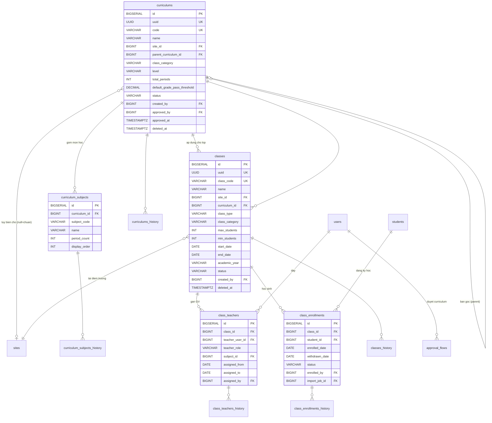
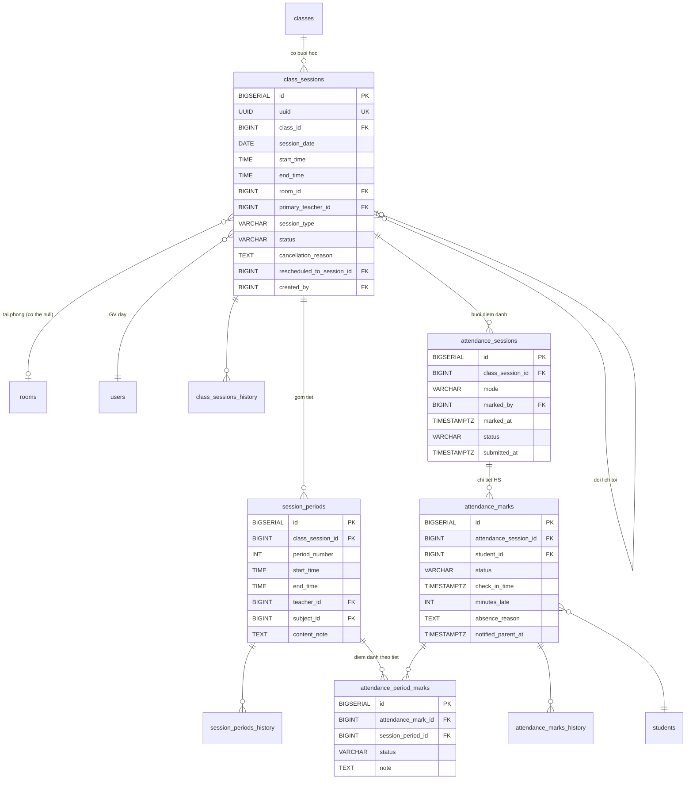
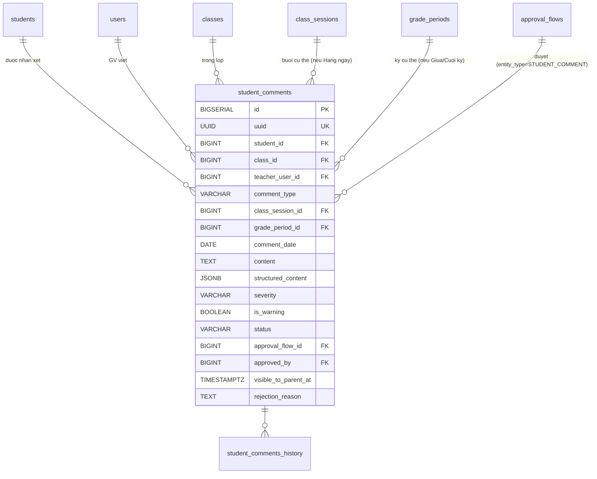

## Học thuật

### Mô tả tổng quan

Nhóm lớn nhất và trung tâm của hệ thống, bao phủ 5 phân hệ và toàn bộ
phân hệ 6. Phần này sẽ chia thành 4 phần con: Khung chương trình học &
Lớp học, Lịch dạy & Điểm danh, Sổ điểm, Nhận xét định kỳ.

### Khung chương trình & Lớp học

<!-- Nguồn: docs/diagrams/erd/ERD-Nhom5A-KhungChuongTrinh.mmd (chỉnh sửa trực tiếp file này, không sửa trong srs.md/sdd-groups) -->

a)  Bảng curriculums --- Khung chương trình

1 bảng duy nhất cho cả khung chuẩn và bản tùy biến theo trường, phân
biệt qua site_id (NULL = chuẩn).

  -------------------------------------------------------------------------------------
  **Cột**                        **Kiểu**       **Ràng buộc**      **Ghi chú**
  ------------------------------ -------------- ------------------ --------------------
  id                             BIGSERIAL      PK                  

  uuid                           UUID           UNIQUE, NOT NULL   

  code                           VARCHAR(50)    UNIQUE, NOT NULL   VD EN-G8-STD-2026

  name                           VARCHAR(300)   NOT NULL           

  site_id                        BIGINT         FK → sites(id),    NULL = khung chuẩn;
                                                NULL               NOT NULL = tùy biến
                                                                   cho site

  parent_curriculum_id           BIGINT         FK →               Nếu tùy biến, trỏ về
                                                curriculums(id),   bản chuẩn gốc
                                                NULL               

  class_category                 VARCHAR(30)    NOT NULL           MAIN / SUPPLEMENTARY
                                                                   / EXAM_PREP / OTHER

  level                          VARCHAR(50)    NULL               \"Lớp 6\",
                                                                   \"PET\"\...

  total_periods                  INT            NULL                

  default_grade_pass_threshold   DECIMAL(4,2)   NULL, DEFAULT 5.0  

  status                         VARCHAR(20)    NOT NULL, DEFAULT  DRAFT /
                                                \'DRAFT\'          PENDING_APPROVAL /
                                                                   ACTIVE / ARCHIVED

  created_by                     BIGINT         FK → users(id)     

  approved_by                    BIGINT         FK → users(id),    Trưởng phòng đào tạo
                                                NULL               --- người duyệt cuối
                                                                   cùng

  approved_at                    TIMESTAMPTZ    NULL               

  created_at, updated_at,        TIMESTAMPTZ                       Soft-delete
  deleted_at                                                       
  -------------------------------------------------------------------------------------

Có curriculums_history.

Ràng buộc

ALTER TABLE curriculums ADD CONSTRAINT chk_custom_has_parent

CHECK ( (site_id IS NULL AND parent_curriculum_id IS NULL) OR

(site_id IS NOT NULL AND parent_curriculum_id IS NOT NULL) );

b)  Bảng curriculum_subjects --- Môn học trong khung

  ------------------------------------------------------------------------
  **Cột**         **Kiểu**          **Ràng buộc**            **Ghi chú**
  --------------- ----------------- ------------------------ -------------
  id              BIGSERIAL         PK                        

  curriculum_id   BIGINT            FK → curriculums(id),    
                                    NOT NULL                 

  subject_code    VARCHAR(50)       NOT NULL                 SPEAKING /
                                                             LISTENING /
                                                             READING /
                                                             WRITING /
                                                             GRAMMAR /
                                                             OTHER

  name            VARCHAR(200)      NOT NULL                 

  period_count    INT               NULL                      

  display_order   INT               NOT NULL, DEFAULT 0      

                                    UNIQUE(curriculum_id,     
                                    subject_code)            
  ------------------------------------------------------------------------

Có curriculum_subjects_history.

c)  Bảng classes --- Lớp học thực tế

  ---------------------------------------------------------------------------
  **Cột**          **Kiểu**          **Ràng buộc**      **Ghi chú**
  ---------------- ----------------- ------------------ ---------------------
  id               BIGSERIAL         PK                  

  uuid             UUID              UNIQUE, NOT NULL   

  class_code       VARCHAR(50)       UNIQUE, NOT NULL   VD 8A2-NGDU-26-27

  name             VARCHAR(300)      NOT NULL           

  site_id          BIGINT            FK → sites(id),     
                                     NOT NULL           

  curriculum_id    BIGINT            FK →               
                                     curriculums(id),   
                                     NOT NULL           

  class_type       VARCHAR(20)       NOT NULL           LINKED / OPEN

  class_category   VARCHAR(30)       NULL               Copy từ curriculum
                                                        tại thời điểm tạo

  max_students     INT               NOT NULL, CHECK \>  
                                     0                  

  min_students     INT               NULL               

  start_date,      DATE              start_date NOT      
  end_date                           NULL               

  academic_year    VARCHAR(20)       NULL               

  semester         VARCHAR(20)       NULL               S1 / S2 / SUMMER

  status           VARCHAR(20)       NOT NULL, DEFAULT  PLANNED /
                                     \'PLANNED\'        OPEN_ENROLLMENT /
                                                        IN_PROGRESS /
                                                        COMPLETED / CANCELLED

  created_by       BIGINT            FK → users(id)     TPĐT quyết định, Nhân
                                                        viên giáo vụ nhập

  created_at,      TIMESTAMPTZ                          Soft-delete
  updated_at,                                           
  deleted_at                                            
  ---------------------------------------------------------------------------

Có classes_history.

*Logic nghiệp vụ:* Trưởng phòng đào tạo quyết định sắp xếp lớp/điều phối
giáo viên; Nhân viên giáo vụ thực hiện nhập liệu hành chính trên bảng
này theo quyết định đó.

d)  Bảng class_teachers --- Gán GV cho lớp

  ---------------------------------------------------------------------------
  **Cột**           **Kiểu**         **Ràng buộc**              **Ghi chú**
  ----------------- ---------------- -------------------------- -------------
  id                BIGSERIAL        PK                          

  class_id          BIGINT           FK → classes(id), NOT NULL 

  teacher_user_id   BIGINT           FK → users(id), NOT NULL    

  teacher_role      VARCHAR(20)      NOT NULL, DEFAULT          PRIMARY /
                                     \'PRIMARY\'                ASSISTANT /
                                                                SUBSTITUTE

  subject_id        BIGINT           FK →                        
                                     curriculum_subjects(id),   
                                     NULL                       

  assigned_from,    DATE             assigned_to NULL = đang    
  assigned_to                        phụ trách                  

  assigned_by       BIGINT           FK → users(id)              
  ---------------------------------------------------------------------------

Có class_teachers_history.

Ràng buộc:

CREATE UNIQUE INDEX idx_class_teacher_primary_active

ON class_teachers(class_id, COALESCE(subject_id, 0))

WHERE teacher_role = \'PRIMARY\' AND assigned_to IS NULL;

e)  Bảng class_enrollments --- Học sinh trong lớp

  --------------------------------------------------------------------------
  **Cột**            **Kiểu**          **Ràng buộc**      **Ghi chú**
  ------------------ ----------------- ------------------ ------------------
  id                 BIGSERIAL         PK                  

  class_id           BIGINT            FK → classes(id),  
                                       NOT NULL           

  student_id         BIGINT            FK → students(id),  
                                       NOT NULL           

  enrolled_date,     DATE              NULL cho           
  withdrawn_date                       withdrawn_date     

  status             VARCHAR(20)       NOT NULL, DEFAULT  ACTIVE / WITHDRAWN
                                       \'ACTIVE\'         / TRANSFERRED /
                                                          COMPLETED

  withdraw_reason    TEXT              NULL               

  enrolled_by        BIGINT            FK → users(id)      

  import_job_id      BIGINT            FK →               Nếu từ import
                                       import_jobs(id),   Excel lớp liên kết
                                       NULL               
  --------------------------------------------------------------------------

Có class_enrollments_history.

Ràng buộc:

CREATE UNIQUE INDEX idx_enrollment_active

ON class_enrollments(class_id, student_id)

WHERE status = \'ACTIVE\';

f)  Bảng approval_flows

(Đã thiết kế ở Nhóm 1 --- dùng chung cho luồng duyệt curriculum tùy biến
với entity_type=\'CURRICULUM\', không tạo bảng riêng.)

### Lịch dạy & Điểm danh

<!-- Nguồn: docs/diagrams/erd/ERD-Nhom5B-LichDayDiemDanh.mmd (chỉnh sửa trực tiếp file này, không sửa trong srs.md/sdd-groups) -->

a)  Bảng class_sessions --- Buổi học

1 record = 1 buổi học vật lý tại 1 thời điểm cụ thể.

  --------------------------------------------------------------------------------
  **Cột**                     **Kiểu**         **Ràng buộc**         **Ghi chú**
  --------------------------- ---------------- --------------------- -------------
  id                          BIGSERIAL        PK                     

  uuid                        UUID             UNIQUE, NOT NULL      

  class_id                    BIGINT           FK → classes(id), NOT  
                                               NULL                  

  session_date                DATE             NOT NULL              

  start_time, end_time        TIME             NOT NULL               

  room_id                     BIGINT           FK → rooms(id), NULL  NULL khi lớp
                                                                     do trường tự
                                                                     quản lý phòng

  primary_teacher_id          BIGINT           FK → users(id), NOT   Có thể khác
                                               NULL                  GV chính của
                                                                     lớp (VD dạy
                                                                     thay)

  session_type                VARCHAR(20)      NOT NULL, DEFAULT     REGULAR /
                                               \'REGULAR\'           MAKEUP / EXAM
                                                                     / SPECIAL

  status                      VARCHAR(20)      NOT NULL, DEFAULT     SCHEDULED /
                                               \'SCHEDULED\'         IN_PROGRESS /
                                                                     COMPLETED /
                                                                     CANCELLED /
                                                                     RESCHEDULED

  cancellation_reason         TEXT             NULL                  

  rescheduled_to_session_id   BIGINT           FK →                  Tự tham chiếu
                                               class_sessions(id),   khi dời lịch
                                               NULL                  

  created_by                  BIGINT           FK → users(id)        Nhân viên
                                                                     giáo vụ tạo

  created_at, updated_at      TIMESTAMPTZ                             
  --------------------------------------------------------------------------------

Có class_sessions_history.

Ràng buộc:

ALTER TABLE class_sessions ADD CONSTRAINT chk_session_time CHECK
(end_time \> start_time);

CREATE INDEX idx_class_sessions_date ON class_sessions(session_date);

CREATE INDEX idx_class_sessions_teacher_date ON
class_sessions(primary_teacher_id, session_date DESC);

Logic kiểm tra trùng phòng (FR-FAC-03) --- xử lý ở service layer, không
phải SQL constraint đơn thuần:

SELECT \* FROM class_sessions cs

JOIN rooms r ON r.id = cs.room_id

WHERE cs.room_id = :room_id

AND cs.session_date = :date

AND cs.status NOT IN (\'CANCELLED\', \'RESCHEDULED\')

AND r.is_flexible = FALSE

AND (:start_time \< cs.end_time AND :end_time \> cs.start_time)

AND cs.id != :editing_session_id;

Chỉ kiểm tra với phòng có is_flexible=FALSE; phòng linh hoạt (trường
liên kết cấp) được loại trừ khỏi ràng buộc cứng.

b)  Bảng session_periods --- Tiết học trong buổi

Tự động sinh (mặc định 2 tiết/buổi theo system_settings) khi tạo
class_sessions, GV có thể sửa chi tiết sau.

  -----------------------------------------------------------------------------
  **Cột**            **Kiểu**      **Ràng buộc**              **Ghi chú**
  ------------------ ------------- -------------------------- -----------------
  id                 BIGSERIAL     PK                          

  class_session_id   BIGINT        FK → class_sessions(id),   
                                   NOT NULL                   

  period_number      INT           NOT NULL                    

  start_time,        TIME          NOT NULL                   
  end_time                                                    

  teacher_id         BIGINT        FK → users(id), NULL       NULL = dùng
                                                              primary_teacher
                                                              của session

  subject_id         BIGINT        FK →                       
                                   curriculum_subjects(id),   
                                   NULL                       

  content_note       TEXT          NULL                        

                                   UNIQUE(class_session_id,   
                                   period_number)             
  -----------------------------------------------------------------------------

Có session_periods_history.

c)  Bảng attendance_sessions --- Buổi điểm danh

Header cho việc điểm danh 1 buổi cụ thể.

  ----------------------------------------------------------------------------
  **Cột**            **Kiểu**         **Ràng buộc**         **Ghi chú**
  ------------------ ---------------- --------------------- ------------------
  id                 BIGSERIAL        PK                     

  class_session_id   BIGINT           FK →                  
                                      class_sessions(id),   
                                      NOT NULL, UNIQUE      

  mode               VARCHAR(20)      NOT NULL, DEFAULT     SESSION_LEVEL /
                                      \'SESSION_LEVEL\'     PERIOD_LEVEL

  marked_by          BIGINT           FK → users(id), NOT   
                                      NULL                  

  marked_at          TIMESTAMPTZ      NOT NULL, DEFAULT      
                                      NOW()                 

  status             VARCHAR(20)      NOT NULL, DEFAULT     DRAFT / SUBMITTED
                                      \'DRAFT\'             / LOCKED

  submitted_at       TIMESTAMPTZ      NULL                   
  ----------------------------------------------------------------------------

Không cần history riêng --- chi tiết thay đổi đã có ở
attendance_marks_history.

d)  Bảng attendance_marks --- Điểm danh cấp buổi (mỗi HS)

Nguồn dữ liệu chính để tính chuyên cần.

  -------------------------------------------------------------------------------------
  **Cột**                 **Kiểu**       **Ràng buộc**                   **Ghi chú**
  ----------------------- -------------- ------------------------------- --------------
  id                      BIGSERIAL      PK                               

  attendance_session_id   BIGINT         FK → attendance_sessions(id),   
                                         NOT NULL                        

  student_id              BIGINT         FK → students(id), NOT NULL      

  status                  VARCHAR(20)    NOT NULL                        PRESENT /
                                                                         ABSENT /
                                                                         EXCUSED / LATE
                                                                         / EARLY_LEAVE

  check_in_time           TIMESTAMPTZ    NULL                             

  minutes_late,           INT            NULL                            
  minutes_early_leave                                                    

  absence_reason          TEXT           NULL                             

  notified_parent_at      TIMESTAMPTZ    NULL                            Thời điểm đã
                                                                         gửi thông báo
                                                                         cho PH

                                         UNIQUE(attendance_session_id,    
                                         student_id)                     
  -------------------------------------------------------------------------------------

Có attendance_marks_history.

Chỉ số:

CREATE INDEX idx_attendance_marks_student ON
attendance_marks(student_id);

*Logic gửi thông báo:* Khi attendance_sessions.status chuyển SUBMITTED
và có mark ABSENT/LATE → gửi thông báo cho **tất cả phụ huynh** liên kết
với HS đó.

e)  Bảng attendance_period_marks --- Điểm danh chi tiết theo tiết

Chỉ tạo khi GV cần sửa chi tiết theo tiết (VD: có mặt tiết 1, vắng tiết
2). Khi điểm danh 1 lần đầu buổi (SESSION_LEVEL), hệ thống tự tạo record
ở đây cho từng tiết với cùng status.

  ---------------------------------------------------------------------------
  **Cột**              **Kiểu**        **Ràng buộc**                **Ghi
                                                                    chú**
  -------------------- --------------- ---------------------------- ---------
  id                   BIGSERIAL       PK                            

  attendance_mark_id   BIGINT          FK → attendance_marks(id),   
                                       NOT NULL                     

  session_period_id    BIGINT          FK → session_periods(id),     
                                       NOT NULL                     

  status               VARCHAR(20)     NOT NULL                     PRESENT /
                                                                    ABSENT /
                                                                    EXCUSED /
                                                                    LATE

  note                 TEXT            NULL                          

                                       UNIQUE(attendance_mark_id,   
                                       session_period_id)           
  ---------------------------------------------------------------------------

Không history riêng --- thay đổi ghi vào attendance_marks_history.

### Sổ điểm & Điểm tổng kết

Đây là phần thiết kế linh hoạt nhất hệ thống --- mỗi curriculum tự định
nghĩa cấu trúc điểm riêng (kỳ đánh giá + bộ điểm), cho phép lớp bổ trợ
có 2 kỹ năng, lớp chính có 5 kỹ năng, mà không cần đổi schema.

a)  Bảng grade_periods --- Kỳ đánh giá

Mỗi curriculum định nghĩa các kỳ đánh giá riêng (Giữa kỳ 1, Cuối kỳ
1\...).

  --------------------------------------------------------------------------
  **Cột**           **Kiểu**          **Ràng buộc**            **Ghi chú**
  ----------------- ----------------- ------------------------ -------------
  id                BIGSERIAL         PK                        

  curriculum_id     BIGINT            FK → curriculums(id),    
                                      NOT NULL                 

  code              VARCHAR(50)       NOT NULL                 MID_1 / END_1
                                                               / MID_2 /
                                                               END_2 / OTHER

  name              VARCHAR(200)      NOT NULL                 \"Giữa kỳ
                                                               1\", \"Cuối
                                                               kỳ 1\"

  display_order     INT               NOT NULL, DEFAULT 0       

  weight_in_final   DECIMAL(5,2)      NOT NULL                 Trọng số kỳ
                                                               trong điểm
                                                               tổng kết (VD
                                                               20.00 = 20%)

  start_date,       DATE              NULL                      
  end_date                                                     

  status            VARCHAR(20)       NOT NULL, DEFAULT        ACTIVE /
                                      \'ACTIVE\'               ARCHIVED

                                      UNIQUE(curriculum_id,     
                                      code)                    
  --------------------------------------------------------------------------

Có grade_periods_history.

*Ràng buộc nghiệp vụ (validate ở service, không phải SQL):* Tổng
weight_in_final của các kỳ thuộc cùng 1 curriculum phải = 100.

b)  Bảng grade_components --- Thành phần điểm trong kỳ

Với lớp bổ trợ 2 kỹ năng, lớp chính 5 kỹ năng → chỉ khác số lượng record
ở đây, cùng schema.

  --------------------------------------------------------------------------
  **Cột**            **Kiểu**         **Ràng buộc**              **Ghi chú**
  ------------------ ---------------- -------------------------- -----------
  id                 BIGSERIAL        PK                          

  grade_period_id    BIGINT           FK → grade_periods(id),    
                                      NOT NULL                   

  subject_id         BIGINT           FK →                        
                                      curriculum_subjects(id),   
                                      NULL                       

  code               VARCHAR(50)      NOT NULL                   SPEAKING /
                                                                 WRITING /
                                                                 LISTENING /
                                                                 READING /
                                                                 GRAMMAR /
                                                                 PROJECT /
                                                                 OTHER

  name               VARCHAR(200)     NOT NULL                    

  weight_in_period   DECIMAL(5,2)     NOT NULL                   Trọng số
                                                                 trong kỳ

  max_score          DECIMAL(5,2)     NOT NULL, DEFAULT 10.00     

  pass_threshold     DECIMAL(5,2)     NULL                       

  display_order      INT              NOT NULL, DEFAULT 0         

                                      UNIQUE(grade_period_id,    
                                      code)                      
  --------------------------------------------------------------------------

Có grade_components_history.

*Logic bảo vệ khi sửa cấu trúc:* Nếu đã tồn tại grade_entries cho
component này → cấm sửa weight_in_period/max_score, chỉ cho sửa
name/description/display_order. Muốn đổi trọng số thì phải archive
grade_period cũ, tạo grade_period mới.

c)  Bảng grade_entries --- Điểm cụ thể của học sinh

Mỗi ô nhập điểm = 1 record. Có workflow duyệt qua approval_flows.

  ---------------------------------------------------------------------------
  **Cột**              **Kiểu**         **Ràng buộc**           **Ghi chú**
  -------------------- ---------------- ----------------------- -------------
  id                   BIGSERIAL        PK                       

  uuid                 UUID             UNIQUE, NOT NULL        

  class_id             BIGINT           FK → classes(id), NOT    
                                        NULL                    

  student_id           BIGINT           FK → students(id), NOT  
                                        NULL                    

  grade_component_id   BIGINT           FK →                     
                                        grade_components(id),   
                                        NOT NULL                

  score                DECIMAL(5,2)     NOT NULL                0 ≤ score ≤
                                                                max_score
                                                                (validate
                                                                service)

  absence_flag         BOOLEAN          NOT NULL, DEFAULT FALSE HS vắng buổi
                                                                kiểm tra

  teacher_note         TEXT             NULL                    

  entered_by           BIGINT           FK → users(id), NOT      
                                        NULL                    

  entered_at           TIMESTAMPTZ      NOT NULL, DEFAULT NOW() 

  status               VARCHAR(20)      NOT NULL, DEFAULT       DRAFT /
                                        \'DRAFT\'               PENDING /
                                                                APPROVED /
                                                                REJECTED

  approval_flow_id     BIGINT           FK →                    
                                        approval_flows(id),     
                                        NULL                    

  submitted_at,        TIMESTAMPTZ      NULL                     
  approved_at                                                   

  approved_by          BIGINT           FK → users(id), NULL    Quản lý điểm
                                                                trường

                                        UNIQUE(class_id,         
                                        student_id,             
                                        grade_component_id)     
  ---------------------------------------------------------------------------

Có grade_entries_history --- bắt buộc.

CREATE INDEX idx_grade_entries_class_student ON grade_entries(class_id,
student_id);

CREATE INDEX idx_grade_entries_pending ON grade_entries(status) WHERE
status = \'PENDING\';

Workflow:

GV nhập điểm → DRAFT

GV submit → PENDING (tạo record ở approval_flows, có thể theo batch_id
nếu submit theo lô)

Quản lý điểm trường duyệt → APPROVED (hiển thị cho PH) hoặc REJECTED (GV
sửa lại, submit lại)

d)  Bảng grade_final_summaries --- Điểm tổng kết học phần

Snapshot chốt cuối cùng --- bảo toàn dữ liệu lịch sử ngay cả khi cấu
trúc điểm thay đổi sau này.

  ---------------------------------------------------------------------------
  **Cột**                **Kiểu**          **Ràng buộc**      **Ghi chú**
  ---------------------- ----------------- ------------------ ---------------
  id                     BIGSERIAL         PK                  

  uuid                   UUID              UNIQUE, NOT NULL   

  class_id               BIGINT            FK → classes(id),   
                                           NOT NULL           

  student_id             BIGINT            FK → students(id), 
                                           NOT NULL           

  final_score            DECIMAL(5,2)      NOT NULL            

  result                 VARCHAR(30)       NOT NULL           EXCELLENT /
                                                              GOOD / PASS /
                                                              FAIL /
                                                              INCOMPLETE

  calculation_snapshot   JSONB             NOT NULL           Snapshot toàn
                                                              bộ công thức +
                                                              điểm thành phần
                                                              tại thời điểm
                                                              chốt

  finalized_by           BIGINT            FK → users(id),    
                                           NOT NULL           

  finalized_at           TIMESTAMPTZ       NOT NULL            

  status                 VARCHAR(20)       NOT NULL, DEFAULT  FINALIZED /
                                           \'FINALIZED\'      REVISED

  revision_reason        TEXT              NULL                

                                           UNIQUE(class_id,   
                                           student_id)        
  ---------------------------------------------------------------------------

Có grade_final_summaries_history.

Format calculation_snapshot (JSONB) --- ví dụ:

{

\"curriculum_name\": \"TA Lớp 8 - THCS Nguyễn Du\",

\"final_formula\": \"SUM(period_avg \* period_weight) / 100\",

\"periods\": \[

{

\"period_name\": \"Giữa kỳ 1\", \"period_weight\": 20, \"period_avg\":
7.5,

\"components\": \[

{\"code\": \"SPEAKING\", \"score\": 8.0, \"weight\": 50, \"weighted\":
4.0},

{\"code\": \"WRITING\", \"score\": 7.0, \"weight\": 50, \"weighted\":
3.5}

\]

}

\],

\"final_score\": 7.65

}

### Nhận xét định kỳ

<!-- Nguồn: docs/diagrams/erd/ERD-Nhom5D-NhanXet.mmd (chỉnh sửa trực tiếp file này, không sửa trong srs.md/sdd-groups) -->

Xử lý FR-ACA-04 (Sổ nhận xét 3 biểu mẫu: Hàng ngày/Giữa kỳ/Cuối kỳ) và
FR-LMS-09 (cơ chế duyệt trước khi hiển thị PH). Chỉ 1 bảng duy nhất cho
cả 3 biểu mẫu, phân biệt qua comment_type.

a)  Bảng student_comments --- Nhận xét học sinh

  -------------------------------------------------------------------------------------------
  **Cột**                **Kiểu**      **Ràng buộc**         **Ghi chú**
  ---------------------- ------------- --------------------- --------------------------------
  id                     BIGSERIAL     PK                     

  uuid                   UUID          UNIQUE, NOT NULL      

  student_id             BIGINT        FK → students(id),     
                                       NOT NULL              

  class_id               BIGINT        FK → classes(id), NOT 
                                       NULL                  

  teacher_user_id        BIGINT        FK → users(id), NOT    
                                       NULL                  

  comment_type           VARCHAR(20)   NOT NULL              DAILY / MID_TERM / END_TERM

  class_session_id       BIGINT        FK →                  Chỉ set khi comment_type=DAILY
                                       class_sessions(id),   
                                       NULL                  

  grade_period_id        BIGINT        FK →                  Chỉ set khi
                                       grade_periods(id),    comment_type=MID_TERM/END_TERM
                                       NULL                  

  comment_date           DATE          NOT NULL               

  content                TEXT          NOT NULL              Nội dung tự do

  structured_content     JSONB         NULL                  Cấu trúc cho biểu mẫu Giữa/Cuối
                                                             kỳ (attitude, participation,
                                                             skills\...)

  severity               VARCHAR(20)   NOT NULL, DEFAULT     POSITIVE / NORMAL / CONCERN /
                                       \'NORMAL\'            WARNING

  is_warning             BOOLEAN       NOT NULL, DEFAULT     Cờ \"PH cần chú ý ngay\" --- GV
                                       FALSE                 chủ động đánh dấu

  status                 VARCHAR(20)   NOT NULL, DEFAULT     DRAFT / PENDING / APPROVED /
                                       \'DRAFT\'             REJECTED

  approval_flow_id       BIGINT        FK →                   
                                       approval_flows(id),   
                                       NULL                  

  submitted_at,          TIMESTAMPTZ   NULL                  
  approved_at                                                

  approved_by            BIGINT        FK → users(id), NULL  Quản lý điểm trường

  visible_to_parent_at   TIMESTAMPTZ   NULL                   

  rejection_reason       TEXT          NULL                   
  -------------------------------------------------------------------------------------------

Có student_comments_history.

Ràng buộc:

ALTER TABLE student_comments ADD CONSTRAINT chk_comment_context CHECK (

(comment_type = \'DAILY\' AND class_session_id IS NOT NULL AND
grade_period_id IS NULL) OR

(comment_type IN (\'MID_TERM\', \'END_TERM\') AND grade_period_id IS NOT
NULL AND class_session_id IS NULL)

);

Chỉ số:

CREATE INDEX idx_comments_student_type ON student_comments(student_id,
comment_type, comment_date DESC);

CREATE INDEX idx_comments_warnings ON student_comments(student_id,
comment_date DESC)

WHERE is_warning = TRUE AND status = \'APPROVED\';

Format structured_content (JSONB) --- biểu mẫu Giữa/Cuối kỳ:

{

\"attitude\": {\"rating\": \"GOOD\", \"note\": \"Chủ động tham gia hoạt
động lớp\"},

\"participation\": {\"rating\": \"AVERAGE\", \"note\": \"Đôi lúc mất tập
trung\"},

\"skills\": {\"speaking\": \"Phát âm tốt, cần cải thiện fluency\"},

\"recommendations\": \"Cần luyện thêm nghe hàng ngày\"

}

Workflow duyệt:

Duyệt từng nhận xét:

GV tạo → DRAFT → submit → PENDING (approval_flows, batch_id=NULL)

→ Quản lý điểm trường duyệt riêng lẻ → APPROVED/REJECTED

Duyệt theo lô:

GV nhập hàng loạt (VD điểm danh + comment cả lớp 30 HS)

→ submit lô → sinh 1 batch_id, tạo 30 record approval_flows cùng
batch_id

→ Quản lý điểm trường duyệt cả lô cùng lúc (transactional)

Logic cảnh báo hiển thị Portal PH:

SELECT \* FROM student_comments

WHERE student_id = :student_id

AND is_warning = TRUE

AND status = \'APPROVED\'

ORDER BY comment_date DESC;
