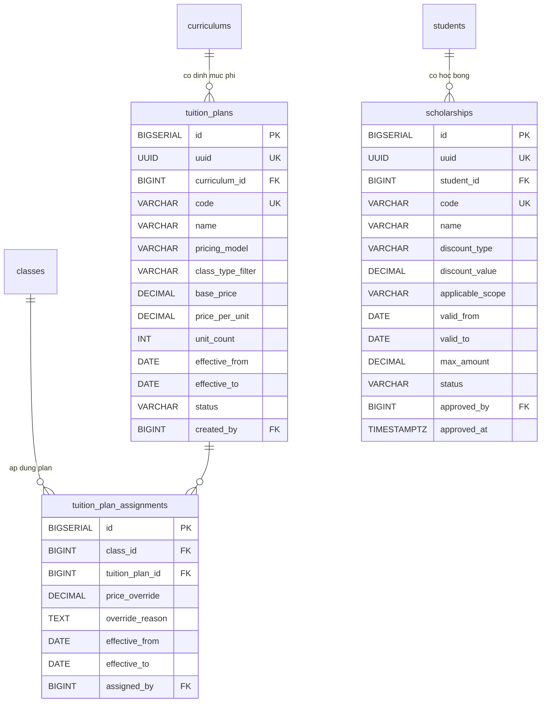
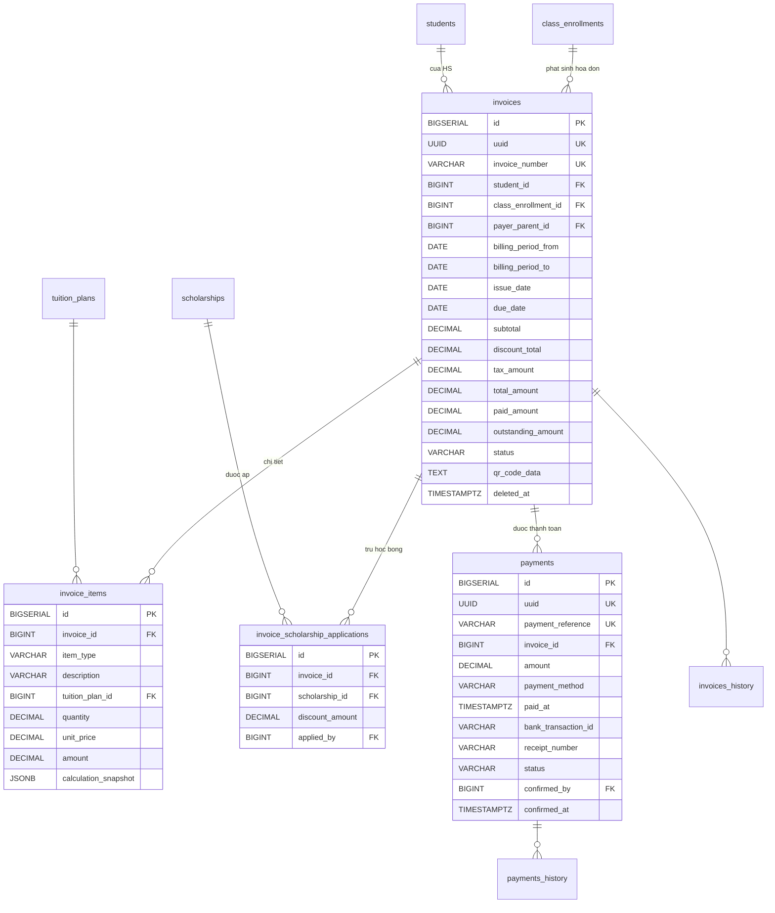
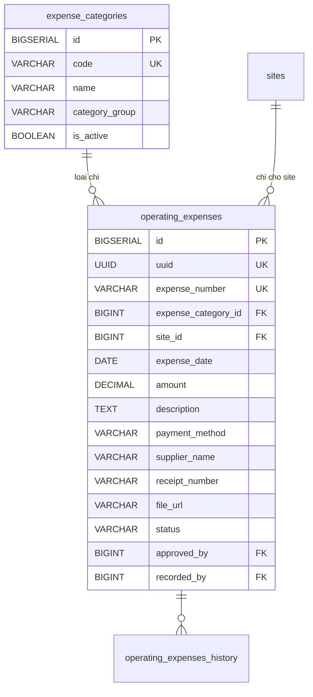

## Tài chính & Học phí

### Mô tả tổng quan

Gồm 4 nhóm con: Định mức học phí, Học bổng/Miễn giảm, Hóa đơn & Thanh
toán, Chi vận hành. Hỗ trợ 3 mô hình tính phí song song (Khóa, buổi,
tháng), công thức khác nhau giữa liên kết và lớp mở, cùng đầy đủ phương
thức thanh toán (QR, tiền mặt, chuyển khoản, ghi nợ).

### Định mức học phí

<!-- Nguồn: docs/diagrams/erd/ERD-Nhom6AB-DinhMucHocBong.mmd (chỉnh sửa trực tiếp file này, không sửa trong srs.md/sdd-groups) -->

a)  Bảng tuition_plans --- Định mức phí

  --------------------------------------------------------------------------
  **Cột**             **Kiểu**            **Ràng buộc**      **Ghi chú**
  ------------------- ------------------- ------------------ ---------------
  id                  BIGSERIAL           PK                  

  uuid                UUID                UNIQUE, NOT NULL   

  curriculum_id       BIGINT              FK →                
                                          curriculums(id),   
                                          NOT NULL           

  code                VARCHAR(50)         UNIQUE, NOT NULL   

  name                VARCHAR(300)        NOT NULL            

  pricing_model       VARCHAR(20)         NOT NULL           COURSE /
                                                             PER_SESSION /
                                                             MONTHLY

  class_type_filter   VARCHAR(20)         NULL               LINKED / OPEN /
                                                             NULL (cả 2)

  base_price          DECIMAL(15,2)       NOT NULL           

  price_per_unit      DECIMAL(15,2)       NULL               Đơn giá/buổi
                                                             hoặc /tháng

  unit_count          INT                 NULL               

  currency            VARCHAR(3)          NOT NULL, DEFAULT   
                                          \'VND\'            

  effective_from,     DATE                effective_to NULL  
  effective_to                            = mãi mãi          

  status              VARCHAR(20)         NOT NULL, DEFAULT  ACTIVE /
                                          \'ACTIVE\'         INACTIVE

  created_by          BIGINT              FK → users(id)     
  --------------------------------------------------------------------------

Không history, thay đổi plan tạo record mới thay vì sửa.

b)  Bảng tuition_plan_assignments --- Gán plan cho lớp cụ thể

Cho phép override giá cho lớp cụ thể.

  ------------------------------------------------------------------------
  **Cột**             **Kiểu**             **Ràng buộc**        **Ghi
                                                                chú**
  ------------------- -------------------- -------------------- ----------
  id                  BIGSERIAL            PK                    

  class_id            BIGINT               FK → classes(id),    
                                           NOT NULL             

  tuition_plan_id     BIGINT               FK →                  
                                           tuition_plans(id),   
                                           NOT NULL             

  price_override      DECIMAL(15,2)        NULL                 

  override_reason     TEXT                 NULL                 VD \"Ưu
                                                                đãi hợp
                                                                đồng liên
                                                                kết Nguyễn
                                                                Du\"

  effective_from,     DATE                                      
  effective_to                                                  

  assigned_by         BIGINT               FK → users(id)        
  ------------------------------------------------------------------------

Ràng buộc: mỗi lớp tại 1 thời điểm chỉ có 1 plan active.

### Học bổng/Miễn giảm

a)  Bảng scholarships --- Học bổng / Miễn giảm

  -------------------------------------------------------------------------
  **Cột**            **Kiểu**           **Ràng buộc**     **Ghi chú**
  ------------------ ------------------ ----------------- -----------------
  id                 BIGSERIAL          PK                 

  uuid               UUID               UNIQUE, NOT NULL  

  student_id         BIGINT             FK →               
                                        students(id), NOT 
                                        NULL              

  code               VARCHAR(50)        UNIQUE, NOT NULL  

  name               VARCHAR(300)       NOT NULL           

  discount_type      VARCHAR(20)        NOT NULL          PERCENTAGE /
                                                          FIXED_AMOUNT

  discount_value     DECIMAL(15,2)      NOT NULL           

  applicable_scope   VARCHAR(20)        NOT NULL, DEFAULT PER_INVOICE /
                                        \'PER_INVOICE\'   ONE_TIME

  valid_from,        DATE                                  
  valid_to                                                

  max_amount         DECIMAL(15,2)      NULL              Trần giảm/hóa đơn

  status             VARCHAR(20)        NOT NULL, DEFAULT ACTIVE / EXPIRED
                                        \'ACTIVE\'        / REVOKED

  approved_by        BIGINT             FK → users(id),   
                                        NOT NULL          

  approved_at        TIMESTAMPTZ        NOT NULL           
  -------------------------------------------------------------------------

Không history --- thay đổi thì REVOKE record cũ, tạo record mới.

### Hóa đơn & Thanh toán

<!-- Nguồn: docs/diagrams/erd/ERD-Nhom6C-HoaDonThanhToan.mmd (chỉnh sửa trực tiếp file này, không sửa trong srs.md/sdd-groups) -->

a)  Bảng invoices --- Hóa đơn học phí

  ---------------------------------------------------------------------------------------------------------
  **Cột**                **Kiểu**        **Ràng buộc**            **Ghi chú**
  ---------------------- --------------- ------------------------ -----------------------------------------
  id                     BIGSERIAL       PK                        

  uuid                   UUID            UNIQUE, NOT NULL         

  invoice_number         VARCHAR(50)     UNIQUE, NOT NULL         VD INV-2026-07-0001

  student_id             BIGINT          FK → students(id), NOT   
                                         NULL                     

  class_enrollment_id    BIGINT          FK →                      
                                         class_enrollments(id),   
                                         NULL                     

  payer_parent_id        BIGINT          FK → parents(id), NULL   Từ
                                                                  parent_student.is_financial_responsible

  billing_period_from,   DATE            NULL                      
  billing_period_to                                               

  issue_date, due_date   DATE            NOT NULL                 

  subtotal               DECIMAL(15,2)   NOT NULL                  

  discount_total         DECIMAL(15,2)   NOT NULL, DEFAULT 0      

  tax_amount             DECIMAL(15,2)   NOT NULL, DEFAULT 0       

  total_amount           DECIMAL(15,2)   NOT NULL                 

  paid_amount            DECIMAL(15,2)   NOT NULL, DEFAULT 0       

  outstanding_amount     DECIMAL(15,2)   GENERATED ALWAYS AS      
                                         (total_amount -          
                                         paid_amount) STORED      

  status                 VARCHAR(20)     NOT NULL, DEFAULT        DRAFT / ISSUED / PARTIAL_PAID / PAID /
                                         \'ISSUED\'               OVERDUE / CANCELLED

  qr_code_data           TEXT            NULL                     Dữ liệu QR ngân hàng (VietQR)

  created_by             BIGINT          FK → users(id), NULL     NULL nếu sinh tự động

  created_at,            TIMESTAMPTZ                              Soft-delete
  updated_at, deleted_at                                          
  ---------------------------------------------------------------------------------------------------------

Có invoices_history.

Chỉ số:

CREATE INDEX idx_invoices_status_due ON invoices(status, due_date)

WHERE status IN (\'ISSUED\', \'PARTIAL_PAID\', \'OVERDUE\');

*Cron job nightly:* invoices có due_date \< NOW() và status chưa PAID →
tự động chuyển OVERDUE.

b)  Bảng invoice_items --- Chi tiết dòng hóa đơn

  ----------------------------------------------------------------------------
  **Cột**                **Kiểu**           **Ràng buộc**        **Ghi chú**
  ---------------------- ------------------ -------------------- -------------
  id                     BIGSERIAL          PK                    

  invoice_id             BIGINT             FK → invoices(id),   
                                            NOT NULL             

  item_type              VARCHAR(30)        NOT NULL             TUITION /
                                                                 MATERIAL /
                                                                 EXAM_FEE /
                                                                 LATE_FEE /
                                                                 OTHER

  description            VARCHAR(500)       NOT NULL             

  tuition_plan_id        BIGINT             FK →                  
                                            tuition_plans(id),   
                                            NULL                 

  quantity               DECIMAL(10,2)      NOT NULL, DEFAULT 1  

  unit_price             DECIMAL(15,2)      NOT NULL              

  amount                 DECIMAL(15,2)      NOT NULL             

  calculation_snapshot   JSONB              NULL                  
  ----------------------------------------------------------------------------

c)  Bảng invoice_scholarship_applications --- Áp học bổng vào hóa đơn

  ------------------------------------------------------------------------
  **Cột**            **Kiểu**           **Ràng buộc**          **Ghi chú**
  ------------------ ------------------ ---------------------- -----------
  id                 BIGSERIAL          PK                      

  invoice_id         BIGINT             FK → invoices(id), NOT 
                                        NULL                   

  scholarship_id     BIGINT             FK → scholarships(id),  
                                        NOT NULL               

  discount_amount    DECIMAL(15,2)      NOT NULL               Đã
                                                               snapshot,
                                                               không tính
                                                               lại

  applied_by         BIGINT             FK → users(id), NOT     
                                        NULL                   

                                        UNIQUE(invoice_id,     
                                        scholarship_id)        
  ------------------------------------------------------------------------

d)  Bảng payments --- Thanh toán

1 hóa đơn có thể có nhiều payment.

  -------------------------------------------------------------------------
  **Cột**               **Kiểu**          **Ràng buộc**   **Ghi chú**
  --------------------- ----------------- --------------- -----------------
  id                    BIGSERIAL         PK               

  uuid                  UUID              UNIQUE, NOT     
                                          NULL            

  payment_reference     VARCHAR(100)      UNIQUE, NOT      
                                          NULL            

  invoice_id            BIGINT            FK →            
                                          invoices(id),   
                                          NOT NULL        

  amount                DECIMAL(15,2)     NOT NULL, CHECK  
                                          \> 0            

  payment_method        VARCHAR(20)       NOT NULL        QR_BANK / CASH /
                                                          BANK_TRANSFER /
                                                          OTHER

  paid_at               TIMESTAMPTZ       NOT NULL         

  bank_transaction_id   VARCHAR(200)      NULL            Đối soát QR

  receipt_number        VARCHAR(50)       NULL            Với CASH

  status                VARCHAR(20)       NOT NULL,       PENDING /
                                          DEFAULT         CONFIRMED /
                                          \'CONFIRMED\'   REFUNDED

  confirmed_by          BIGINT            FK → users(id), Kế toán xác nhận
                                          NULL            

  confirmed_at          TIMESTAMPTZ       NULL            
  -------------------------------------------------------------------------

Có payments_history.

Logic tự động khi INSERT payment CONFIRMED:

UPDATE invoices

SET paid_amount = paid_amount + :amount,

status = CASE WHEN paid_amount + :amount \>= total_amount THEN \'PAID\'
ELSE \'PARTIAL_PAID\' END

WHERE id = :invoice_id;

### Chi vận hành

<!-- Nguồn: docs/diagrams/erd/ERD-Nhom6D-ChiVanHanh.mmd (chỉnh sửa trực tiếp file này, không sửa trong srs.md/sdd-groups) -->

a)  Bảng expense_categories --- Danh mục loại chi

  ------------------------------------------------------------------------
  **Cột**             **Kiểu**              **Ràng buộc**  **Ghi chú**
  ------------------- --------------------- -------------- ---------------
  id                  BIGSERIAL             PK              

  code                VARCHAR(50)           UNIQUE, NOT    SALARY / RENT /
                                            NULL           UTILITY / TECH
                                                           / CDN /
                                                           MARKETING /
                                                           OTHER

  name                VARCHAR(200)          NOT NULL        

  category_group      VARCHAR(30)           NOT NULL       HR / FACILITY /
                                                           TECH /
                                                           MARKETING /
                                                           OPERATION /
                                                           OTHER

  is_active           BOOLEAN               NOT NULL,       
                                            DEFAULT TRUE   
  ------------------------------------------------------------------------

Không history

b)  Bảng operating_expenses --- Ghi nhận chi vận hành

  -------------------------------------------------------------------------------
  **Cột**               **Kiểu**        **Ràng buộc**             **Ghi chú**
  --------------------- --------------- ------------------------- ---------------
  id                    BIGSERIAL       PK                         

  uuid                  UUID            UNIQUE, NOT NULL          

  expense_number        VARCHAR(50)     UNIQUE, NOT NULL           

  expense_category_id   BIGINT          FK →                      
                                        expense_categories(id),   
                                        NOT NULL                  

  site_id               BIGINT          FK → sites(id), NULL      NULL = chi
                                                                  chung toàn hệ
                                                                  thống

  expense_date          DATE            NOT NULL                  

  amount                DECIMAL(15,2)   NOT NULL, CHECK \> 0       

  description           TEXT            NOT NULL                  

  payment_method        VARCHAR(20)     NOT NULL                  CASH /
                                                                  BANK_TRANSFER /
                                                                  CARD / OTHER

  supplier_name         VARCHAR(300)    NULL                      

  receipt_number        VARCHAR(100)    NULL                       

  file_url              VARCHAR(500)    NULL                      

  status                VARCHAR(20)     NOT NULL, DEFAULT         RECORDED /
                                        \'RECORDED\'              APPROVED /
                                                                  REJECTED

  approved_by           BIGINT          FK → users(id), NULL      

  recorded_by           BIGINT          FK → users(id), NOT NULL  Kế toán
  -------------------------------------------------------------------------------

Có operating_expenses_history.

### Báo cáo tài chính

Không cần thêm bảng, query trên các bảng đã có:

\-- Doanh thu theo điểm trường trong tháng

SELECT s.name, SUM(p.amount)

FROM payments p

JOIN invoices i ON i.id = p.invoice_id

JOIN class_enrollments ce ON ce.id = i.class_enrollment_id

JOIN classes c ON c.id = ce.class_id

JOIN sites s ON s.id = c.site_id

WHERE p.status = \'CONFIRMED\' AND p.paid_at BETWEEN :from AND :to

GROUP BY s.id, s.name;

*Phân quyền:* Ban giám đốc xem báo cáo tài chính tổng hợp toàn chuỗi;
Quản trị viên chỉ giữ quyền kỹ thuật/cấu hình hệ thống, không có quyền
xem báo cáo kinh doanh này.
