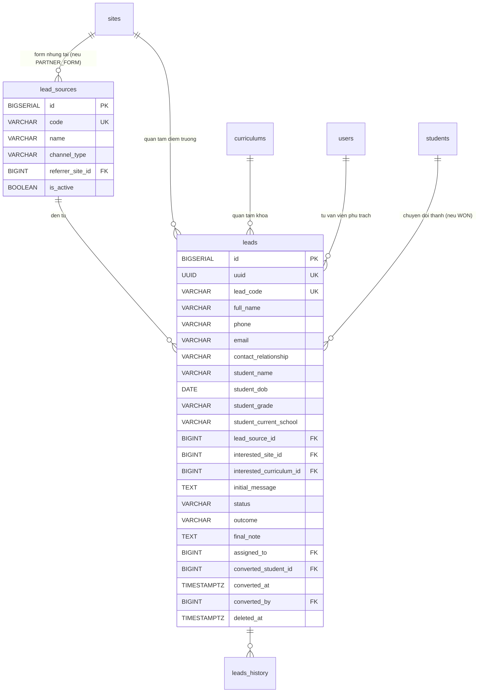

## Tuyển sinh & CRM

### Mô tả tổng quan

Xử lý luồng từ khách hàng tiềm năng đến khi trở thành học sinh chính
thức. Có 2 luồng tách biệt: luồng cá nhân (Website/Facebook/Hotline,...)
đi qua bảng leads và luồng lô (nhập danh sách) đi thẳng qua import_jobs
→ students/class_enrollments, không qua leads.

Không theo dõi lịch sử tư vấn chi tiết, chỉ ghi trạng thái + note cuối
cùng.

### Sơ đồ ERD

<!-- Nguồn: docs/diagrams/erd/ERD-Nhom7-TuyenSinhCRM.mmd (chỉnh sửa trực tiếp file này, không sửa trong srs.md/sdd-groups) -->

### Chi tiết từng bảng

a)  Bảng lead_sources --- Danh mục nguồn lead

  ------------------------------------------------------------------------------
  **Cột**            **Kiểu**         **Ràng       **Ghi chú**
                                      buộc**       
  ------------------ ---------------- ------------ -----------------------------
  id                 BIGSERIAL        PK            

  code               VARCHAR(50)      UNIQUE, NOT  VD WEBSITE, FANPAGE_MAIN,
                                      NULL         HOTLINE, ZALO_OA,
                                                   PARTNER_NGUYENDU

  name               VARCHAR(200)     NOT NULL      

  channel_type       VARCHAR(30)      NOT NULL     WEBSITE / SOCIAL / HOTLINE /
                                                   MESSAGING / PARTNER_FORM /
                                                   OFFLINE / OTHER

  referrer_site_id   BIGINT           FK →         Chỉ set nếu
                                      sites(id),   channel_type=PARTNER_FORM
                                      NULL         

  is_active          BOOLEAN          NOT NULL,    
                                      DEFAULT TRUE 
  ------------------------------------------------------------------------------

Không history

Ràng buộc:

ALTER TABLE lead_sources ADD CONSTRAINT chk_partner_source CHECK (

(channel_type = \'PARTNER_FORM\' AND referrer_site_id IS NOT NULL) OR

(channel_type != \'PARTNER_FORM\')

);

b)  Bảng leads --- Khách hàng tiềm năng

Bảng trung tâm --- gộp cả thông tin liên hệ, thông tin học sinh quan
tâm, trạng thái xử lý, và kết quả chuyển đổi trong 1 bảng duy nhất.

  -----------------------------------------------------------------------------------
  **Cột**                    **Kiểu**        **Ràng buộc**       **Ghi chú**
  -------------------------- --------------- ------------------- --------------------
  id                         BIGSERIAL       PK                   

  uuid                       UUID            UNIQUE, NOT NULL    

  lead_code                  VARCHAR(50)     UNIQUE, NOT NULL    VD LEAD-2026-07-0001

  full_name                  VARCHAR(200)    NOT NULL            Người điền form

  phone                      VARCHAR(20)     NOT NULL             

  email                      VARCHAR(255)    NULL                

  contact_relationship       VARCHAR(30)     NULL                SELF / FATHER /
                                                                 MOTHER / GUARDIAN /
                                                                 OTHER

  student_name               VARCHAR(200)    NULL                

  student_dob                DATE            NULL                 

  student_grade              VARCHAR(50)     NULL                

  student_current_school     VARCHAR(300)    NULL                 

  lead_source_id             BIGINT          FK →                
                                             lead_sources(id),   
                                             NOT NULL            

  interested_site_id         BIGINT          FK → sites(id),      
                                             NULL                

  interested_curriculum_id   BIGINT          FK →                
                                             curriculums(id),    
                                             NULL                

  initial_message            TEXT            NULL                 

  status                     VARCHAR(20)     NOT NULL, DEFAULT   NEW / CONTACTED /
                                             \'NEW\'             QUALIFIED / WON /
                                                                 LOST / DUPLICATE

  outcome                    VARCHAR(30)     NULL                WON_ENROLLED /
                                                                 LOST_PRICE /
                                                                 LOST_LOCATION /
                                                                 LOST_TIMING /
                                                                 LOST_NO_INTEREST /
                                                                 LOST_OTHER

  final_note                 TEXT            NULL                Ghi chú cuối cùng
                                                                 của tư vấn viên

  assigned_to                BIGINT          FK → users(id),     Nhân viên tư vấn phụ
                                             NULL                trách

  assigned_at                TIMESTAMPTZ     NULL                 

  converted_student_id       BIGINT          FK → students(id),  Set khi status=WON
                                             NULL                

  converted_at               TIMESTAMPTZ     NULL                 

  converted_by               BIGINT          FK → users(id),      
                                             NULL                

  created_at, updated_at,    TIMESTAMPTZ                         Soft-delete
  deleted_at                                                     
  -----------------------------------------------------------------------------------

Có leads_history.

Chỉ số:

CREATE UNIQUE INDEX idx_leads_phone ON leads(phone) WHERE deleted_at IS
NULL;

CREATE INDEX idx_leads_status ON leads(status, created_at DESC) WHERE
status IN (\'NEW\',\'CONTACTED\',\'QUALIFIED\');

Ràng buộc UNIQUE trên phone (loại trừ đã xóa) giúp tự động phát hiện
lead trùng --- không cho 2 lead active cùng số điện thoại.

Workflow:

NEW (thu thập tự động) → CONTACTED (đã liên hệ) → QUALIFIED (khách phù
hợp)

→ WON (chốt, tự động chuyển đổi thành student) hoặc LOST (không chốt
được)

DUPLICATE: phát hiện trùng số điện thoại → merge vào lead cũ

Cơ chế chuyển đổi, thực hiện trong 1 transaction:

1\. Tạo users (nếu chưa có PH với số phone này) + parents

2\. Tạo users + students cho HS

3\. Tạo parent_student liên kết

4\. Cập nhật leads.converted_student_id, converted_at

5\. (Sau đó, riêng) Nhân viên giáo vụ tạo class_enrollment gán HS vào
lớp

### Ghi chú về luồng import lô (FR-CRM-04)

Không có bảng riêng cho luồng này --- tái sử dụng import_jobs (Nhóm 1)
với import_type=\'STUDENTS\'. Khi import file Excel danh sách học sinh
từ trường liên kết: parse → validate trùng lặp (theo CCCD/họ tên+ngày
sinh) → tạo hàng loạt users+students → tạo class_enrollments gắn
import_job_id. Luồng này **không đi qua bảng leads** vì đây là học sinh
đã được trường xác nhận, không phải khách hàng cần tư vấn.
