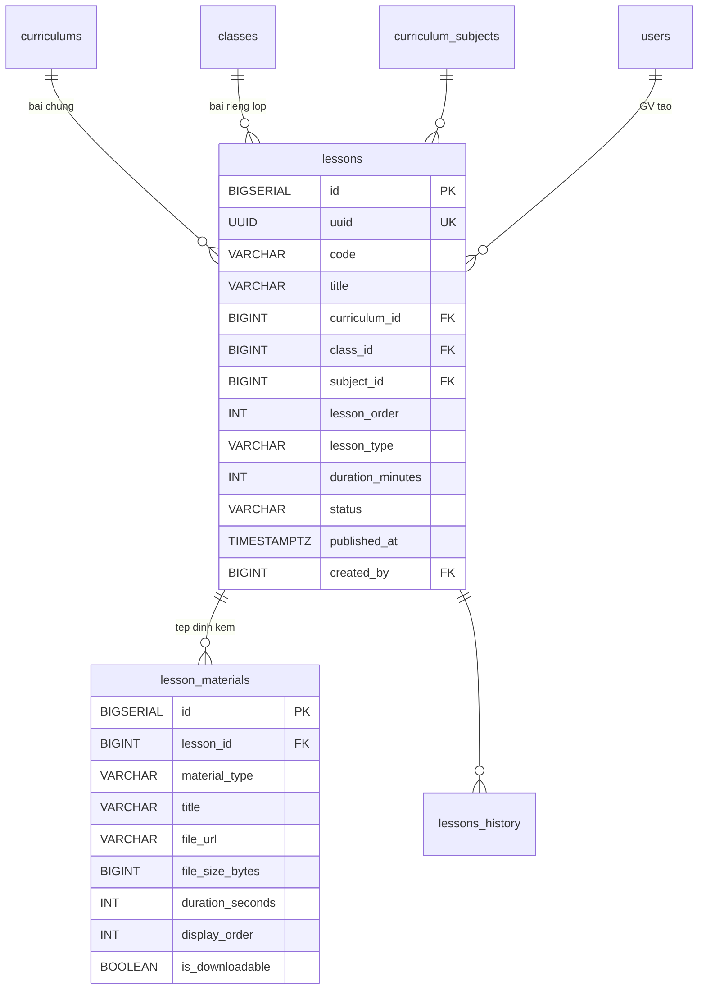
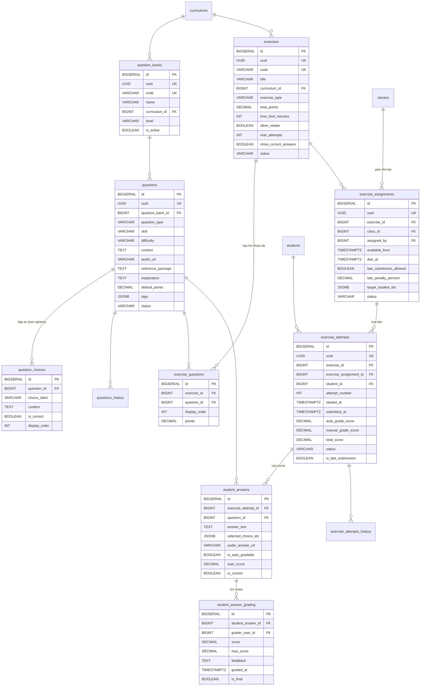
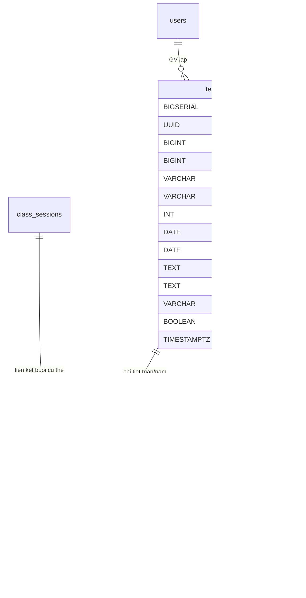

## LMS & Portal

### Mô tả tổng quan

Bao phủ FR-LMS-01 đến FR-LMS-09, chia làm 4 nhóm nhỏ: Bài giảng & Kho
học liệu, Ngân hàng câu hỏi & Bài tập, Portal phụ huynh, Kế hoạch giảng
dạy.

### Bài giảng & Kho học liệu

<!-- Nguồn: docs/diagrams/erd/ERD-Nhom8A-BaiGiang.mmd (chỉnh sửa trực tiếp file này, không sửa trong srs.md/sdd-groups) -->

a)  Bảng lessons --- Bài giảng

Bài giảng có thể thuộc curriculum (dùng chung nhiều lớp) hoặc thuộc 1
class cụ thể (riêng).

  --------------------------------------------------------------------------------
  **Cột**            **Kiểu**        **Ràng buộc**              **Ghi chú**
  ------------------ --------------- -------------------------- ------------------
  id                 BIGSERIAL       PK                          

  uuid               UUID            UNIQUE, NOT NULL           

  code               VARCHAR(50)     NOT NULL                    

  title              VARCHAR(500)    NOT NULL                   

  curriculum_id      BIGINT          FK → curriculums(id), NULL Nếu là bài chung

  class_id           BIGINT          FK → classes(id), NULL     Nếu là bài riêng
                                                                lớp

  subject_id         BIGINT          FK →                        
                                     curriculum_subjects(id),   
                                     NULL                       

  lesson_order       INT             NULL                       

  lesson_type        VARCHAR(30)     NOT NULL                   VIDEO_LECTURE /
                                                                PDF_DOCUMENT /
                                                                MIXED /
                                                                LIVE_RECORDING

  duration_minutes   INT             NULL                       

  status             VARCHAR(20)     NOT NULL, DEFAULT          DRAFT / PUBLISHED
                                     \'DRAFT\'                  / ARCHIVED

  published_at       TIMESTAMPTZ     NULL                       

  created_by         BIGINT          FK → users(id), NOT NULL    
  --------------------------------------------------------------------------------

Có lessons_history.

Ràng buộc:

ALTER TABLE lessons ADD CONSTRAINT chk_lesson_scope CHECK (

(curriculum_id IS NOT NULL AND class_id IS NULL) OR

(curriculum_id IS NULL AND class_id IS NOT NULL)

);

*Logic HS xem được bài gì:* HS trong lớp X xem được lessons WHERE
class_id=X OR curriculum_id=(curriculum của lớp X).

b)  Bảng lesson_materials --- Tệp đính kèm

  --------------------------------------------------------------------------
  **Cột**               **Kiểu**                **Ràng buộc**  **Ghi chú**
  --------------------- ----------------------- -------------- -------------
  id                    BIGSERIAL               PK              

  lesson_id             BIGINT                  FK →           
                                                lessons(id),   
                                                NOT NULL       

  material_type         VARCHAR(30)             NOT NULL       VIDEO / PDF /
                                                               AUDIO / SLIDE
                                                               / IMAGE /
                                                               OTHER

  title                 VARCHAR(300)            NOT NULL       

  file_url              VARCHAR(1000)           NOT NULL       Bắt buộc qua
                                                               CDN
                                                               (FR-LMS-01)

  file_size_bytes       BIGINT                  NULL           

  duration_seconds      INT                     NULL            

  display_order         INT                     NOT NULL,      
                                                DEFAULT 0      

  is_downloadable       BOOLEAN                 NOT NULL,       
                                                DEFAULT FALSE  
  --------------------------------------------------------------------------

Không history, thay đổi tài liệu tạo bản mới.

### Ngân hàng câu hỏi & Bài tập

<!-- Nguồn: docs/diagrams/erd/ERD-Nhom8B-CauHoiBaiTap.mmd (chỉnh sửa trực tiếp file này, không sửa trong srs.md/sdd-groups) -->

Hỗ trợ 3 loại câu hỏi: Trắc nghiệm, tự luận, nói (upload audio).

a)  Bảng question_banks --- Ngân hàng câu hỏi

  ------------------------------------------------------------------------------
  **Cột**         **Kiểu**          **Ràng buộc**              **Ghi chú**
  --------------- ----------------- -------------------------- -----------------
  id              BIGSERIAL         PK                          

  uuid            UUID              UNIQUE, NOT NULL           

  code            VARCHAR(50)       UNIQUE, NOT NULL            

  name            VARCHAR(300)      NOT NULL                   

  curriculum_id   BIGINT            FK → curriculums(id), NULL  

  subject_id      BIGINT            FK →                       
                                    curriculum_subjects(id),   
                                    NULL                       

  level           VARCHAR(50)       NULL                       A1/A2/B1/B2\...

  is_active       BOOLEAN           NOT NULL, DEFAULT TRUE     
  ------------------------------------------------------------------------------

Không history

b)  Bảng questions --- Câu hỏi

  -------------------------------------------------------------------------------
  **Cột**             **Kiểu**         **Ràng buộc**         **Ghi chú**
  ------------------- ---------------- --------------------- --------------------
  id                  BIGSERIAL        PK                     

  uuid                UUID             UNIQUE, NOT NULL      

  question_bank_id    BIGINT           FK →                   
                                       question_banks(id),   
                                       NOT NULL              

  question_type       VARCHAR(30)      NOT NULL              MULTIPLE_CHOICE /
                                                             MULTIPLE_ANSWER /
                                                             TRUE_FALSE /
                                                             FILL_IN_BLANK /
                                                             ESSAY / SPEAKING

  skill               VARCHAR(20)      NULL                  LISTENING / READING
                                                             / WRITING / SPEAKING
                                                             / GRAMMAR / OTHER

  difficulty          VARCHAR(20)      NULL                  EASY / MEDIUM / HARD

  content             TEXT             NOT NULL               

  audio_url           VARCHAR(1000)    NULL                  Câu hỏi Listening

  image_url           VARCHAR(1000)    NULL                   

  reference_passage   TEXT             NULL                  Đoạn văn tham chiếu
                                                             (Reading)

  explanation         TEXT             NULL                   

  default_points      DECIMAL(5,2)     NOT NULL, DEFAULT 1.0 

  tags                JSONB            NULL                   

  status              VARCHAR(20)      NOT NULL, DEFAULT     ACTIVE / ARCHIVED
                                       \'ACTIVE\'            

  created_by          BIGINT           FK → users(id)         
  -------------------------------------------------------------------------------

Có questions_history.\
Bảo vệ khi sửa: Nếu câu hỏi đã có student_answers, không cho sửa nội
dung/đáp án đúng. Tạo bản mới, archive bản cũ.

c)  Bảng question_choices --- Đáp án trắc nghiệm

  -----------------------------------------------------------------------
  **Cột**          **Kiểu**            **Ràng buộc**    **Ghi chú**
  ---------------- ------------------- ---------------- -----------------
  id               BIGSERIAL           PK                

  question_id      BIGINT              FK →             
                                       questions(id),   
                                       NOT NULL         

  choice_label     VARCHAR(10)         NOT NULL         A/B/C/D hoặc
                                                        TRUE/FALSE

  content          TEXT                NOT NULL         

  is_correct       BOOLEAN             NOT NULL,         
                                       DEFAULT FALSE    

  display_order    INT                 NOT NULL,        
                                       DEFAULT 0        
  -----------------------------------------------------------------------

d)  Bảng exercises --- Đề ôn tập / Bài tập

  ----------------------------------------------------------------------------------
  **Cột**                **Kiểu**       **Ràng buộc**              **Ghi chú**
  ---------------------- -------------- -------------------------- -----------------
  id                     BIGSERIAL      PK                          

  uuid                   UUID           UNIQUE, NOT NULL           

  code                   VARCHAR(50)    UNIQUE, NOT NULL            

  title                  VARCHAR(500)   NOT NULL                   

  curriculum_id          BIGINT         FK → curriculums(id), NULL  

  subject_id             BIGINT         FK →                       
                                        curriculum_subjects(id),   
                                        NULL                       

  exercise_type          VARCHAR(30)    NOT NULL                   SELF_PRACTICE /
                                                                   ASSIGNED /
                                                                   MOCK_TEST /
                                                                   SKILL_PRACTICE

  total_points           DECIMAL(6,2)   NOT NULL                   

  time_limit_minutes     INT            NULL                       NULL = không giới
                                                                   hạn

  allow_retake           BOOLEAN        NOT NULL, DEFAULT TRUE     

  max_attempts           INT            NULL                        

  show_correct_answers   BOOLEAN        NOT NULL, DEFAULT TRUE     

  status                 VARCHAR(20)    NOT NULL, DEFAULT          DRAFT / PUBLISHED
                                        \'DRAFT\'                  / ARCHIVED

  created_by             BIGINT         FK → users(id), NOT NULL   Giáo viên soạn đề
                                                                   (theo FR-LMS-10)

  created_at, updated_at TIMESTAMPTZ    NOT NULL, DEFAULT NOW()    
  ----------------------------------------------------------------------------------

e)  Bảng exercise_questions --- Câu hỏi thuộc đề

  ------------------------------------------------------------------------
  **Cột**             **Kiểu**               **Ràng buộc**
  ------------------- ---------------------- -----------------------------
  id                  BIGSERIAL              PK

  exercise_id         BIGINT                 FK → exercises(id), NOT NULL

  question_id         BIGINT                 FK → questions(id), NOT NULL

  display_order       INT                    NOT NULL

  points              DECIMAL(5,2)           NOT NULL

                                             UNIQUE(exercise_id,
                                             question_id)
  ------------------------------------------------------------------------

f)  Bảng exercise_assignments --- Giao đề cho lớp

Phân biệt SELF_PRACTICE (luôn mở, có thể không cần assignment) và
ASSIGNED (có deadline).

  ----------------------------------------------------------------------------
  **Cột**                   **Kiểu**          **Ràng buộc**    **Ghi chú**
  ------------------------- ----------------- ---------------- ---------------
  id                        BIGSERIAL         PK                

  uuid                      UUID              UNIQUE, NOT NULL 

  exercise_id               BIGINT            FK →              
                                              exercises(id),   
                                              NOT NULL         

  class_id                  BIGINT            FK →             
                                              classes(id), NOT 
                                              NULL             

  assigned_by               BIGINT            FK → users(id),   
                                              NOT NULL         

  available_from            TIMESTAMPTZ       NOT NULL,        
                                              DEFAULT NOW()    

  due_at                    TIMESTAMPTZ       NULL             Deadline ---
                                                               NULL với bài tự
                                                               luyện

  late_submission_allowed   BOOLEAN           NOT NULL,        
                                              DEFAULT FALSE    

  late_penalty_percent      DECIMAL(5,2)      NULL              

  target_student_ids        JSONB             NULL             NULL = cả lớp;
                                                               có giá trị = cá
                                                               nhân hóa

  status                    VARCHAR(20)       NOT NULL,        ACTIVE /
                                              DEFAULT          CANCELLED /
                                              \'ACTIVE\'       COMPLETED
  ----------------------------------------------------------------------------

g)  Bảng exercise_attempts --- Lượt học sinh làm bài

  ------------------------------------------------------------------------------------
  **Cột**                  **Kiểu**       **Ràng buộc**               **Ghi chú**
  ------------------------ -------------- --------------------------- ----------------
  id                       BIGSERIAL      PK                           

  uuid                     UUID           UNIQUE, NOT NULL            

  exercise_id              BIGINT         FK → exercises(id), NOT      
                                          NULL                        

  exercise_assignment_id   BIGINT         FK →                        NULL cho
                                          exercise_assignments(id),   SELF_PRACTICE
                                          NULL                        

  student_id               BIGINT         FK → students(id), NOT NULL  

  attempt_number           INT            NOT NULL, DEFAULT 1         

  started_at, submitted_at TIMESTAMPTZ    submitted_at NULL = đang     
                                          làm dở                      

  auto_grade_score         DECIMAL(6,2)   NULL                        Trắc nghiệm

  manual_grade_score       DECIMAL(6,2)   NULL                        Tự luận + nói

  total_score              DECIMAL(6,2)   NULL                        

  status                   VARCHAR(20)    NOT NULL, DEFAULT           IN_PROGRESS /
                                          \'IN_PROGRESS\'             SUBMITTED /
                                                                      AUTO_GRADED /
                                                                      FULLY_GRADED /
                                                                      EXPIRED

  is_late_submission       BOOLEAN        NOT NULL, DEFAULT FALSE     
  ------------------------------------------------------------------------------------

Có exercise_attempts_history.

h)  Bảng student_answers --- Câu trả lời từng câu

  -----------------------------------------------------------------------------------------------------
  **Cột**               **Kiểu**        **Ràng buộc**                 **Ghi chú**
  --------------------- --------------- ----------------------------- ---------------------------------
  id                    BIGSERIAL       PK                             

  exercise_attempt_id   BIGINT          FK → exercise_attempts(id),   
                                        NOT NULL                      

  question_id           BIGINT          FK → questions(id), NOT NULL   

  answer_text           TEXT            NULL                          FILL_IN_BLANK, ESSAY

  selected_choice_ids   JSONB           NULL                          MULTIPLE_CHOICE/MULTIPLE_ANSWER

  audio_answer_url      VARCHAR(1000)   NULL                          SPEAKING --- audio HS upload

  is_auto_gradable      BOOLEAN         NOT NULL                       

  auto_score            DECIMAL(5,2)    NULL                          

  is_correct            BOOLEAN         NULL                           

                                        UNIQUE(exercise_attempt_id,   
                                        question_id)                  
  -----------------------------------------------------------------------------------------------------

i)  Bảng student_answer_grading --- GV chấm tự luận/nói

  --------------------------------------------------------------------------
  **Cột**               **Kiểu**             **Ràng buộc**           **Ghi
                                                                     chú**
  --------------------- -------------------- ----------------------- -------
  id                    BIGSERIAL            PK                       

  student_answer_id     BIGINT               FK →                    
                                             student_answers(id),    
                                             NOT NULL                

  grader_user_id        BIGINT               FK → users(id), NOT      
                                             NULL                    

  score, max_score      DECIMAL(5,2)         NOT NULL                

  feedback              TEXT                 NULL                     

  graded_at             TIMESTAMPTZ          NOT NULL, DEFAULT NOW() 

  is_final              BOOLEAN              NOT NULL, DEFAULT TRUE   
  --------------------------------------------------------------------------

Không history, sửa điểm chấm tạo record mới thay vì sửa.

### Portal Phụ huynh

FR-LMS-03 và FR-LMS-07 là read-only view trên dữ liệu đã có ở các nhóm
khác, không cần bảng riêng:

  -----------------------------------------------------------------------
  **Nội dung hiển thị**   **Nguồn dữ liệu**
  ----------------------- -----------------------------------------------
  Bảng điểm               grade_entries WHERE status=APPROVED (Nhóm 5)

  Chuyên cần              attendance_marks join class_sessions (Nhóm 5)

  Nhận xét/Cảnh báo       student_comments WHERE status=APPROVED (Nhóm 5)

  Lịch học                class_sessions (Nhóm 5)

  Thông báo               notifications (Nhóm 9)
  -----------------------------------------------------------------------

Mọi query đều lọc theo parent_student (Nhóm 3) để xác định phạm vi con
của phụ huynh đang đăng nhập.

### Kế hoạch giảng dạy

<!-- Nguồn: docs/diagrams/erd/ERD-Nhom8D-KeHoachGiangDay.mmd (chỉnh sửa trực tiếp file này, không sửa trong srs.md/sdd-groups) -->

a)  Bảng teaching_plans --- Kế hoạch giảng dạy

  -------------------------------------------------------------------------
  **Cột**              **Kiểu**             **Ràng buộc**  **Ghi chú**
  -------------------- -------------------- -------------- ----------------
  id                   BIGSERIAL            PK              

  uuid                 UUID                 UNIQUE, NOT    
                                            NULL           

  class_id             BIGINT               FK →            
                                            classes(id),   
                                            NOT NULL       

  teacher_user_id      BIGINT               FK →           
                                            users(id), NOT 
                                            NULL           

  plan_type            VARCHAR(20)          NOT NULL       WEEKLY / YEARLY

  academic_year        VARCHAR(20)          NULL           Cho YEARLY

  week_number,         INT, DATE, DATE      NULL           Cho WEEKLY
  week_start_date,                                         
  week_end_date                                            

  summary, objectives  TEXT                 NULL           

  status               VARCHAR(20)          NOT NULL,      DRAFT /
                                            DEFAULT        PUBLISHED
                                            \'DRAFT\'      

  visible_to_partner   BOOLEAN              NOT NULL,      Hiển thị Portal
                                            DEFAULT TRUE   trường liên kết

  published_at         TIMESTAMPTZ          NULL            
  -------------------------------------------------------------------------

Có teaching_plans_history.

Ràng buộc:

ALTER TABLE teaching_plans ADD CONSTRAINT chk_plan_period CHECK (

(plan_type = \'WEEKLY\' AND week_start_date IS NOT NULL AND
week_end_date IS NOT NULL) OR

(plan_type = \'YEARLY\' AND academic_year IS NOT NULL));

b)  Bảng teaching_plan_items --- Chi tiết kế hoạch

  ------------------------------------------------------------------------
  **Cột**              **Kiểu**             **Ràng buộc**          **Ghi
                                                                   chú**
  -------------------- -------------------- ---------------------- -------
  id                   BIGSERIAL            PK                      

  teaching_plan_id     BIGINT               FK →                   
                                            teaching_plans(id),    
                                            NOT NULL               

  item_order           INT                  NOT NULL                

  planned_date         DATE                 NULL                   

  topic                VARCHAR(500)         NOT NULL                

  objectives,          TEXT                 NULL                   
  content_outline                                                  

  skills_focus         VARCHAR(200)         NULL                    

  homework_note        TEXT                 NULL                   

  class_session_id     BIGINT               FK →                   Link
                                            class_sessions(id),    tới
                                            NULL                   buổi cụ
                                                                   thể nếu
                                                                   có
  ------------------------------------------------------------------------

Không history riêng.

*Xuất file PDF/Excel (theo quyết định \"cả xem trực tiếp + có nút xuất
file\" của FR-LMS-09):* Không cần bảng --- service query 2 bảng trên rồi
format ra template.
