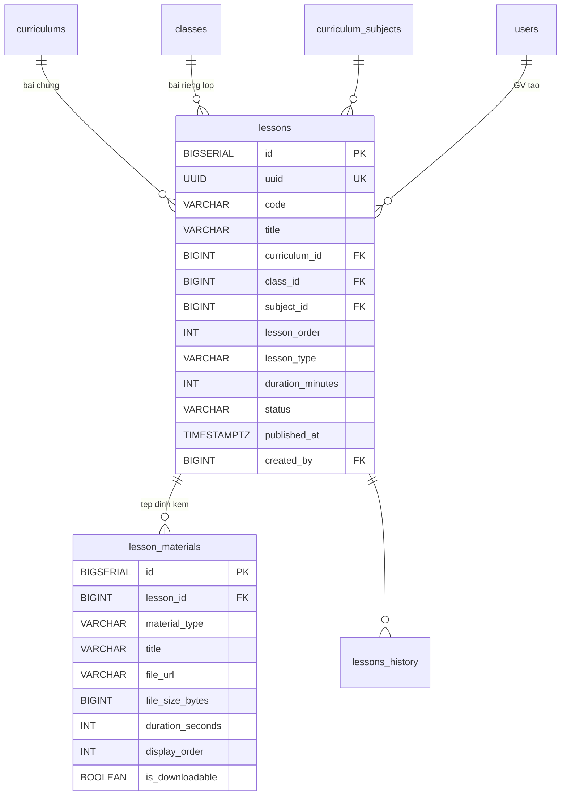
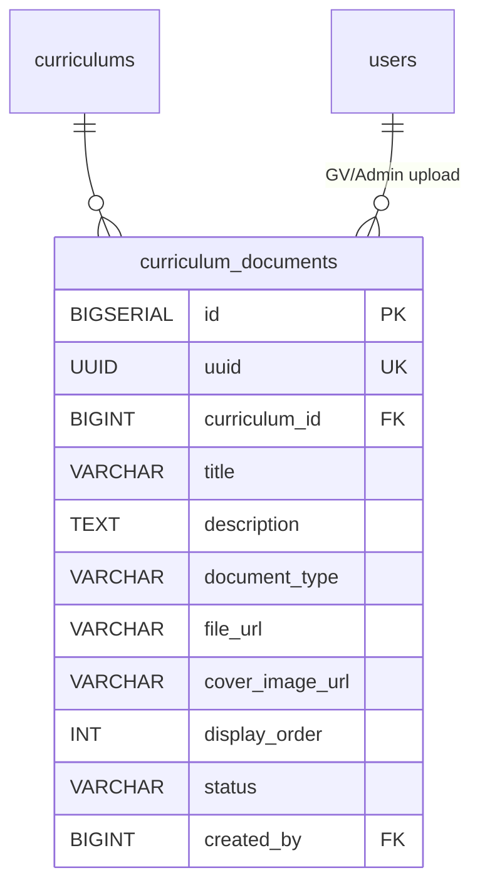
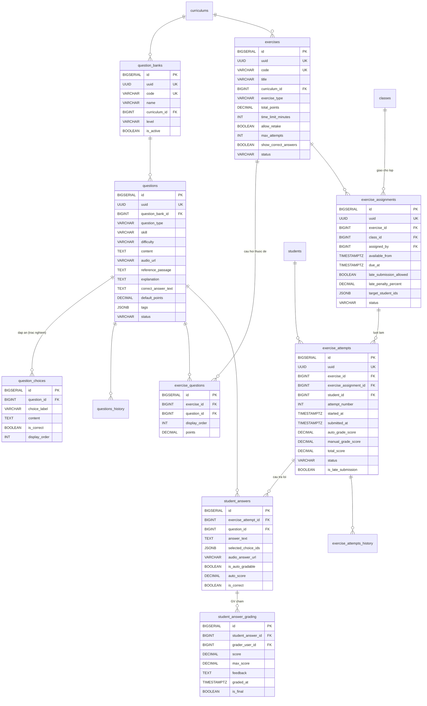
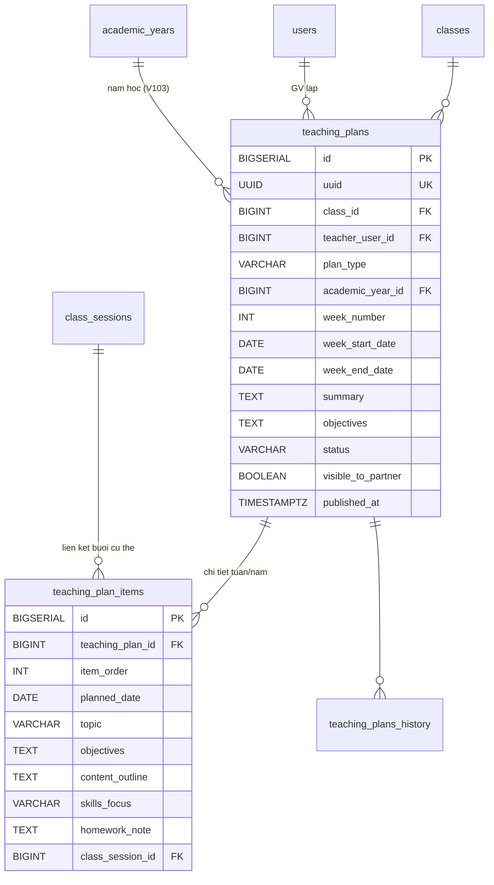

## LMS & Portal

### Mô tả tổng quan

Bao phủ FR-LMS-01 đến FR-LMS-09, chia làm 4 nhóm nhỏ: Bài giảng & Kho
học liệu, Ngân hàng câu hỏi & Bài tập, Portal phụ huynh, Kế hoạch giảng
dạy.

### Bài giảng & Kho học liệu

<!-- Nguồn: docs/diagrams/erd/ERD-Nhom8A-BaiGiang.mmd (chỉnh sửa trực tiếp file này, không sửa trong srs.md/sdd-groups) -->


**Tái cấu trúc 2026-07-27 (đã xác nhận với người dùng):** "Bài giảng &
Kho học liệu" (UC-23/UC-23a) đổi thành "Kho Video Ôn tập" — bỏ hẳn
PDF/Slide/Word/Image, chỉ còn video/audio ôn tập (Video từ kết nối/Video
phản xạ), tổ chức theo "bộ" (`review_video_sets`, trước là `lessons`),
mỗi bộ chứa nhiều video (`review_videos`, trước là `lesson_materials`),
thêm bảng hoàn toàn mới `review_video_progress` theo dõi % thời lượng
từng học sinh đã xem. Migration V52 (thay thế toàn bộ V16, DB dev xác
nhận 0 dòng dữ liệu tại thời điểm tái cấu trúc nên chọn DROP+CREATE thay
vì ALTER).

a)  Bảng review_video_sets --- "Bộ" video ôn tập

**V98 (2026-08-06, bổ sung ngoài SDD gốc, đã xác nhận với người dùng)
--- đổi mô hình gán lớp giống hệt Kho đề (mục j/k):** trước V98, Bộ
thuộc ĐÚNG 1 trong 2 (curriculum_id XOR class_id, CHECK
`chk_review_video_set_scope`) — bộ dùng chung theo curriculum thì TỰ
hiển thị cho MỌI lớp thuộc khung đó. Từ V98, `curriculum_id` LUÔN khác
NULL nhưng CHỈ còn dùng lọc/tìm kiếm trong Kho Video (không còn là điều
kiện hiển thị) — điều kiện hiển thị DUY NHẤT cho 1 lớp là đã được gán
tường minh qua bảng mới `review_video_set_class_assignments` (mục a.1,
mirror `exam_class_assignments`). `class_id` bị xóa khỏi bảng.

  --------------------------------------------------------------------------------
  **Cột**            **Kiểu**        **Ràng buộc**              **Ghi chú**
  ------------------ --------------- -------------------------- ------------------
  id                 BIGSERIAL       PK

  uuid               UUID            UNIQUE, NOT NULL

  code               VARCHAR(50)     NOT NULL

  title              VARCHAR(500)    NOT NULL

  video_type         VARCHAR(20)     NOT NULL                   CONNECTION
                                                                 (Video từ kết
                                                                 nối) / REFLEX
                                                                 (Video phản
                                                                 xạ)

  curriculum_id      BIGINT          FK → curriculums(id),      V98: CHỈ để lọc/
                                     NOT NULL                    tìm kiếm, KHÔNG
                                                                 phải điều kiện
                                                                 hiển thị (xem
                                                                 a.1)

  teacher_type       VARCHAR(20)     NOT NULL                   V98: VIETNAMESE /
                                                                 FOREIGN — bắt
                                                                 buộc chọn khi
                                                                 tạo, dùng lọc Bộ
                                                                 khi giao bài
                                                                 (mirror
                                                                 exams.
                                                                 teacher_type)

  subject_id         BIGINT          FK →
                                     curriculum_subjects(id),
                                     NULL

  display_order      INT             NULL

  status             VARCHAR(20)     NOT NULL, DEFAULT          DRAFT / PUBLISHED
                                     'DRAFT'                     / ARCHIVED

  published_at       TIMESTAMPTZ     NULL

  created_by         BIGINT          FK → users(id), NOT NULL

  created_at,        TIMESTAMPTZ     NOT NULL                   BaseAuditEntity —
  updated_at                                                     bảng lessons cũ
                                                                 thiếu 2 cột này,
                                                                 bổ sung khi tái
                                                                 cấu trúc
  --------------------------------------------------------------------------------

Có review_video_sets_history.

*Logic HS xem được bộ gì (V98):* HS trong lớp X xem được
review_video_sets đã có 1 dòng review_video_set_class_assignments khớp
class_id=X (thay hẳn logic OR curriculum/class cũ) VÀ có
ReviewVideoAssignment ACTIVE giao cho lớp X (V65, không đổi — xem mục
dưới). Học sinh gọi phải có class_enrollments ACTIVE khớp lớp đang
truy vấn.

**Backfill V98 (migrate dữ liệu Sprint 0/1 cũ, không có dữ liệu thật):**
Bộ trước đây riêng 1 lớp (class_id) → gán đúng lớp đó qua
review_video_set_class_assignments; Bộ dùng chung theo curriculum → gán
MỌI lớp đang thuộc đúng khung đó tại thời điểm migrate (giữ nguyên phạm
vi hiển thị hiện tại, không làm mất quyền xem lớp nào); Bộ chỉ có
class_id (chưa có curriculum_id) → backfill curriculum_id từ khung của
lớp đó. `teacher_type` backfill theo `video_type` hiện có (CONNECTION→
VIETNAMESE, REFLEX→FOREIGN — đúng quy tắc lọc `matchesSessionTeacherType`
cũ ở StudentCommentService, giữ nguyên hành vi lọc buổi học cho dữ liệu
cũ) rồi mới đổi StudentCommentService sang đọc trực tiếp cột mới.

a.1)  Bảng review_video_set_class_assignments --- Gán "Bộ" cho lớp
(MỚI HOÀN TOÀN, V98, 2026-08-06, bổ sung ngoài SDD gốc, đã xác nhận với
người dùng --- mirror `exam_class_assignments`, mục k)

  ----------------------------------------------------------------------------------
  **Cột**                  **Kiểu**       **Ràng buộc**                **Ghi chú**
  ------------------------ -------------- ---------------------------- -------------
  id                       BIGSERIAL      PK

  review_video_set_id      BIGINT         FK → review_video_sets(id),
                                          NOT NULL

  class_id                 BIGINT         FK → classes(id), NOT NULL

  assigned_by              BIGINT         FK → users(id), NOT NULL

  assigned_at              TIMESTAMPTZ    NOT NULL, DEFAULT NOW()
  ----------------------------------------------------------------------------------

UNIQUE (review_video_set_id, class_id). Join thuần (mirror
`exam_class_assignments`) — không phải "bản giao" cần lưu lịch sử như
`review_video_assignments` (mục dưới), nên KHÔNG có uuid/status; gỡ lớp
= xóa cứng dòng này.

Permission riêng `lms.review-video.create/update/view` cho quản lý bộ/
video + xem thống kê (gán mặc định TEACHER, bổ sung V63 — trước đó
ReviewVideoController không hề gate permission nào, chỉ dựa
requireAssignedTeacher) — chấm điểm audio (UC-23b) tái dùng đúng
`lms.grading.manage` đã có sẵn từ V28 (mô tả gốc "Chấm bài thủ công" đủ
tổng quát, review-video là domain thứ 3 dùng chung sau UC-41/UC-26,
KHÔNG tách riêng vì không có khía cạnh create/update/delete để tách theo
hành động — cùng lý do đã áp dụng cho listening-practice grading bên
dưới). Gán/gỡ lớp (V98) dùng permission mới `lms.review-video.assign`
(mirror `lms.exam.assign`, V67), cũng chỉ gán TEACHER.

b)  Bảng review_videos --- Video/audio trong 1 bộ

  --------------------------------------------------------------------------
  **Cột**               **Kiểu**                **Ràng buộc**  **Ghi chú**
  --------------------- ----------------------- -------------- -------------
  id                    BIGSERIAL               PK

  review_video_set_id   BIGINT                  FK →
                                                 review_video_
                                                 sets(id), NOT
                                                 NULL

  source_type           VARCHAR(20)             NOT NULL       YOUTUBE_URL /
                                                                R2_VIDEO /
                                                                R2_AUDIO

  title                 VARCHAR(300)            NOT NULL

  file_url              VARCHAR(1000)           NOT NULL       Link YouTube
                                                                hoặc URL CDN
                                                                (Cloudflare R2,
                                                                FR-LMS-01)

  file_size_bytes       BIGINT                  NULL           NULL với
                                                                YOUTUBE_URL

  duration_seconds      INT                     NOT NULL       Bắt buộc cho
                                                                cả 3 nguồn —
                                                                FE tự phát
                                                                hiện trước khi
                                                                gọi API, dùng
                                                                tính % xem
                                                                (UC-23a)

  display_order         INT                     NOT NULL,
                                                 DEFAULT 0

  completion_threshold_ INT                     NOT NULL,      Chỉ có ý nghĩa
  percent                                       DEFAULT 80     videoType=
                                                                CONNECTION —
                                                                % ngưỡng để 1
                                                                LƯỢT xem được
                                                                tính "hợp lệ"
                                                                (V59, bổ sung
                                                                ngoài SDD gốc)

  required_view_count   INT                     NOT NULL,      Chỉ có ý nghĩa
                                                 DEFAULT 1      videoType=
                                                                CONNECTION —
                                                                số lượt hợp lệ
                                                                tối thiểu để
                                                                video được
                                                                tính "đạt"
                                                                (V59)

  created_at,           TIMESTAMPTZ             NOT NULL       BaseAuditEntity
  updated_at
  --------------------------------------------------------------------------

Không history, thay đổi video tạo bản ghi mới. Bỏ `material_type` (thay
bằng `source_type`) và `is_downloadable` so với `lesson_materials` cũ —
cho tải xuống sẽ phá mục đích theo dõi % xem, không có yêu cầu nào cần
giữ.

c)  Bảng review_video_progress --- Theo dõi tiến độ xem (MỚI HOÀN TOÀN,
UC-23a, 2026-07-27, bổ sung ngoài SDD gốc đã xác nhận với người dùng —
chưa từng tồn tại cơ chế này trước khi tái cấu trúc)

  --------------------------------------------------------------------------
  **Cột**               **Kiểu**                **Ràng buộc**  **Ghi chú**
  --------------------- ----------------------- -------------- -------------
  id                    BIGSERIAL               PK

  review_video_id       BIGINT                  FK →
                                                 review_videos
                                                 (id), NOT NULL

  student_id            BIGINT                  FK →
                                                 students(id),
                                                 NOT NULL

  watched_seconds       INT                     NOT NULL,      Mốc giây CAO
                                                 DEFAULT 0      NHẤT từng đạt
                                                                — server lấy
                                                                max(cũ, mới),
                                                                không giảm khi
                                                                tua tới

  is_completed          BOOLEAN                 NOT NULL,      V59, đổi ý
                                                 DEFAULT FALSE  nghĩa: tính lại
                                                                ở Service =
                                                                view_count >=
                                                                review_video.
                                                                required_view_
                                                                count (trước
                                                                đây tính trực
                                                                tiếp từ
                                                                watched_seconds)

  view_count             INT                     NOT NULL,      V59, bổ sung
                                                 DEFAULT 0      ngoài SDD gốc
                                                                — số LƯỢT xem
                                                                (review_video_
                                                                watch_sessions)
                                                                đã đạt
                                                                completion_
                                                                threshold_
                                                                percent, rollup
                                                                tính lại mỗi
                                                                lần có session
                                                                mới cập nhật

  created_at,           TIMESTAMPTZ             NOT NULL       BaseAuditEntity
  updated_at
  --------------------------------------------------------------------------

Ràng buộc: UNIQUE (review_video_id, student_id) — 1 dòng/học sinh/video,
là bảng TỔNG HỢP (rollup) từ review_video_watch_sessions, không phải bảng
ghi trực tiếp nữa (V59). Giáo viên xem thống kê theo bộ + lớp qua API
riêng (GET /api/review-video-sets/{setId}/stats), ghép ma trận học sinh
× video ở tầng Service (roster lớp LEFT JOIN video LEFT JOIN tiến độ —
học sinh chưa xem gì vẫn hiện 0%, không biến mất khỏi ma trận).

c2)  Bảng review_video_watch_sessions --- Từng LƯỢT xem (MỚI HOÀN TOÀN,
V59, 2026-07-28, bổ sung ngoài SDD gốc đã xác nhận với người dùng — thay
thế cơ chế watermark suốt đời không phân biệt được "lần" nào với "lần"
nào của review_video_progress ban đầu)

  --------------------------------------------------------------------------
  **Cột**               **Kiểu**                **Ràng buộc**  **Ghi chú**
  --------------------- ----------------------- -------------- -------------
  id                    BIGSERIAL               PK

  review_video_id       BIGINT                  FK →
                                                 review_videos
                                                 (id), NOT NULL

  student_id            BIGINT                  FK →
                                                 students(id),
                                                 NOT NULL

  watched_seconds       INT                     NOT NULL,      Mốc giây CAO
                                                 DEFAULT 0      NHẤT trong
                                                                CHÍNH lượt
                                                                này (không
                                                                phải suốt
                                                                đời) — server
                                                                lấy max(cũ,
                                                                mới) trong
                                                                phạm vi lượt

  is_qualified           BOOLEAN                 NOT NULL,      Đã đạt
                                                 DEFAULT FALSE  completion_
                                                                threshold_
                                                                percent của
                                                                video trong
                                                                lượt này

  quiz_completed_at      TIMESTAMPTZ             NULL           V83: đã trả
                                                                lời đủ bộ
                                                                câu hỏi
                                                                trắc nghiệm
                                                                CONNECTION
                                                                cho ĐÚNG
                                                                lượt này
                                                                (NULL = chưa)

  slot_index             INT                     NULL           V115, bổ sung
                                                                ngoài SDD gốc
                                                                (2026-08-11) —
                                                                CHỈ có ý nghĩa
                                                                với CONNECTION:
                                                                lượt này ứng
                                                                với nhóm câu
                                                                hỏi số mấy
                                                                (1..M, xem
                                                                bảng d3). NULL
                                                                với REFLEX.

  started_at,             TIMESTAMPTZ             NOT NULL       BaseAuditEntity
  updated_at
  --------------------------------------------------------------------------

Mở 1 lượt mới (POST /api/review-videos/{videoId}/watch-sessions) khi học
sinh bắt đầu/mở lại video; các lần báo tiến độ tiếp theo
(PUT /api/review-videos/{videoId}/progress, kèm watchSessionId trong
body) cập nhật ĐÚNG session đó. Mỗi lần cập nhật, Service tính lại rollup
trên review_video_progress: watched_seconds = max mọi session,
is_completed = view_count >= required_view_count.

**V83 (2026-08-04, đã xác nhận với người dùng):** `view_count` giờ đếm
session thoả **CẢ 2** điều kiện thay vì chỉ `is_qualified=true` như trước
— video CONNECTION: `is_qualified=true AND quiz_completed_at IS NOT NULL`
(khớp cặp 1-1 "xem lượt nào, trả lời câu hỏi lượt đó" — xem
`ReviewVideoService#recomputeProgress`); video khác (REFLEX, nếu từng gọi
watch-session) giữ nguyên công thức cũ (chỉ `is_qualified=true`).

d)  Bảng review_video_questions --- Câu hỏi theo mốc thời gian trong 1
video Phản xạ (MỚI HOÀN TOÀN, V57, 2026-07-28, bổ sung ngoài SDD gốc đã
xác nhận với người dùng — THAY THẾ thiết kế "1 video = 1 audio duy nhất"
ban đầu của UC-23b, 2026-07-27)

  ------------------------------------------------------------------------
  **Cột**                 **Kiểu**       **Ràng buộc**    **Ghi chú**
  ----------------------- -------------- ---------------- -----------------
  id                      BIGSERIAL      PK

  review_video_id         BIGINT         FK →             Chỉ hợp lệ khi
                                          review_videos    video thuộc bộ
                                          (id), NOT NULL   có video_type=
                                                            REFLEX — kiểm
                                                            tra ở Service

  timestamp_seconds       INT            NOT NULL         Mốc giây trong
                                                            video — FE
                                                            seek video tới
                                                            đây khi HS bấm
                                                            câu hỏi

  prompt                  VARCHAR(500)   NULL             Nội dung câu
                                                            hỏi (tuỳ chọn)

  max_recording_seconds   INT            NOT NULL         Thời lượng ghi
                                                            âm tối đa —
                                                            RIÊNG từng câu
                                                            hỏi (đã xác
                                                            nhận, không
                                                            dùng chung 1
                                                            giá trị/video)

  max_attempts            INT            NULL             NULL = không
                                                            giới hạn số
                                                            lần nộp lại —
                                                            RIÊNG từng
                                                            câu hỏi

  display_order           INT            NOT NULL

  created_at, updated_at  TIMESTAMPTZ    NOT NULL         BaseAuditEntity
  ------------------------------------------------------------------------

d2) Bảng review_video_connection_questions/_choices/_answers --- Câu hỏi
trắc nghiệm tự chấm cho video Kết nối (MỚI HOÀN TOÀN, V83, 2026-08-04, bổ
sung ngoài SDD gốc đã xác nhận với người dùng) — mirror cấu trúc d)/e) ở
trên nhưng cho CONNECTION thay vì REFLEX, và KHÁC BẢN CHẤT: trắc nghiệm tự
chấm (không phải audio/GV chấm tay), hiện SAU KHI xem xong 1 lượt (không
gắn mốc thời gian giữa video), gắn ĐÚNG 1 lượt xem cụ thể thay vì 1 lần
giao (assignment).

  --------------------------------------------------------------------------
  **Bảng**                              **Cột chính**            **Ghi chú**
  -------------------------------------- ------------------------ -----------
  review_video_connection_questions      review_video_id FK,      Chỉ hợp lệ
                                          prompt TEXT NOT NULL,    khi video
                                          display_order            thuộc bộ
                                                                    video_type=
                                                                    CONNECTION

  review_video_connection_choices        review_video_connection_ Mirror
                                          question_id FK,          question_
                                          choice_label,            choices
                                          content TEXT NOT NULL,
                                          is_correct BOOLEAN,
                                          display_order

  review_video_connection_answers        review_video_connection_ UNIQUE
                                          question_id FK,          (question_id,
                                          watch_session_id FK →    watch_
                                          review_video_watch_      session_id)
                                          sessions(id), student_id — khớp cặp
                                          FK, selected_choice_id   1-1, chặn
                                          FK, is_correct BOOLEAN,  trả lời
                                          answered_at              trùng trong
                                                                    CÙNG 1 lượt
  --------------------------------------------------------------------------

`watch_session_id` là liên kết cốt lõi: 1 lượt xem chỉ được nộp trắc
nghiệm SAU KHI `review_video_watch_sessions.is_qualified=true`, và chỉ
nộp được 1 lần (`quiz_completed_at` set xong thì khoá, không cho nộp lại
đổi đáp án cho lượt đó) — xem `ReviewVideoService#submitConnectionAnswers`.
Publish 1 bộ CONNECTION giờ chặn nếu còn video chưa có ≥ 1 câu hỏi (xem
`ReviewVideoService#requireConnectionVideosHaveQuestions`, gọi từ
`updateSet`).

**V115 (2026-08-11, đã xác nhận với người dùng) — không còn phải trả lời
TOÀN BỘ N câu hỏi mỗi lượt:** `is_qualified=true` giờ nghĩa là xem HẾT
100% (cố định, không còn đọc `completion_threshold_percent` cho CONNECTION
nữa — field đó đổi ý nghĩa, xem bảng d3). Học sinh chỉ cần trả lời ĐÚNG
nhóm câu hỏi đã gán cho `slot_index` của lượt đó (không phải toàn bộ N câu)
— xem `ReviewVideoService#submitConnectionAnswers`/`ensureConnectionQuestionSlotsAssigned`.

d3) Bảng review_video_connection_question_slots --- Phân bổ câu hỏi
CONNECTION theo nhóm/lượt, RIÊNG từng học sinh (MỚI HOÀN TOÀN, V115,
2026-08-11, bổ sung ngoài SDD gốc đã xác nhận với người dùng)

  --------------------------------------------------------------------------
  **Cột**                              **Kiểu**      **Ràng buộc**   **Ghi chú**
  ------------------------------------ ------------- --------------- --------
  id                                    BIGSERIAL     PK

  review_video_connection_question_id   BIGINT        FK →
                                                       review_video_
                                                       connection_
                                                       questions(id),
                                                       NOT NULL

  student_id                            BIGINT        FK →
                                                       students(id),
                                                       NOT NULL

  slot_index                            INT           NOT NULL        Nhóm số
                                                                       mấy
                                                                       (1..M)

  created_at, updated_at                TIMESTAMPTZ   NOT NULL        BaseAuditEntity
  --------------------------------------------------------------------------

  UNIQUE (review_video_connection_question_id, student_id) — 1 câu hỏi chỉ
  thuộc ĐÚNG 1 nhóm cho 1 học sinh.

Sinh 1 LẦN DUY NHẤT lúc học sinh mở lượt xem đầu tiên của video
(`startWatchSession`): N câu hỏi được xáo trộn ngẫu nhiên rồi chia đều
nhất có thể vào M nhóm (M = `review_videos.required_view_count`) — NHÓM
ĐẦU nhận số câu dư nếu N không chia hết M (VD 10 câu/3 lượt = 4,3,3). Xem
lại đúng lượt nào (theo `slot_index` trên watch session, chu kỳ modulo M
nếu xem quá M lượt) nhận lại đúng nhóm câu hỏi đó, không random lại — xem
`ReviewVideoService#ensureConnectionQuestionSlotsAssigned`.

**`review_videos.completion_threshold_percent` đổi ý nghĩa CHO CONNECTION**
(V115) — từ "ngưỡng % xem để 1 lượt được tính hợp lệ" (ý nghĩa GỐC, REFLEX
vẫn dùng y hệt, không đổi) sang **"ngưỡng % pass điểm trắc nghiệm tổng"**:
tổng số câu trả lời ĐÚNG (bản mới nhất mỗi câu hỏi, xem
`review_video_connection_answers.answered_at`) / TỔNG N câu hỏi của video,
gộp MỌI lượt — dùng tính "% đạt" cho BTVN CONNECTION ở UC-66 (xem
`ReviewVideoService#isConnectionVideoPassed`,
`ReviewVideoAssignmentStatsResponse.passedCount/passRatePercent`).

e)  Bảng review_video_question_submissions --- Audio Học sinh nộp cho 1
câu hỏi + Giáo viên chấm điểm (thay thế review_video_submissions cũ, V57)

  --------------------------------------------------------------------------
  **Cột**                  **Kiểu**       **Ràng buộc**     **Ghi chú**
  ------------------------- -------------- ----------------- -----------------
  id                        BIGSERIAL      PK

  review_video_question_id  BIGINT         FK →              
                                            review_video_
                                            questions(id),
                                            NOT NULL

  student_id                 BIGINT         FK →
                                            students(id),
                                            NOT NULL

  review_video_assignment_id  BIGINT         FK →              V69 -- NULL
                                            review_video_      cho dữ liệu
                                            assignments(id),   trước V69
                                            NULL               (không xác
                                                                định được
                                                                lần giao
                                                                nào)

  attempt_number              INT            NOT NULL          Tăng dần mỗi
                                                                lần nộp lại
                                                                — GIỮ LỊCH
                                                                SỬ (khác
                                                                hẳn cơ chế
                                                                ghi đè cũ)

  audio_url                    VARCHAR(1000)  NOT NULL          URL CDN
                                                                (Cloudflare
                                                                R2, module
                                                                REVIEW_VIDEO_
                                                                SUBMISSION)

  submitted_at                  TIMESTAMPTZ    NOT NULL

  score                          DECIMAL(5,2)   NULL              NULL = chưa
                                                                chấm — attempt
                                                                mới KHÔNG kế
                                                                thừa điểm
                                                                attempt trước

  max_score                       DECIMAL(5,2)   NULL

  feedback                         TEXT           NULL

  graded_by                         BIGINT         FK → users(id),
                                                    NULL

  graded_at                         TIMESTAMPTZ    NULL

  created_at, updated_at             TIMESTAMPTZ    NOT NULL          BaseAuditEntity
  --------------------------------------------------------------------------

Ràng buộc: UNIQUE (review_video_question_id, student_id,
review_video_assignment_id, attempt_number) — GIỮ LỊCH SỬ mọi lần nộp
(khác hẳn UNIQUE(review_video_id, student_id) + upsert-ghi-đè của thiết
kế cũ). Vượt quá max_attempts của câu hỏi → từ chối tạo attempt mới
(RetakeNotAllowedException, tái dùng nguyên cơ chế giới hạn lượt làm lại
của Exercise/UC-24/27). Giáo viên chấm điểm mặc định trên attempt MỚI
NHẤT (listSubmissionsForTeacher chỉ trả 1 dòng/câu hỏi/học sinh — attempt
có attempt_number lớn nhất, KHÔNG lọc theo review_video_assignment_id —
Giáo viên vẫn cần thấy lịch sử cũ để chấm dù học sinh đã được giao lại).

**Bổ sung V69 (bổ sung ngoài SDD gốc, đã xác nhận với người dùng
2026-07-31) — fix bug "Đã nộp bài" hiện sai khi giao lại:** thêm cột
`review_video_assignment_id` + đổi UNIQUE constraint để `attempt_number`
tính lại từ đầu ở MỖI lần giao (không còn tính dồn lịch sử xuyên suốt mọi
lần giao trong quá khứ) — `submitQuestionAudio`/`getMyLatestSubmission`/
`listMySubmissionHistory` (phía Học sinh) đều lọc theo ĐÚNG
`review_video_assignment_id` hiện tại. `ReviewVideoService.deliverToClass`
(giao lại) tự hủy (CANCELLED) mọi lần giao ACTIVE cũ của cùng (bộ, lớp)
trước khi tạo lần giao mới, đảm bảo tại mọi thời điểm chỉ có TỐI ĐA 1 lần
giao ACTIVE cho 1 (bộ, lớp) — không còn mơ hồ khi tra "lần giao nào đang
hiệu lực".

Migration V57 (DROP review_video_submissions cũ sau khi migrate dữ liệu:
mỗi video REFLEX có sẵn → 1 câu hỏi mặc định timestamp=0 phủ cả video,
submission cũ → attempt_number=1 của câu hỏi đó — không mất dữ liệu học
sinh đã nộp trước khi tái cấu trúc).

KHÔNG tái dùng grade_entries/GradeEntry (gắn sổ điểm chính thức, luồng
DRAFT→PROVISIONAL_PUBLISHED→APPEAL→OFFICIAL quá nặng cho audio ôn tập tự
nguyện) và KHÔNG tái dùng StudentAnswerGrading (gắn UC-40/41, có
versioning is_final/latest + partial unique index không cần thiết ở đây).
score/max_score/feedback theo đúng shape đã có tiền lệ ở
listening_practice_gradings (UC-26) để nhất quán convention chấm điểm
dạng luyện tập trong dự án.

f)  Bảng review_video_assignments --- Giao bộ video cho lớp (MỚI HOÀN
TOÀN, V65, bổ sung ngoài SDD gốc, đã xác nhận với người dùng 2026-07-30)

Mirror `exercise_assignments` (mục f nhóm Ngân hàng câu hỏi & Bài tập
dưới) --- KHÔNG có `late_submission_allowed`/`late_penalty_percent` (không
áp dụng cho video).

  ----------------------------------------------------------------------------
  **Cột**                   **Kiểu**          **Ràng buộc**    **Ghi chú**
  ------------------------- ----------------- ---------------- ---------------
  id                        BIGSERIAL         PK

  uuid                      UUID              UNIQUE, NOT NULL

  review_video_set_id       BIGINT            FK →
                                              review_video_
                                              sets(id), NOT NULL

  class_id                  BIGINT            FK →
                                              classes(id), NOT
                                              NULL

  assigned_by               BIGINT            FK → users(id),
                                              NOT NULL

  available_from            TIMESTAMPTZ       NOT NULL,
                                              DEFAULT NOW()

  due_at                    TIMESTAMPTZ       NULL             Hạn nộp = buổi
                                                               học kế tiếp
                                                               của lớp (tính
                                                               ở StudentComment
                                                               Service, xem
                                                               UC-21)

  target_student_ids        JSONB             NULL             NULL = cả lớp
                                                               (V65: LUÔN
                                                               NULL --- không
                                                               còn cá nhân
                                                               hóa như V55)

  status                    VARCHAR(20)       NOT NULL,        ACTIVE /
                                              DEFAULT          CANCELLED /
                                              'ACTIVE'         COMPLETED

  teacher_notified_at       TIMESTAMPTZ       NULL             V82: NULL =
                                                               chưa báo GV %
                                                               hoàn thành khi
                                                               hết hạn

  source_class_session_id   BIGINT            FK →             V123: buổi học
                                              class_sessions   mà GV đang viết
                                              (id), NULL       Nhận xét lúc
                                                               chọn bộ này ---
                                                               NULL với bản
                                                               giao TRƯỚC V123
  ----------------------------------------------------------------------------

**Bổ sung ngoài SDD gốc, đã xác nhận với người dùng (V65, 2026-07-30):**
tạo qua `ReviewVideoService.deliverToClass()`, gọi TỪ
`StudentCommentService` khi Giáo viên chọn 1 `ReviewVideoSet` làm "BTVN
buổi sau" ở Nhận xét học viên (UC-21) --- KHÔNG expose qua Controller
riêng (không có endpoint `POST /api/review-video-sets/{id}/assign`).
Trước V65, Kho Video Ôn tập không hề có khái niệm "giao theo lớp" ---
`status=PUBLISHED` trên `review_video_sets` là đủ để học sinh xem. V65
thêm bảng này làm điều kiện thứ 2 bắt buộc (PUBLISHED **VÀ** có
`review_video_assignments` ACTIVE cho lớp) --- xem
`ReviewVideoService.requireStudentCanViewSet()`/`listByClass()`. Áp dụng
cho CẢ `CONNECTION` lẫn `REFLEX`. Đồng thời đổi cột
`student_comments.homework_next_review_video_set_id` (FK thẳng
`review_video_sets`) → `homework_next_review_video_assignment_id` (FK →
bảng này) để đối xứng với `homework_next_exercise_assignment_id` sẵn có
(cả 2 đều trỏ BẢN GIAO, không trỏ nguồn) --- xem chi tiết nhóm 6 (Học
thuật), bảng `student_comments`.

### Kho tài liệu tham khảo (UC-60, FR-LMS-13 — bổ sung ngoài SDD gốc, đã xác nhận với người dùng)

Khái niệm độc lập với review_video_sets/review_videos ở trên — không gắn
1 bộ video ôn tập cụ thể nào, chỉ gắn theo curriculum. Migration V41.



a)  Bảng curriculum_documents --- Tài liệu tham khảo

  --------------------------------------------------------------------------------
  **Cột**            **Kiểu**        **Ràng buộc**              **Ghi chú**
  ------------------ --------------- -------------------------- ------------------
  id                 BIGSERIAL       PK                          

  uuid               UUID            UNIQUE, NOT NULL           

  curriculum_id      BIGINT          FK → curriculums(id), NOT  
                                     NULL                       

  title              VARCHAR(500)    NOT NULL                   

  description        TEXT            NULL                       

  document_type      VARCHAR(30)     NOT NULL                   VIDEO / PDF /
                                                                AUDIO / SLIDE /
                                                                IMAGE / OTHER

  file_url           VARCHAR(1000)   NOT NULL                   Bắt buộc qua
                                                                CDN
                                                                (NFR-TECH-07)

  cover_image_url    VARCHAR(500)    NULL                       Ảnh bìa hiển
                                                                thị khi liệt
                                                                kê kho tài
                                                                liệu, độc
                                                                lập với
                                                                file_url. Bổ
                                                                sung ngoài
                                                                SDD gốc, đã
                                                                xác nhận với
                                                                người dùng
                                                                (2026-07-23,
                                                                V48)

  display_order      INT             NOT NULL, DEFAULT 0        

  status              VARCHAR(20)     NOT NULL, DEFAULT          DRAFT / PUBLISHED
                                     \'DRAFT\'                  / ARCHIVED

  created_by         BIGINT          FK → users(id), NOT NULL    
  --------------------------------------------------------------------------------

Không có bảng history — sửa metadata/trạng thái update tại chỗ (không
có ràng buộc downstream nào cần bất biến, khác questions/review_video_sets).

*Logic HS xem được tài liệu gì:* HS ghi danh ACTIVE tại lớp thuộc
curriculum X xem được curriculum_documents WHERE curriculum_id=X AND
status=PUBLISHED.

Permission riêng `lms.document.create/update/view` (gán mặc định TEACHER,
có thể gán thêm cho HEAD_ACADEMIC/SITE_MANAGER qua UC-04 override, tách
từ `lms.document.manage` ở V62) — không tái dùng `lms.exercise.*`/
`lms.question-bank.*` vì mô tả permission đó đã khai rõ "đề kiểm tra" /
"ngân hàng câu hỏi", khác ngữ nghĩa.

**Bổ sung ngoài SDD gốc, đã xác nhận với người dùng (2026-07-22, theo
yêu cầu FE):** `lesson_materials.file_url` (nay là `review_videos.
file_url`, xem ghi chú tái cấu trúc 2026-07-27 ở mục Kho Video Ôn tập
phía trên) và `curriculum_documents.file_url` ở trên vốn quy ước "Bắt
buộc qua CDN" nhưng thực tế là field nhập tay URL, không qua upload
thật. Đã thêm 2 module `LESSON_MATERIAL` (nay là `REVIEW_VIDEO`) và
`CURRICULUM_DOCUMENT` vào `MediaModule` (dùng chung
`POST /api/media/upload` với `LMS_QUESTION`, xem ghi chú ở mục Ngân hàng
câu hỏi bên dưới) — 2 module này ban đầu được nhận thêm PDF/Word/Excel/
PowerPoint (≤20MB) và `video/*` (≤200MB) ngoài audio/ảnh, khớp với miền
giá trị `material_type`/`document_type` (VIDEO/PDF/AUDIO/SLIDE/IMAGE/
OTHER) đã thiết kế ở 2 bảng trên — cột `material_type`/`document_type`
vẫn do người dùng tự chọn trong form, không suy ra tự động từ
Content-Type file upload. **Từ 2026-07-27:** `REVIEW_VIDEO` (Kho Video
Ôn tập) chỉ còn nhận video/audio, không còn PDF/Word/Excel/PowerPoint —
cờ `acceptsDocuments()` được tách thành `acceptsVideo()`/
`acceptsOfficeDocuments()` độc lập để hỗ trợ riêng trường hợp này;
`CURRICULUM_DOCUMENT`/`LMS_QUESTION` không đổi hành vi.

**Bổ sung ngoài SDD gốc, đã xác nhận với người dùng (2026-07-23, V48):**
thêm cột `cover_image_url` cho `curriculum_documents` — ảnh bìa hiển thị
khi liệt kê danh sách tài liệu, độc lập với `file_url` (nội dung tài liệu
thực tế). Upload qua `POST /api/media/upload` dùng lại module
`CURRICULUM_DOCUMENT` sẵn có (nhánh `image/*` trong `MediaStorageService.
store()` không phân biệt theo `acceptsDocuments`, mọi module đều nhận
ảnh) — không cần thêm module riêng.

### Ngân hàng câu hỏi & Bài tập

<!-- Nguồn: docs/diagrams/erd/ERD-Nhom8B-CauHoiBaiTap.mmd (chỉnh sửa trực tiếp file này, không sửa trong srs.md/sdd-groups) -->


Hỗ trợ 3 loại câu hỏi: Trắc nghiệm, tự luận, nói (upload audio).

a)  Bảng question_banks --- Ngân hàng câu hỏi

  ------------------------------------------------------------------------------
  **Cột**         **Kiểu**          **Ràng buộc**              **Ghi chú**
  --------------- ----------------- -------------------------- -----------------
  id              BIGSERIAL         PK                          

  uuid            UUID              UNIQUE, NOT NULL           

  code            VARCHAR(50)       UNIQUE, NOT NULL            

  name            VARCHAR(300)      NOT NULL                   

  curriculum_id   BIGINT            FK → curriculums(id), NULL  

  subject_id      BIGINT            FK →                       
                                    curriculum_subjects(id),   
                                    NULL                       

  level           VARCHAR(50)       NULL                       A1/A2/B1/B2\...

  is_active       BOOLEAN           NOT NULL, DEFAULT TRUE     
  ------------------------------------------------------------------------------

Không history

b)  Bảng questions --- Câu hỏi

  -------------------------------------------------------------------------------
  **Cột**             **Kiểu**         **Ràng buộc**         **Ghi chú**
  ------------------- ---------------- --------------------- --------------------
  id                  BIGSERIAL        PK                     

  uuid                UUID             UNIQUE, NOT NULL      

  question_bank_id    BIGINT           FK →                   
                                       question_banks(id),   
                                       NOT NULL              

  question_type       VARCHAR(30)      NOT NULL              MULTIPLE_CHOICE /
                                                             MULTIPLE_ANSWER /
                                                             TRUE_FALSE /
                                                             FILL_IN_BLANK /
                                                             ESSAY / SPEAKING /
                                                             WORD_BANK /
                                                             SENTENCE_BUILDING
                                                             (2 loại cuối —
                                                             V85)

  skill               VARCHAR(20)      NULL                  LISTENING / READING
                                                             / WRITING / SPEAKING
                                                             / GRAMMAR / OTHER

  difficulty          VARCHAR(20)      NULL                  EASY / MEDIUM / HARD

  content             TEXT             NOT NULL               

  audio_url           VARCHAR(1000)    NULL                  Câu hỏi Listening

  image_url           VARCHAR(1000)    NULL                   

  reference_passage   TEXT             NULL                  Đoạn văn tham chiếu
                                                             (Reading)

  explanation         TEXT             NULL                   

  correct_answer_text TEXT             NULL                  Chỉ dùng khi
                                                             question_type=
                                                             FILL_IN_BLANK
                                                             — so khớp
                                                             CHÍNH XÁC
                                                             (case-
                                                             insensitive +
                                                             trim) khi tự
                                                             chấm (V54, bổ
                                                             sung ngoài SDD
                                                             gốc, đã xác
                                                             nhận với người
                                                             dùng
                                                             2026-07-27)

  default_points      DECIMAL(5,2)     NOT NULL, DEFAULT 1.0 

  structured_content  JSONB            NULL                  V85 --- key
                                                             "blanks" (WORD_
                                                             BANK) / "chunks"
                                                             (SENTENCE_
                                                             BUILDING), lưu
                                                             ĐÚNG thứ tự đáp
                                                             án đúng

  group_key           VARCHAR(64)      NULL                  V85 --- nhiều
                                                             câu MULTIPLE_
                                                             CHOICE cùng
                                                             group_key gộp
                                                             hiển thị 1
                                                             reference_
                                                             passage ("Đọc
                                                             hiểu --- lưới")

  tags                JSONB            NULL                   

  status              VARCHAR(20)      NOT NULL, DEFAULT     ACTIVE / ARCHIVED
                                       \'ACTIVE\'            

  created_by          BIGINT           FK → users(id)         
  -------------------------------------------------------------------------------

Có questions_history.\
Bảo vệ khi sửa: Nếu câu hỏi đã có student_answers, không cho sửa nội
dung/đáp án đúng (bao gồm cả `correct_answer_text`/`structured_content`).
Tạo bản mới, archive bản cũ.

**Bổ sung V85 (bổ sung ngoài SDD gốc, đã xác nhận với người dùng
2026-08-04) --- BẢO MẬT quan trọng cho `structured_content`:** cột này
lưu ĐÚNG thứ tự đáp án đúng cho WORD_BANK/SENTENCE_BUILDING (khác
`correct_answer_text`/`question_choices.is_correct` vốn đã được thiết kế
không lộ ra endpoint học sinh gọi). Endpoint học sinh dùng để làm bài
(`GET /api/exercises/{id}/questions`) KHÔNG BAO GIỜ trả nguyên
`structured_content` --- luôn trả 1 bản sao đã xáo trộn ngẫu nhiên mỗi
lần gọi (`ExerciseService#shuffledStructuredContent`), chỉ endpoint Ngân
hàng câu hỏi dành riêng GV (`GET /api/questions/{id}`, quyền
`lms.question-bank.view`) mới trả nguyên thứ tự thật.

**Bổ sung ngoài SDD gốc, đã xác nhận với người dùng (2026-07-21, cập nhật
2026-07-22):** `audio_url`/`image_url` trước đây quy ước "đã upload sẵn
lên CDN ngoài" (không có hạ tầng lưu file trong phạm vi backend). Đã bổ
sung API dùng chung `POST /api/media/upload`
(`MediaController`/`MediaStorageService`) nhận multipart `audio/*`
(≤50MB) hoặc `image/*` (≤10MB) kèm tham số bắt buộc `module` (xem
`MediaModule` - từ 2026-07-22 có thêm `CURRICULUM_DOCUMENT`/
`LESSON_MATERIAL`, xem ghi chú ở mục "Kho tài liệu tham khảo" bên trên),
upload lên
**Cloudflare R2** (Object Storage tương thích S3 API, không tính phí
egress — xem `R2StorageConfig`) thay vì lưu đĩa cục bộ + Docker volume
như quyết định ban đầu, trả về URL công khai của R2 (r2.dev subdomain
hoặc Custom Domain, tuỳ cấu hình bucket) với key dạng
`{module}/{audio|images}/{uuid}.{ext}` - tham số `module` để phân biệt
"thư mục" trên R2 khi có module khác ngoài LMS cũng gọi API dùng chung
này sau này, tránh trộn lẫn file giữa các module. Không có bảng DB mới
cho việc này (stateless — R2 + tên file UUID là nguồn dữ liệu duy nhất).
Phạm vi lần đầu chỉ áp dụng cho 2 cột này của `questions`; các cột URL
khác trong hệ
thống chưa đổi.

c)  Bảng question_choices --- Đáp án trắc nghiệm

  -----------------------------------------------------------------------
  **Cột**          **Kiểu**            **Ràng buộc**    **Ghi chú**
  ---------------- ------------------- ---------------- -----------------
  id               BIGSERIAL           PK                

  question_id      BIGINT              FK →             
                                       questions(id),   
                                       NOT NULL         

  choice_label     VARCHAR(10)         NOT NULL         A/B/C/D hoặc
                                                        TRUE/FALSE

  content          TEXT                NOT NULL         

  is_correct       BOOLEAN             NOT NULL,         
                                       DEFAULT FALSE    

  display_order    INT                 NOT NULL,        
                                       DEFAULT 0        
  -----------------------------------------------------------------------

d)  Bảng exercises --- "Bài" trong 1 "Đề" (Kho đề, bổ sung ngoài SDD gốc,
    đã xác nhận với người dùng 2026-07-30 --- xem mục j) Bảng exams)

  ----------------------------------------------------------------------------------
  **Cột**                **Kiểu**       **Ràng buộc**              **Ghi chú**
  ---------------------- -------------- -------------------------- -----------------
  id                     BIGSERIAL      PK                          

  uuid                   UUID           UNIQUE, NOT NULL           

  code                   VARCHAR(50)    UNIQUE, NOT NULL            

  title                  VARCHAR(500)   NOT NULL                   

  exam_id                BIGINT         FK → exams(id), NOT NULL   Thay cho         
                                                                   curriculum_id cũ 
                                                                   (V66, xem mục j) 

  subject_id             BIGINT         FK →                       
                                        curriculum_subjects(id),   
                                        NULL                       

  exercise_type          VARCHAR(30)    NOT NULL                   SELF_PRACTICE /
                                                                   ASSIGNED /
                                                                   MOCK_TEST /
                                                                   SKILL_PRACTICE

  total_points           DECIMAL(6,2)   NOT NULL                   

  time_limit_minutes     INT            NULL                       NULL = không giới
                                                                   hạn

  allow_retake           BOOLEAN        NOT NULL, DEFAULT TRUE     

  max_attempts           INT            NULL                        

  show_correct_answers   BOOLEAN        NOT NULL, DEFAULT TRUE     

  status                 VARCHAR(20)    NOT NULL, DEFAULT          DRAFT / PUBLISHED
                                        \'DRAFT\'                  / ARCHIVED

  created_by             BIGINT         FK → users(id), NOT NULL   Giáo viên soạn đề
                                                                   (theo FR-LMS-10)

  created_at, updated_at TIMESTAMPTZ    NOT NULL, DEFAULT NOW()    
  ----------------------------------------------------------------------------------

**Bổ sung V84 (2026-08-04) rồi rollback HẲN ở V86 (cùng ngày, đã xác nhận
với người dùng):** V84 từng thêm loại Bài `REFLEX_VIDEO` + cột
`review_video_set_id` (FK `review_video_sets(id)`) để 1 Bài đại diện 1
`review_video_sets` loại REFLEX. Người dùng phản hồi cách này không hợp
lý — Video phản xạ (REFLEX) vốn đã giao lớp được độc lập, y hệt Video kết
nối (CONNECTION), qua "Nhận xét học viên"
(`homework_next_review_video_set_id` → `ReviewVideoService#deliverToClass`
thẳng, không qua `Exercise`). Migration
`V86__revert_exercise_reflex_video_link.sql` DROP cột `review_video_set_id`
(không sửa migration V84 cũ theo đúng quy ước Flyway); enum
`exercise_type` bỏ `REFLEX_VIDEO`. Video phản xạ giờ giao lớp hoàn toàn
qua Kho Video Ôn tập, không còn liên quan gì tới `exercises`.

**Bổ sung V87 (2026-08-04, đã xác nhận với người dùng) --- "Xóa Bài":**
`status=ARCHIVED` có sẵn trong enum từ đầu nhưng chưa từng có đường gọi
tới --- nay dùng làm cơ chế "Xóa Bài" (`ExerciseService#deleteExercise`,
`DELETE /api/exercises/{id}`). KHÔNG xóa cứng (exercise_questions/
exercise_assignments/exercise_attempts/student_answers có thể đã tham
chiếu). `ARCHIVED` tự động chặn học sinh xem/làm tiếp qua
`requireCanViewExercise` (đã yêu cầu sẵn `status=PUBLISHED`) --- không cần
sửa gì thêm; `listByExam` (Kho đề GV xem) lọc bỏ Bài `ARCHIVED`.

*Ghi chú sửa lỗi (UC-24):* cột `show_correct_answers` đã có sẵn từ đầu
nhưng trước đây chưa được `ExerciseAttemptService` đọc/áp dụng ở đâu cả
— đã nối dây lại: khi 1 lượt làm bài đã nộp (không còn IN_PROGRESS) và
`show_correct_answers=true`, response `student_answers` trả thêm đáp án
đúng (correct_choice_ids) và giải thích (questions.explanation, cột đã
có sẵn nhưng trước đây cũng chưa từng được dùng).

**Bổ sung ngoài SDD gốc, đã xác nhận với người dùng (V54, 2026-07-27):**
FILL_IN_BLANK giờ tự chấm được (thêm vào `AUTO_GRADABLE_TYPES` của
`ExerciseAttemptService`, so khớp CHÍNH XÁC case-insensitive + trim với
`correct_answer_text`) — trước đây luôn rơi vào hàng chờ Giáo viên chấm
tay giống ESSAY/SPEAKING. Đồng thời thu hẹp phạm vi hiển thị
`explanation`: câu **tự chấm được** (MULTIPLE_CHOICE/MULTIPLE_ANSWER/
TRUE_FALSE/FILL_IN_BLANK) chỉ trả `explanation` khi học sinh trả lời
SAI; câu **chấm tay** (ESSAY/SPEAKING) giữ nguyên hành vi cũ — luôn trả
`explanation` khi `revealAnswer=true` (vì `ManualGradingService` không
set cờ `student_answers.is_correct`, không có tín hiệu đúng/sai đáng tin
cậy để lọc theo).

e)  Bảng exercise_questions --- Câu hỏi thuộc đề

  ------------------------------------------------------------------------
  **Cột**             **Kiểu**               **Ràng buộc**
  ------------------- ---------------------- -----------------------------
  id                  BIGSERIAL              PK

  exercise_id         BIGINT                 FK → exercises(id), NOT NULL

  question_id         BIGINT                 FK → questions(id), NOT NULL

  display_order       INT                    NOT NULL

  points              DECIMAL(5,2)           NOT NULL

                                             UNIQUE(exercise_id,
                                             question_id)
  ------------------------------------------------------------------------

Bổ sung (2026-08-18, đã xác nhận với người dùng): tổng `points` của mọi
câu hỏi thuộc 1 Bài không được vượt quá `exercises.total_points` của
chính Bài đó — validate ở `ExerciseService#addQuestion`/`updateQuestionPoints`
(endpoint `PUT /api/exercises/{id}/questions/{exerciseQuestionId}/points`,
chỉ sửa được khi `exercises.status=DRAFT`), xem UC-40
(`docs/uc/phan-he-07-lms-portal.md`).

f)  Bảng exercise_assignments --- Giao đề cho lớp

Phân biệt SELF_PRACTICE (luôn mở, có thể không cần assignment) và
ASSIGNED (có deadline).

  ----------------------------------------------------------------------------
  **Cột**                   **Kiểu**          **Ràng buộc**    **Ghi chú**
  ------------------------- ----------------- ---------------- ---------------
  id                        BIGSERIAL         PK                

  uuid                      UUID              UNIQUE, NOT NULL 

  exercise_id               BIGINT            FK →              
                                              exercises(id),   
                                              NOT NULL         

  class_id                  BIGINT            FK →             
                                              classes(id), NOT 
                                              NULL             

  assigned_by               BIGINT            FK → users(id),   
                                              NOT NULL         

  available_from            TIMESTAMPTZ       NOT NULL,        
                                              DEFAULT NOW()    

  due_at                    TIMESTAMPTZ       NULL             Deadline ---
                                                               NULL với bài tự
                                                               luyện

  late_submission_allowed   BOOLEAN           NOT NULL,        
                                              DEFAULT FALSE    

  late_penalty_percent      DECIMAL(5,2)      NULL              

  target_student_ids        JSONB             NULL             NULL = cả lớp;
                                                               có giá trị = cá
                                                               nhân hóa

  status                    VARCHAR(20)       NOT NULL,        ACTIVE /
                                              DEFAULT          CANCELLED /
                                              \'ACTIVE\'       COMPLETED

  teacher_notified_at       TIMESTAMPTZ       NULL             V82: NULL =
                                                               chưa báo GV %
                                                               hoàn thành khi
                                                               hết hạn

  source_class_session_id   BIGINT            FK →             V123, bổ sung
                                              class_sessions   ngoài SDD gốc,
                                              (id), NULL       đã xác nhận với
                                                               người dùng
                                                               2026-08-14: buổi
                                                               học mà GV đang
                                                               viết Nhận xét
                                                               (UC-21) lúc chọn
                                                               Bài này làm
                                                               "BTVN buổi sau"
                                                               --- mirror
                                                               review_video_
                                                               assignments,
                                                               NULL với bản
                                                               giao TRƯỚC V123
  ----------------------------------------------------------------------------

g)  Bảng exercise_attempts --- Lượt học sinh làm bài

  ------------------------------------------------------------------------------------
  **Cột**                  **Kiểu**       **Ràng buộc**               **Ghi chú**
  ------------------------ -------------- --------------------------- ----------------
  id                       BIGSERIAL      PK                           

  uuid                     UUID           UNIQUE, NOT NULL            

  exercise_id              BIGINT         FK → exercises(id), NOT      
                                          NULL                        

  exercise_assignment_id   BIGINT         FK →                        NULL cho
                                          exercise_assignments(id),   SELF_PRACTICE
                                          NULL                        

  student_id               BIGINT         FK → students(id), NOT NULL  

  attempt_number           INT            NOT NULL, DEFAULT 1         

  started_at, submitted_at TIMESTAMPTZ    submitted_at NULL = đang     
                                          làm dở                      

  auto_grade_score         DECIMAL(6,2)   NULL                        Trắc nghiệm

  manual_grade_score       DECIMAL(6,2)   NULL                        Tự luận + nói

  total_score              DECIMAL(6,2)   NULL                        

  status                   VARCHAR(20)    NOT NULL, DEFAULT           IN_PROGRESS /
                                          \'IN_PROGRESS\'             SUBMITTED /
                                                                      AUTO_GRADED /
                                                                      FULLY_GRADED /
                                                                      EXPIRED

  is_late_submission       BOOLEAN        NOT NULL, DEFAULT FALSE     
  ------------------------------------------------------------------------------------

Có exercise_attempts_history.

h)  Bảng student_answers --- Câu trả lời từng câu

  -----------------------------------------------------------------------------------------------------
  **Cột**               **Kiểu**        **Ràng buộc**                 **Ghi chú**
  --------------------- --------------- ----------------------------- ---------------------------------
  id                    BIGSERIAL       PK                             

  exercise_attempt_id   BIGINT          FK → exercise_attempts(id),   
                                        NOT NULL                      

  question_id           BIGINT          FK → questions(id), NOT NULL   

  answer_text           TEXT            NULL                          FILL_IN_BLANK, ESSAY

  selected_choice_ids   JSONB           NULL                          MULTIPLE_CHOICE/MULTIPLE_ANSWER

  audio_answer_url      VARCHAR(1000)   NULL                          SPEAKING --- audio HS upload

  structured_answer     JSONB           NULL                          V85 --- WORD_BANK (đáp án theo
                                                                       đúng thứ tự chỗ trống) /
                                                                       SENTENCE_BUILDING (thứ tự khối
                                                                       đã chọn)

  is_auto_gradable      BOOLEAN         NOT NULL                       

  auto_score            DECIMAL(5,2)    NULL                          

  is_correct            BOOLEAN         NULL                           

                                        UNIQUE(exercise_attempt_id,   
                                        question_id)                  
  -----------------------------------------------------------------------------------------------------

i)  Bảng student_answer_grading --- GV chấm tự luận/nói

  --------------------------------------------------------------------------
  **Cột**               **Kiểu**             **Ràng buộc**           **Ghi
                                                                     chú**
  --------------------- -------------------- ----------------------- -------
  id                    BIGSERIAL            PK                       

  student_answer_id     BIGINT               FK →                    
                                             student_answers(id),    
                                             NOT NULL                

  grader_user_id        BIGINT               FK → users(id), NOT      
                                             NULL                    

  score, max_score      DECIMAL(5,2)         NOT NULL                

  feedback              TEXT                 NULL                     

  graded_at             TIMESTAMPTZ          NOT NULL, DEFAULT NOW() 

  is_final              BOOLEAN              NOT NULL, DEFAULT TRUE   
  --------------------------------------------------------------------------

Không history, sửa điểm chấm tạo record mới thay vì sửa.

j)  Bảng exams --- "Đề" (Kho đề, MỚI HOÀN TOÀN, V66, 2026-07-30, bổ
sung ngoài SDD gốc, đã xác nhận với người dùng — gộp nhiều "Bài"
(exercises) theo 1 khung chương trình, gán được nhiều lớp)

  ----------------------------------------------------------------------------------
  **Cột**                **Kiểu**       **Ràng buộc**              **Ghi chú**      
  ---------------------- -------------- -------------------------- -----------------
  id                     BIGSERIAL      PK                                          

  uuid                   UUID           UNIQUE, NOT NULL                            

  code                   VARCHAR(50)    UNIQUE, NOT NULL                            

  title                  VARCHAR(500)   NOT NULL                                    

  curriculum_id          BIGINT         FK → curriculums(id), NOT  Chỉ để lọc/duyệt 
                                        NULL                       trong Kho đề,    
                                                                   KHÔNG phải điều  
                                                                   kiện hiển thị    
                                                                   (xem k)          

  question_bank_id       BIGINT         FK → question_banks(id),  Ngân hàng nội bộ
                                        UNIQUE, NOT NULL            1-1, tạo tự động;
                                                                   không hiển thị
                                                                   trong màn quản lý
                                                                   ngân hàng chung

  teacher_type           VARCHAR(20)    NOT NULL                   VIETNAMESE /
                                                                   FOREIGN — bắt
                                                                   buộc chọn khi
                                                                   tạo, dùng lọc Đề
                                                                   khi giao bài

  exam_type              VARCHAR(20)    NOT NULL                   REVIEW (Ôn tập) /
                                                                   HOMEWORK (Bài tập
                                                                   về nhà) — độc lập
                                                                   với exercises.
                                                                   exercise_type

  created_by             BIGINT         FK → users(id), NOT NULL   Giáo viên tạo Đề 

  deleted_at             TIMESTAMPTZ    NULL                       V87 --- soft-
                                                                   delete "Xóa Đề",
                                                                   mirror
                                                                   partner_
                                                                   contracts/classes

  created_at,            TIMESTAMPTZ    NOT NULL                   BaseAuditEntity  
  updated_at                                                                        

  ----------------------------------------------------------------------------------

**Bổ sung V74 (2026-08-04, đã xác nhận với người dùng):** `teacher_type`
và `exam_type` bắt buộc chọn 1 trong 2 khi tạo Đề; cả hai sửa được cùng
`title`. `teacher_type` dùng làm tiêu chí lọc Đề theo giáo viên Việt Nam/
nước ngoài khi giao bài. `exam_type` là phân loại hoàn toàn mới ở cấp
`Exam`, KHÔNG thay thế/đổi ý nghĩa `exercises.exercise_type` hiện có.

**Bổ sung V75 (2026-08-04, đã xác nhận với người dùng):** mỗi `Exam` có
đúng 1 `QuestionBank` nội bộ qua `question_bank_id`, tạo tự động cùng
transaction tạo Đề. Quan hệ FK UNIQUE/NOT NULL là nguồn xác định bank nội
bộ — không thêm cờ boolean dễ lệch trạng thái. Bank nội bộ không xuất hiện
trong danh sách quản lý chung với bất kỳ vai trò nào; Giáo viên chỉ thao
tác câu hỏi qua `examId`. Migration chỉ tạo/link bank mới cho Exam cũ,
không đổi `questions.question_bank_id`, không xóa/clone bank/câu legacy,
không tác động các liên kết `exercise_questions`/`student_answers` cũ.

Không có cột `status` riêng (không tự thêm state ngoài yêu cầu đã
chốt với người dùng — nếu sau này cần "ẩn Đề" thì hỏi lại trước).

`curriculum_id` CHỈ dùng lọc/duyệt trong UI Kho đề — điều kiện hiển
thị/giao bài thật sự nằm ở bảng `exam_class_assignments` (mục k),
theo đúng quyết định đã chốt: gán lớp là điều kiện DUY NHẤT, khung
chương trình không phải điều kiện thứ 2 (kể cả khi lớp và Đề khác
khung chương trình).

**Bổ sung V87 (2026-08-04, đã xác nhận với người dùng) --- "Xóa Đề":**
không xóa cứng (Bài thuộc Đề có thể đã có exercise_assignments/
exercise_attempts/student_answers) --- soft-delete qua `deleted_at`
(cùng pattern `partner_contracts`/`classes` đã dùng). Chỉ xóa được khi
mọi Bài thuộc Đề đã ở trạng thái `ARCHIVED` (xem "Xóa Bài" ở bảng
`exercises`, mục d) --- `ExamService#deleteExam` chặn bằng
`exerciseService.listByExam(...).isEmpty()`. Gỡ luôn mọi dòng
`exam_class_assignments` của Đề khi xóa.

k)  Bảng exam_class_assignments --- Gán "Đề" cho lớp (MỚI HOÀN TOÀN,
V66, 2026-07-30, bổ sung ngoài SDD gốc, đã xác nhận với người dùng)

  ----------------------------------------------------------------------------------
  **Cột**                **Kiểu**       **Ràng buộc**              **Ghi chú**      
  ---------------------- -------------- -------------------------- -----------------
  id                     BIGSERIAL      PK                                          

  exam_id                BIGINT         FK → exams(id), NOT NULL                    

  class_id               BIGINT         FK → classes(id), NOT NULL                  

  assigned_by            BIGINT         FK → users(id), NOT NULL                    

  assigned_at            TIMESTAMPTZ    NOT NULL, DEFAULT NOW()                     

  ----------------------------------------------------------------------------------

`UNIQUE(exam_id, class_id)`. Join thuần (mirror `class_teachers`),
KHÔNG có `uuid`/`status` — gỡ lớp = DELETE cứng, không soft-cancel.
Có 1 dòng ở đây là điều kiện hiển thị DUY NHẤT cho MỌI "Bài"
(`exercises`) thuộc Đề này, áp dụng như nhau cho CẢ 4
`exercise_type` (SELF_PRACTICE/ASSIGNED/MOCK_TEST/SKILL_PRACTICE) —
từ V66, SELF_PRACTICE không còn "mở tự do sau khi Publish" như
trước (xem UC-27 Precondition cập nhật tại
`docs/uc/phan-he-07-lms-portal.md`). Giáo viên vẫn giao "Bài" cụ thể
cho lớp qua Nhận xét học viên (UC-21) như cũ — gán Đề cho lớp ở đây
chỉ mở ĐIỀU KIỆN, không tự động giao bất kỳ "Bài" nào.

l)  Bảng attempt_integrity_events --- Giám sát thoát màn hình khi làm
bài (MỚI HOÀN TOÀN, V70, 2026-07-31, bổ sung ngoài SDD gốc, đã xác
nhận với người dùng — xem UC-24 phía trên để biết đầy đủ ngữ cảnh)

  ----------------------------------------------------------------------------------
  **Cột**                **Kiểu**       **Ràng buộc**              **Ghi chú**      
  ---------------------- -------------- -------------------------- -----------------
  id                     BIGSERIAL      PK                                          

  attempt_type           VARCHAR(30)    NOT NULL                   EXERCISE /       
                                                                    REVIEW_VIDEO_    
                                                                    QUESTION         

  attempt_id             BIGINT         NOT NULL                   Khóa đa hình,    
                                                                    KHÔNG FK DB thật  
                                                                    (trỏ 2 bảng      
                                                                    khác nhau tùy    
                                                                    attempt_type)    

  student_id             BIGINT         FK → students(id), NOT                      
                                        NULL                                        

  school_class_id        BIGINT         FK → classes(id), NULL     NULL nếu chưa    
                                                                    xác định được    
                                                                    lớp              

  event_type             VARCHAR(30)    NOT NULL                   OUT_OF_FOCUS /   
                                                                    FULLSCREEN_      
                                                                    EXITED           

  started_at, ended_at   TIMESTAMPTZ    NOT NULL                   Chỉ lưu khoảng   
                                                                    ĐÃ KẾT THÚC      

  duration_seconds       INT            NOT NULL                                    

  client_reported_at     TIMESTAMPTZ    NOT NULL                                    

  user_agent             VARCHAR(500)   NULL                                        

  notified_at            TIMESTAMPTZ    NULL                       Set ở đúng 1     
                                                                    dòng đầu tiên    
                                                                    vượt ngưỡng cho  
                                                                    1 (attempt_type, 
                                                                    attempt_id)      

  created_at             TIMESTAMPTZ    NOT NULL, DEFAULT NOW()                     

  ----------------------------------------------------------------------------------

Log bất biến (không có history riêng, giống `exercise_attempts_history`
nhưng bản thân bảng này KHÔNG cần history vì chỉ thêm dòng, không
sửa/xóa). `attempt_type`/`event_type` VARCHAR tự do (không CHECK
constraint) — mirror đúng quy ước `notification_type`/`import_type`,
thêm giá trị enum mới (VD `LISTENING_PRACTICE`) sau này không cần
migration. 4 ngưỡng cấu hình ở `system_settings` (category `SECURITY`):
`integrity.monitoring_enabled`, `integrity.min_violation_duration_seconds`,
`integrity.notify_violation_count_threshold`,
`integrity.notify_cumulative_duration_seconds_threshold`.

### Luyện Nghe – Nói (UC-26, FR-LMS-04 — bổ sung ngoài SDD gốc, đã xác nhận với người dùng)

UC-26 đã có đặc tả Main Flow/Postcondition đầy đủ từ trước nhưng SDD
chưa từng có bảng nào cho tính năng này. Domain TÁCH RIÊNG hoàn toàn
khỏi Ngân hàng câu hỏi & Bài tập ở trên (không dùng chung
exercises/questions/exercise_attempts/student_answers) — theo xác nhận
của người dùng. Migration V42.

```mermaid
erDiagram
    curriculums ||--o{ listening_practice_items : ""
    users ||--o{ listening_practice_items : "GV soan"
    listening_practice_items ||--o{ listening_practice_attempts : "luot luyen"
    students ||--o{ listening_practice_attempts : ""
    listening_practice_attempts ||--o| listening_practice_gradings : "GV cham (che do Noi)"

    listening_practice_items {
        BIGSERIAL id PK
        UUID uuid UK
        BIGINT curriculum_id FK
        VARCHAR title
        VARCHAR mode
        VARCHAR audio_url
        TEXT script_text
        VARCHAR difficulty
        INT display_order
        VARCHAR status
        BIGINT created_by FK
    }

    listening_practice_attempts {
        BIGSERIAL id PK
        UUID uuid UK
        BIGINT practice_item_id FK
        BIGINT student_id FK
        INT attempt_number
        TIMESTAMPTZ started_at
        TIMESTAMPTZ submitted_at
        INT paused_position_seconds
        TEXT dictation_answer_text
        DECIMAL dictation_score
        VARCHAR audio_answer_url
        VARCHAR status
    }

    listening_practice_gradings {
        BIGSERIAL id PK
        BIGINT practice_attempt_id FK UK
        BIGINT grader_user_id FK
        DECIMAL score
        DECIMAL max_score
        TEXT feedback
        TIMESTAMPTZ graded_at
    }
```

a)  Bảng listening_practice_items --- Bài luyện Nghe/Chép chính tả/Nói

Tổ chức theo curriculum (không theo lớp/giao bài như exercises) — học
sinh tự luyện, không deadline (tinh thần giống exercise_type
SELF_PRACTICE nhưng là bảng riêng).

  --------------------------------------------------------------------------------
  **Cột**            **Kiểu**        **Ràng buộc**              **Ghi chú**
  ------------------ --------------- -------------------------- ------------------
  id                 BIGSERIAL       PK                          

  uuid               UUID            UNIQUE, NOT NULL           

  curriculum_id      BIGINT          FK → curriculums(id), NOT  
                                     NULL                       

  title              VARCHAR(500)    NOT NULL                   

  mode               VARCHAR(20)     NOT NULL                   LISTENING /
                                                                DICTATION /
                                                                SPEAKING

  audio_url          VARCHAR(1000)   NULL                       NULL = FE tự
                                                                đọc bằng Web
                                                                Speech API
                                                                trình duyệt

  script_text        TEXT            NOT NULL                   Highlight/so
                                                                khớp/mẫu chuẩn

  difficulty         VARCHAR(20)     NULL                       EASY / MEDIUM /
                                                                HARD

  display_order      INT             NOT NULL, DEFAULT 0        

  status              VARCHAR(20)     NOT NULL, DEFAULT          DRAFT / PUBLISHED
                                     \'DRAFT\'                  / ARCHIVED

  created_by         BIGINT          FK → users(id), NOT NULL    
  --------------------------------------------------------------------------------

b)  Bảng listening_practice_attempts --- Lượt học sinh luyện tập

Không giới hạn số lượt (khác exercise_attempts) — tự luyện thuần túy.

  --------------------------------------------------------------------------------------
  **Cột**                  **Kiểu**       **Ràng buộc**               **Ghi chú**
  ------------------------ -------------- --------------------------- ----------------
  id                       BIGSERIAL      PK                           

  uuid                     UUID           UNIQUE, NOT NULL            

  practice_item_id         BIGINT         FK →                        
                                          listening_practice_items(id),
                                          NOT NULL                    

  student_id               BIGINT         FK → students(id), NOT NULL  

  attempt_number           INT            NOT NULL, DEFAULT 1         

  started_at, submitted_at TIMESTAMPTZ    submitted_at NULL = đang     
                                          luyện dở                    

  paused_position_seconds  INT            NULL                        A1: tạm dừng
                                                                      giữa chừng

  dictation_answer_text    TEXT           NULL                        Chế độ Chép
                                                                      chính tả

  dictation_score          DECIMAL(5,2)   NULL                        So khớp tự
                                                                      động với
                                                                      script_text

  audio_answer_url         VARCHAR(1000)  NULL                        Chế độ Nói

  status                   VARCHAR(20)    NOT NULL, DEFAULT           IN_PROGRESS /
                                          \'IN_PROGRESS\'             SUBMITTED /
                                                                      GRADED
  --------------------------------------------------------------------------------------

c)  Bảng listening_practice_gradings --- GV chấm thủ công chế độ Nói

Tách riêng hoàn toàn khỏi student_answer_grading (UC-41) — 1 attempt
tối đa 1 lần chấm (UNIQUE practice_attempt_id, không cần versioning vì
không có nhiều câu hỏi con như student_answer_grading).

  --------------------------------------------------------------------------
  **Cột**               **Kiểu**             **Ràng buộc**           **Ghi
                                                                     chú**
  --------------------- -------------------- ----------------------- -------
  id                    BIGSERIAL            PK                       

  practice_attempt_id   BIGINT               FK →                    1
                                             listening_practice_attempts(id), attempt
                                             UNIQUE, NOT NULL        =1 lần
                                                                     chấm

  grader_user_id        BIGINT               FK → users(id), NOT      
                                             NULL                    

  score, max_score      DECIMAL(5,2)         NOT NULL                

  feedback              TEXT                 NULL                     

  graded_at             TIMESTAMPTZ          NOT NULL, DEFAULT NOW() 
  --------------------------------------------------------------------------

Không history — sửa điểm chấm update tại chỗ (khác student_answer_grading
vì chỉ 1 điểm/attempt, không cần versioning is_final).

Permission riêng `lms.listening-practice.create/update/view` cho quản lý
nội dung (gán mặc định TEACHER, tách từ `lms.listening-practice.manage`
ở V62) — chấm điểm tái dùng đúng `lms.grading.manage` đã có sẵn (mô tả
gốc "Chấm bài thủ công" đủ tổng quát cho cả 2 domain, KHÔNG tách ở V62 vì
không có khía cạnh create/update/delete để tách theo hành động).

### Portal Phụ huynh

FR-LMS-03 và FR-LMS-07 là read-only view trên dữ liệu đã có ở các nhóm
khác, không cần bảng riêng:

  -----------------------------------------------------------------------
  **Nội dung hiển thị**   **Nguồn dữ liệu**
  ----------------------- -----------------------------------------------
  Bảng điểm               grade_entries WHERE status=APPROVED (Nhóm 5)

  Chuyên cần              attendance_marks join class_sessions (Nhóm 5)

  Nhận xét/Cảnh báo       student_comments WHERE status=APPROVED (Nhóm 5)

  Lịch học                class_sessions (Nhóm 5)

  Thông báo               notifications (Nhóm 9)
  -----------------------------------------------------------------------

Mọi query đều lọc theo parent_student (Nhóm 3) để xác định phạm vi con
của phụ huynh đang đăng nhập.

### Kế hoạch giảng dạy

<!-- Nguồn: docs/diagrams/erd/ERD-Nhom8D-KeHoachGiangDay.mmd (chỉnh sửa trực tiếp file này, không sửa trong srs.md/sdd-groups) -->


a)  Bảng teaching_plans --- Kế hoạch giảng dạy

  -------------------------------------------------------------------------
  **Cột**              **Kiểu**             **Ràng buộc**  **Ghi chú**
  -------------------- -------------------- -------------- ----------------
  id                   BIGSERIAL            PK              

  uuid                 UUID                 UNIQUE, NOT    
                                            NULL           

  class_id             BIGINT               FK →            
                                            classes(id),   
                                            NOT NULL       

  teacher_user_id      BIGINT               FK →           
                                            users(id), NOT 
                                            NULL           

  plan_type            VARCHAR(20)          NOT NULL       WEEKLY / YEARLY

  academic_year_id     BIGINT               FK →           Cho YEARLY (V103,
                                            academic_       đổi từ VARCHAR
                                            years(id), NULL sang FK, bổ sung
                                                            ngoài SDD gốc,
                                                            đã xác nhận với
                                                            người dùng
                                                            2026-08-07)

  week_number,         INT, DATE, DATE      NULL           Cho WEEKLY
  week_start_date,                                         
  week_end_date                                            

  summary, objectives  TEXT                 NULL           

  status               VARCHAR(20)          NOT NULL,      DRAFT /
                                            DEFAULT        PUBLISHED
                                            \'DRAFT\'      

  visible_to_partner   BOOLEAN              NOT NULL,      Hiển thị Portal
                                            DEFAULT TRUE   trường liên kết

  published_at         TIMESTAMPTZ          NULL            
  -------------------------------------------------------------------------

Có teaching_plans_history.

Ràng buộc:

ALTER TABLE teaching_plans ADD CONSTRAINT chk_plan_period CHECK (

(plan_type = \'WEEKLY\' AND week_start_date IS NOT NULL AND
week_end_date IS NOT NULL) OR

(plan_type = \'YEARLY\' AND academic_year_id IS NOT NULL));

b)  Bảng teaching_plan_items --- Chi tiết kế hoạch

  ------------------------------------------------------------------------
  **Cột**              **Kiểu**             **Ràng buộc**          **Ghi
                                                                   chú**
  -------------------- -------------------- ---------------------- -------
  id                   BIGSERIAL            PK                      

  teaching_plan_id     BIGINT               FK →                   
                                            teaching_plans(id),    
                                            NOT NULL               

  item_order           INT                  NOT NULL                

  planned_date         DATE                 NULL                   

  topic                VARCHAR(500)         NOT NULL                

  objectives,          TEXT                 NULL                   
  content_outline                                                  

  skills_focus         VARCHAR(200)         NULL                    

  homework_note        TEXT                 NULL                   

  class_session_id     BIGINT               FK →                   Link
                                            class_sessions(id),    tới
                                            NULL                   buổi cụ
                                                                   thể nếu
                                                                   có
  ------------------------------------------------------------------------

Không history riêng.

*Xuất file PDF/Excel (theo quyết định \"cả xem trực tiếp + có nút xuất
file\" của FR-LMS-09):* Không cần bảng --- service query 2 bảng trên rồi
format ra template.
