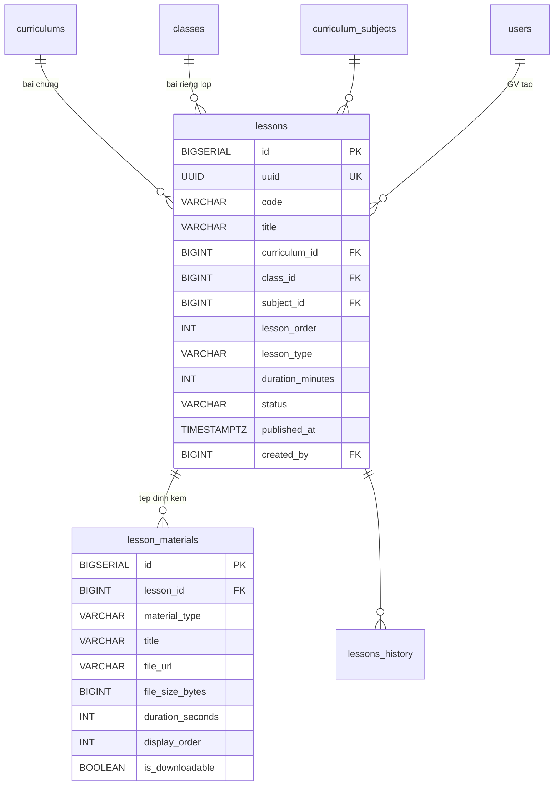
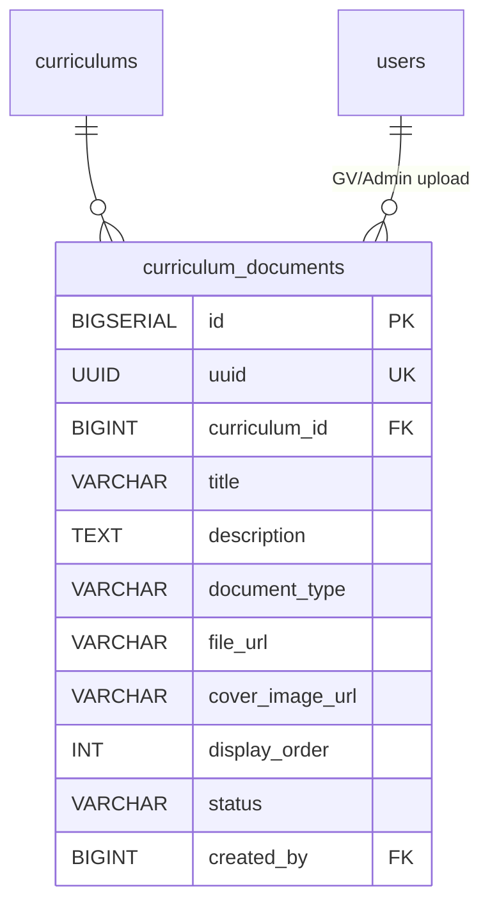
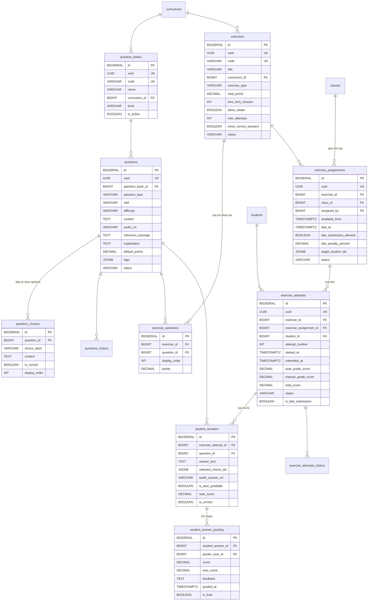
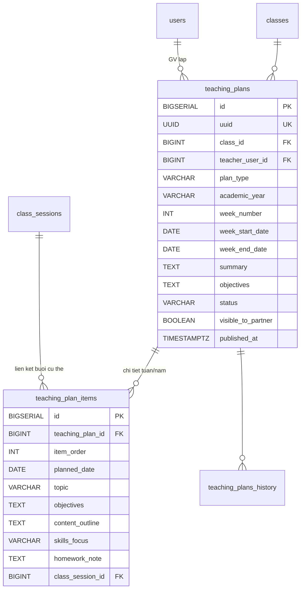

## LMS & Portal

### Mô tả tổng quan

Bao phủ FR-LMS-01 đến FR-LMS-09, chia làm 4 nhóm nhỏ: Bài giảng & Kho
học liệu, Ngân hàng câu hỏi & Bài tập, Portal phụ huynh, Kế hoạch giảng
dạy.

### Bài giảng & Kho học liệu

<!-- Nguồn: docs/diagrams/erd/ERD-Nhom8A-BaiGiang.mmd (chỉnh sửa trực tiếp file này, không sửa trong srs.md/sdd-groups) -->


**Tái cấu trúc 2026-07-27 (đã xác nhận với người dùng):** "Bài giảng &
Kho học liệu" (UC-23/UC-23a) đổi thành "Kho Video Ôn tập" — bỏ hẳn
PDF/Slide/Word/Image, chỉ còn video/audio ôn tập (Video từ kết nối/Video
phản xạ), tổ chức theo "bộ" (`review_video_sets`, trước là `lessons`),
mỗi bộ chứa nhiều video (`review_videos`, trước là `lesson_materials`),
thêm bảng hoàn toàn mới `review_video_progress` theo dõi % thời lượng
từng học sinh đã xem. Migration V52 (thay thế toàn bộ V16, DB dev xác
nhận 0 dòng dữ liệu tại thời điểm tái cấu trúc nên chọn DROP+CREATE thay
vì ALTER).

a)  Bảng review_video_sets --- "Bộ" video ôn tập

Bộ có thể thuộc curriculum (dùng chung nhiều lớp) hoặc thuộc 1 class cụ
thể (riêng).

  --------------------------------------------------------------------------------
  **Cột**            **Kiểu**        **Ràng buộc**              **Ghi chú**
  ------------------ --------------- -------------------------- ------------------
  id                 BIGSERIAL       PK

  uuid               UUID            UNIQUE, NOT NULL

  code               VARCHAR(50)     NOT NULL

  title              VARCHAR(500)    NOT NULL

  video_type         VARCHAR(20)     NOT NULL                   CONNECTION
                                                                 (Video từ kết
                                                                 nối) / REFLEX
                                                                 (Video phản
                                                                 xạ)

  curriculum_id      BIGINT          FK → curriculums(id), NULL Nếu là bộ chung

  class_id           BIGINT          FK → classes(id), NULL     Nếu là bộ riêng
                                                                 lớp

  subject_id         BIGINT          FK →
                                     curriculum_subjects(id),
                                     NULL

  display_order      INT             NULL

  status             VARCHAR(20)     NOT NULL, DEFAULT          DRAFT / PUBLISHED
                                     'DRAFT'                     / ARCHIVED

  published_at       TIMESTAMPTZ     NULL

  created_by         BIGINT          FK → users(id), NOT NULL

  created_at,        TIMESTAMPTZ     NOT NULL                   BaseAuditEntity —
  updated_at                                                     bảng lessons cũ
                                                                 thiếu 2 cột này,
                                                                 bổ sung khi tái
                                                                 cấu trúc
  --------------------------------------------------------------------------------

Có review_video_sets_history.

Ràng buộc:

ALTER TABLE review_video_sets ADD CONSTRAINT chk_review_video_set_scope CHECK (

(curriculum_id IS NOT NULL AND class_id IS NULL) OR

(curriculum_id IS NULL AND class_id IS NOT NULL)

);

*Logic HS xem được bộ gì:* HS trong lớp X xem được review_video_sets
WHERE class_id=X OR curriculum_id=(curriculum của lớp X).

*Ghi chú kế thừa (từ lessons cũ, UC-23a):* logic OR ở trên copy nguyên
văn từ `Lesson.findVisibleForClass` (repository method, đổi tên thành
`ReviewVideoSet.findVisibleForClass`) — bản gốc từng có 1 bug (bỏ sót bộ
dùng chung theo curriculum, chỉ lọc theo class_id) đã được sửa trước khi
tái cấu trúc, giữ nguyên logic đã fix. Học sinh gọi phải có
class_enrollments ACTIVE khớp lớp/khung đang truy vấn.

b)  Bảng review_videos --- Video/audio trong 1 bộ

  --------------------------------------------------------------------------
  **Cột**               **Kiểu**                **Ràng buộc**  **Ghi chú**
  --------------------- ----------------------- -------------- -------------
  id                    BIGSERIAL               PK

  review_video_set_id   BIGINT                  FK →
                                                 review_video_
                                                 sets(id), NOT
                                                 NULL

  source_type           VARCHAR(20)             NOT NULL       YOUTUBE_URL /
                                                                R2_VIDEO /
                                                                R2_AUDIO

  title                 VARCHAR(300)            NOT NULL

  file_url              VARCHAR(1000)           NOT NULL       Link YouTube
                                                                hoặc URL CDN
                                                                (Cloudflare R2,
                                                                FR-LMS-01)

  file_size_bytes       BIGINT                  NULL           NULL với
                                                                YOUTUBE_URL

  duration_seconds      INT                     NOT NULL       Bắt buộc cho
                                                                cả 3 nguồn —
                                                                FE tự phát
                                                                hiện trước khi
                                                                gọi API, dùng
                                                                tính % xem
                                                                (UC-23a)

  display_order         INT                     NOT NULL,
                                                 DEFAULT 0

  created_at,           TIMESTAMPTZ             NOT NULL       BaseAuditEntity
  updated_at
  --------------------------------------------------------------------------

Không history, thay đổi video tạo bản ghi mới. Bỏ `material_type` (thay
bằng `source_type`) và `is_downloadable` so với `lesson_materials` cũ —
cho tải xuống sẽ phá mục đích theo dõi % xem, không có yêu cầu nào cần
giữ.

c)  Bảng review_video_progress --- Theo dõi tiến độ xem (MỚI HOÀN TOÀN,
UC-23a, 2026-07-27, bổ sung ngoài SDD gốc đã xác nhận với người dùng —
chưa từng tồn tại cơ chế này trước khi tái cấu trúc)

  --------------------------------------------------------------------------
  **Cột**               **Kiểu**                **Ràng buộc**  **Ghi chú**
  --------------------- ----------------------- -------------- -------------
  id                    BIGSERIAL               PK

  review_video_id       BIGINT                  FK →
                                                 review_videos
                                                 (id), NOT NULL

  student_id            BIGINT                  FK →
                                                 students(id),
                                                 NOT NULL

  watched_seconds       INT                     NOT NULL,      Mốc giây CAO
                                                 DEFAULT 0      NHẤT từng đạt
                                                                — server lấy
                                                                max(cũ, mới),
                                                                không giảm khi
                                                                tua tới

  is_completed          BOOLEAN                 NOT NULL,      Tính lại mỗi
                                                 DEFAULT FALSE  lần cập nhật =
                                                                watched_seconds
                                                                >= duration_
                                                                seconds * 0.8

  created_at,           TIMESTAMPTZ             NOT NULL       BaseAuditEntity
  updated_at
  --------------------------------------------------------------------------

Ràng buộc: UNIQUE (review_video_id, student_id) — 1 dòng/học sinh/video,
upsert mỗi lần báo tiến độ. Giáo viên xem thống kê theo bộ + lớp qua API
riêng (GET /api/review-video-sets/{setId}/stats), ghép ma trận học sinh
× video ở tầng Service (roster lớp LEFT JOIN video LEFT JOIN tiến độ —
học sinh chưa xem gì vẫn hiện 0%, không biến mất khỏi ma trận).

### Kho tài liệu tham khảo (UC-60, FR-LMS-13 — bổ sung ngoài SDD gốc, đã xác nhận với người dùng)

Khái niệm độc lập với review_video_sets/review_videos ở trên — không gắn
1 bộ video ôn tập cụ thể nào, chỉ gắn theo curriculum. Migration V41.



a)  Bảng curriculum_documents --- Tài liệu tham khảo

  --------------------------------------------------------------------------------
  **Cột**            **Kiểu**        **Ràng buộc**              **Ghi chú**
  ------------------ --------------- -------------------------- ------------------
  id                 BIGSERIAL       PK                          

  uuid               UUID            UNIQUE, NOT NULL           

  curriculum_id      BIGINT          FK → curriculums(id), NOT  
                                     NULL                       

  title              VARCHAR(500)    NOT NULL                   

  description        TEXT            NULL                       

  document_type      VARCHAR(30)     NOT NULL                   VIDEO / PDF /
                                                                AUDIO / SLIDE /
                                                                IMAGE / OTHER

  file_url           VARCHAR(1000)   NOT NULL                   Bắt buộc qua
                                                                CDN
                                                                (NFR-TECH-07)

  cover_image_url    VARCHAR(500)    NULL                       Ảnh bìa hiển
                                                                thị khi liệt
                                                                kê kho tài
                                                                liệu, độc
                                                                lập với
                                                                file_url. Bổ
                                                                sung ngoài
                                                                SDD gốc, đã
                                                                xác nhận với
                                                                người dùng
                                                                (2026-07-23,
                                                                V48)

  display_order      INT             NOT NULL, DEFAULT 0        

  status              VARCHAR(20)     NOT NULL, DEFAULT          DRAFT / PUBLISHED
                                     \'DRAFT\'                  / ARCHIVED

  created_by         BIGINT          FK → users(id), NOT NULL    
  --------------------------------------------------------------------------------

Không có bảng history — sửa metadata/trạng thái update tại chỗ (không
có ràng buộc downstream nào cần bất biến, khác questions/review_video_sets).

*Logic HS xem được tài liệu gì:* HS ghi danh ACTIVE tại lớp thuộc
curriculum X xem được curriculum_documents WHERE curriculum_id=X AND
status=PUBLISHED.

Permission riêng `lms.document.manage` (gán mặc định TEACHER, có thể
gán thêm cho HEAD_ACADEMIC/SITE_MANAGER qua UC-04 override) — không tái
dùng `lms.exercise.manage` vì mô tả permission đó đã khai rõ "ngân hàng
câu hỏi & đề kiểm tra", khác ngữ nghĩa.

**Bổ sung ngoài SDD gốc, đã xác nhận với người dùng (2026-07-22, theo
yêu cầu FE):** `lesson_materials.file_url` (nay là `review_videos.
file_url`, xem ghi chú tái cấu trúc 2026-07-27 ở mục Kho Video Ôn tập
phía trên) và `curriculum_documents.file_url` ở trên vốn quy ước "Bắt
buộc qua CDN" nhưng thực tế là field nhập tay URL, không qua upload
thật. Đã thêm 2 module `LESSON_MATERIAL` (nay là `REVIEW_VIDEO`) và
`CURRICULUM_DOCUMENT` vào `MediaModule` (dùng chung
`POST /api/media/upload` với `LMS_QUESTION`, xem ghi chú ở mục Ngân hàng
câu hỏi bên dưới) — 2 module này ban đầu được nhận thêm PDF/Word/Excel/
PowerPoint (≤20MB) và `video/*` (≤200MB) ngoài audio/ảnh, khớp với miền
giá trị `material_type`/`document_type` (VIDEO/PDF/AUDIO/SLIDE/IMAGE/
OTHER) đã thiết kế ở 2 bảng trên — cột `material_type`/`document_type`
vẫn do người dùng tự chọn trong form, không suy ra tự động từ
Content-Type file upload. **Từ 2026-07-27:** `REVIEW_VIDEO` (Kho Video
Ôn tập) chỉ còn nhận video/audio, không còn PDF/Word/Excel/PowerPoint —
cờ `acceptsDocuments()` được tách thành `acceptsVideo()`/
`acceptsOfficeDocuments()` độc lập để hỗ trợ riêng trường hợp này;
`CURRICULUM_DOCUMENT`/`LMS_QUESTION` không đổi hành vi.

**Bổ sung ngoài SDD gốc, đã xác nhận với người dùng (2026-07-23, V48):**
thêm cột `cover_image_url` cho `curriculum_documents` — ảnh bìa hiển thị
khi liệt kê danh sách tài liệu, độc lập với `file_url` (nội dung tài liệu
thực tế). Upload qua `POST /api/media/upload` dùng lại module
`CURRICULUM_DOCUMENT` sẵn có (nhánh `image/*` trong `MediaStorageService.
store()` không phân biệt theo `acceptsDocuments`, mọi module đều nhận
ảnh) — không cần thêm module riêng.

### Ngân hàng câu hỏi & Bài tập

<!-- Nguồn: docs/diagrams/erd/ERD-Nhom8B-CauHoiBaiTap.mmd (chỉnh sửa trực tiếp file này, không sửa trong srs.md/sdd-groups) -->


Hỗ trợ 3 loại câu hỏi: Trắc nghiệm, tự luận, nói (upload audio).

a)  Bảng question_banks --- Ngân hàng câu hỏi

  ------------------------------------------------------------------------------
  **Cột**         **Kiểu**          **Ràng buộc**              **Ghi chú**
  --------------- ----------------- -------------------------- -----------------
  id              BIGSERIAL         PK                          

  uuid            UUID              UNIQUE, NOT NULL           

  code            VARCHAR(50)       UNIQUE, NOT NULL            

  name            VARCHAR(300)      NOT NULL                   

  curriculum_id   BIGINT            FK → curriculums(id), NULL  

  subject_id      BIGINT            FK →                       
                                    curriculum_subjects(id),   
                                    NULL                       

  level           VARCHAR(50)       NULL                       A1/A2/B1/B2\...

  is_active       BOOLEAN           NOT NULL, DEFAULT TRUE     
  ------------------------------------------------------------------------------

Không history

b)  Bảng questions --- Câu hỏi

  -------------------------------------------------------------------------------
  **Cột**             **Kiểu**         **Ràng buộc**         **Ghi chú**
  ------------------- ---------------- --------------------- --------------------
  id                  BIGSERIAL        PK                     

  uuid                UUID             UNIQUE, NOT NULL      

  question_bank_id    BIGINT           FK →                   
                                       question_banks(id),   
                                       NOT NULL              

  question_type       VARCHAR(30)      NOT NULL              MULTIPLE_CHOICE /
                                                             MULTIPLE_ANSWER /
                                                             TRUE_FALSE /
                                                             FILL_IN_BLANK /
                                                             ESSAY / SPEAKING

  skill               VARCHAR(20)      NULL                  LISTENING / READING
                                                             / WRITING / SPEAKING
                                                             / GRAMMAR / OTHER

  difficulty          VARCHAR(20)      NULL                  EASY / MEDIUM / HARD

  content             TEXT             NOT NULL               

  audio_url           VARCHAR(1000)    NULL                  Câu hỏi Listening

  image_url           VARCHAR(1000)    NULL                   

  reference_passage   TEXT             NULL                  Đoạn văn tham chiếu
                                                             (Reading)

  explanation         TEXT             NULL                   

  default_points      DECIMAL(5,2)     NOT NULL, DEFAULT 1.0 

  tags                JSONB            NULL                   

  status              VARCHAR(20)      NOT NULL, DEFAULT     ACTIVE / ARCHIVED
                                       \'ACTIVE\'            

  created_by          BIGINT           FK → users(id)         
  -------------------------------------------------------------------------------

Có questions_history.\
Bảo vệ khi sửa: Nếu câu hỏi đã có student_answers, không cho sửa nội
dung/đáp án đúng. Tạo bản mới, archive bản cũ.

**Bổ sung ngoài SDD gốc, đã xác nhận với người dùng (2026-07-21, cập nhật
2026-07-22):** `audio_url`/`image_url` trước đây quy ước "đã upload sẵn
lên CDN ngoài" (không có hạ tầng lưu file trong phạm vi backend). Đã bổ
sung API dùng chung `POST /api/media/upload`
(`MediaController`/`MediaStorageService`) nhận multipart `audio/*`
(≤50MB) hoặc `image/*` (≤10MB) kèm tham số bắt buộc `module` (xem
`MediaModule` - từ 2026-07-22 có thêm `CURRICULUM_DOCUMENT`/
`LESSON_MATERIAL`, xem ghi chú ở mục "Kho tài liệu tham khảo" bên trên),
upload lên
**Cloudflare R2** (Object Storage tương thích S3 API, không tính phí
egress — xem `R2StorageConfig`) thay vì lưu đĩa cục bộ + Docker volume
như quyết định ban đầu, trả về URL công khai của R2 (r2.dev subdomain
hoặc Custom Domain, tuỳ cấu hình bucket) với key dạng
`{module}/{audio|images}/{uuid}.{ext}` - tham số `module` để phân biệt
"thư mục" trên R2 khi có module khác ngoài LMS cũng gọi API dùng chung
này sau này, tránh trộn lẫn file giữa các module. Không có bảng DB mới
cho việc này (stateless — R2 + tên file UUID là nguồn dữ liệu duy nhất).
Phạm vi lần đầu chỉ áp dụng cho 2 cột này của `questions`; các cột URL
khác trong hệ
thống chưa đổi.

c)  Bảng question_choices --- Đáp án trắc nghiệm

  -----------------------------------------------------------------------
  **Cột**          **Kiểu**            **Ràng buộc**    **Ghi chú**
  ---------------- ------------------- ---------------- -----------------
  id               BIGSERIAL           PK                

  question_id      BIGINT              FK →             
                                       questions(id),   
                                       NOT NULL         

  choice_label     VARCHAR(10)         NOT NULL         A/B/C/D hoặc
                                                        TRUE/FALSE

  content          TEXT                NOT NULL         

  is_correct       BOOLEAN             NOT NULL,         
                                       DEFAULT FALSE    

  display_order    INT                 NOT NULL,        
                                       DEFAULT 0        
  -----------------------------------------------------------------------

d)  Bảng exercises --- Đề ôn tập / Bài tập

  ----------------------------------------------------------------------------------
  **Cột**                **Kiểu**       **Ràng buộc**              **Ghi chú**
  ---------------------- -------------- -------------------------- -----------------
  id                     BIGSERIAL      PK                          

  uuid                   UUID           UNIQUE, NOT NULL           

  code                   VARCHAR(50)    UNIQUE, NOT NULL            

  title                  VARCHAR(500)   NOT NULL                   

  curriculum_id          BIGINT         FK → curriculums(id), NULL  

  subject_id             BIGINT         FK →                       
                                        curriculum_subjects(id),   
                                        NULL                       

  exercise_type          VARCHAR(30)    NOT NULL                   SELF_PRACTICE /
                                                                   ASSIGNED /
                                                                   MOCK_TEST /
                                                                   SKILL_PRACTICE

  total_points           DECIMAL(6,2)   NOT NULL                   

  time_limit_minutes     INT            NULL                       NULL = không giới
                                                                   hạn

  allow_retake           BOOLEAN        NOT NULL, DEFAULT TRUE     

  max_attempts           INT            NULL                        

  show_correct_answers   BOOLEAN        NOT NULL, DEFAULT TRUE     

  status                 VARCHAR(20)    NOT NULL, DEFAULT          DRAFT / PUBLISHED
                                        \'DRAFT\'                  / ARCHIVED

  created_by             BIGINT         FK → users(id), NOT NULL   Giáo viên soạn đề
                                                                   (theo FR-LMS-10)

  created_at, updated_at TIMESTAMPTZ    NOT NULL, DEFAULT NOW()    
  ----------------------------------------------------------------------------------

*Ghi chú sửa lỗi (UC-24):* cột `show_correct_answers` đã có sẵn từ đầu
nhưng trước đây chưa được `ExerciseAttemptService` đọc/áp dụng ở đâu cả
— đã nối dây lại: khi 1 lượt làm bài đã nộp (không còn IN_PROGRESS) và
`show_correct_answers=true`, response `student_answers` trả thêm đáp án
đúng (correct_choice_ids) và giải thích (questions.explanation, cột đã
có sẵn nhưng trước đây cũng chưa từng được dùng).

e)  Bảng exercise_questions --- Câu hỏi thuộc đề

  ------------------------------------------------------------------------
  **Cột**             **Kiểu**               **Ràng buộc**
  ------------------- ---------------------- -----------------------------
  id                  BIGSERIAL              PK

  exercise_id         BIGINT                 FK → exercises(id), NOT NULL

  question_id         BIGINT                 FK → questions(id), NOT NULL

  display_order       INT                    NOT NULL

  points              DECIMAL(5,2)           NOT NULL

                                             UNIQUE(exercise_id,
                                             question_id)
  ------------------------------------------------------------------------

f)  Bảng exercise_assignments --- Giao đề cho lớp

Phân biệt SELF_PRACTICE (luôn mở, có thể không cần assignment) và
ASSIGNED (có deadline).

  ----------------------------------------------------------------------------
  **Cột**                   **Kiểu**          **Ràng buộc**    **Ghi chú**
  ------------------------- ----------------- ---------------- ---------------
  id                        BIGSERIAL         PK                

  uuid                      UUID              UNIQUE, NOT NULL 

  exercise_id               BIGINT            FK →              
                                              exercises(id),   
                                              NOT NULL         

  class_id                  BIGINT            FK →             
                                              classes(id), NOT 
                                              NULL             

  assigned_by               BIGINT            FK → users(id),   
                                              NOT NULL         

  available_from            TIMESTAMPTZ       NOT NULL,        
                                              DEFAULT NOW()    

  due_at                    TIMESTAMPTZ       NULL             Deadline ---
                                                               NULL với bài tự
                                                               luyện

  late_submission_allowed   BOOLEAN           NOT NULL,        
                                              DEFAULT FALSE    

  late_penalty_percent      DECIMAL(5,2)      NULL              

  target_student_ids        JSONB             NULL             NULL = cả lớp;
                                                               có giá trị = cá
                                                               nhân hóa

  status                    VARCHAR(20)       NOT NULL,        ACTIVE /
                                              DEFAULT          CANCELLED /
                                              \'ACTIVE\'       COMPLETED
  ----------------------------------------------------------------------------

g)  Bảng exercise_attempts --- Lượt học sinh làm bài

  ------------------------------------------------------------------------------------
  **Cột**                  **Kiểu**       **Ràng buộc**               **Ghi chú**
  ------------------------ -------------- --------------------------- ----------------
  id                       BIGSERIAL      PK                           

  uuid                     UUID           UNIQUE, NOT NULL            

  exercise_id              BIGINT         FK → exercises(id), NOT      
                                          NULL                        

  exercise_assignment_id   BIGINT         FK →                        NULL cho
                                          exercise_assignments(id),   SELF_PRACTICE
                                          NULL                        

  student_id               BIGINT         FK → students(id), NOT NULL  

  attempt_number           INT            NOT NULL, DEFAULT 1         

  started_at, submitted_at TIMESTAMPTZ    submitted_at NULL = đang     
                                          làm dở                      

  auto_grade_score         DECIMAL(6,2)   NULL                        Trắc nghiệm

  manual_grade_score       DECIMAL(6,2)   NULL                        Tự luận + nói

  total_score              DECIMAL(6,2)   NULL                        

  status                   VARCHAR(20)    NOT NULL, DEFAULT           IN_PROGRESS /
                                          \'IN_PROGRESS\'             SUBMITTED /
                                                                      AUTO_GRADED /
                                                                      FULLY_GRADED /
                                                                      EXPIRED

  is_late_submission       BOOLEAN        NOT NULL, DEFAULT FALSE     
  ------------------------------------------------------------------------------------

Có exercise_attempts_history.

h)  Bảng student_answers --- Câu trả lời từng câu

  -----------------------------------------------------------------------------------------------------
  **Cột**               **Kiểu**        **Ràng buộc**                 **Ghi chú**
  --------------------- --------------- ----------------------------- ---------------------------------
  id                    BIGSERIAL       PK                             

  exercise_attempt_id   BIGINT          FK → exercise_attempts(id),   
                                        NOT NULL                      

  question_id           BIGINT          FK → questions(id), NOT NULL   

  answer_text           TEXT            NULL                          FILL_IN_BLANK, ESSAY

  selected_choice_ids   JSONB           NULL                          MULTIPLE_CHOICE/MULTIPLE_ANSWER

  audio_answer_url      VARCHAR(1000)   NULL                          SPEAKING --- audio HS upload

  is_auto_gradable      BOOLEAN         NOT NULL                       

  auto_score            DECIMAL(5,2)    NULL                          

  is_correct            BOOLEAN         NULL                           

                                        UNIQUE(exercise_attempt_id,   
                                        question_id)                  
  -----------------------------------------------------------------------------------------------------

i)  Bảng student_answer_grading --- GV chấm tự luận/nói

  --------------------------------------------------------------------------
  **Cột**               **Kiểu**             **Ràng buộc**           **Ghi
                                                                     chú**
  --------------------- -------------------- ----------------------- -------
  id                    BIGSERIAL            PK                       

  student_answer_id     BIGINT               FK →                    
                                             student_answers(id),    
                                             NOT NULL                

  grader_user_id        BIGINT               FK → users(id), NOT      
                                             NULL                    

  score, max_score      DECIMAL(5,2)         NOT NULL                

  feedback              TEXT                 NULL                     

  graded_at             TIMESTAMPTZ          NOT NULL, DEFAULT NOW() 

  is_final              BOOLEAN              NOT NULL, DEFAULT TRUE   
  --------------------------------------------------------------------------

Không history, sửa điểm chấm tạo record mới thay vì sửa.

### Luyện Nghe – Nói (UC-26, FR-LMS-04 — bổ sung ngoài SDD gốc, đã xác nhận với người dùng)

UC-26 đã có đặc tả Main Flow/Postcondition đầy đủ từ trước nhưng SDD
chưa từng có bảng nào cho tính năng này. Domain TÁCH RIÊNG hoàn toàn
khỏi Ngân hàng câu hỏi & Bài tập ở trên (không dùng chung
exercises/questions/exercise_attempts/student_answers) — theo xác nhận
của người dùng. Migration V42.

```mermaid
erDiagram
    curriculums ||--o{ listening_practice_items : ""
    users ||--o{ listening_practice_items : "GV soan"
    listening_practice_items ||--o{ listening_practice_attempts : "luot luyen"
    students ||--o{ listening_practice_attempts : ""
    listening_practice_attempts ||--o| listening_practice_gradings : "GV cham (che do Noi)"

    listening_practice_items {
        BIGSERIAL id PK
        UUID uuid UK
        BIGINT curriculum_id FK
        VARCHAR title
        VARCHAR mode
        VARCHAR audio_url
        TEXT script_text
        VARCHAR difficulty
        INT display_order
        VARCHAR status
        BIGINT created_by FK
    }

    listening_practice_attempts {
        BIGSERIAL id PK
        UUID uuid UK
        BIGINT practice_item_id FK
        BIGINT student_id FK
        INT attempt_number
        TIMESTAMPTZ started_at
        TIMESTAMPTZ submitted_at
        INT paused_position_seconds
        TEXT dictation_answer_text
        DECIMAL dictation_score
        VARCHAR audio_answer_url
        VARCHAR status
    }

    listening_practice_gradings {
        BIGSERIAL id PK
        BIGINT practice_attempt_id FK UK
        BIGINT grader_user_id FK
        DECIMAL score
        DECIMAL max_score
        TEXT feedback
        TIMESTAMPTZ graded_at
    }
```

a)  Bảng listening_practice_items --- Bài luyện Nghe/Chép chính tả/Nói

Tổ chức theo curriculum (không theo lớp/giao bài như exercises) — học
sinh tự luyện, không deadline (tinh thần giống exercise_type
SELF_PRACTICE nhưng là bảng riêng).

  --------------------------------------------------------------------------------
  **Cột**            **Kiểu**        **Ràng buộc**              **Ghi chú**
  ------------------ --------------- -------------------------- ------------------
  id                 BIGSERIAL       PK                          

  uuid               UUID            UNIQUE, NOT NULL           

  curriculum_id      BIGINT          FK → curriculums(id), NOT  
                                     NULL                       

  title              VARCHAR(500)    NOT NULL                   

  mode               VARCHAR(20)     NOT NULL                   LISTENING /
                                                                DICTATION /
                                                                SPEAKING

  audio_url          VARCHAR(1000)   NULL                       NULL = FE tự
                                                                đọc bằng Web
                                                                Speech API
                                                                trình duyệt

  script_text        TEXT            NOT NULL                   Highlight/so
                                                                khớp/mẫu chuẩn

  difficulty         VARCHAR(20)     NULL                       EASY / MEDIUM /
                                                                HARD

  display_order      INT             NOT NULL, DEFAULT 0        

  status              VARCHAR(20)     NOT NULL, DEFAULT          DRAFT / PUBLISHED
                                     \'DRAFT\'                  / ARCHIVED

  created_by         BIGINT          FK → users(id), NOT NULL    
  --------------------------------------------------------------------------------

b)  Bảng listening_practice_attempts --- Lượt học sinh luyện tập

Không giới hạn số lượt (khác exercise_attempts) — tự luyện thuần túy.

  --------------------------------------------------------------------------------------
  **Cột**                  **Kiểu**       **Ràng buộc**               **Ghi chú**
  ------------------------ -------------- --------------------------- ----------------
  id                       BIGSERIAL      PK                           

  uuid                     UUID           UNIQUE, NOT NULL            

  practice_item_id         BIGINT         FK →                        
                                          listening_practice_items(id),
                                          NOT NULL                    

  student_id               BIGINT         FK → students(id), NOT NULL  

  attempt_number           INT            NOT NULL, DEFAULT 1         

  started_at, submitted_at TIMESTAMPTZ    submitted_at NULL = đang     
                                          luyện dở                    

  paused_position_seconds  INT            NULL                        A1: tạm dừng
                                                                      giữa chừng

  dictation_answer_text    TEXT           NULL                        Chế độ Chép
                                                                      chính tả

  dictation_score          DECIMAL(5,2)   NULL                        So khớp tự
                                                                      động với
                                                                      script_text

  audio_answer_url         VARCHAR(1000)  NULL                        Chế độ Nói

  status                   VARCHAR(20)    NOT NULL, DEFAULT           IN_PROGRESS /
                                          \'IN_PROGRESS\'             SUBMITTED /
                                                                      GRADED
  --------------------------------------------------------------------------------------

c)  Bảng listening_practice_gradings --- GV chấm thủ công chế độ Nói

Tách riêng hoàn toàn khỏi student_answer_grading (UC-41) — 1 attempt
tối đa 1 lần chấm (UNIQUE practice_attempt_id, không cần versioning vì
không có nhiều câu hỏi con như student_answer_grading).

  --------------------------------------------------------------------------
  **Cột**               **Kiểu**             **Ràng buộc**           **Ghi
                                                                     chú**
  --------------------- -------------------- ----------------------- -------
  id                    BIGSERIAL            PK                       

  practice_attempt_id   BIGINT               FK →                    1
                                             listening_practice_attempts(id), attempt
                                             UNIQUE, NOT NULL        =1 lần
                                                                     chấm

  grader_user_id        BIGINT               FK → users(id), NOT      
                                             NULL                    

  score, max_score      DECIMAL(5,2)         NOT NULL                

  feedback              TEXT                 NULL                     

  graded_at             TIMESTAMPTZ          NOT NULL, DEFAULT NOW() 
  --------------------------------------------------------------------------

Không history — sửa điểm chấm update tại chỗ (khác student_answer_grading
vì chỉ 1 điểm/attempt, không cần versioning is_final).

Permission riêng `lms.listening-practice.manage` cho quản lý nội dung
(gán mặc định TEACHER) — chấm điểm tái dùng đúng `lms.grading.manage`
đã có sẵn (mô tả gốc "Chấm bài thủ công" đủ tổng quát cho cả 2 domain).

### Portal Phụ huynh

FR-LMS-03 và FR-LMS-07 là read-only view trên dữ liệu đã có ở các nhóm
khác, không cần bảng riêng:

  -----------------------------------------------------------------------
  **Nội dung hiển thị**   **Nguồn dữ liệu**
  ----------------------- -----------------------------------------------
  Bảng điểm               grade_entries WHERE status=APPROVED (Nhóm 5)

  Chuyên cần              attendance_marks join class_sessions (Nhóm 5)

  Nhận xét/Cảnh báo       student_comments WHERE status=APPROVED (Nhóm 5)

  Lịch học                class_sessions (Nhóm 5)

  Thông báo               notifications (Nhóm 9)
  -----------------------------------------------------------------------

Mọi query đều lọc theo parent_student (Nhóm 3) để xác định phạm vi con
của phụ huynh đang đăng nhập.

### Kế hoạch giảng dạy

<!-- Nguồn: docs/diagrams/erd/ERD-Nhom8D-KeHoachGiangDay.mmd (chỉnh sửa trực tiếp file này, không sửa trong srs.md/sdd-groups) -->


a)  Bảng teaching_plans --- Kế hoạch giảng dạy

  -------------------------------------------------------------------------
  **Cột**              **Kiểu**             **Ràng buộc**  **Ghi chú**
  -------------------- -------------------- -------------- ----------------
  id                   BIGSERIAL            PK              

  uuid                 UUID                 UNIQUE, NOT    
                                            NULL           

  class_id             BIGINT               FK →            
                                            classes(id),   
                                            NOT NULL       

  teacher_user_id      BIGINT               FK →           
                                            users(id), NOT 
                                            NULL           

  plan_type            VARCHAR(20)          NOT NULL       WEEKLY / YEARLY

  academic_year        VARCHAR(20)          NULL           Cho YEARLY

  week_number,         INT, DATE, DATE      NULL           Cho WEEKLY
  week_start_date,                                         
  week_end_date                                            

  summary, objectives  TEXT                 NULL           

  status               VARCHAR(20)          NOT NULL,      DRAFT /
                                            DEFAULT        PUBLISHED
                                            \'DRAFT\'      

  visible_to_partner   BOOLEAN              NOT NULL,      Hiển thị Portal
                                            DEFAULT TRUE   trường liên kết

  published_at         TIMESTAMPTZ          NULL            
  -------------------------------------------------------------------------

Có teaching_plans_history.

Ràng buộc:

ALTER TABLE teaching_plans ADD CONSTRAINT chk_plan_period CHECK (

(plan_type = \'WEEKLY\' AND week_start_date IS NOT NULL AND
week_end_date IS NOT NULL) OR

(plan_type = \'YEARLY\' AND academic_year IS NOT NULL));

b)  Bảng teaching_plan_items --- Chi tiết kế hoạch

  ------------------------------------------------------------------------
  **Cột**              **Kiểu**             **Ràng buộc**          **Ghi
                                                                   chú**
  -------------------- -------------------- ---------------------- -------
  id                   BIGSERIAL            PK                      

  teaching_plan_id     BIGINT               FK →                   
                                            teaching_plans(id),    
                                            NOT NULL               

  item_order           INT                  NOT NULL                

  planned_date         DATE                 NULL                   

  topic                VARCHAR(500)         NOT NULL                

  objectives,          TEXT                 NULL                   
  content_outline                                                  

  skills_focus         VARCHAR(200)         NULL                    

  homework_note        TEXT                 NULL                   

  class_session_id     BIGINT               FK →                   Link
                                            class_sessions(id),    tới
                                            NULL                   buổi cụ
                                                                   thể nếu
                                                                   có
  ------------------------------------------------------------------------

Không history riêng.

*Xuất file PDF/Excel (theo quyết định \"cả xem trực tiếp + có nút xuất
file\" của FR-LMS-09):* Không cần bảng --- service query 2 bảng trên rồi
format ra template.
