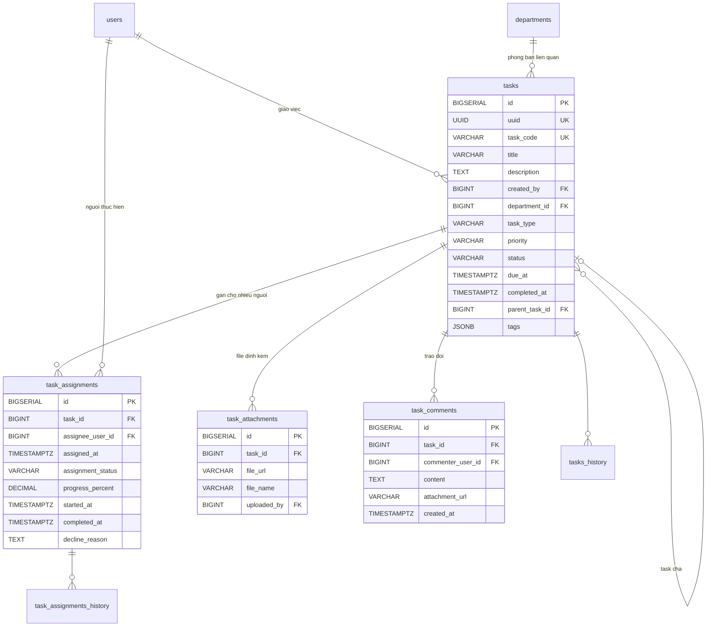
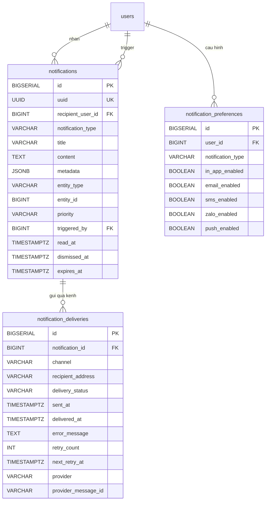

## Task Management & Thông báo

### Mô tả tổng quan

Nhóm gồm 2 phần: Task Management và Notifications. Notifications bao gồm
hệ thống thông báo chung, phục vụ cho mọi phân hệ khác.

### Task Management

<!-- Nguồn: docs/diagrams/erd/ERD-Nhom9A-TaskManagement.mmd (chỉnh sửa trực tiếp file này, không sửa trong srs.md/sdd-groups) -->

a)  Bảng tasks -- Công việc

  --------------------------------------------------------------------------
  **Cột**          **Kiểu**            **Ràng buộc**      **Ghi chú**
  ---------------- ------------------- ------------------ ------------------
  id               BIGSERIAL           PK                  

  uuid             UUID                UNIQUE, NOT NULL   

  task_code        VARCHAR(50)         UNIQUE, NOT NULL   VD
                                                          TSK-2026-07-0001

  title            VARCHAR(500)        NOT NULL           

  description      TEXT                NULL                

  created_by       BIGINT              FK → users(id),    Cấp quản lý/trưởng
                                       NOT NULL           phòng ban giao
                                                          việc

  department_id    BIGINT              FK →                
                                       departments(id),   
                                       NULL               

  task_type        VARCHAR(30)         NOT NULL, DEFAULT  GENERAL / URGENT /
                                       \'GENERAL\'        RECURRING /
                                                          PROJECT

  priority         VARCHAR(20)         NOT NULL, DEFAULT  LOW / NORMAL /
                                       \'NORMAL\'         HIGH / URGENT

  status           VARCHAR(20)         NOT NULL, DEFAULT  OPEN / IN_PROGRESS
                                       \'OPEN\'           / COMPLETED /
                                                          CANCELLED /
                                                          OVERDUE

  due_at           TIMESTAMPTZ         NULL                

  completed_at     TIMESTAMPTZ         NULL               

  parent_task_id   BIGINT              FK → tasks(id),    Cho phép chia task
                                       NULL               lớn thành
                                                          sub-tasks

  tags             JSONB               NULL               
  --------------------------------------------------------------------------

Có tasks_history.

Chỉ số:

CREATE INDEX idx_tasks_overdue ON tasks(status, due_at)

WHERE status IN (\'OPEN\',\'IN_PROGRESS\') AND due_at IS NOT NULL;

Logic auto-status: Khi tất cả task_assignments của task = COMPLETED →
tasks.status = COMPLETED. Cron job nightly set OVERDUE khi quá hạn.

Phân quyền: Cấp quản lý/trưởng phòng giao việc cho nhân sự trực thuộc
phòng ban trực thuộc; riêng Quản lý vận hành có quyền giao việc cho toàn
công ty, kể cả cấp quản lý khác.

b)  Bảng task_assignments --- Gán task cho người thực hiện

  --------------------------------------------------------------------------
  **Cột**             **Kiểu**          **Ràng buộc**       **Ghi chú**
  ------------------- ----------------- ------------------- ----------------
  id                  BIGSERIAL         PK                   

  task_id             BIGINT            FK → tasks(id), NOT 
                                        NULL                

  assignee_user_id    BIGINT            FK → users(id), NOT  
                                        NULL                

  assigned_at         TIMESTAMPTZ       NOT NULL, DEFAULT   
                                        NOW()               

  assignment_status   VARCHAR(20)       NOT NULL, DEFAULT   PENDING /
                                        \'PENDING\'         ACCEPTED /
                                                            IN_PROGRESS /
                                                            COMPLETED /
                                                            DECLINED

  progress_percent    DECIMAL(5,2)      NOT NULL, DEFAULT 0 Người thực hiện
                                                            tự cập nhật

  started_at,         TIMESTAMPTZ       NULL                 
  completed_at                                              

  decline_reason      TEXT              NULL                

                                        UNIQUE(task_id,      
                                        assignee_user_id)   
  --------------------------------------------------------------------------

Có task_assignments_history làm cơ sở cho báo cáo hiệu suất.

c)  Bảng task_attachments --- File đính kèm

  ------------------------------------------------------------------------
  **Cột**                **Kiểu**                        **Ràng buộc**
  ---------------------- ------------------------------- -----------------
  id                     BIGSERIAL                       PK

  task_id                BIGINT                          FK → tasks(id),
                                                         NOT NULL

  file_url               VARCHAR(1000)                   NOT NULL

  file_name              VARCHAR(500)                    NOT NULL

  uploaded_by            BIGINT                          FK → users(id)
  ------------------------------------------------------------------------

d)  Bảng task_comments --- Trao đổi trong task

  ------------------------------------------------------------------------
  **Cột**                  **Kiểu**                **Ràng buộc**   **Ghi
                                                                   chú**
  ------------------------ ----------------------- --------------- -------
  id                       BIGSERIAL               PK               

  task_id                  BIGINT                  FK → tasks(id), 
                                                   NOT NULL        

  commenter_user_id        BIGINT                  FK → users(id),  
                                                   NOT NULL        

  content                  TEXT                    NOT NULL        

  attachment_url           VARCHAR(1000)           NULL             

  created_at               TIMESTAMPTZ             NOT NULL,       
                                                   DEFAULT NOW()   
  ------------------------------------------------------------------------

Không history, dạng log, không sửa (cần sửa thì thêm comment mới).

### Notifications

<!-- Nguồn: docs/diagrams/erd/ERD-Nhom9B-Notifications.mmd (chỉnh sửa trực tiếp file này, không sửa trong srs.md/sdd-groups) -->

Thiết kế theo pattern \"channel-agnostic\" --- tách nội dung thông báo
khỏi kênh gửi, dễ mở rộng SMS/Zalo/Push sau này mà không đổi schema.

a)  Bảng notifications --- Thông báo

  -----------------------------------------------------------------------------
  **Cột**             **Kiểu**         **Ràng       **Ghi chú**
                                       buộc**       
  ------------------- ---------------- ------------ ---------------------------
  id                  BIGSERIAL        PK            

  uuid                UUID             UNIQUE, NOT  
                                       NULL         

  recipient_user_id   BIGINT           FK →          
                                       users(id),   
                                       NOT NULL     

  notification_type   VARCHAR(50)      NOT NULL     ATTENDANCE_ABSENT /
                                                    TASK_ASSIGNED /
                                                    TASK_COMMENT / INVOICE_DUE
                                                    / GRADE_PUBLISHED /
                                                    COMMENT_APPROVED /
                                                    PARTNER_FEEDBACK /
                                                    LEAVE_REQUEST_STATUS /
                                                    SYSTEM_ANNOUNCEMENT / OTHER

  title               VARCHAR(500)     NOT NULL      

  content             TEXT             NOT NULL     

  metadata            JSONB            NULL          

  entity_type         VARCHAR(50)      NULL         Loại object liên quan để
                                                    click chuyển trang

  entity_id           BIGINT           NULL          

  priority            VARCHAR(20)      NOT NULL,    LOW / NORMAL / HIGH /
                                       DEFAULT      URGENT
                                       \'NORMAL\'   

  triggered_by        BIGINT           FK →         NULL = system
                                       users(id),   
                                       NULL         

  read_at             TIMESTAMPTZ      NULL         

  dismissed_at        TIMESTAMPTZ      NULL          

  expires_at          TIMESTAMPTZ      NULL         
  -----------------------------------------------------------------------------

Không history --- bản chất là log.

Chỉ số:

CREATE INDEX idx_notif_recipient_unread ON
notifications(recipient_user_id, created_at DESC)

WHERE read_at IS NULL AND dismissed_at IS NULL;

b)  Bảng notification_deliveries --- Gửi qua kênh

Tách riêng vì 1 notification có thể gửi qua nhiều kênh (in-app + email
hiện tại; SMS/Zalo/Push tương lai), mỗi kênh trạng thái riêng.

  ------------------------------------------------------------------------------------
  **Cột**               **Kiểu**          **Ràng buộc**        **Ghi chú**
  --------------------- ----------------- -------------------- -----------------------
  id                    BIGSERIAL         PK                    

  notification_id       BIGINT            FK →                 
                                          notifications(id),   
                                          NOT NULL             

  channel               VARCHAR(20)       NOT NULL             IN_APP / EMAIL / SMS /
                                                               ZALO / PUSH

  recipient_address     VARCHAR(500)      NULL                 Snapshot
                                                               email/SĐT/device token
                                                               tại thời điểm gửi

  delivery_status       VARCHAR(20)       NOT NULL, DEFAULT    PENDING / QUEUED / SENT
                                          \'PENDING\'          / DELIVERED / FAILED /
                                                               BOUNCED

  sent_at, delivered_at TIMESTAMPTZ       NULL                 

  error_message         TEXT              NULL                  

  retry_count           INT               NOT NULL, DEFAULT 0  

  next_retry_at         TIMESTAMPTZ       NULL                  

  provider              VARCHAR(50)       NULL                 \"SMTP-SendGrid\"\...

  provider_message_id   VARCHAR(200)      NULL                  
  ------------------------------------------------------------------------------------

c)  Bảng notification_preferences --- Cấu hình theo user

  ------------------------------------------------------------------------
  **Cột**                 **Kiểu**               **Ràng buộc**
  ----------------------- ---------------------- -------------------------
  id                      BIGSERIAL              PK

  user_id                 BIGINT                 FK → users(id), NOT NULL

  notification_type       VARCHAR(50)            NOT NULL

  in_app_enabled          BOOLEAN                NOT NULL, DEFAULT TRUE

  email_enabled           BOOLEAN                NOT NULL, DEFAULT TRUE

  sms_enabled,            BOOLEAN                NOT NULL, DEFAULT FALSE
  zalo_enabled,                                  
  push_enabled                                   

                                                 UNIQUE(user_id,
                                                 notification_type)
  ------------------------------------------------------------------------

Logic gửi thông báo:

1\. Sự kiện xảy ra (VD HS vắng học) → xác định recipient (tất cả PH của
HS)

2\. Với mỗi recipient: INSERT notifications, đọc
notification_preferences

(không có record → mặc định in-app + email = enabled)

3\. Mỗi kênh enabled → INSERT notification_deliveries (status=PENDING)

4\. Background job xử lý delivery: IN_APP đánh dấu SENT ngay;

EMAIL gửi qua SMTP, cập nhật DELIVERED/BOUNCED qua webhook

5\. FAILED + retry_count \< max → schedule next_retry_at
