Được soạn bởi: Lăng Tuấn Anh

Hà Nội, Ngày 01, Tháng 07, Năm 2026

# Mục lục {#mục-lục .TOC-Heading}

[**1. Giới thiệu** [1](#giới-thiệu)](#giới-thiệu)

[**1.1. Mục đích** [1](#mục-đích)](#mục-đích)

[**1.2. Phạm vi** [1](#phạm-vi)](#phạm-vi)

[**1.3. Từ điển thuật ngữ** [1](#từ-điển-thuật-ngữ)](#từ-điển-thuật-ngữ)

[**1.4. Tổng quát** [1](#tổng-quát)](#tổng-quát)

[**2. Các yêu cầu chức năng** [2](#_Toc233889374)](#_Toc233889374)

[**2.1. Các tác nhân** [2](#các-tác-nhân)](#các-tác-nhân)

[**2.2. Các phân hệ và chức năng của hệ thống**
[2](#các-phân-hệ-và-chức-năng-của-hệ-thống)](#các-phân-hệ-và-chức-năng-của-hệ-thống)

[**3. Các yêu cầu phi chức năng**
[8](#các-yêu-cầu-phi-chức-năng)](#các-yêu-cầu-phi-chức-năng)

[**3.1. Giao diện người dùng.**
[8](#giao-diện-người-dùng.)](#giao-diện-người-dùng.)

[**3.2. Công nghệ sử dụng.**
[8](#công-nghệ-sử-dụng.)](#công-nghệ-sử-dụng.)

[**3.3. Tính bảo mật.** [9](#tính-bảo-mật.)](#tính-bảo-mật.)

[**3.4. Ràng buộc.** [9](#ràng-buộc.)](#ràng-buộc.)

# Giới thiệu

## **Mục đích**

Mục đích của tài liệu đặc tả yêu cầu phần mềm này là cung cấp một cái
nhìn tổng quan, dễ hiểu về các yêu cầu, thành phần của dự án.

Tài liệu này được cung cấp như một tài liệu tham khảo cho các bên trực
tiếp tham gia phát triển dự án PPS Education. Ngoài ra trong môi trường
thực tế bên ngoài tài liệu này còn phục cho những nhà phát triền dự án
phần mềm, kiểm thử viên, nhà quản lý dự án cũng như các bên liên quan.

## **Phạm vi**

Tài liệu đặc tả yêu cầu phần mềm này được xây dựng nhằm phục vụ cho dự
án Phát triển hệ thống giáo dục và quản lý PPS Education phục vụ công
việc giảng dạy, học tập và quản lý.

## **Từ điển thuật ngữ**

  -----------------------------------------------------------------------
  Software Requirements               Đặc tả yêu cầu phần mềm
  Specifications SRS                  
  ----------------------------------- -----------------------------------
  Use Case(s)                         Biêu đồ mô tả những yêu cầu của hệ
                                      thống

                                      

                                      
  -----------------------------------------------------------------------

## **Tổng quát**

Tài liệu này được viết dựa theo tiêu chuẩn của Tài liệu đặc tả yêu cầu
phần mềm được giải thích trong "IEEE Recommend Practice for Software
Requirements Specifications" và "IEEE Guide for Developing System
Requirements Specification".

Tài liệu có cấu trúc được chia làm 3 phần.

1.  Phần 1: Cung cấp cái nhìn tổng quan về các thành phần của SRS.

2.  Phần 2: Mô tả tổng quan các nhân tố, ràng buộc, đặc điểm người dùng,
    môi trường thực thi tác động lên hệ thống và các yêu cầu của nó.
    Cung cấp thông tin chi tiết các yêu cầu chức năng, cung cấp cho các
    nhà phát triển phần mềm thông tin để phát triển phần mềm đáp ứng
    được các yếu tố đó.

3.  Phần 3: Các yêu cầu phi chức năng

[]{#_Toc233889374 .anchor}**\
**

# Các yêu cầu chức năng

## **Các tác nhân**

Hệ thống gồm có các tác nhân là Học sinh, Phụ huynh, Giáo viên, Trưởng
phòng đào tạo, Quản lý điểm trường, Quản lý nhân sự, Nhân viên, Quản trị
viên, Đại diện trường liên kết, Quản lý vận hành, Ban giám đốc.

***Lưu ý bản chất mô tả tác nhân:** Các mô tả tác nhân dưới đây thể hiện
phạm vi công việc điển về hình/mặc định theo mô hình tổ chức của trung
tâm, phục vụ mục đích thiết kế use case và nhóm quyền mặc định
(FR-PER-02). Trên thực tế vận hành, một tài khoản có thể được cấp quyền
thực hiện công việc thuộc phạm vi tác nhân khác (ví dụ: một Giáo viên
được ủy quyền xếp lịch thay Trưởng phòng đào tạo trong một số trường hợp
cụ thể) thông qua cơ chế tùy chỉnh quyền theo từng tài khoản
(FR-PER-03). Vì vậy, các FR trong tài liệu này mô tả quy trình nghiệp vụ
theo vai trò chuẩn, không phải ràng buộc kỹ thuật cứng về việc chỉ tác
nhân đó mới được thao tác.*

**Chi tiết từng tác nhân:**

-   **Học sinh:** Người trực tiếp sử dụng dịch vụ và tham gia vào các
    lớp học.

-   **Phụ huynh:** Người giám hộ, đóng vai trò theo dõi tiến độ và thanh
    toán tài chính.

-   **Giáo viên:** Người trực tiếp thực hiện công tác giảng dạy và đánh
    giá học sinh, chịu sự điều phối của Quản lý điểm trường tại (các)
    điểm trường mình giảng dạy. Một Giáo viên có thể được phân công dạy
    tại nhiều điểm trường khác nhau.

-   **Trưởng phòng đào tạo:** Người có quyền hạn cao nhất của Phòng Đào
    tạo, chịu trách nhiệm toàn bộ hoạt động học thuật của hệ thống ---
    thiết lập khung chương trình chuẩn, phê duyệt cuối cùng các bản tùy
    biến chương trình theo từng điểm trường, lên lịch và sắp xếp lớp
    học, điều phối giáo viên vào từng lớp. Sau khi quyết định, thông tin
    lớp/giáo viên được chuyển xuống Quản lý điểm trường tại từng điểm để
    triển khai và giám sát thực thi.

-   **Nhân viên:** Đại diện cho bộ phận tư vấn tuyển sinh, chăm sóc
    khách hàng hoặc giáo vụ.

-   **Quản lý điểm trường:** Thuộc Phòng Đào tạo. Người phụ trách vận
    hành một hoặc nhiều điểm trường cụ thể --- có thể là cơ sở do trung
    tâm sở hữu hoặc trường liên kết. Triển khai và giám sát các lớp học,
    giáo viên theo phân công của Trưởng phòng đào tạo; kiểm soát tình
    hình lớp học (sĩ số, chuyên cần, báo cáo học tập); là đầu mối tiếp
    nhận ý kiến/phản hồi từ Phụ huynh và Nhà trường liên kết; đồng thời
    phụ trách công tác hành chính của trung tâm tại trường liên kết
    (tiếp nhận công văn, thông báo từ trường).

-   **Quản lý nhân sự:** Người phụ trách vòng đời nhân sự ở cấp hệ thống
    --- hồ sơ, hợp đồng lao động, bảng lương, khen thưởng/kỷ luật. Không
    trực tiếp duyệt đơn từ hàng ngày (nghỉ phép, đi muộn) --- việc này
    thuộc thẩm quyền Quản lý điểm trường tại nơi nhân sự đó công tác.

-   **Quản trị viên:** Người phụ trách chính về mặt kỹ thuật và cấu hình
    hệ thống.

-   **Đại diện trường liên kết:** Người của trường liên kết. Có quyền
    xem báo cáo (chuyên cần, kết quả học tập, kế hoạch giảng dạy) của
    học sinh trường mình và gửi ý kiến/phản hồi tới Quản lý điểm trường
    phụ trách. Không có quyền chỉnh sửa hồ sơ học sinh hoặc dữ liệu học
    thuật.

-   **Quản lý vận hành:** Người phụ trách điều phối hoạt động chung tại
    trung tâm, làm việc trực tiếp với các trường liên kết về hợp đồng
    hợp tác và tổ chức các sự kiện do trung tâm thực hiện tại trường.

-   **Ban giám đốc:** Cấp quản lý cao nhất, xem báo cáo tổng hợp toàn hệ
    thống (tài chính, học thuật, nhân sự, vận hành) và phê duyệt các
    quyết định quan trọng có tính chiến lược (chi phí lớn, hợp đồng liên
    kết trường mới\...).

## **Các phân hệ và chức năng của hệ thống**

**PHÂN HỆ 1: ĐĂNG NHẬP & XÁC THỰC HỆ THỐNG**

-   **Mô tả tổng quan:** Kiểm soát quyền truy cập công nghệ của toàn bộ
    người dùng, bảo vệ an toàn lớp hạ tầng.

-   **Tác nhân tham gia:** Tất cả 11 tác nhân.

-   **Yêu cầu chức năng:**

    -   **FR-AUT-01: Đăng nhập đa phương thức -** Cho phép người dùng
        đăng nhập bằng Tài khoản/Mật khẩu hoặc Đăng nhập nhanh qua
        Google.

    -   **FR-AUT-02:** **Cơ chế chống Brute-Force** - Tự động khóa tài
        khoản trong 15 phút nếu nhập sai mật khẩu quá 5 lần. Ghi nhận
        địa chỉ IP và gửi cảnh báo về cho Quản trị viên.

**PHÂN HỆ 2: QUẢN TRỊ NGƯỜI DÙNG & PHÂN QUYỀN**

-   **Mô tả tổng quan:** Khởi tạo tài khoản và thiết lập cấu hình quyền
    hạn truy cập dữ liệu theo mô hình Hybrid PBAC.

-   **Tác nhân tham gia:** Quản trị viên.

-   **Yêu cầu chức năng:**

    -   **FR-PER-01: Quản lý Danh mục Quyền -** Khởi tạo danh mục các
        hành động chi tiết trong hệ thống.

    -   **FR-PER-02: Cấu hình Nhóm quyền sẵn -** Gom các quyền thành các
        nhóm vai trò mặc định áp dụng hàng loạt.

    -   **FR-PER-03: Cơ chế tùy chỉnh riêng -** Admin có giao diện chọn
        đích danh một tài khoản để: Bổ sung thêm quyền hoặc Tước bỏ
        quyền mặc định. Quyền ngoại lệ này có độ ưu tiên cao nhất.

    -   **FR-PER-04: Nhật ký thay đổi quyền -** Hệ thống bắt buộc lưu
        lại lịch sử: Ai đã sửa quyền, sửa của ai, vào thời gian nào để
        phục vụ tra soát.

    -   **FR-PER-05: Gán/Thu hồi vai trò cho tài khoản -** Quản trị
        viên gán 1 vai trò (role) cho 1 tài khoản cụ thể, hoặc thu hồi 1
        vai trò đã gán — mỗi tài khoản có thể mang nhiều vai trò cùng
        lúc (bảng user_roles thiết kế M-N). Khác với FR-PER-02 (cấu
        hình quyền MẶC ĐỊNH của 1 vai trò áp dụng hàng loạt) và
        FR-PER-03 (tùy chỉnh quyền LẺ cho 1 tài khoản) — FR-PER-05 là
        bước trung gian bắt buộc: liên kết tài khoản đó với vai trò
        đang có sẵn. Mỗi lần gán/thu hồi ghi 1 dòng vào
        permission_audit_log (action = ROLE_GRANTED/ROLE_REVOKED, cùng
        cơ chế tra soát với FR-PER-04).

    -   **FR-USR-01: Khởi tạo tài khoản người dùng -** Quản trị viên
        khởi tạo tài khoản (username, email, họ tên, SĐT, phòng ban).
        Mật khẩu ban đầu là tùy chọn: bỏ trống nếu tài khoản chỉ đăng
        nhập bằng Google (FR-AUT-01 — hệ thống khớp theo email). Việc
        gán vai trò/quyền KHÔNG thuộc bước khởi tạo — thực hiện sau qua
        FR-PER-05 (gán vai trò) và/hoặc FR-PER-03 (tùy chỉnh quyền lẻ).
        Ngoài ra, luồng khởi tạo hồ sơ nhân sự (FR-HRM-01) được phép
        tạo tài khoản kèm hồ sơ trong cùng một giao dịch cho nhân sự
        chưa có tài khoản.

    -   **FR-USR-02: Đổi mật khẩu -** Hai luồng: (1) Tài khoản tự đổi mật
        khẩu của chính mình, phải xác thực bằng mật khẩu hiện tại (trừ
        tài khoản đang chỉ đăng nhập Google — chưa có mật khẩu — đặt mật
        khẩu lần đầu không cần xác thực); (2) Quản trị viên (quyền
        user.manage) đổi mật khẩu cho một tài khoản khác, không cần biết
        mật khẩu hiện tại của tài khoản đó. Cả 2 luồng: mật khẩu mới tối
        thiểu 8 ký tự, sau khi đổi thành công hệ thống thu hồi toàn bộ
        refresh token đang hoạt động của tài khoản đó (đăng xuất khỏi mọi
        thiết bị, bắt buộc đăng nhập lại bằng mật khẩu mới).

    -   **FR-USR-03: Xem/tra cứu danh sách tài khoản -** Quản trị viên xem
        danh sách toàn bộ tài khoản; tìm kiếm theo username/email/họ tên,
        lọc theo phòng ban và trạng thái (ACTIVE/INACTIVE/SUSPENDED); xem
        chi tiết 1 tài khoản (không bao gồm password_hash). Là hạ tầng
        tra cứu bắt buộc trước khi thực hiện FR-USR-02 (đổi mật khẩu cho
        tài khoản khác), FR-PER-03 (tùy chỉnh quyền riêng), FR-PER-05
        (gán/thu hồi vai trò) và FR-USR-04 (khóa/mở khóa tài khoản) — cả
        4 FR này đều yêu cầu Quản trị viên "chọn đích danh 1 tài khoản"
        nhưng trước nay chưa có FR nào định nghĩa cách tra cứu ra tài
        khoản đó.

    -   **FR-USR-04: Khóa/Mở khóa tài khoản -** Quản trị viên chuyển
        trạng thái 1 tài khoản: ACTIVE → INACTIVE (ngừng hoạt động dài
        hạn, ví dụ nhân sự đã nghỉ việc/học sinh rời trung tâm — thao tác
        thủ công, KHÔNG tự động đồng bộ từ trạng thái nhân sự/học sinh,
        ngoài phạm vi thiết kế hiện tại), ACTIVE → SUSPENDED (tạm khóa có
        chủ đích, ví dụ đang xử lý vi phạm/nghi vấn bảo mật), hoặc khôi
        phục INACTIVE/SUSPENDED → ACTIVE. Tài khoản không ở trạng thái
        ACTIVE bị từ chối đăng nhập (đã đặc tả ở UC-01 A3) nhưng trước
        nay chưa có FR nào mô tả ai/khi nào thực hiện việc chuyển trạng
        thái đó. Mỗi lần đổi trạng thái ghi lại vào users_history.

**PHÂN HỆ 3: QUẢN LÝ CÔNG VIỆC VÀ QUY TRÌNH**

-   **Mô tả tổng quan:** Số hóa luồng giao việc, theo dõi tiến độ phối
    hợp giữa các phòng ban và cơ sở.

-   **Tác nhân tham gia:** Toàn bộ các cấp Quản lý, Giáo viên, Nhân
    viên.

-   **Yêu cầu chức năng:**

    -   **FR-TSK-01: Khởi tạo & Giao việc phân cấp --** Cấp quản lý và
        trưởng phòng có quyền giao việc cho nhân sự trực thuộc phòng ban
        trực thuộc, đặt Deadline, đính kèm tệp tin. Ngoại lệ: **Quản lý
        vận hành** có quyền giao việc cho toàn bộ công ty, kể cả cấp
        quản lý khác.

    -   **FR-TSK-02: Không gian làm việc Kanban/Gantt -** Người nhận
        việc có giao diện cập nhật trạng thái (Cần làm -\> Đang làm -\>
        Chờ duyệt -\> Hoàn thành). Quản lý theo dõi tiến độ tổng quan
        qua biểu đồ.

    -   **FR-TSK-03: Hệ thống thông báo thời gian thực -** Tự động gửi
        thông báo (Email) khi có đầu việc mới, khi công việc sắp trễ hạn
        hoặc khi có phản hồi mới từ cấp trên.

**PHÂN HỆ 4: QUẢN LÝ NHÂN SỰ**

-   **Mô tả tổng quan:** Quản lý hồ sơ, hợp đồng và tự động hóa quy
    trình chấm công, tính lương cho cán bộ nhân viên, giảng viên.

-   **Tác nhân tham gia:** Quản lý nhân sự, Quản lý điểm trường, Giáo
    viên, Nhân viên.

-   **Yêu cầu chức năng:**

    -   **FR-HRM-01: Hồ sơ nhân sự đa cơ sở -** Quản lý nhân sự lưu trữ
        thông tin cá nhân, bằng cấp, chứng chỉ sư phạm, lịch sử ký hợp
        đồng lao động và quá trình khen thưởng/kỷ luật.

    -   **FR-HRM-02: Chấm công đa hình thức** - Giáo viên và Nhân viên
        thực hiện chấm công qua máy vân tay, nhận diện khuôn mặt tại
        điểm trường hoặc định vị GPS trên ứng dụng. *Các cấp quản lý
        (Quản lý điểm trường, Trưởng phòng đào tạo, Quản lý vận hành,
        Quản lý nhân sự, Ban giám đốc) được miễn trừ chấm công.*

    -   **FR-HRM-03: Phê duyệt đơn từ trực tuyến -** Quy trình duyệt đơn
        nghỉ phép/đi muộn/về sớm phân theo nhóm nhân sự:

        -   **Nhân sự thuộc từng phòng ban:** đơn được duyệt qua 2 cấp
            --- Trưởng phòng ban duyệt ở cấp phòng ban, sau đó Quản lý
            vận hành duyệt ở cấp công ty (do Quản lý vận hành bao quát
            toàn bộ phòng ban của công ty).

        -   Nếu phòng ban không có trưởng phòng trực thuộc thì có thể bỏ
            qua bước Trưởng phòng ban duyệt, chuyển thẳng lên Quản lý
            vận hành.

        -   **Cấp quản lý** (Quản lý điểm trường, Trưởng phòng đào tạo,
            Quản lý vận hành, Quản lý nhân sự): đơn nghỉ phép do Ban
            giám đốc duyệt.

        -   **Ban giám đốc:** miễn trừ --- không cần xin duyệt nghỉ phép
            qua hệ thống.

    -   **FR-HRM-04: Bảng lương tự động -** Tự động tổng hợp công thức
        tính lương dựa trên ngày công của Nhân viên, số tiết dạy thực tế
        của Giáo viên (lấy dữ liệu từ Phân hệ Học thuật) và trừ đi các
        khoản phạt, thuế, bảo hiểm.

**PHÂN HỆ 5: QUẢN LÝ HỌC SINH**

-   **Mô tả tổng quan:** Quản lý thông tin định danh, hồ sơ lý lịch và
    trạng thái học tập của từng học sinh trong suốt vòng đời tại trường.

-   **Tác nhân tham gia:** Nhân viên (Giáo vụ), Quản lý điểm trường,
    Giáo viên, Học sinh, Phụ huynh.

-   **Yêu cầu chức năng:**

    -   **FR-STU-01: Hồ sơ điện tử học sinh -** Lưu trữ thông tin cá
        nhân, mã số học sinh (ID duy nhất), ảnh chân dung, thông tin
        liên hệ của Phụ huynh, và lịch sử chuyển lớp/chuyển điểm trường.

    -   **FR-STU-02: Quản lý trạng thái học tập -** Cập nhật và theo dõi
        trạng thái của học sinh theo thời gian thực (Đang học, Bảo lưu,
        Đình chỉ, Đã tốt nghiệp).

    -   **FR-STU-03: Điểm danh & Chuyên cần -** Giáo viên thực hiện điểm
        danh học sinh đầu mỗi tiết học. Hệ thống tự động tổng hợp tỷ lệ
        nghỉ học và gửi thông báo vắng mặt ngay lập tức cho Phụ huynh.

**PHÂN HỆ 6: QUẢN LÝ HỌC THUẬT VÀ ĐÀO TẠO**

-   **Mô tả tổng quan:** Thiết kế chương trình đào tạo, tổ chức lớp học,
    chấm điểm và đánh giá chất lượng dạy học.

-   **Tác nhân tham gia:** Trưởng phòng đào tạo, Quản lý điểm trường,
    Giáo viên, Nhân viên (Giáo vụ).

-   **Yêu cầu chức năng:**

    -   **FR-ACA-01: Quản lý Khung chương trình** --- Trưởng phòng đào
        tạo thiết lập khung chương trình chuẩn. Quản lý điểm trường có
        thể tạo bản sao khung chương trình gốc và đề xuất điều chỉnh
        riêng cho điểm trường mình phụ trách, nhưng bản tùy biến chỉ có
        hiệu lực sau khi được Trưởng phòng đào tạo phê duyệt.

    -   **FR-ACA-02:** **Xếp lớp & Gán khóa học** --- Trưởng phòng đào
        tạo quyết định việc sắp xếp lớp học và điều phối giáo viên vào
        từng lớp. Nhân viên giáo vụ thực hiện nhập liệu hành chính trên
        hệ thống theo quyết định đó: khởi tạo record lớp học thực tế,
        khai báo Loại hình lớp (*Lớp liên kết trường* / *Lớp mở tại
        trung tâm*), giới hạn sĩ số tối đa, gán khóa học tương ứng. Với
        lớp liên kết, hệ thống yêu cầu gán thêm Điểm trường (loại Trường
        liên kết) phụ trách.

    -   **FR-ACA-03: Quản lý Sổ điểm -** Giáo viên nhập điểm thành phần
        cho học sinh. Hệ thống tự động tính điểm trung bình học phần
        theo công thức cấu hình sẵn của Trưởng phòng đào tạo.

    -   **FR-ACA-04: Sổ nhận xét định kỳ -** Giáo viên viết nhận xét cho
        học sinh theo 3 biểu mẫu: Hàng ngày (thái độ), Giữa kỳ, và Cuối
        kỳ (tổng kết năng lực).

    -   **FR-ACA-05: Xếp lịch buổi học -** Nhân viên giáo vụ/Trưởng phòng
        đào tạo xếp lịch từng buổi học cụ thể (ngày, khung giờ, phòng,
        giáo viên phụ trách) cho 1 lớp đã khởi tạo (FR-ACA-02); hệ thống
        tự sinh session_periods theo cấu hình mặc định, kiểm tra trùng
        phòng (chỉ áp dụng phòng không đánh dấu linh hoạt — FR-FAC-03).
        Có thể hủy 1 buổi đã lên lịch (kèm lý do tùy chọn) hoặc dời lịch
        sang buổi mới (buổi cũ chuyển trạng thái RESCHEDULED, liên kết
        sang buổi mới tạo) — cả 2 thao tác chỉ áp dụng cho buổi đang ở
        trạng thái SCHEDULED.

**PHÂN HỆ 7: CỔNG THÔNG TIN VÀ E-LEARNING (PORTAL & LMS - TÍCH HỢP
CDN)**

-   **Mô tả tổng quan:** Không gian học tập trực tuyến và kênh tương tác
    thông tin chính thức giữa Nhà trường - Phụ huynh - Học sinh.

-   **Tác nhân tham gia:** Học sinh, Phụ huynh, Giáo viên, Đại diện
    trường liên kết, Quản lý điểm trường.

-   **Yêu cầu chức năng:**

    -   **FR-LMS-01: Kho bài giảng phân phối qua CDN -** Giáo viên tải
        lên bài giảng video, tài liệu PDF. Toàn bộ các tệp tin này bắt
        buộc phải lưu trữ và phân phối thông qua mạng mạng **CDN** để
        bảo đảm Học sinh tải/xem video mượt mà, không giật lag kể cả khi
        mạng yếu.

    -   **FR-LMS-02: Thi & Kiểm tra trực tuyến -** Hệ thống cho phép học
        sinh làm bài tập trắc nghiệm/tự luận trực tuyến. Tự động chấm
        điểm các bài trắc nghiệm và lưu kết quả vào Phân hệ Học thuật.

    -   **FR-LMS-03: Bảng tin Portal Phụ huynh -** Phụ huynh đăng nhập
        để xem toàn bộ lịch học của con, xem bảng điểm, đọc nhận xét của
        giáo viên và nhận các thông báo khẩn từ nhà trường.

    -   **FR-LMS-04: Luyện Nghe - Nói đa chế độ -** Học sinh luyện tập
        theo 3 chế độ: Nghe (nghe + highlight văn bản theo thời gian
        thực), Chép chính tả (điền từ khóa hoặc điền toàn bộ), Nói (ghi
        âm phản xạ, so khớp phát âm). Hỗ trợ điều chỉnh tốc độ phát
        (0.6x--1.15x) và nhiều giọng đọc. Hệ thống cho phép tạm dừng khi
        đang nghe.

    -   **FR-LMS-05: Hệ thống Gamification** *(Phase 2)*\
        Học sinh tích lũy điểm kinh nghiệm và duy trì chuỗi ngày học. Hệ
        thống hiển thị level hiện tại, lộ trình lên level tiếp theo và
        phần thưởng đạt được khi hoàn thành nhiệm vụ ngày/tuần.

    -   **FR-LMS-06: Ngân hàng bài tập & đề ôn tập**: Bài giảng, Bài tập
        chuyên đề, Đề ôn tập (tự biên soạn theo format chuẩn hóa, không
        sao chép nguyên văn đề có bản quyền). Học sinh có thể làm bài,
        xem điểm, xem đáp án, làm lại.

    -   **FR-LMS-07: Portal Phụ huynh - Hồ sơ tổng thể -** Phụ huynh xem
        hồ sơ tổng hợp của từng học sinh (nếu nhiều học sinh, tách riêng
        theo từng học sinh): kết quả học tập, chuyên cần, tình trạng bài
        tập, nhận xét giáo viên, cảnh báo (ý thức trên lớp + bài tập về
        nhà), tổng kết điểm theo từng giai đoạn.

    -   **FR-LMS-08: Portal Báo cáo cho Trường liên kết** - Đại diện
        trường liên kết xem báo cáo tổng hợp của học sinh trường mình,
        gồm: chuyên cần (tỷ lệ đi học/vắng mặt), kết quả học tập (điểm
        đã duyệt), và kế hoạch giảng dạy. Giáo viên điền kế hoạch giảng
        dạy theo tuần hoặc theo năm học cho từng lớp phụ trách; hệ thống
        tổng hợp và hiển thị trực tiếp trong tài khoản Portal của trường
        liên kết, đồng thời cung cấp chức năng xuất file (PDF/Excel) để
        tải về hoặc gửi qua kênh khác khi cần.

    -   **FR-LMS-09: Cơ chế duyệt nội dung trước khi hiển thị cho Phụ
        huynh**\
        Nhận xét/cảnh báo do giáo viên nhập phải qua bước duyệt bởi Quản
        lý điểm trường trước khi hiển thị tới phụ huynh, tránh trùng lặp
        hoặc sai sót. Hệ thống hỗ trợ 2 hình thức duyệt song song:

        -   **Duyệt từng nhận xét** --- xem và duyệt/từ chối riêng lẻ
            từng dòng.

        -   **Duyệt theo lô** --- chọn nhiều nhận xét cùng lúc (ví dụ
            theo lớp, theo ngày) để duyệt hàng loạt, tăng tốc độ xử lý
            khi khối lượng lớn.

    -   **FR-LMS-10: Soạn & Giao đề kiểm tra -** Giáo viên soạn đề kiểm
        tra (chọn câu hỏi từ ngân hàng có sẵn hoặc tạo câu hỏi mới),
        giao đề cho lớp cụ thể kèm thời hạn nộp (nếu là bài tập giao có
        deadline).

    -   **FR-LMS-11: Chấm bài thủ công -** Với các câu hỏi tự luận và
        câu hỏi Nói (ghi âm), Giáo viên chấm điểm thủ công và ghi nhận
        xét cho từng câu trả lời của học sinh. Hệ thống hiển thị điểm
        cho học sinh theo từng kỹ năng ngay khi kỹ năng đó đã có đáp án
        được chấm xong (tự động hoặc thủ công); các kỹ năng chưa được
        chấm và điểm tổng kết (total score) của cả đề tạm thời để trống
        cho đến khi toàn bộ các kỹ năng trong đề đã có điểm.

    -   **FR-LMS-12: Xem dữ liệu theo lớp đã/đang học -** Học sinh có
        thể học qua nhiều lớp theo thời gian (chuyển lớp để phù hợp
        trình độ). Khi đăng nhập (hoặc khi Phụ huynh chọn xem 1 con), hệ
        thống xác định "lớp đang xem" dựa trên lịch sử class_enrollments
        --- tự động chọn nếu chỉ có 1 lớp, cho chọn nếu có nhiều lớp (kể
        cả lớp đã kết thúc). Dữ liệu của lớp cũ không bị xóa hay ẩn vĩnh
        viễn.

**PHÂN HỆ 8: QUẢN LÝ TÀI CHÍNH VÀ HỌC PHÍ**

-   **Mô tả tổng quan:** Quản lý toàn bộ các giao dịch thu/chi, công nợ
    học phí và báo cáo tài chính phân cấp theo từng cơ sở.

-   **Tác nhân tham gia:** Nhân viên (Kế toán), Quản lý điểm trường, Phụ
    huynh.

-   **Yêu cầu chức năng:**

    -   **FR-FIN-01: Tính toán học phí tự động -** Quét dữ liệu từ phân
        hệ Khóa học/Học sinh để tự động xuất hóa đơn học phí định kỳ, áp
        dụng chính xác các mã miễn giảm/học bổng nếu có.

    -   **FR-FIN-02: Cổng thanh toán & Gạch nợ tự động -** Cung cấp mã
        QR ngân hàng động cho từng hóa đơn. Khi Phụ huynh thanh toán
        thành công, hệ thống tự động gạch nợ và chuyển trạng thái hóa
        đơn thành \"Đã thanh toán\".

    -   **FR-FIN-03: Quản lý Chi vận hành -** Kế toán ghi nhận các khoản
        chi lương, chi phí mặt bằng, chi phí bản quyền công nghệ và hạ
        tầng CDN.
        Bổ sung: Ban giám đốc duyệt/từ chối từng khoản chi đã ghi nhận —
        khớp mô tả tác nhân Ban giám đốc "phê duyệt các quyết định quan
        trọng có tính chiến lược (chi phí lớn...)"; dùng quyền riêng
        finance.expense.approve (khác finance.manage của Kế toán). Từ
        chối bắt buộc kèm lý do (rejection_reason).

    -   **FR-FIN-04: Báo cáo doanh thu phân cấp -** Quản lý điểm trường
        xem được báo cáo Thu/Chi/Công nợ của cơ sở mình. Ban giám đốc có
        quyền xem biểu đồ tài chính tổng hợp của toàn chuỗi.

**PHÂN HỆ 9: QUẢN LÝ KHÁCH HÀNG VÀ TUYỂN SINH**

-   **Mô tả tổng quan:** Thu thập dữ liệu, tối ưu hóa quy trình tư vấn
    tuyển sinh và chăm sóc khách hàng trước khi nhập học.

-   **Tác nhân tham gia:** Nhân viên (Tư vấn tuyển sinh/CSKH), Quản lý
    điểm trường.

-   **Yêu cầu chức năng:**

    -   **FR-CRM-01: Thu thập Data đa kênh -** Tự động thu thập thông
        tin Phụ huynh/Học sinh tiềm năng từ Website, Fanpage, và các
        chiến dịch Marketing trực tiếp.

    -   **FR-CRM-02: Phân phối & Lưu vết lịch sử tư vấn -** Chia data
        cho nhân viên tư vấn; lưu lại lịch sử các cuộc gọi, nội dung
        trao đổi, nhu cầu học tập và đặt lịch nhắc gọi lại.

    -   **FR-CRM-03: Chuyển đổi hồ sơ chính thức -** Khi khách hàng đồng
        ý nhập học và đóng phí lần đầu, hệ thống cung cấp nút bấm chuyển
        thẳng toàn bộ thông tin sang **Phân hệ Quản lý Học sinh** để tạo
        hồ sơ tự động, không nhập liệu thủ công lại.

    -   **FR-CRM-04: Nhập học theo lô cho lớp liên kết** --- Nhân viên
        giáo vụ import file Excel danh sách học sinh (theo lớp/khối) từ
        trường liên kết để tạo hồ sơ học sinh hàng loạt, thay vì nhập
        tay từng em. Hệ thống kiểm tra trùng lặp (theo mã học sinh/họ
        tên + ngày sinh) trước khi tạo mới.

**PHÂN HỆ 10: QUẢN LÝ ĐIỂM TRƯỜNG & CƠ SỞ VẬT CHẤT**

-   **Mô tả tổng quan:** Quản lý danh mục điểm trường, phòng học, trang
    thiết bị nhằm phục vụ việc xếp lịch dạy không bị trùng lặp và duy
    trì kênh liên lạc với nhà trường liên kết.

-   **Tác nhân tham gia:** Quản lý điểm trường, Nhân viên (Giáo vụ/Hành
    chính), Đại diện trường liên kết.

-   **Yêu cầu chức năng:**

    -   FR-FAC-01: **Quản lý Điểm trường** --- Khởi tạo danh mục điểm
        trường, phân loại theo Loại hình (Cơ sở tự vận hành / Trường
        liên kết). Với loại Trường liên kết, bổ sung: thông tin người
        liên hệ đầu mối, trạng thái hợp đồng hợp tác (do Quản lý vận
        hành khởi tạo/cập nhật). Mỗi điểm trường được gán 1 Quản lý điểm
        trường phụ trách chính; một Quản lý điểm trường có thể phụ trách
        nhiều điểm trường cùng lúc.

    -   **FR-FAC-02: Điều phối thiết bị dạy học -** Quản lý trạng thái
        sử dụng của các thiết bị (Máy chiếu, loa, micro, máy tính).

    -   **FR-FAC-03: Ràng buộc xếp lịch học vụ -** Khi Nhân viên giáo vụ
        xếp lịch học ở Phân hệ Học thuật, hệ thống phải tự động kiểm tra
        trạng thái phòng học tại phân hệ này để đưa ra cảnh báo trùng
        phòng. Loại trừ các phòng đánh dấu linh hoạt.

    -   **FR-FAC-04: Quản lý phòng học** --- Khởi tạo danh sách phòng
        học tại từng điểm trường (Phòng lý thuyết, phòng máy tính, phòng
        lab) kèm sức chứa tối đa và trạng thái sử dụng. Với điểm trường
        loại Trường liên kết: hỗ trợ đánh dấu phòng là \"linh hoạt\" (có
        thể thay đổi theo tuần) --- các phòng này được loại trừ khỏi
        ràng buộc cảnh báo trùng phòng ở FR-FAC-03.

    -   **FR-FAC-05: Kênh phản hồi từ trường liên kết** --- Đại diện
        trường liên kết gửi ý kiến/phản hồi (về giáo viên, lớp học, vận
        hành, ý kiến khác) tới Quản lý điểm trường phụ trách qua hệ
        thống, kèm mức độ ưu tiên. Quản lý điểm trường tiếp nhận, cập
        nhật trạng thái xử lý (Mới → Đang xử lý → Đã giải quyết → Đóng)
        và ghi nội dung phản hồi giải quyết. Hệ thống lưu lại toàn bộ
        lịch sử trao đổi để phục vụ tra soát.

# Use case tổng quan và phân rã theo chức năng

## Bảng ánh xạ Use Case ↔ FR

  -----------------------------------------------------------------------
  **Mã UC**         **Tên Use Case**  **FR gốc**        **Phân hệ**
  ----------------- ----------------- ----------------- -----------------
  UC-01             Đăng nhập hệ      FR-AUT-01         1
                    thống                               

  UC-02             Quản lý danh mục  FR-PER-01         2
                    quyền                               

  UC-03             Cấu hình nhóm     FR-PER-02         2
                    quyền mặc định                      

  UC-04             Tùy chỉnh quyền   FR-PER-03         2
                    riêng cho tài                       
                    khoản                               

  UC-05             Xem nhật ký thay  FR-PER-04         2
                    đổi quyền                           

  UC-06             Giao việc         FR-TSK-01         3

  UC-07             Cập nhật tiến độ  FR-TSK-02         3
                    công việc                           

  UC-08             Quản lý hồ sơ     FR-HRM-01         4
                    nhân sự                             

  UC-09             Chấm công         FR-HRM-02         4

  UC-10             Nộp đơn từ        FR-HRM-03         4

  UC-11             Duyệt đơn từ      FR-HRM-03         4

  UC-12             Xem bảng lương    FR-HRM-04         4

  UC-13             Quản lý hồ sơ học FR-STU-01         5
                    sinh                                

  UC-14             Cập nhật trạng    FR-STU-02         5
                    thái học tập                        

  UC-15             Điểm danh học     FR-STU-03         5
                    sinh                                

  UC-16             Quản lý khung     FR-ACA-01         6
                    chương trình                        

  UC-16b            Đề xuất khung     FR-ACA-01         6
                    chương trình tùy                    
                    biến                                

  UC-17             Phê duyệt khung   FR-ACA-01         6
                    chương trình tùy                    
                    biến                                

  UC-18             Xếp lớp & gán     FR-ACA-02         6
                    khóa học                            

  UC-48             Xếp lịch buổi học FR-ACA-05         6

  UC-19             Nhập điểm         FR-ACA-03         6

  UC-20             Duyệt điểm        FR-ACA-03         6

  UC-21             Viết nhận xét học FR-ACA-04         6
                    sinh                                

  UC-22             Duyệt nhận xét    FR-LMS-09         6, 7

  UC-23             Quản lý bài giảng FR-LMS-01         7

  UC-24             Làm bài kiểm tra  FR-LMS-02         7
                    trực tuyến                          

  UC-25             Xem Portal Phụ    FR-LMS-03,        7
                    huynh             FR-LMS-07         

  UC-26             Luyện Nghe -- Nói FR-LMS-04         7

  UC-27             Làm bài tập/đề ôn FR-LMS-06         7
                    tập                                 

  UC-28             Điền kế hoạch     FR-LMS-08         7
                    giảng dạy                           

  UC-29             Xem báo cáo       FR-LMS-08         7
                    Portal trường                       
                    liên kết                            

  UC-30             Xem hóa đơn &     FR-FIN-01,        8
                    thanh toán học    FR-FIN-02         
                    phí                                 

  UC-31             Ghi nhận chi vận  FR-FIN-03         8
                    hành                                

  UC-32             Xem báo cáo tài   FR-FIN-04         8
                    chính                               

  UC-33             Quản lý lead & tư FR-CRM-01,        9
                    vấn tuyển sinh    FR-CRM-02         

  UC-34             Chuyển đổi lead   FR-CRM-03         9
                    thành học sinh                      

  UC-35             Nhập học theo lô  FR-CRM-04         9

  UC-36             Quản lý điểm      FR-FAC-01         10
                    trường                              

  UC-36b            Quản lý hợp đồng  FR-FAC-01         10
                    liên kết trường                     

  UC-37             Quản lý phòng học FR-FAC-02,        10
                    & thiết bị        FR-FAC-04         

  UC-38             Gửi phản hồi tới  FR-FAC-05         10
                    Quản lý điểm                        
                    trường                              

  UC-39             Xử lý phản hồi từ FR-FAC-05         10
                    trường liên kết                     

  UC-40             Soạn & giao đề    FR-LMS-10         7
                    kiểm tra                            

  UC-41             Chấm bài thủ công FR-LMS-11         7

  UC-42             Chọn lớp đang     FR-LMS-12         7
                    xem (Portal Học                     
                    sinh/Phụ huynh)                     

  UC-43             Khởi tạo tài      FR-USR-01         2
                    khoản người dùng                    

  UC-44             Xem/tra cứu danh  FR-USR-03         2
                    sách tài khoản                      

  UC-45             Đổi mật khẩu      FR-USR-02         2

  UC-46             Gán/Thu hồi vai   FR-PER-05         2
                    trò cho tài                          
                    khoản                                

  UC-47             Khóa/Mở khóa tài  FR-USR-04         2
                    khoản                                
  -----------------------------------------------------------------------

## Ma trận Actor × Phân hệ

Vì lí do use case tổng quan quá to nên thay bằng ma trận actor x phân hệ

  -----------------------------------------------------------------------------------------------------------
  **Tác nhân \\ Phân hệ**    **1**   **2**   **3**   **4**   **5**   **6**   **7**   **8**   **9**   **10**
  -------------------------- ------- ------- ------- ------- ------- ------- ------- ------- ------- --------
  Học sinh                   ✓                               ✓               ✓                       

  Phụ huynh                  ✓                                               ✓       ✓               

  Giáo viên                  ✓                       ✓       ✓       ✓       ✓                       

  Trưởng phòng đào tạo       ✓                                       ✓                               

  Quản lý điểm trường        ✓                       ✓       ✓       ✓       ✓       ✓       ✓       ✓

  Quản lý nhân sự            ✓                       ✓                                               

  Nhân viên                  ✓               ✓       ✓       ✓       ✓               ✓       ✓       

  Quản trị viên              ✓       ✓                                                               

  Đại diện trường liên kết   ✓                                               ✓                       ✓

  Quản lý vận hành           ✓               ✓       ✓                                               ✓

  Ban giám đốc               ✓                       ✓                               ✓                
  -----------------------------------------------------------------------------------------------------------

##  Phân rã use case học sinh

<!-- Nguồn: docs/diagrams/usecase-actors/UseCase-HocSinh.mmd (chỉnh sửa trực tiếp file này, không sửa trong srs.md/sdd-groups) -->
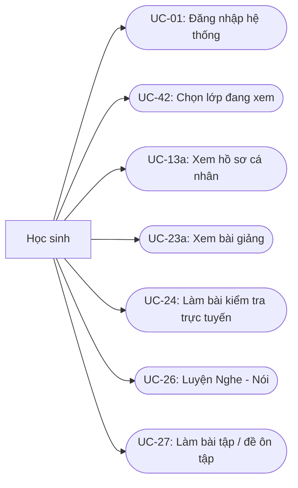

## Phân rã use case phụ huynh

<!-- Nguồn: docs/diagrams/usecase-actors/UseCase-PhuHuynh.mmd (chỉnh sửa trực tiếp file này, không sửa trong srs.md/sdd-groups) -->
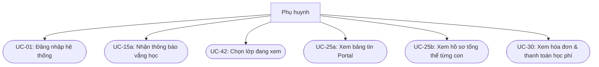

## Phân rã use case giáo viên

<!-- Nguồn: docs/diagrams/usecase-actors/UseCase-GiaoVien.mmd (chỉnh sửa trực tiếp file này, không sửa trong srs.md/sdd-groups) -->
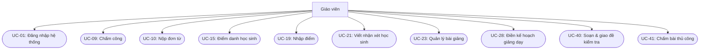

## Phân rã use case trưởng phòng đào tạo

<!-- Nguồn: docs/diagrams/usecase-actors/UseCase-TruongPhongDaoTao.mmd (chỉnh sửa trực tiếp file này, không sửa trong srs.md/sdd-groups) -->
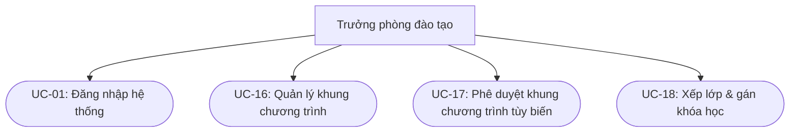

## Phân rã use case quản lý điểm trường

<!-- Nguồn: docs/diagrams/usecase-actors/UseCase-QuanLyDiemTruong-Phan1.mmd (chỉnh sửa trực tiếp file này, không sửa trong srs.md/sdd-groups) -->
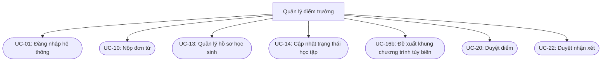

<!-- Nguồn: docs/diagrams/usecase-actors/UseCase-QuanLyDiemTruong-Phan2.mmd (chỉnh sửa trực tiếp file này, không sửa trong srs.md/sdd-groups) -->
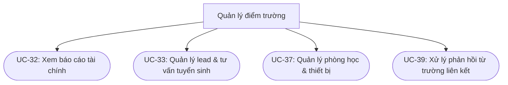

## Phân rã use case quản lý vận hành

<!-- Nguồn: docs/diagrams/usecase-actors/UseCase-QuanLyVanHanh.mmd (chỉnh sửa trực tiếp file này, không sửa trong srs.md/sdd-groups) -->
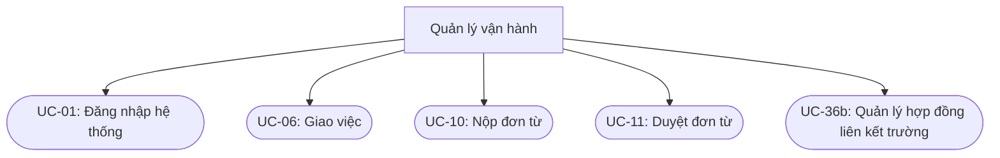

## Phân rã use case ban giám đốc

<!-- Nguồn: docs/diagrams/usecase-actors/UseCase-BanGiamDoc.mmd (chỉnh sửa trực tiếp file này, không sửa trong srs.md/sdd-groups) -->
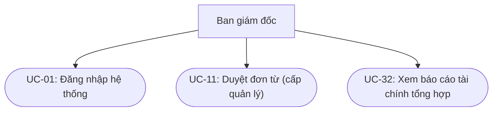

## Phân rã use case quản lý nhân sự

<!-- Nguồn: docs/diagrams/usecase-actors/UseCase-QuanLyNhanSu.mmd (chỉnh sửa trực tiếp file này, không sửa trong srs.md/sdd-groups) -->
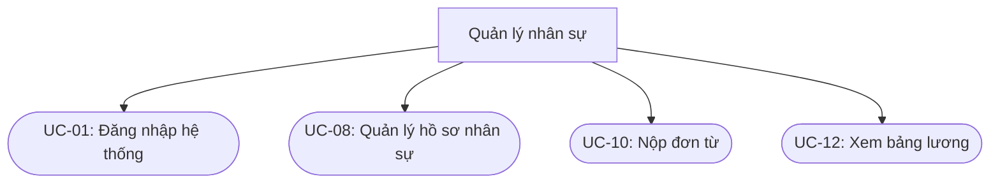

## Phân rã use case nhân viên

<!-- Nguồn: docs/diagrams/usecase-actors/UseCase-NhanVien-Phan1.mmd (chỉnh sửa trực tiếp file này, không sửa trong srs.md/sdd-groups) -->
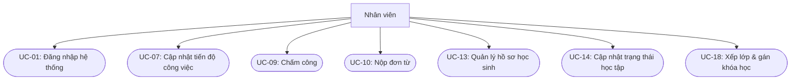

<!-- Nguồn: docs/diagrams/usecase-actors/UseCase-NhanVien-Phan2.mmd (chỉnh sửa trực tiếp file này, không sửa trong srs.md/sdd-groups) -->
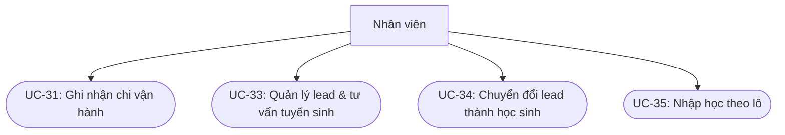

## Phân rã use case quản trị viên

<!-- Nguồn: docs/diagrams/usecase-actors/UseCase-QuanTriVien.mmd (chỉnh sửa trực tiếp file này, không sửa trong srs.md/sdd-groups) -->
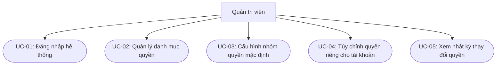

## Phân rã use case đại diện trường liên kết

<!-- Nguồn: docs/diagrams/usecase-actors/UseCase-DaiDienTruongLienKet.mmd (chỉnh sửa trực tiếp file này, không sửa trong srs.md/sdd-groups) -->
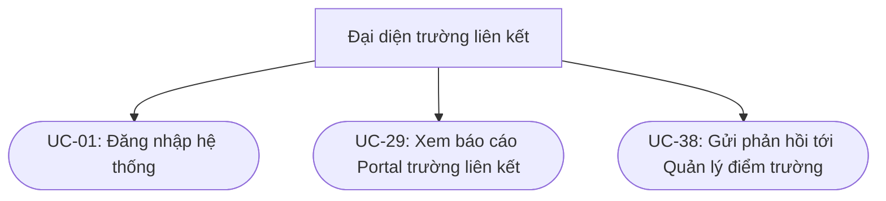

# Sơ đồ luồng hoạt động

## Sơ đồ luồng hoạt động chức năng nhập điểm & duyệt

Sơ đồ chia thành 3 làn theo tác nhân --- Giáo viên, Hệ thống, Quản lý
điểm trường.

Các điểm rẽ nhánh chính trong sơ đồ

  -----------------------------------------------------------------------
  **Điểm quyết **Các nhánh**         **Ý nghĩa**
  định**                             
  ------------ --------------------- ------------------------------------
  Điểm hợp lệ? Hợp lệ / Không hợp lệ Validate 0 ≤ score ≤ max_score trước
                                     khi cho lưu --- chặn ngay từ phía
                                     GV, không để lọt xuống database

  Nhập xong    Chưa / Đã xong        Cho phép GV nhập rải rác nhiều lần
  toàn bộ lớp?                       (lưu nháp DRAFT), chỉ submit khi đã
                                     hoàn tất

  Submit từng  Từng bản ghi / Theo   Phản ánh đúng thiết kế
  cái hay theo lô                    approval_flows.batch_id --- GV có
  lô?                                thể chọn 1 trong 2 cách tùy tình
                                     huống

  Duyệt từng   Từng bản ghi / Theo   QLĐT không bắt buộc phải duyệt theo
  bản ghi hay  batch_id              cùng cách GV đã submit --- có thể
  theo batch?                        tách lẻ ra xem kỹ 1 học sinh cụ thể
                                     dù GV submit theo lô

  Kết quả      APPROVED / REJECTED   Nhánh APPROVED kết thúc luồng (điểm
  duyệt?                             công khai cho PH); nhánh REJECTED
                                     vòng lại điểm bắt đầu (GV sửa &
                                     submit lại) --- thể hiện bằng mũi
                                     tên nét đứt quay ngược
  -----------------------------------------------------------------------

<!-- Nguồn: docs/diagrams/activity/ActivityDiagram-NhapDiemDuyet.mmd (chỉnh sửa trực tiếp file này, không sửa trong srs.md/sdd-groups) -->
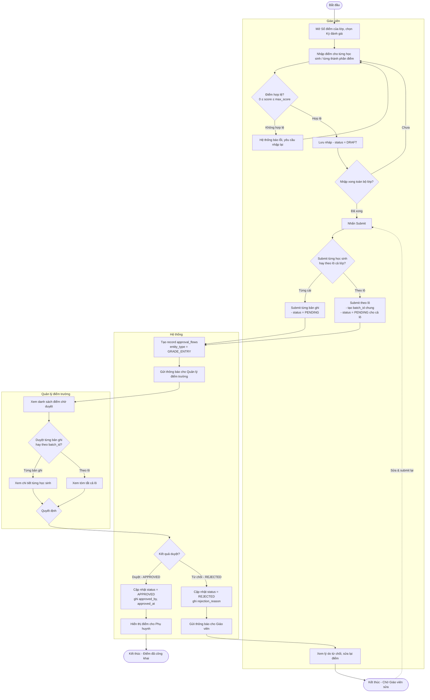

## Sơ đồ luồng hoạt động chức năng chấm công

Các điểm rẽ nhánh chính

  -------------------------------------------------------------------------------
  **\#**   **Điểm quyết định**         **Ý nghĩa**
  -------- --------------------------- ------------------------------------------
  1        is_management = TRUE?       Cấp quản lý miễn trừ hoàn toàn, kết thúc
                                       luồng ngay

  2        Cả 3 phương thức tự động    Kiểm tra system_settings --- quyết định có
           đều tắt?                    cho chấm thủ công không

  3        D là ngày làm việc?         Đối chiếu work_calendar (override) trước,
                                       shifts (pattern mặc định + week_parity)
                                       sau

  4        Là GV và có tiết dạy hôm    Quyết định có tính \"cửa sổ theo lịch
           nay?                        dạy\" hay không

  5        is_default_shift_required = Quyết định có tính thêm \"cửa sổ theo ca
           TRUE?                       cố định\" hay không (GV linh hoạt hoàn
                                       toàn thì bỏ qua)

  6        T thuộc cửa sổ nào đó?      Điểm chốt: chấp nhận hay từ chối chấm công

  7        Phương thức GPS → trong bán Riêng cho phương thức GPS
           kính?                       

  8        Phương thức vân tay/khuôn   Riêng cho 2 phương thức sinh trắc
           mặt → xác thực thành công?  
  -------------------------------------------------------------------------------

<!-- Nguồn: docs/diagrams/activity/ActivityDiagram-ChamCong.mmd (chỉnh sửa trực tiếp file này, không sửa trong srs.md/sdd-groups) -->
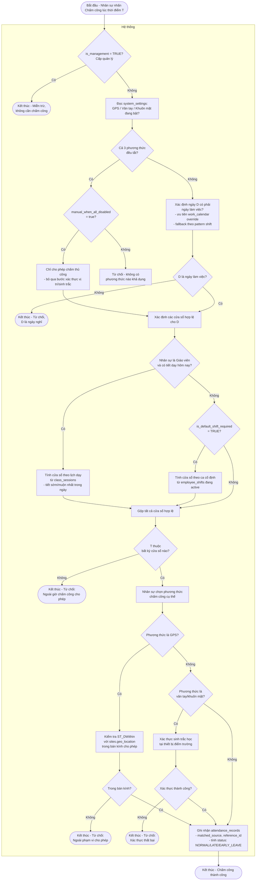

## Sơ đồ luồng hoạt động chức năng duyệt đơn từ

Các điểm rẽ nhánh chính

  --------------------------------------------------------------------------------
  **\#**   **Điểm quyết định**      **Ý nghĩa**
  -------- ------------------------ ----------------------------------------------
  1        is_management = TRUE?    Ban giám đốc miễn trừ, không được tạo đơn ---
                                    chặn ngay từ đầu

  2        Nhân sự thuộc cấp quản   Rẽ sang nhánh \"1 bước, BGĐ duyệt\" hoàn toàn
           lý                       khác với nhân sự thường
           (QLĐT/TPĐT/QLVH/QLNS)?   

  3        Phòng ban có Trưởng      Quyết định tạo 1 bước hay 2 bước cho nhân sự
           phòng?                   thường

  4        Còn bước tiếp theo?      Vòng lặp qua từng bước duyệt (chỉ áp dụng khi
                                    có 2 bước)

  5        Quyết định của người     APPROVED (tiếp tục bước sau hoặc kết thúc nếu
           duyệt                    là bước cuối) / REJECTED (kết thúc ngay, không
                                    cần đi hết các bước còn lại)
  --------------------------------------------------------------------------------

<!-- Nguồn: docs/diagrams/activity/ActivityDiagram-DuyetDonTu.mmd (chỉnh sửa trực tiếp file này, không sửa trong srs.md/sdd-groups) -->
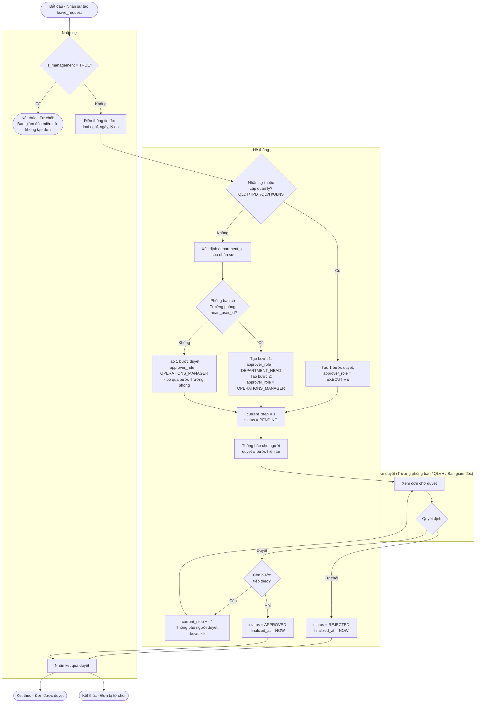

## Sơ đồ luồng hoạt động chức năng thu học phí và đối soát QR

Luồng này có tính chất khác 3 luồng trước, có 1 nhánh bất đồng bộ (chờ
webhook ngân hàng) chạy song song với 1 tiến trình định kỳ độc lập

Các điểm rẽ nhánh chính

  --------------------------------------------------------------------------
  **\#**   **Điểm quyết    **Ý nghĩa**
           định**          
  -------- --------------- -------------------------------------------------
  1        Học sinh có     Quyết định có tạo
           scholarship     invoice_scholarship_applications hay không
           active?         

  2        Phương thức     Rẽ hẳn thành 2 luồng xử lý khác nhau --- tự động
           thanh toán?     (QR) vs thủ công (tiền mặt/chuyển khoản)

  3        Webhook xác     Riêng cho nhánh QR --- nếu timeout/chưa xác nhận
           nhận thành      thì hóa đơn rơi vào diện chờ cron kiểm tra
           công?           OVERDUE

  4        paid_amount \>= Quyết định PAID (đủ) hay PARTIAL_PAID (thanh toán
           total_amount?   từng phần)

  5 (Cron) Quá hạn và chưa Vòng lặp độc lập, chạy mỗi đêm, không phụ thuộc
           PAID?           vào các bước còn lại
  --------------------------------------------------------------------------

<!-- Nguồn: docs/diagrams/activity/ActivityDiagram-ThuHocPhi.mmd (chỉnh sửa trực tiếp file này, không sửa trong srs.md/sdd-groups) -->
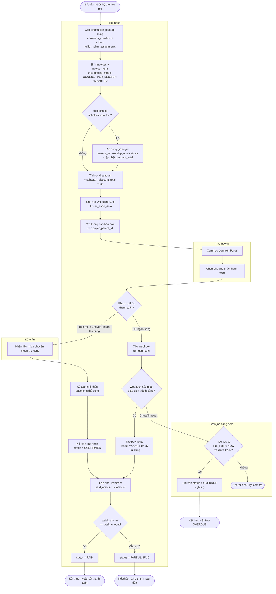

## Sơ đồ luồng hoạt động chức năng chuyển đổi Lead → Học sinh

Các điểm rẽ nhánh chính

  ------------------------------------------------------------------------------
  **\#**   **Điểm quyết định**    **Ý nghĩa**
  -------- ---------------------- ----------------------------------------------
  1        Số điện thoại đã tồn   Phát hiện trùng ngay từ đầu (ràng buộc
           tại ở lead active      UNIQUE(phone) ở tầng DB)
           khác?                  

  2        Liên hệ thành công?    Vòng lặp --- nếu chưa liên hệ được thì thử
                                  lại, không đổi trạng thái

  3        Khách có phù hợp?      NEW/CONTACTED → QUALIFIED hoặc thẳng ra LOST

  4        Chốt được đăng ký?     QUALIFIED → WON hoặc LOST

  5        Kết quả xử lý          Rẽ hẳn 2 nhánh: WON chạy transaction tạo tài
           (WON/LOST)             khoản; LOST chỉ ghi lý do để phân tích sau
  ------------------------------------------------------------------------------

<!-- Nguồn: docs/diagrams/activity/ActivityDiagram-ChuyenDoiLead.mmd (chỉnh sửa trực tiếp file này, không sửa trong srs.md/sdd-groups) -->
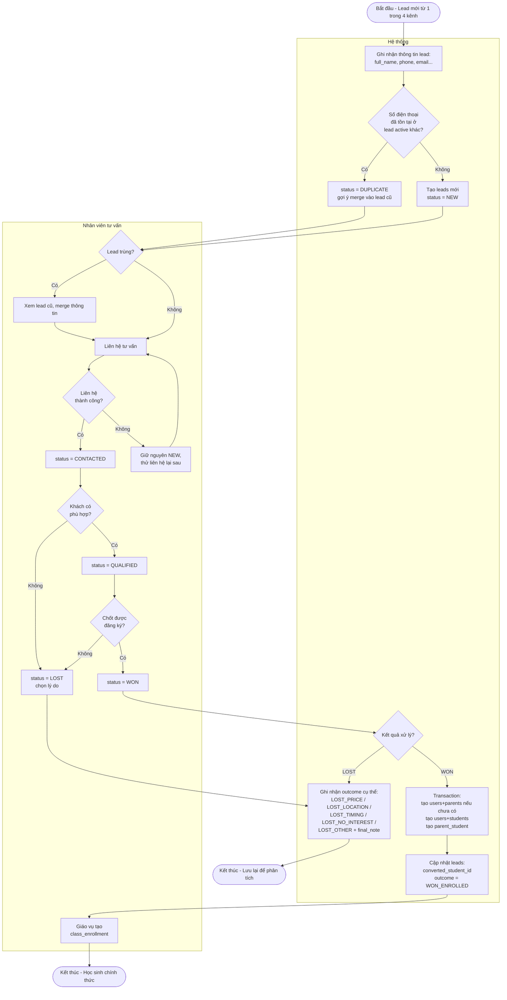

## Sơ đồ luồng chức năng điểm danh và thông báo vắng

Sơ đồ này có 3 làn: Giáo viên, Hệ thống, và Hệ thống gửi (background
job) --- tách riêng làn cuối vì đây là tiến trình bất đồng bộ, chạy độc
lập với thao tác của GV.

Các điểm rẽ nhánh chính

  -----------------------------------------------------------------------------
  **\#**   **Điểm quyết       **Ý nghĩa**
           định**             
  -------- ------------------ -------------------------------------------------
  1        Chọn chế độ điểm   SESSION_LEVEL (1 lần cho cả buổi) hay
           danh?              PERIOD_LEVEL --- quyết định luồng thao tác của GV

  2        Cần sửa chi tiết   Sau khi điểm danh nhanh cả buổi, GV có thể tùy
           theo từng tiết?    chọn vào sửa lại 1 tiết cụ thể cho 1 học sinh

  3        Có học sinh ABSENT Quyết định có kích hoạt luồng gửi thông báo hay
           hoặc LATE?         không

  4        Gửi thành công?    Riêng cho background job --- có cơ chế retry khi
                              gửi thất bại

  5        retry_count \<     Vòng lặp retry có giới hạn, tránh gửi vô hạn khi
           max?               lỗi kéo dài
  -----------------------------------------------------------------------------

<!-- Nguồn: docs/diagrams/activity/ActivityDiagram-DiemDanhThongBao.mmd (chỉnh sửa trực tiếp file này, không sửa trong srs.md/sdd-groups) -->
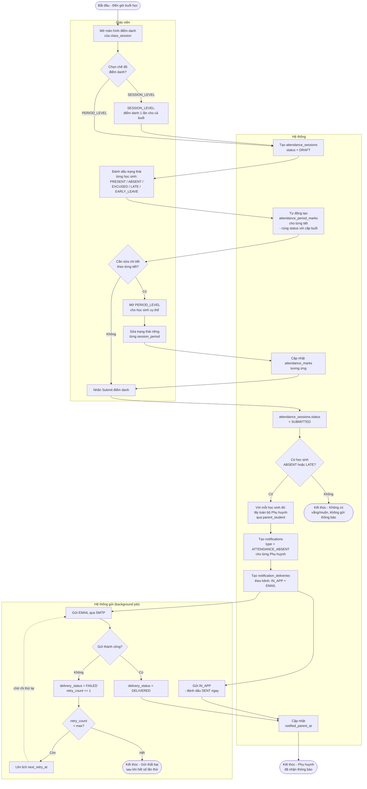

## Sơ đồ luồng chức năng duyệt nhận xét

Các điểm rẽ nhánh chính

  ------------------------------------------------------------------------------
  **\#**   **Điểm quyết      **Ý nghĩa**
           định**            
  -------- ----------------- ---------------------------------------------------
  1        Đây là nhận xét   Quyết định is_warning = TRUE --- cờ hiển thị nổi
           cần cảnh báo đặc  bật cho PH, độc lập với severity
           biệt?             

  2        Viết xong cho     Cho phép GV viết rải rác nhiều lần trước khi submit
           toàn bộ HS cần    
           thiết?            

  3        Submit từng cái   Giống Luồng 1 --- GV chọn tùy tình huống
           hay theo lô?      

  4        Duyệt từng cái    QLĐT cũng không bị ép buộc theo cách GV đã submit
           hay theo          --- nhất quán với quyết định \"không ép buộc 1
           batch_id?         kiểu\" đã chốt ở Luồng 1

  5        Kết quả duyệt?    APPROVED → hiển thị Portal (PH hoặc cả trường liên
                             kết nếu có cảnh báo); REJECTED → quay lại GV sửa
  ------------------------------------------------------------------------------

<!-- Nguồn: docs/diagrams/activity/ActivityDiagram-DuyetNhanXet.mmd (chỉnh sửa trực tiếp file này, không sửa trong srs.md/sdd-groups) -->
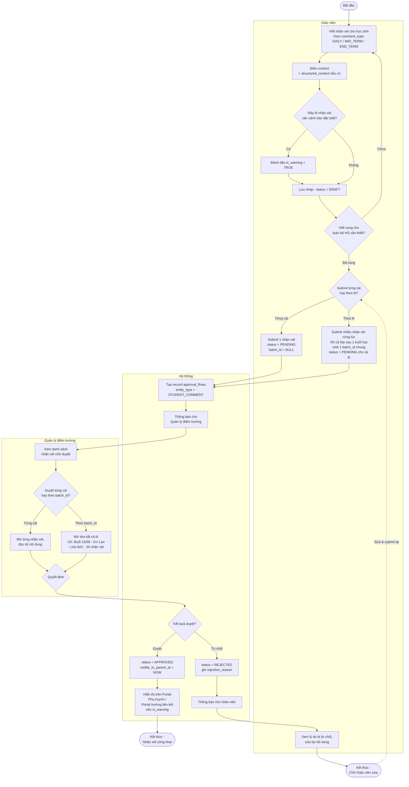

## Sơ đồ luồng chức năng soạn đề & chấm bài

Các điểm rẽ nhánh chính

  ------------------------------------------------------------------------------
  **\#**   **Điểm quyết       **Ý nghĩa**
           định**             
  -------- ------------------ --------------------------------------------------
  1        Chọn nguồn câu     Từ ngân hàng có sẵn hay soạn mới --- cả 2 đều dẫn
           hỏi?               tới exercise_questions

  2        Loại đề?           SELF_PRACTICE (mở tự do) hay ASSIGNED (giao có
                              deadline) --- quyết định có tạo
                              exercise_assignments hay không

  3        Đề có câu tự       Quyết định có cần bước GV chấm thủ công hay dừng ở
           luận/nói?          chấm tự động

  4        Nộp bài quá hạn? + 2 quyết định liên tiếp xử lý riêng trường hợp trễ
           Cho phép nộp muộn? deadline

  5        Còn câu cần GV     Vòng lặp GV chấm từng câu tự luận/nói cho đến khi
           chấm?              xong hết

  6        Xem được kết quả   Nếu có phần chờ GV chấm thì HS chưa thấy điểm
           ngay không?        tổng, chỉ thấy phần trắc nghiệm

  7        Muốn làm lại? +    Vòng lặp retake, quay về đầu luồng của Học sinh
           Còn lượt làm?      
  ------------------------------------------------------------------------------

<!-- Nguồn: docs/diagrams/activity/ActivityDiagram-SoanDeChamBai.mmd (chỉnh sửa trực tiếp file này, không sửa trong srs.md/sdd-groups) -->
```mermaid
flowchart TD
    Start([Bắt đầu]) --> A1

    subgraph GV["Giáo viên"]
        A1[Tạo exercise mới<br/>- title, curriculum_id, subject_id]
        A2{Chọn nguồn câu hỏi?}
        A3[Chọn từ question_banks<br/>có sẵn]
        A4[Soạn câu hỏi mới<br/>- questions + question_choices<br/>nếu trắc nghiệm]
        A5[Thêm vào exercise_questions<br/>gán points từng câu]
        A6[Cấu hình đề:<br/>total_points, time_limit_minutes,<br/>allow_retake, max_attempts,<br/>show_correct_answers]
        A7{Loại đề?}
        A8[exercise_type = SELF_PRACTICE<br/>publish theo curriculum<br/>- mọi lớp dùng chung tự truy cập]
        A9[exercise_type = ASSIGNED<br/>tạo exercise_assignments<br/>cho lớp cụ thể<br/>- due_at, late_submission_allowed]
        A18{Đề có câu<br/>tự luận / nói?}
        A19[Mở danh sách bài<br/>chờ chấm thủ công]
        A20[Chấm điểm + ghi feedback<br/>cho từng câu trả lời<br/>student_answer_grading]
        A21{Chấm xong<br/>toàn bộ câu?}
    end

    subgraph HS["Học sinh"]
        B1[Mở đề - tạo exercise_attempts<br/>started_at = NOW]
        B2[Trả lời từng câu -<br/>student_answers]
        B3[Nhấn Nộp bài]
        B10[Xem điểm các kỹ năng đã có đáp án<br/>tự động - VD Reading/Listening -<br/>ngay sau khi nộp<br/>+ đáp án nếu show_correct_answers]
        B14[Xem total_score đầy đủ<br/>- khi mọi kỹ năng đã có điểm]
        B15{Muốn làm lại?}
        B16{allow_retake = TRUE<br/>và attempt_number<br/>< max_attempts?}
    end

    subgraph HT["Hệ thống"]
        C1{submitted_at<br/>> due_at?}
        C2{late_submission_allowed<br/>= TRUE?}
        C3[is_late_submission = TRUE<br/>áp dụng late_penalty_percent]
        C4([Kết thúc - Từ chối nộp,<br/>đã quá hạn])
        C5[Tự động chấm các câu<br/>trắc nghiệm - is_auto_gradable<br/>tính auto_grade_score]
        C6{Còn câu cần<br/>GV chấm thủ công?}
        C7[status = AUTO_GRADED<br/>- các kỹ năng tự động có điểm ngay,<br/>kỹ năng thủ công còn để trống]
        C8[status = FULLY_GRADED<br/>- toàn bộ là trắc nghiệm,<br/>total_score có ngay]
        C9[status = FULLY_GRADED<br/>total_score = auto + manual]
    end

    A1 --> A2
    A2 -- Có sẵn --> A3 --> A5
    A2 -- Tạo mới --> A4 --> A5
    A5 --> A6 --> A7
    A7 -- Tự luyện --> A8
    A7 -- Bài tập giao --> A9
    A8 --> A18
    A9 --> A18
    A18 --> B1
    B1 --> B2 --> B3 --> C1
    C1 -- Có, quá hạn --> C2
    C2 -- Không --> C4
    C2 -- Có --> C3 --> C5
    C1 -- Không, đúng hạn --> C5
    C5 --> C6
    C6 -- Không --> C8 --> B14
    C6 -- Có --> C7
    C7 --> B10
    C7 --> A19
    A19 --> A20 --> A21
    A21 -- Chưa --> A20
    A21 -- Xong --> C9 --> B14
    B10 -.chờ Giáo viên chấm xong.-> B14
    B14 --> B15
    B15 -- Không --> End1([Kết thúc -<br/>Hoàn tất bài làm])
    B15 -- Có --> B16
    B16 -- Không --> End2([Kết thúc -<br/>Không được làm lại])
    B16 -- Có --> B1
```

# Các yêu cầu phi chức năng

## **Giao diện người dùng.**

-   **NFR-UI-01: Thiết kế Responsive** --- Giao diện phải hiển thị tốt
    trên cả máy tính (desktop/laptop) và trình duyệt di động, đảm bảo
    Giáo viên/Phụ huynh có thể sử dụng mượt mà trên điện thoại.

-   **NFR-UI-02: Phân tách giao diện theo vai trò** --- Mỗi tác nhân
    (Học sinh, Giáo viên, Phụ huynh, Quản lý điểm trường, Đại diện
    trường liên kết\...) có Dashboard riêng, chỉ hiển thị chức năng và
    dữ liệu thuộc phạm vi quyền hạn của mình, tránh gây rối mắt bởi
    thông tin không liên quan.

-   **NFR-UI-03: Ngôn ngữ** --- Toàn bộ giao diện sử dụng tiếng Việt làm
    ngôn ngữ chính và tiếng Anh làm ngôn ngữ phụ.

-   **NFR-UI-04: Khả năng truy cập (Accessibility)** --- Cỡ chữ, độ
    tương phản màu sắc đảm bảo dễ đọc; các trang có tương tác quan trọng
    (điểm danh, nhập điểm) tối ưu thao tác nhanh, hạn chế số bước click.

## **Công nghệ sử dụng.**

-   **NFR-TECH-01: Kiến trúc tổng thể** --- Hệ thống xây dựng theo mô
    hình client-server, tách biệt Backend và Frontend, giao tiếp qua
    giao thức HTTPS.

-   **NFR-TECH-02: Backend** --- Xây dựng bằng **Spring Boot**, áp dụng
    kiến trúc phân lớp (Controller -- Service -- Repository), sử dụng
    Spring Security cho xác thực/phân quyền, Spring Data JPA cho truy
    xuất dữ liệu.

-   **NFR-TECH-03: Frontend** --- Xây dựng bằng **React**, tổ chức theo
    component tái sử dụng được, phân chia module theo từng phân hệ
    nghiệp vụ.

-   **NFR-TECH-04: Cơ sở dữ liệu** --- Sử dụng **PostgreSQL** làm hệ
    quản trị cơ sở dữ liệu chính. Thiết kế schema chuẩn hóa, có đánh
    index cho các cột thường xuyên lọc/sắp xếp (mã học sinh, lớp, ngày
    điểm danh\...).

-   **NFR-TECH-05: Quản lý mã nguồn** --- Toàn bộ mã nguồn được lưu trữ
    và quản lý phiên bản trên **GitHub**, áp dụng quy trình nhánh tối
    thiểu gồm nhánh main/production và nhánh phát triển tính năng, thông
    qua Pull Request trước khi merge.

-   **NFR-TECH-06: Đóng gói & triển khai** --- Backend và Frontend được
    đóng gói bằng **Docker**, sử dụng Docker Compose cho môi trường phát
    triển cục bộ để đảm bảo đồng nhất giữa các thành viên trong nhóm.

-   **NFR-TECH-07: Lưu trữ học liệu** --- Video bài giảng, tài liệu PDF,
    file audio bắt buộc lưu trữ qua **CDN/Object Storage** (không lưu
    trực tiếp trên server ứng dụng), đảm bảo tốc độ tải ổn định khi
    nhiều học sinh truy cập đồng thời.

## **Tính bảo mật.**

-   **NFR-SEC-01: Mã hóa dữ liệu nhạy cảm** --- Mật khẩu người dùng bắt
    buộc băm (hash) bằng thuật toán an toàn (BCrypt), không lưu trữ dạng
    plain-text dưới bất kỳ hình thức nào.

-   **NFR-SEC-02: Truyền tải dữ liệu an toàn** --- Toàn bộ giao tiếp
    giữa Frontend -- Backend -- Database bắt buộc qua kênh mã hóa
    **HTTPS/TLS**.

-   **NFR-SEC-03: Phân quyền truy xuất dữ liệu ở tầng Service** --- Mỗi
    tác nhân chỉ được truy vấn dữ liệu thuộc phạm vi quyền hạn của mình
    (Giáo viên chỉ thấy lớp mình dạy, Phụ huynh chỉ thấy con mình, Đại
    diện trường liên kết chỉ thấy học sinh trường mình\...), kiểm soát
    chặt tại tầng Service/Repository của Backend, không tin tưởng dữ
    liệu gửi từ phía Frontend.

-   **NFR-SEC-04: Không tồn tại cơ chế bypass đăng nhập** --- Mọi cơ chế
    tài khoản demo/xem thử (nếu có, phục vụ mục đích test/nghiệm thu)
    chỉ được phép hoạt động ở môi trường phát triển (dev/staging), tuyệt
    đối không được tồn tại hoặc kích hoạt được ở môi trường production
    dưới bất kỳ hình thức nào.

-   **NFR-SEC-05: Nhật ký truy vết (Audit Log)** --- Các hành động quan
    trọng (đổi quyền, xóa dữ liệu, duyệt/từ chối nội dung) phải được ghi
    log kèm người thực hiện và thời gian, phục vụ tra soát khi cần.

## **Ràng buộc.**

-   **NFR-CON-01: Quy mô người dùng** --- Hệ thống phải đáp ứng tối
    thiểu **1.300 học sinh** cùng phụ huynh, giáo viên, nhân viên các cơ
    sở, đảm bảo hoạt động ổn định trong khung giờ cao điểm.

-   **NFR-CON-02: Đa cơ sở/đa trường liên kết** --- Kiến trúc dữ liệu
    phải hỗ trợ mô hình nhiều điểm trường và nhiều trường liên kết, đảm
    bảo tách biệt dữ liệu và báo cáo theo từng đơn vị khi cần.

-   **NFR-CON-03: Khả năng mở rộng** --- Thiết kế hướng tới khả năng mở
    rộng theo chiều ngang khi số lượng học sinh tăng trong tương lai,
    hạn chế các điểm nghẽn tại tầng Database.

-   **NFR-CON-04: Sao lưu dữ liệu** --- Cơ sở dữ liệu PostgreSQL phải
    được sao lưu định kỳ, có phương án khôi phục khi xảy ra sự cố mất dữ
    liệu.
